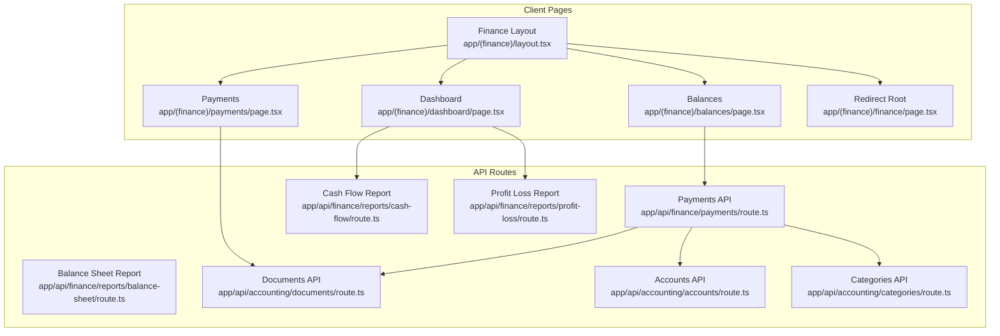
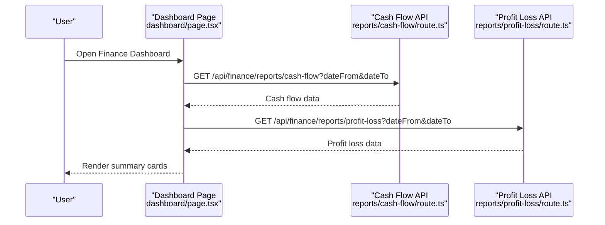
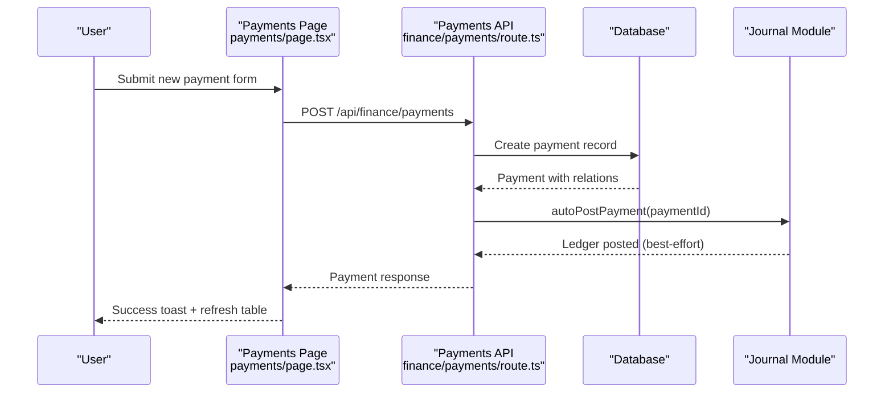
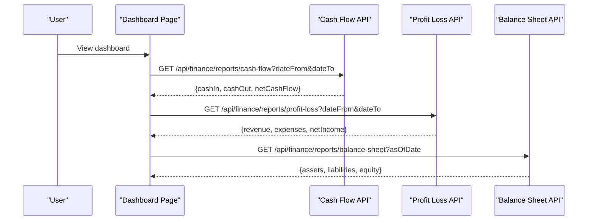
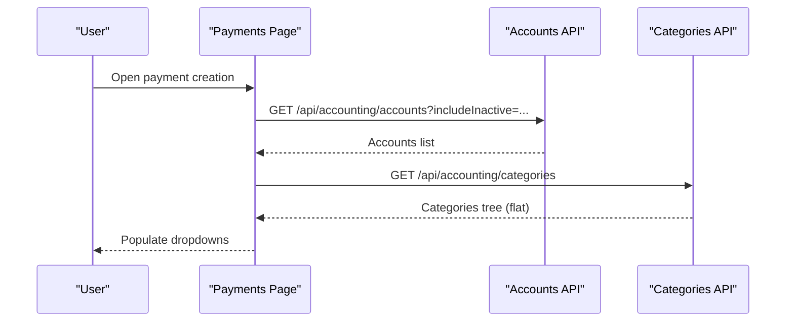
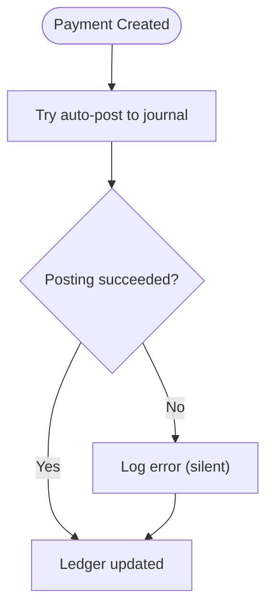
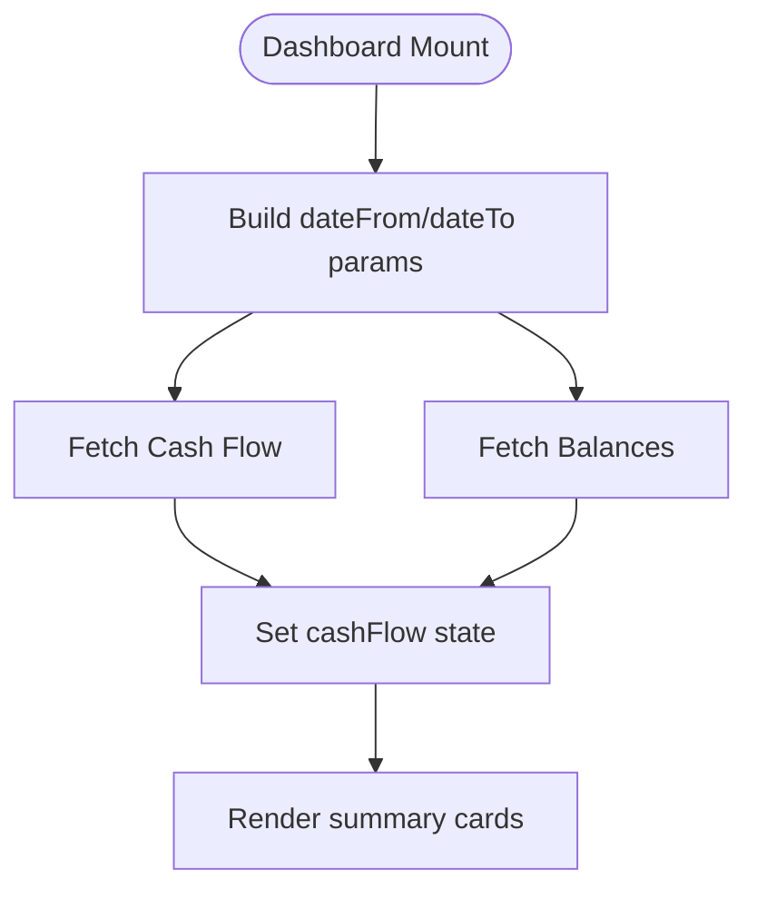
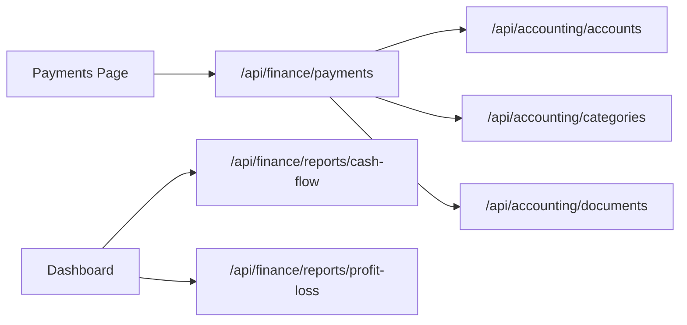

# Finance Module

<cite>
**Referenced Files in This Document**
- [app/(finance)/layout.tsx](file://app/(finance)/layout.tsx)
- [app/(finance)/finance/page.tsx](file://app/(finance)/finance/page.tsx)
- [app/(finance)/dashboard/page.tsx](file://app/(finance)/dashboard/page.tsx)
- [app/(finance)/balances/page.tsx](file://app/(finance)/balances/page.tsx)
- [app/(finance)/payments/page.tsx](file://app/(finance)/payments/page.tsx)
- [app/api/finance/payments/route.ts](file://app/api/finance/payments/route.ts)
- [app/api/finance/reports/cash-flow/route.ts](file://app/api/finance/reports/cash-flow/route.ts)
- [app/api/finance/reports/profit-loss/route.ts](file://app/api/finance/reports/profit-loss/route.ts)
- [app/api/finance/reports/balance-sheet/route.ts](file://app/api/finance/reports/balance-sheet/route.ts)
- [app/api/accounting/documents/route.ts](file://app/api/accounting/documents/route.ts)
- [app/api/accounting/accounts/route.ts](file://app/api/accounting/accounts/route.ts)
- [app/api/accounting/categories/route.ts](file://app/api/accounting/categories/route.ts)
</cite>

## Table of Contents
1. [Introduction](#introduction)
2. [Project Structure](#project-structure)
3. [Core Components](#core-components)
4. [Architecture Overview](#architecture-overview)
5. [Detailed Component Analysis](#detailed-component-analysis)
6. [Dependency Analysis](#dependency-analysis)
7. [Performance Considerations](#performance-considerations)
8. [Troubleshooting Guide](#troubleshooting-guide)
9. [Conclusion](#conclusion)

## Introduction
This document describes the ListOpt ERP Finance module, focusing on financial transaction management, payment processing, financial reporting, chart of accounts, journal entries, and reporting dashboards. It explains how incoming and outgoing payments are captured, categorized, and posted to the ledger, how financial reports are generated, and how the system integrates with accounting documents and real-time data updates.

## Project Structure
The Finance module is organized into:
- Client-side pages under app/(finance) for dashboards, balances, payments, and reports
- API routes under app/api/finance for payments and financial reports
- Shared accounting APIs under app/api/accounting for documents, accounts, and categories

**Diagram sources**
- [app/(finance)/layout.tsx](file://app/(finance)/layout.tsx#L1-L24)
- [app/(finance)/dashboard/page.tsx](file://app/(finance)/dashboard/page.tsx#L1-L145)
- [app/(finance)/balances/page.tsx](file://app/(finance)/balances/page.tsx#L1-L152)
- [app/(finance)/payments/page.tsx](file://app/(finance)/payments/page.tsx#L1-L108)
- [app/(finance)/finance/page.tsx](file://app/(finance)/finance/page.tsx#L1-L6)
- [app/api/finance/payments/route.ts:1-113](file://app/api/finance/payments/route.ts#L1-L113)
- [app/api/finance/reports/cash-flow/route.ts:1-27](file://app/api/finance/reports/cash-flow/route.ts#L1-L27)
- [app/api/finance/reports/profit-loss/route.ts:1-27](file://app/api/finance/reports/profit-loss/route.ts#L1-L27)
- [app/api/finance/reports/balance-sheet/route.ts:1-29](file://app/api/finance/reports/balance-sheet/route.ts#L1-L29)
- [app/api/accounting/documents/route.ts:1-136](file://app/api/accounting/documents/route.ts#L1-L136)
- [app/api/accounting/accounts/route.ts:1-19](file://app/api/accounting/accounts/route.ts#L1-L19)
- [app/api/accounting/categories/route.ts:1-41](file://app/api/accounting/categories/route.ts#L1-L41)

**Section sources**
- [app/(finance)/layout.tsx](file://app/(finance)/layout.tsx#L1-L24)
- [app/(finance)/finance/page.tsx](file://app/(finance)/finance/page.tsx#L1-L6)

## Core Components
- Finance Dashboard: Loads cash flow and balances via API endpoints and renders summary cards.
- Balances page: Displays receivables/payables per counterparty and totals.
- Payments page: Lists financial documents and supports creation of new payment documents.
- Payments API: Manages payment records, validation, numbering, and automatic posting to the journal.
- Financial Reports API: Provides cash flow, profit-and-loss, and balance sheet endpoints.
- Accounting APIs: Documents, accounts, and categories support cross-module workflows.

**Section sources**
- [app/(finance)/dashboard/page.tsx](file://app/(finance)/dashboard/page.tsx#L22-L48)
- [app/(finance)/balances/page.tsx](file://app/(finance)/balances/page.tsx#L26-L36)
- [app/(finance)/payments/page.tsx](file://app/(finance)/payments/page.tsx#L21-L56)
- [app/api/finance/payments/route.ts:26-73](file://app/api/finance/payments/route.ts#L26-L73)
- [app/api/finance/reports/cash-flow/route.ts:7-26](file://app/api/finance/reports/cash-flow/route.ts#L7-L26)
- [app/api/finance/reports/profit-loss/route.ts:7-26](file://app/api/finance/reports/profit-loss/route.ts#L7-L26)
- [app/api/finance/reports/balance-sheet/route.ts:11-28](file://app/api/finance/reports/balance-sheet/route.ts#L11-L28)
- [app/api/accounting/documents/route.ts:8-61](file://app/api/accounting/documents/route.ts#L8-L61)
- [app/api/accounting/accounts/route.ts:6-12](file://app/api/accounting/accounts/route.ts#L6-L12)
- [app/api/accounting/categories/route.ts:7-22](file://app/api/accounting/categories/route.ts#L7-L22)

## Architecture Overview
The Finance module follows a layered pattern:
- UI pages orchestrate data fetching and present summaries.
- API routes validate requests, enforce permissions, and delegate to domain modules.
- Domain modules compute reports and manage ledger posting.
- Shared accounting APIs support documents, accounts, and categories.

**Diagram sources**
- [app/(finance)/dashboard/page.tsx](file://app/(finance)/dashboard/page.tsx#L27-L47)
- [app/api/finance/reports/cash-flow/route.ts:7-26](file://app/api/finance/reports/cash-flow/route.ts#L7-L26)
- [app/api/finance/reports/profit-loss/route.ts:7-26](file://app/api/finance/reports/profit-loss/route.ts#L7-L26)

## Detailed Component Analysis

### Payment Processing System
The payment processing system captures incoming and outgoing payments, assigns categories, links optional documents and counterparties, and posts journal entries automatically.

Key behaviors:
- Validation: Enforces required fields and enums for type, category, amount, method, and date.
- Numbering: Generates sequential payment numbers using a counter.
- Journal Posting: Attempts to auto-post to the ledger after creation.
- Filtering: Supports filtering by type, category, counterparty, and date range.

**Diagram sources**
- [app/(finance)/payments/page.tsx](file://app/(finance)/payments/page.tsx#L27-L56)
- [app/api/finance/payments/route.ts:75-112](file://app/api/finance/payments/route.ts#L75-L112)

**Section sources**
- [app/api/finance/payments/route.ts:7-16](file://app/api/finance/payments/route.ts#L7-L16)
- [app/api/finance/payments/route.ts:18-24](file://app/api/finance/payments/route.ts#L18-L24)
- [app/api/finance/payments/route.ts:26-73](file://app/api/finance/payments/route.ts#L26-L73)
- [app/api/finance/payments/route.ts:75-112](file://app/api/finance/payments/route.ts#L75-L112)
- [app/(finance)/payments/page.tsx](file://app/(finance)/payments/page.tsx#L21-L56)

### Financial Reporting Capabilities
The module exposes three primary financial reports:
- Cash Flow: Aggregates inflows and outflows over a date range.
- Profit and Loss: Computes revenue and expenses over a date range.
- Balance Sheet: Produces assets, liabilities, and equity as of a specific date.

**Diagram sources**
- [app/(finance)/dashboard/page.tsx](file://app/(finance)/dashboard/page.tsx#L27-L47)
- [app/api/finance/reports/cash-flow/route.ts:7-26](file://app/api/finance/reports/cash-flow/route.ts#L7-L26)
- [app/api/finance/reports/profit-loss/route.ts:7-26](file://app/api/finance/reports/profit-loss/route.ts#L7-L26)
- [app/api/finance/reports/balance-sheet/route.ts:11-28](file://app/api/finance/reports/balance-sheet/route.ts#L11-L28)

**Section sources**
- [app/api/finance/reports/cash-flow/route.ts:7-26](file://app/api/finance/reports/cash-flow/route.ts#L7-L26)
- [app/api/finance/reports/profit-loss/route.ts:7-26](file://app/api/finance/reports/profit-loss/route.ts#L7-L26)
- [app/api/finance/reports/balance-sheet/route.ts:11-28](file://app/api/finance/reports/balance-sheet/route.ts#L11-L28)

### Account Management and Chart of Accounts
Account management is exposed via the accounting API:
- Retrieve accounts with optional inclusion of inactive ones.
- Categories are hierarchical and returned as a flat list with children for building trees client-side.

**Diagram sources**
- [app/(finance)/payments/page.tsx](file://app/(finance)/payments/page.tsx#L70-L76)
- [app/api/accounting/accounts/route.ts:6-12](file://app/api/accounting/accounts/route.ts#L6-L12)
- [app/api/accounting/categories/route.ts:7-22](file://app/api/accounting/categories/route.ts#L7-L22)

**Section sources**
- [app/api/accounting/accounts/route.ts:6-12](file://app/api/accounting/accounts/route.ts#L6-L12)
- [app/api/accounting/categories/route.ts:7-22](file://app/api/accounting/categories/route.ts#L7-L22)

### Journal Entries and Financial Data Synchronization
Payments trigger automatic journal posting upon creation. The Payments API attempts to post to the ledger after successful creation, ensuring financial data synchronization.

**Diagram sources**
- [app/api/finance/payments/route.ts:102-103](file://app/api/finance/payments/route.ts#L102-L103)

**Section sources**
- [app/api/finance/payments/route.ts:102-103](file://app/api/finance/payments/route.ts#L102-L103)

### Reporting Dashboards and Analytics
The Finance dashboard aggregates key metrics:
- Cash inflows/outflows over a selected period
- Receivables/payables and net balance
- Placeholder areas for future charts

**Diagram sources**
- [app/(finance)/dashboard/page.tsx](file://app/(finance)/dashboard/page.tsx#L27-L47)

**Section sources**
- [app/(finance)/dashboard/page.tsx](file://app/(finance)/dashboard/page.tsx#L22-L48)

### Common Financial Workflows and Scenarios
- Create an incoming payment:
  - Navigate to Payments, choose a payment type, select a category, enter amount and method, optionally link a document or counterparty, submit.
  - The system validates input, generates a payment number, persists the record, and attempts to post to the journal.
- Create an outgoing payment:
  - Similar process with type set to expense.
- Generate a cash flow report:
  - Select a date range in the dashboard or call the cash flow endpoint directly.
- Generate a profit and loss report:
  - Select a date range and retrieve revenue vs. expenses.
- Generate a balance sheet:
  - Request as-of date to snapshot assets, liabilities, and equity.
- Monitor inter-company balances:
  - Use the balances page to review receivables/payables per counterparty and totals.

**Section sources**
- [app/(finance)/payments/page.tsx](file://app/(finance)/payments/page.tsx#L21-L56)
- [app/api/finance/payments/route.ts:75-112](file://app/api/finance/payments/route.ts#L75-L112)
- [app/api/finance/reports/cash-flow/route.ts:7-26](file://app/api/finance/reports/cash-flow/route.ts#L7-L26)
- [app/api/finance/reports/profit-loss/route.ts:7-26](file://app/api/finance/reports/profit-loss/route.ts#L7-L26)
- [app/api/finance/reports/balance-sheet/route.ts:11-28](file://app/api/finance/reports/balance-sheet/route.ts#L11-L28)
- [app/(finance)/balances/page.tsx](file://app/(finance)/balances/page.tsx#L26-L36)

## Dependency Analysis
The Finance module depends on:
- Authentication and permissions enforced at the API layer
- Shared validation utilities for query/body parsing
- Domain modules for report generation and journal posting
- Shared accounting APIs for documents, accounts, and categories

**Diagram sources**
- [app/(finance)/payments/page.tsx](file://app/(finance)/payments/page.tsx#L70-L76)
- [app/(finance)/dashboard/page.tsx](file://app/(finance)/dashboard/page.tsx#L36-L38)
- [app/api/finance/payments/route.ts:26-73](file://app/api/finance/payments/route.ts#L26-L73)
- [app/api/accounting/accounts/route.ts:6-12](file://app/api/accounting/accounts/route.ts#L6-L12)
- [app/api/accounting/categories/route.ts:7-22](file://app/api/accounting/categories/route.ts#L7-L22)
- [app/api/accounting/documents/route.ts:8-61](file://app/api/accounting/documents/route.ts#L8-L61)

**Section sources**
- [app/api/finance/payments/route.ts:26-73](file://app/api/finance/payments/route.ts#L26-L73)
- [app/api/accounting/documents/route.ts:8-61](file://app/api/accounting/documents/route.ts#L8-L61)
- [app/api/accounting/accounts/route.ts:6-12](file://app/api/accounting/accounts/route.ts#L6-L12)
- [app/api/accounting/categories/route.ts:7-22](file://app/api/accounting/categories/route.ts#L7-L22)

## Performance Considerations
- Pagination and limits: Payment listing uses pagination to avoid large payloads.
- Parallel fetches: Dashboard loads cash flow and balances concurrently.
- Lightweight client rendering: Reports are fetched as JSON and rendered with minimal client-side computation.
- Best-effort journal posting: Journal posting errors are caught and logged silently to avoid blocking payment creation.

[No sources needed since this section provides general guidance]

## Troubleshooting Guide
- Unauthorized access: API routes check permissions and return appropriate errors.
- Validation failures: Zod schemas validate request bodies; invalid data yields structured error responses.
- Network errors: UI surfaces toast notifications for loading failures.
- Silent journal posting: Auto-post failures are logged silently; verify journal posting separately if discrepancies arise.

**Section sources**
- [app/api/finance/payments/route.ts:107-111](file://app/api/finance/payments/route.ts#L107-L111)
- [app/(finance)/dashboard/page.tsx](file://app/(finance)/dashboard/page.tsx#L44-L46)
- [app/(finance)/balances/page.tsx](file://app/(finance)/balances/page.tsx#L33-L35)

## Conclusion
The ListOpt ERP Finance module provides a cohesive foundation for payment processing, financial reporting, and account management. It integrates payments with documents and categories, enforces validation and permissions, and exposes robust report endpoints for cash flow, profit and loss, and balance sheet views. The dashboard consolidates key metrics for quick insights, while automatic journal posting ensures timely financial data synchronization.