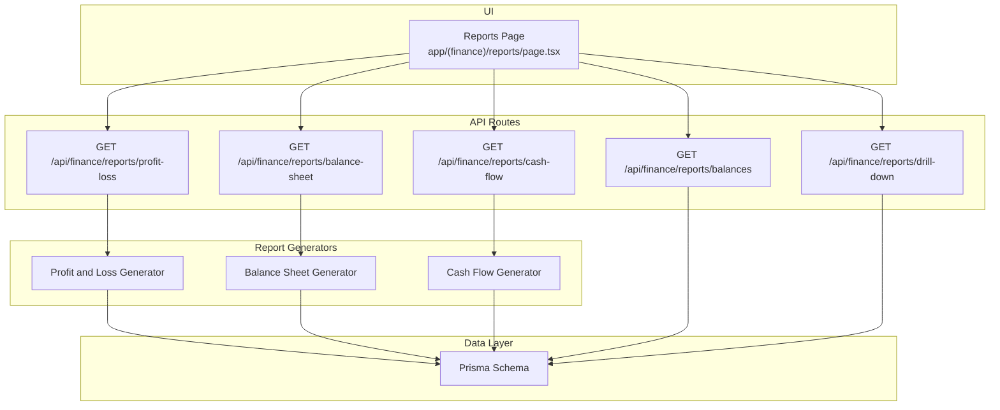
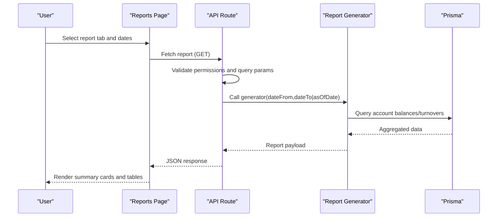
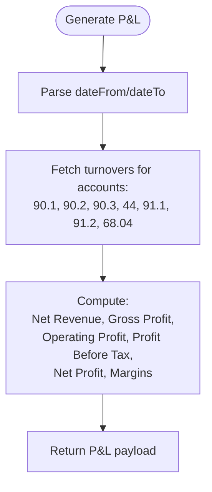
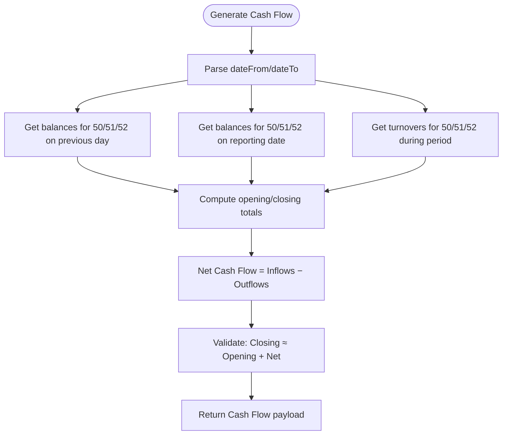
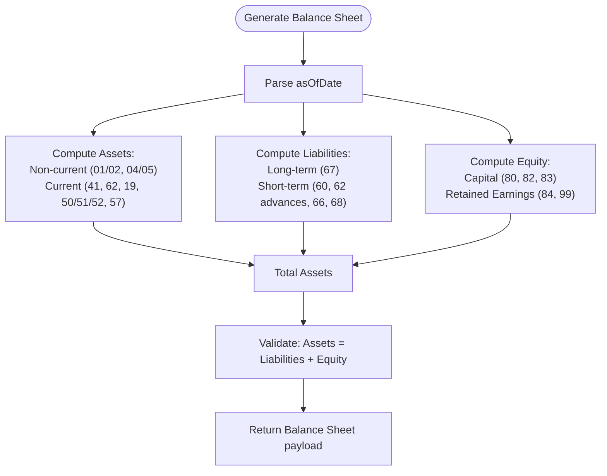
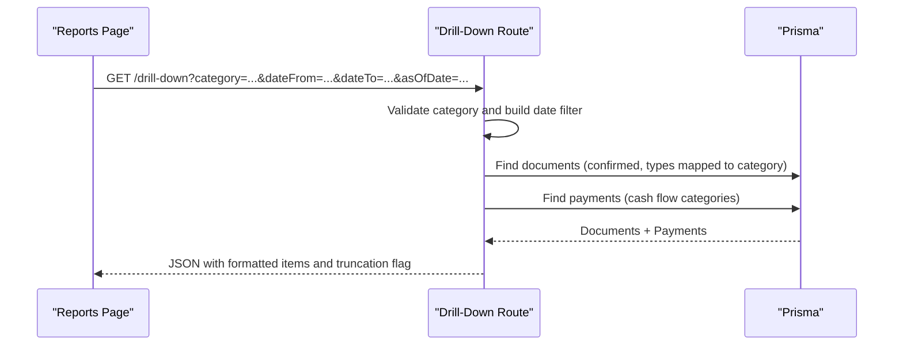
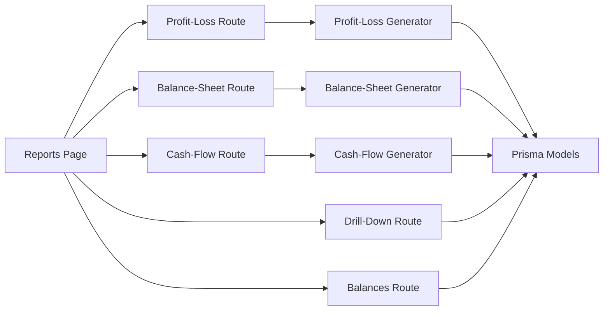

# Financial Reporting

<cite>
**Referenced Files in This Document**
- [Reports Page](file://app/(finance)/reports/page.tsx)
- [Profit and Loss Route](file://app/api/finance/reports/profit-loss/route.ts)
- [Balance Sheet Route](file://app/api/finance/reports/balance-sheet/route.ts)
- [Cash Flow Route](file://app/api/finance/reports/cash-flow/route.ts)
- [Balances List Route](file://app/api/finance/reports/balances/route.ts)
- [Drill-Down Route](file://app/api/finance/reports/drill-down/route.ts)
- [Reports Schemas](file://lib/modules/finance/schemas/reports.schema.ts)
- [Profit and Loss Report Generator](file://lib/modules/finance/reports/profit-loss.ts)
- [Balance Sheet Report Generator](file://lib/modules/finance/reports/balance-sheet.ts)
- [Cash Flow Report Generator](file://lib/modules/finance/reports/cash-flow.ts)
- [Prisma Schema](file://prisma/schema.prisma)
</cite>

## Table of Contents
1. [Introduction](#introduction)
2. [Project Structure](#project-structure)
3. [Core Components](#core-components)
4. [Architecture Overview](#architecture-overview)
5. [Detailed Component Analysis](#detailed-component-analysis)
6. [Dependency Analysis](#dependency-analysis)
7. [Performance Considerations](#performance-considerations)
8. [Troubleshooting Guide](#troubleshooting-guide)
9. [Conclusion](#conclusion)
10. [Appendices](#appendices)

## Introduction
This document describes the financial reporting capabilities within the finance module. It covers the supported reports (Profit and Loss, Cash Flow, Balance Sheet, Receivables/Payables balances), the generation workflow, parameters and filters, drill-down functionality, and how the UI surfaces results. It also outlines the underlying data sources, calculation methodologies, and validation checks used to ensure report accuracy. Guidance is included for interpreting results, performing trend analysis, and supporting financial decision-making.

## Project Structure
The financial reporting feature is organized around:
- A client-side Reports page that renders tabs for P&L, Cash Flow, and Balance Sheet, and displays summary cards and detailed tables.
- API routes that validate permissions, parse date parameters, and delegate report generation to dedicated report generators.
- Report generators that compute figures from ledger account balances and turnovers.
- A drill-down route that links report categories to concrete documents and payments.
- Prisma models that define the domain entities (documents, counterparties, payments, stock movements) used by reports.

**Diagram sources**
- [Reports Page](file://app/(finance)/reports/page.tsx#L65-L101)
- [Profit and Loss Route:7-26](file://app/api/finance/reports/profit-loss/route.ts#L7-L26)
- [Balance Sheet Route:11-28](file://app/api/finance/reports/balance-sheet/route.ts#L11-L28)
- [Cash Flow Route:7-26](file://app/api/finance/reports/cash-flow/route.ts#L7-L26)
- [Balances List Route:6-44](file://app/api/finance/reports/balances/route.ts#L6-L44)
- [Drill-Down Route:24-146](file://app/api/finance/reports/drill-down/route.ts#L24-L146)
- [Profit and Loss Report Generator:19-63](file://lib/modules/finance/reports/profit-loss.ts#L19-L63)
- [Balance Sheet Report Generator:12-137](file://lib/modules/finance/reports/balance-sheet.ts#L12-L137)
- [Cash Flow Report Generator:12-70](file://lib/modules/finance/reports/cash-flow.ts#L12-L70)
- [Prisma Schema:446-517](file://prisma/schema.prisma#L446-L517)

**Section sources**
- [Reports Page](file://app/(finance)/reports/page.tsx#L65-L101)
- [Profit and Loss Route:7-26](file://app/api/finance/reports/profit-loss/route.ts#L7-L26)
- [Balance Sheet Route:11-28](file://app/api/finance/reports/balance-sheet/route.ts#L11-L28)
- [Cash Flow Route:7-26](file://app/api/finance/reports/cash-flow/route.ts#L7-L26)
- [Balances List Route:6-44](file://app/api/finance/reports/balances/route.ts#L6-L44)
- [Drill-Down Route:24-146](file://app/api/finance/reports/drill-down/route.ts#L24-L146)
- [Profit and Loss Report Generator:19-63](file://lib/modules/finance/reports/profit-loss.ts#L19-L63)
- [Balance Sheet Report Generator:12-137](file://lib/modules/finance/reports/balance-sheet.ts#L12-L137)
- [Cash Flow Report Generator:12-70](file://lib/modules/finance/reports/cash-flow.ts#L12-L70)
- [Prisma Schema:446-517](file://prisma/schema.prisma#L446-L517)

## Core Components
- Reports Page (client): Renders tabs for P&L, Cash Flow, and Balance Sheet; manages date pickers; triggers report loading; displays summary cards and detailed tables; shows validation warnings for balance mismatches.
- API Routes: Enforce permission checks, parse and validate query parameters, and call report generators.
- Report Generators: Compute financial figures from ledger account balances and turnovers.
- Drill-Down Route: Returns underlying documents and payments for a selected category and date range.
- Prisma Models: Define documents, counterparties, payments, and stock movements used by reports.

Key UI behaviors:
- Date range selection for P&L and Cash Flow.
- As-of-date selection for Balance Sheet.
- Loading states and error notifications.
- Validation indicators (e.g., balance sheet balance check).

**Section sources**
- [Reports Page](file://app/(finance)/reports/page.tsx#L65-L101)
- [Profit and Loss Route:7-26](file://app/api/finance/reports/profit-loss/route.ts#L7-L26)
- [Balance Sheet Route:11-28](file://app/api/finance/reports/balance-sheet/route.ts#L11-L28)
- [Cash Flow Route:7-26](file://app/api/finance/reports/cash-flow/route.ts#L7-L26)
- [Drill-Down Route:24-146](file://app/api/finance/reports/drill-down/route.ts#L24-L146)
- [Profit and Loss Report Generator:19-63](file://lib/modules/finance/reports/profit-loss.ts#L19-L63)
- [Balance Sheet Report Generator:12-137](file://lib/modules/finance/reports/balance-sheet.ts#L12-L137)
- [Cash Flow Report Generator:12-70](file://lib/modules/finance/reports/cash-flow.ts#L12-L70)

## Architecture Overview
The reporting pipeline follows a clear separation of concerns:
- UI triggers report generation via tab navigation and date inputs.
- API routes validate permissions and parameters, then delegate to report generators.
- Report generators compute figures using ledger account balances and turnovers.
- Results are returned to the UI for rendering and drill-down.

**Diagram sources**
- [Reports Page](file://app/(finance)/reports/page.tsx#L79-L101)
- [Profit and Loss Route:7-26](file://app/api/finance/reports/profit-loss/route.ts#L7-L26)
- [Balance Sheet Route:11-28](file://app/api/finance/reports/balance-sheet/route.ts#L11-L28)
- [Cash Flow Route:7-26](file://app/api/finance/reports/cash-flow/route.ts#L7-L26)
- [Profit and Loss Report Generator:19-63](file://lib/modules/finance/reports/profit-loss.ts#L19-L63)
- [Balance Sheet Report Generator:12-137](file://lib/modules/finance/reports/balance-sheet.ts#L12-L137)
- [Cash Flow Report Generator:12-70](file://lib/modules/finance/reports/cash-flow.ts#L12-L70)

## Detailed Component Analysis

### Profit and Loss Report
- Purpose: Computes revenue, cost of goods sold (COGS), gross profit, operating expenses, operating profit, taxes, and net profit over a date range.
- Inputs: dateFrom, dateTo (end-of-day normalization).
- Calculation methodology:
  - Revenue from credit turnover on account 90.1.
  - COGS from debit turnover on account 90.2.
  - VAT on sales from debit turnover on account 90.3.
  - Selling expenses from debit turnover on account 44.
  - Other income/expenses from accounts 91.1/91.2.
  - Income tax from debit turnover on account 68.04.
  - Net revenue excludes VAT; margins computed as percentages.
- Outputs: Period, totals, and derived metrics suitable for summary cards and detailed tables.

**Diagram sources**
- [Profit and Loss Route:7-26](file://app/api/finance/reports/profit-loss/route.ts#L7-L26)
- [Profit and Loss Report Generator:19-63](file://lib/modules/finance/reports/profit-loss.ts#L19-L63)

**Section sources**
- [Profit and Loss Route:7-26](file://app/api/finance/reports/profit-loss/route.ts#L7-L26)
- [Profit and Loss Report Generator:19-63](file://lib/modules/finance/reports/profit-loss.ts#L19-L63)

### Cash Flow Report
- Purpose: Computes opening and closing cash balances and net cash flow from cash account turnovers (accounts 50, 51, 52).
- Inputs: dateFrom, dateTo (end-of-day normalization).
- Calculation methodology:
  - Opening cash = sum of balances on previous day for accounts 50/51/52.
  - Closing cash = sum of balances on reporting end date for accounts 50/51/52.
  - Inflows/outflows = sum of debits/credits for accounts 50/51/52 during the period.
  - Net cash flow = total inflows − total outflows.
  - Balanced check compares closing balance vs. opening + net cash flow.
- Outputs: Period, opening/closing balances, inflows/outflows by account, net cash flow, and balance validation flag.

**Diagram sources**
- [Cash Flow Route:7-26](file://app/api/finance/reports/cash-flow/route.ts#L7-L26)
- [Cash Flow Report Generator:12-70](file://lib/modules/finance/reports/cash-flow.ts#L12-L70)

**Section sources**
- [Cash Flow Route:7-26](file://app/api/finance/reports/cash-flow/route.ts#L7-L26)
- [Cash Flow Report Generator:12-70](file://lib/modules/finance/reports/cash-flow.ts#L12-L70)

### Balance Sheet Report
- Purpose: Produces assets, liabilities, and equity as of a specific date, ensuring balance equality.
- Inputs: asOfDate (end-of-day normalization).
- Calculation methodology:
  - Non-current assets from balances on accounts 01/02 (fixed assets), 04/05 (intangible assets).
  - Current assets: inventories (account 41), receivables (account 62), VAT recoverable (account 19), cash (sum 50/51/52), other current assets (account 57).
  - Equity from capital accounts (80, 82, 83) and retained earnings (accounts 84, 99).
  - Long-term and short-term liabilities from accounts 67, 60, 62 (customer advances), 66, 68.
  - Balance check: total assets vs. total liabilities plus equity.
- Outputs: Assets (current/non-current), liabilities (current/non-current), equity, totals, and balance validation flag.

**Diagram sources**
- [Balance Sheet Route:11-28](file://app/api/finance/reports/balance-sheet/route.ts#L11-L28)
- [Balance Sheet Report Generator:12-137](file://lib/modules/finance/reports/balance-sheet.ts#L12-L137)

**Section sources**
- [Balance Sheet Route:11-28](file://app/api/finance/reports/balance-sheet/route.ts#L11-L28)
- [Balance Sheet Report Generator:12-137](file://lib/modules/finance/reports/balance-sheet.ts#L12-L137)

### Receivables and Payables Balances
- Purpose: Provides a snapshot of receivable/payable balances as of a given date, filtered to non-zero balances.
- Inputs: asOfDate (optional).
- Behavior:
  - Filters counterparties with non-zero balances.
  - Splits into receivable (positive) and payable (negative) buckets.
  - Computes totals and net balance.
- Outputs: Lists of balances, receivable/payable subsets, totals, and net balance.

**Section sources**
- [Balances List Route:6-44](file://app/api/finance/reports/balances/route.ts#L6-L44)

### Drill-Down Functionality
- Purpose: Allows users to explore the source documents and payments behind a specific report category.
- Supported categories:
  - P&L: grossRevenue, customerReturns, cogs, supplierReturns, sellingExpenses.
  - Cash Flow: operating.in, operating.out.
  - Balance Sheet: assets.stock.incoming, assets.stock.outgoing.
  - Receivables: assets.receivables (special handling via counterparties).
- Behavior:
  - Builds date filters depending on whether asOfDate or dateFrom/dateTo is provided.
  - Queries documents by type and status, includes counterparty and warehouse info.
  - For cash flow categories, also queries payments with counterparty/category/document linkage.
  - Limits results to a safe cap and marks truncation if reached.
- Outputs: Formatted lists of documents and payments, plus metadata.

**Diagram sources**
- [Drill-Down Route:24-146](file://app/api/finance/reports/drill-down/route.ts#L24-L146)

**Section sources**
- [Drill-Down Route:24-146](file://app/api/finance/reports/drill-down/route.ts#L24-L146)

### Report Generation Workflow and Parameters
- Authentication and permissions:
  - All report routes require the "reports:read" permission.
- Parameter parsing and validation:
  - Date range schema enforces presence of dateFrom and dateTo.
  - Routes normalize dateTo to end-of-day to include all entries on that date.
  - Balance sheet route accepts optional asOfDate and normalizes to end-of-day.
- Real-time generation:
  - Reports are generated on-demand per request; no caching is implemented in the routes.
- Export capabilities:
  - No explicit export endpoints are present in the examined routes. The UI renders tables and summary cards; exporting would require adding endpoints or client-side export logic.

**Section sources**
- [Profit and Loss Route:7-26](file://app/api/finance/reports/profit-loss/route.ts#L7-L26)
- [Balance Sheet Route:11-28](file://app/api/finance/reports/balance-sheet/route.ts#L11-L28)
- [Cash Flow Route:7-26](file://app/api/finance/reports/cash-flow/route.ts#L7-L26)
- [Reports Schemas:3-6](file://lib/modules/finance/schemas/reports.schema.ts#L3-L6)

### Data Sources and Calculation Methodology
- Data sources:
  - Documents (types include sales/purchase/outgoing/incoming/returns, payments, stock movements).
  - Counterparties and balances.
  - Payments (income/expense linked to categories and documents).
- Calculation methodology:
  - P&L: turnovers on specific ledger accounts for revenue, COGS, VAT, expenses, other income/expenses, and taxes.
  - Cash Flow: account balances and turnovers on cash accounts (50/51/52).
  - Balance Sheet: balances on asset/liability/equity accounts with explicit subtotals and a balance equality check.
- Validation:
  - Balance Sheet validates total assets vs. total liabilities plus equity.
  - Cash Flow validates closing balance against opening plus net cash flow.

**Section sources**
- [Profit and Loss Report Generator:19-63](file://lib/modules/finance/reports/profit-loss.ts#L19-L63)
- [Cash Flow Report Generator:12-70](file://lib/modules/finance/reports/cash-flow.ts#L12-L70)
- [Balance Sheet Report Generator:12-137](file://lib/modules/finance/reports/balance-sheet.ts#L12-L137)
- [Prisma Schema:446-517](file://prisma/schema.prisma#L446-L517)

### Report Interpretation, Trend Analysis, and Decision Support
- Interpretation tips:
  - P&L: Monitor revenue trends, gross margin, operating margin, and net margin; investigate volatility in selling expenses or taxes.
  - Cash Flow: Track operating cash flow sustainability; analyze changes in receivables/payables cycles and capital expenditures.
  - Balance Sheet: Assess liquidity (cash/current ratio), solvency (debt ratios), and asset composition.
- Trend analysis:
  - Compare month-over-month or year-over-year figures; use drill-down to identify drivers (e.g., large customer returns or supplier returns).
- Decision support:
  - Use receivables/payables snapshots to manage working capital; monitor cash flow trends to inform financing decisions.

[No sources needed since this section provides general guidance]

## Dependency Analysis
The following diagram shows how the UI, API routes, and report generators depend on Prisma models and each other.

**Diagram sources**
- [Reports Page](file://app/(finance)/reports/page.tsx#L65-L101)
- [Profit and Loss Route:7-26](file://app/api/finance/reports/profit-loss/route.ts#L7-L26)
- [Balance Sheet Route:11-28](file://app/api/finance/reports/balance-sheet/route.ts#L11-L28)
- [Cash Flow Route:7-26](file://app/api/finance/reports/cash-flow/route.ts#L7-L26)
- [Drill-Down Route:24-146](file://app/api/finance/reports/drill-down/route.ts#L24-L146)
- [Balances List Route:6-44](file://app/api/finance/reports/balances/route.ts#L6-L44)
- [Profit and Loss Report Generator:19-63](file://lib/modules/finance/reports/profit-loss.ts#L19-L63)
- [Balance Sheet Report Generator:12-137](file://lib/modules/finance/reports/balance-sheet.ts#L12-L137)
- [Cash Flow Report Generator:12-70](file://lib/modules/finance/reports/cash-flow.ts#L12-L70)
- [Prisma Schema:446-517](file://prisma/schema.prisma#L446-L517)

**Section sources**
- [Reports Page](file://app/(finance)/reports/page.tsx#L65-L101)
- [Profit and Loss Route:7-26](file://app/api/finance/reports/profit-loss/route.ts#L7-L26)
- [Balance Sheet Route:11-28](file://app/api/finance/reports/balance-sheet/route.ts#L11-L28)
- [Cash Flow Route:7-26](file://app/api/finance/reports/cash-flow/route.ts#L7-L26)
- [Drill-Down Route:24-146](file://app/api/finance/reports/drill-down/route.ts#L24-L146)
- [Balances List Route:6-44](file://app/api/finance/reports/balances/route.ts#L6-L44)
- [Profit and Loss Report Generator:19-63](file://lib/modules/finance/reports/profit-loss.ts#L19-L63)
- [Balance Sheet Report Generator:12-137](file://lib/modules/finance/reports/balance-sheet.ts#L12-L137)
- [Cash Flow Report Generator:12-70](file://lib/modules/finance/reports/cash-flow.ts#L12-L70)
- [Prisma Schema:446-517](file://prisma/schema.prisma#L446-L517)

## Performance Considerations
- Query limits: Drill-down routes limit results to avoid excessive payloads.
- Parallelization: Report generators use concurrent account queries to reduce latency.
- Date normalization: End-of-day normalization ensures inclusive date ranges without extra filtering overhead.
- Recommendations:
  - Add pagination for drill-down results if needed.
  - Consider caching aggregated balances for frequently accessed asOfDate snapshots.
  - Index database queries on date ranges and statuses to improve performance.

[No sources needed since this section provides general guidance]

## Troubleshooting Guide
Common issues and resolutions:
- Permission errors: Ensure the "reports:read" permission is granted to the user role.
- Validation errors: Verify dateFrom and dateTo are provided and correctly formatted.
- Empty reports: Confirm that documents exist with confirmed status and matching types for the selected category.
- Balance mismatches:
  - Balance Sheet: Investigate discrepancies by reviewing asset/liability/equity accounts and their balances.
  - Cash Flow: Reconcile opening/closing balances with computed net cash flow.

**Section sources**
- [Profit and Loss Route:21-25](file://app/api/finance/reports/profit-loss/route.ts#L21-L25)
- [Balance Sheet Route:23-27](file://app/api/finance/reports/balance-sheet/route.ts#L23-L27)
- [Cash Flow Route:21-25](file://app/api/finance/reports/cash-flow/route.ts#L21-L25)
- [Drill-Down Route:143-145](file://app/api/finance/reports/drill-down/route.ts#L143-L145)

## Conclusion
The finance reporting module provides robust, on-demand generation of core financial statements and balances. It leverages ledger account balances and turnovers to compute accurate results, supports drill-down exploration, and offers validation checks to ensure integrity. While export endpoints are not present in the examined routes, the UI’s structured presentation and drill-down capabilities enable effective financial analysis and decision-making.

[No sources needed since this section summarizes without analyzing specific files]

## Appendices

### Example Scenarios
- Monthly financial summary:
  - Select P&L and Cash Flow tabs with a one-month date range; review summary cards and drill down into large line items.
- Year-end reporting:
  - Generate Balance Sheet asOfDate at year-end; verify balance equality and review equity changes.
- Management dashboard:
  - Combine Receivables/Payables balances with recent Cash Flow trends to assess working capital health.

[No sources needed since this section provides general guidance]