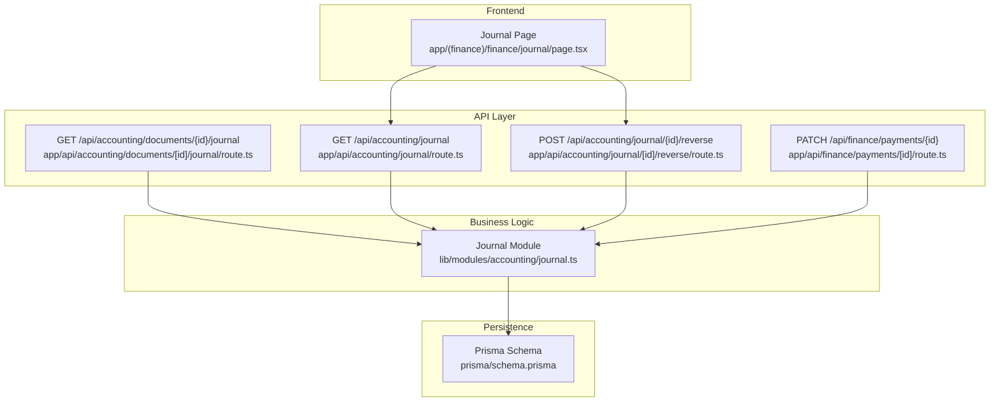
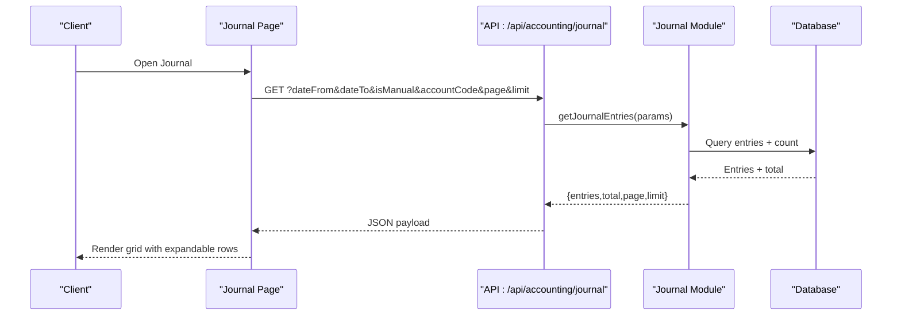
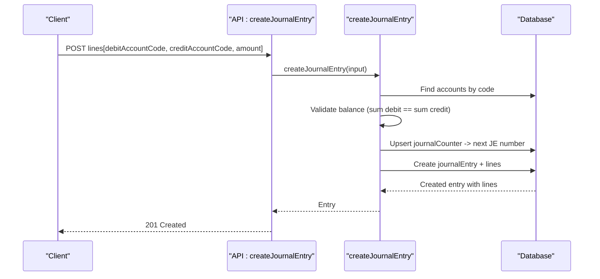
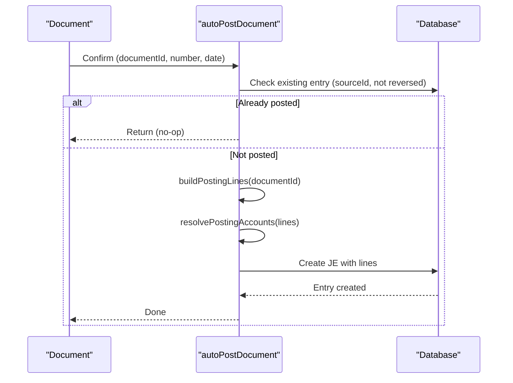
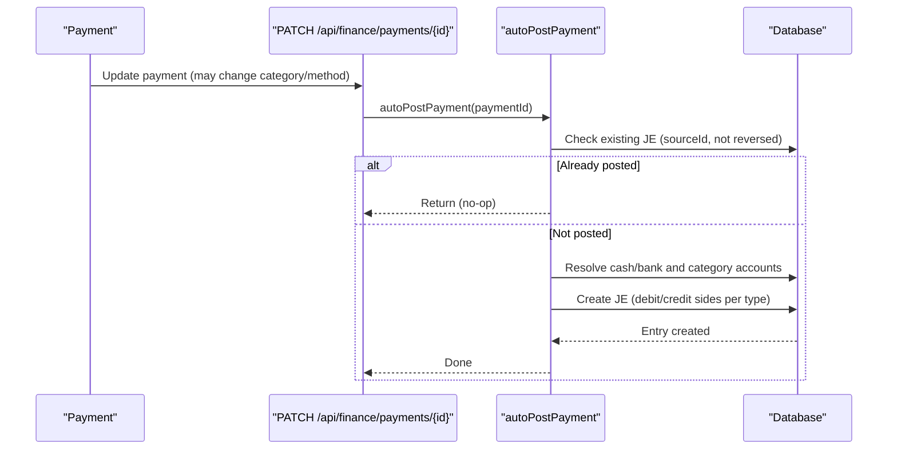
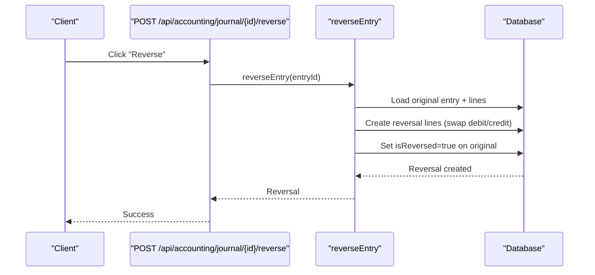
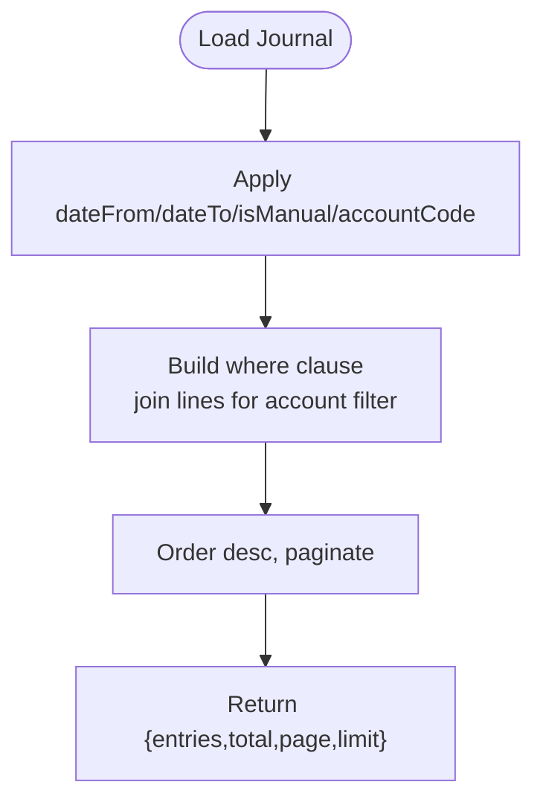
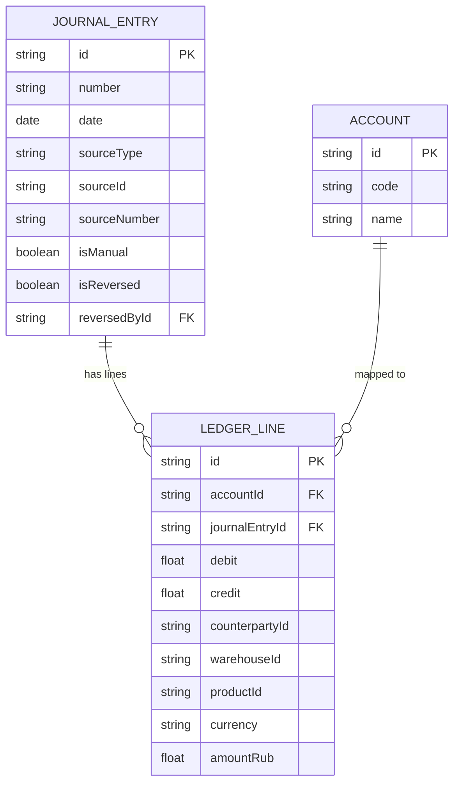
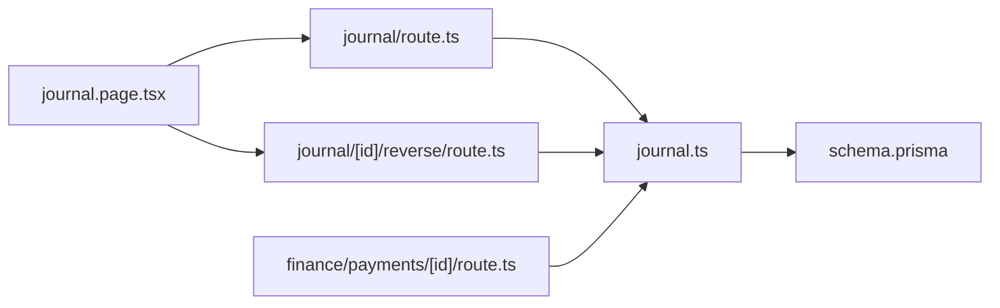

# Journal Entries

<cite>
**Referenced Files in This Document**
- [journal.ts](file://lib/modules/accounting/journal.ts)
- [journal.route.ts](file://app/api/accounting/journal/route.ts)
- [journal.reverse.route.ts](file://app/api/accounting/journal/[id]/reverse/route.ts)
- [documents.journal.route.ts](file://app/api/accounting/documents/[id]/journal/route.ts)
- [finance.payments.id.route.ts](file://app/api/finance/payments/[id]/route.ts)
- [journal.page.tsx](file://app/(finance)/finance/journal/page.tsx)
- [schema.prisma](file://prisma/schema.prisma)
- [journal.test.ts](file://tests/integration/documents/journal.test.ts)
</cite>

## Table of Contents
1. [Introduction](#introduction)
2. [Project Structure](#project-structure)
3. [Core Components](#core-components)
4. [Architecture Overview](#architecture-overview)
5. [Detailed Component Analysis](#detailed-component-analysis)
6. [Dependency Analysis](#dependency-analysis)
7. [Performance Considerations](#performance-considerations)
8. [Troubleshooting Guide](#troubleshooting-guide)
9. [Conclusion](#conclusion)
10. [Appendices](#appendices)

## Introduction
This document describes the journal entry system within the finance module. It covers how journal entries are created, validated, posted, reversed, searched, filtered, and integrated with financial reports. It also explains automated posting from accounting documents and payments, cross-referencing entries to their source documents, and operational controls such as permissions, idempotency, and audit trail semantics.

## Project Structure
The journal entry system spans frontend and backend components:
- Frontend: a Next.js page that renders a searchable, filterable journal grid with reversal actions.
- Backend APIs: endpoints to list entries, reverse entries, and fetch entries by source document.
- Business logic: a module implementing manual entry creation, automatic posting from documents and payments, reversal, and queries.
- Persistence: Prisma schema modeling journal entries, ledger lines, and counters.

**Diagram sources**
- [journal.page.tsx](file://app/(finance)/finance/journal/page.tsx#L205-L414)
- [journal.route.ts:1-43](file://app/api/accounting/journal/route.ts#L1-L43)
- [journal.reverse.route.ts:1-27](file://app/api/accounting/journal/[id]/reverse/route.ts#L1-L27)
- [documents.journal.route.ts:1-37](file://app/api/accounting/documents/[id]/journal/route.ts#L1-L37)
- [finance.payments.id.route.ts:38-65](file://app/api/finance/payments/[id]/route.ts#L38-L65)
- [journal.ts:1-387](file://lib/modules/accounting/journal.ts#L1-L387)
- [schema.prisma:1-1067](file://prisma/schema.prisma#L1-L1067)

**Section sources**
- [journal.page.tsx](file://app/(finance)/finance/journal/page.tsx#L1-L414)
- [journal.route.ts:1-43](file://app/api/accounting/journal/route.ts#L1-L43)
- [journal.reverse.route.ts:1-27](file://app/api/accounting/journal/[id]/reverse/route.ts#L1-L27)
- [documents.journal.route.ts:1-37](file://app/api/accounting/documents/[id]/journal/route.ts#L1-L37)
- [finance.payments.id.route.ts:38-65](file://app/api/finance/payments/[id]/route.ts#L38-L65)
- [journal.ts:1-387](file://lib/modules/accounting/journal.ts#L1-L387)
- [schema.prisma:1-1067](file://prisma/schema.prisma#L1-L1067)

## Core Components
- Journal Entry model and ledger lines: persisted as a separate lines table with debit/credit amounts and foreign keys to accounts.
- Numbering: centralized counter for sequential JE numbers.
- Posting rules: configurable mapping from document types to ledger lines; resolved to account IDs.
- Manual entries: create balanced entries with explicit account codes and amounts.
- Automatic posting: triggered on document confirmation and payment creation/update.
- Reversal: creates a new entry swapping debit/credit while marking the original as reversed.
- Queries: paginated listing with date range, manual/auto filter, and account code filter; per-document retrieval.

**Section sources**
- [journal.ts:9-119](file://lib/modules/accounting/journal.ts#L9-L119)
- [journal.ts:125-187](file://lib/modules/accounting/journal.ts#L125-L187)
- [journal.ts:193-244](file://lib/modules/accounting/journal.ts#L193-L244)
- [journal.ts:345-386](file://lib/modules/accounting/journal.ts#L345-L386)
- [schema.prisma:1-1067](file://prisma/schema.prisma#L1-L1067)

## Architecture Overview
The system enforces double-entry bookkeeping with strict balancing and audit semantics. Automated posting ensures that financial events originating from documents and payments are consistently recorded. The UI provides filtering and reversal controls, while the backend enforces permissions and idempotency.

**Diagram sources**
- [journal.page.tsx](file://app/(finance)/finance/journal/page.tsx#L217-L287)
- [journal.route.ts:6-43](file://app/api/accounting/journal/route.ts#L6-L43)
- [journal.ts:345-386](file://lib/modules/accounting/journal.ts#L345-L386)

## Detailed Component Analysis

### Journal Entry Creation (Manual)
Manual entries are created with balanced debit/credit lines. The module resolves account codes to IDs, validates the entry is balanced, assigns a sequential number, and persists the entry and its lines.

**Diagram sources**
- [journal.ts:40-119](file://lib/modules/accounting/journal.ts#L40-L119)

**Section sources**
- [journal.ts:40-119](file://lib/modules/accounting/journal.ts#L40-L119)
- [journal.test.ts:52-144](file://tests/integration/documents/journal.test.ts#L52-L144)

### Automated Entry Generation from Accounting Documents
When a document is confirmed, the system builds posting lines and posts them as a single journal entry. The process is idempotent: repeated calls for the same document are no-ops.

**Diagram sources**
- [journal.ts:125-187](file://lib/modules/accounting/journal.ts#L125-L187)

**Section sources**
- [journal.ts:125-187](file://lib/modules/accounting/journal.ts#L125-L187)
- [journal.test.ts:166-222](file://tests/integration/documents/journal.test.ts#L166-L222)

### Automated Entry Generation from Finance Payments
Payments trigger automatic posting. Income vs expense determines which sides debit and credit, and whether cash or bank accounts are used. Category default accounts can override defaults.

**Diagram sources**
- [finance.payments.id.route.ts:38-65](file://app/api/finance/payments/[id]/route.ts#L38-L65)
- [journal.ts:251-325](file://lib/modules/accounting/journal.ts#L251-L325)

**Section sources**
- [finance.payments.id.route.ts:38-65](file://app/api/finance/payments/[id]/route.ts#L38-L65)
- [journal.ts:251-325](file://lib/modules/accounting/journal.ts#L251-L325)
- [journal.test.ts:306-417](file://tests/integration/documents/journal.test.ts#L306-L417)

### Journal Entry Reversal (Storno)
Reversals create a new entry with debit/credit swapped for each original line, mark the original as reversed, and link the reversal back to the original.

**Diagram sources**
- [journal.reverse.route.ts:6-27](file://app/api/accounting/journal/[id]/reverse/route.ts#L6-L27)
- [journal.ts:193-244](file://lib/modules/accounting/journal.ts#L193-L244)

**Section sources**
- [journal.reverse.route.ts:1-27](file://app/api/accounting/journal/[id]/reverse/route.ts#L1-L27)
- [journal.ts:193-244](file://lib/modules/accounting/journal.ts#L193-L244)
- [journal.test.ts:228-300](file://tests/integration/documents/journal.test.ts#L228-L300)

### Journal Search, Filtering, and Display
The UI supports:
- Date range filtering
- Manual/Auto filter
- Account code filter
- Pagination
- Expandable rows to show debits and credits

The backend endpoint translates UI filters into database queries, including joins for account filtering.

**Diagram sources**
- [journal.page.tsx](file://app/(finance)/finance/journal/page.tsx#L217-L287)
- [journal.route.ts:6-43](file://app/api/accounting/journal/route.ts#L6-L43)
- [journal.ts:345-386](file://lib/modules/accounting/journal.ts#L345-L386)

**Section sources**
- [journal.page.tsx](file://app/(finance)/finance/journal/page.tsx#L217-L287)
- [journal.route.ts:1-43](file://app/api/accounting/journal/route.ts#L1-L43)
- [journal.ts:345-386](file://lib/modules/accounting/journal.ts#L345-L386)

### Cross-Referencing and Audit Trail Semantics
- Each entry stores sourceType, sourceId, and sourceNumber to link back to the originating document or payment.
- Per-document entry retrieval returns flattened lines with account codes/names and amounts.
- Reversals set reversedById on the reversal and mark the original isReversed=true.
- Idempotency guards prevent duplicate postings for the same source.

**Diagram sources**
- [schema.prisma:1-1067](file://prisma/schema.prisma#L1-L1067)
- [documents.journal.route.ts:16-31](file://app/api/accounting/documents/[id]/journal/route.ts#L16-L31)
- [journal.ts:193-244](file://lib/modules/accounting/journal.ts#L193-L244)

**Section sources**
- [documents.journal.route.ts:1-37](file://app/api/accounting/documents/[id]/journal/route.ts#L1-L37)
- [journal.ts:193-244](file://lib/modules/accounting/journal.ts#L193-L244)
- [schema.prisma:1-1067](file://prisma/schema.prisma#L1-L1067)

### Permissions and Idempotency Controls
- Listing entries requires permission for reports.
- Reversal requires permission for document write.
- Automatic posting checks for existing non-reversed entries for the same source to remain idempotent.
- Payment updates/deletes reverse prior journal entries before mutating data.

**Section sources**
- [journal.route.ts:8-8](file://app/api/accounting/journal/route.ts#L8-L8)
- [journal.reverse.route.ts:11-11](file://app/api/accounting/journal/[id]/reverse/route.ts#L11-L11)
- [finance.payments.id.route.ts:44-51](file://app/api/finance/payments/[id]/route.ts#L44-L51)
- [finance.payments.id.route.ts:115-121](file://app/api/finance/payments/[id]/route.ts#L115-L121)

## Dependency Analysis
- UI depends on the journal API for listing and reversing entries.
- API endpoints delegate to the journal module for business logic.
- The journal module depends on the persistence layer for counters, entries, and lines.
- Automatic posting integrates with document and payment lifecycles.

**Diagram sources**
- [journal.page.tsx](file://app/(finance)/finance/journal/page.tsx#L205-L414)
- [journal.route.ts:1-43](file://app/api/accounting/journal/route.ts#L1-L43)
- [journal.reverse.route.ts:1-27](file://app/api/accounting/journal/[id]/reverse/route.ts#L1-L27)
- [finance.payments.id.route.ts:38-65](file://app/api/finance/payments/[id]/route.ts#L38-L65)
- [journal.ts:1-387](file://lib/modules/accounting/journal.ts#L1-L387)
- [schema.prisma:1-1067](file://prisma/schema.prisma#L1-L1067)

**Section sources**
- [journal.page.tsx](file://app/(finance)/finance/journal/page.tsx#L205-L414)
- [journal.route.ts:1-43](file://app/api/accounting/journal/route.ts#L1-L43)
- [journal.reverse.route.ts:1-27](file://app/api/accounting/journal/[id]/reverse/route.ts#L1-L27)
- [finance.payments.id.route.ts:38-65](file://app/api/finance/payments/[id]/route.ts#L38-L65)
- [journal.ts:1-387](file://lib/modules/accounting/journal.ts#L1-L387)
- [schema.prisma:1-1067](file://prisma/schema.prisma#L1-L1067)

## Performance Considerations
- Filtering by account code requires joining through lines; ensure appropriate indexing on account IDs and dates.
- Pagination limits reduce payload sizes; use reasonable page sizes for large datasets.
- Idempotency checks avoid redundant writes and maintain consistency under retries.
- Balancing validation occurs in-memory during creation; keep batches reasonable to avoid large intermediate arrays.

## Troubleshooting Guide
Common issues and resolutions:
- Unbalanced entry: creation fails if total debit differs from total credit beyond tolerance; verify all lines are paired and amounts are correct.
- Account not found: creation fails if either debit or credit account code is invalid; ensure codes exist in the chart of accounts.
- Double reversal: attempting to reverse an already reversed entry throws an error; check isReversed flag before reversing.
- Duplicate posting: automatic posting is idempotent; if a posting exists for the same source, subsequent calls are no-ops.
- Payment reversal on update/delete: payment updates/deletes attempt to reverse prior journal entries; failures are handled non-critically to preserve mutation.

**Section sources**
- [journal.ts:98-103](file://lib/modules/accounting/journal.ts#L98-L103)
- [journal.ts:61-62](file://lib/modules/accounting/journal.ts#L61-L62)
- [journal.ts:204-205](file://lib/modules/accounting/journal.ts#L204-L205)
- [journal.ts:131-135](file://lib/modules/accounting/journal.ts#L131-L135)
- [finance.payments.id.route.ts:44-51](file://app/api/finance/payments/[id]/route.ts#L44-L51)
- [finance.payments.id.route.ts:115-121](file://app/api/finance/payments/[id]/route.ts#L115-L121)

## Conclusion
The journal entry system provides robust double-entry bookkeeping with clear automation from documents and payments, strong validation, and audit-friendly semantics. The UI enables efficient search, filtering, and reversal, while backend safeguards ensure consistency and idempotency.

## Appendices

### Common Journal Entry Scenarios
- Adjusting entries: create manual entries to adjust balances or reclassify amounts; ensure they remain balanced.
- Correcting entries: reverse incorrect entries and post corrected ones; use reversal to maintain audit trail.
- Closing entries: close temporary accounts at period ends; ensure all revenue and expense accounts are reset.

### Best Practices
- Always maintain balanced entries; use multi-line entries for complex transactions.
- Leverage automatic posting for documents and payments to minimize manual errors.
- Use sourceType/sourceId/sourceNumber to link entries to their origins for traceability.
- Apply filters (date range, manual/auto, account code) to focus reporting and analysis.
- Respect permissions and idempotency to avoid unintended duplicates or unauthorized changes.