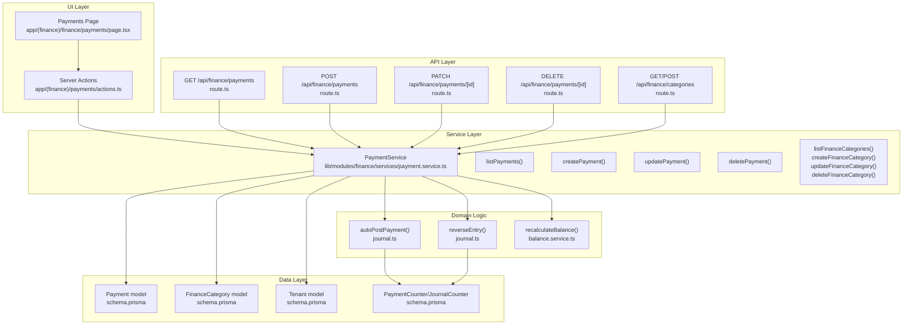
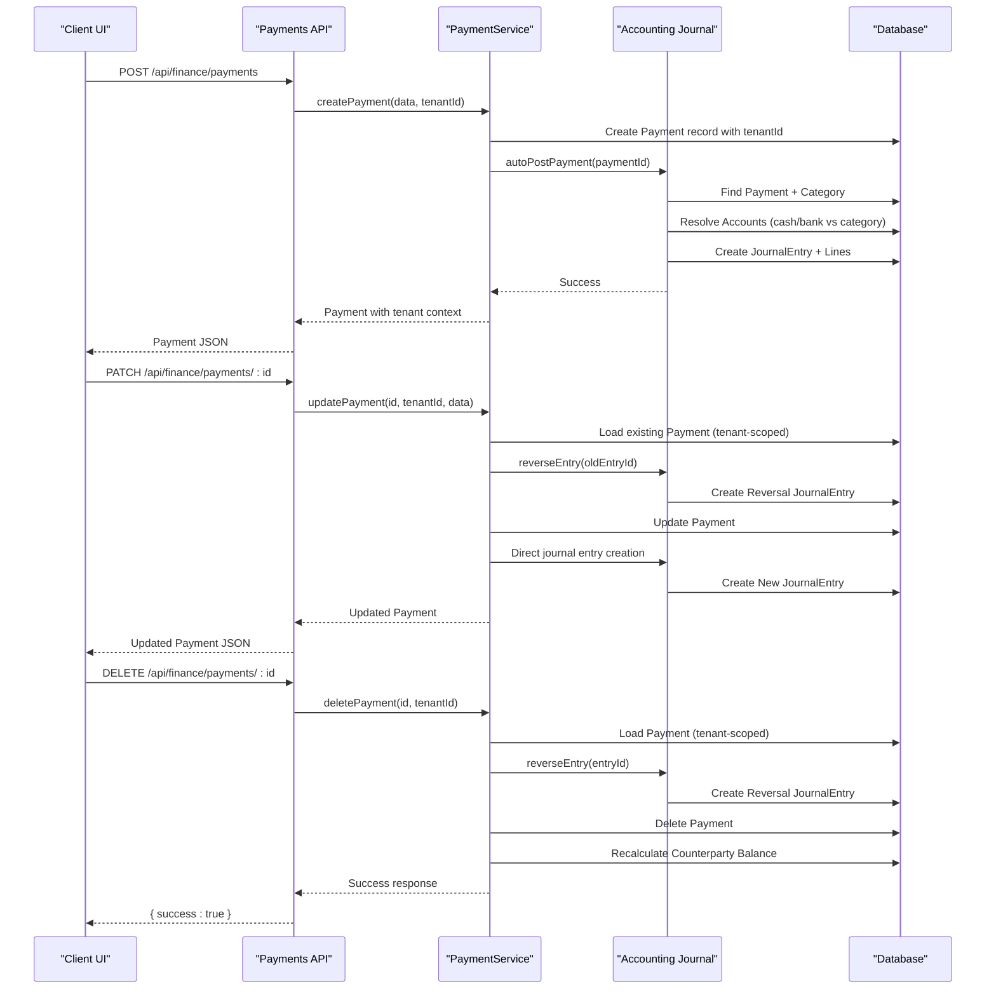
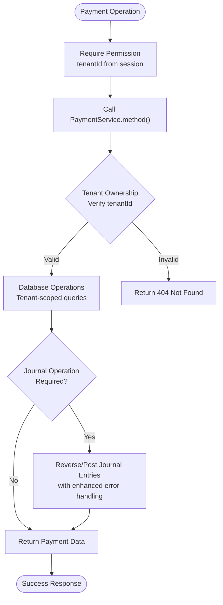
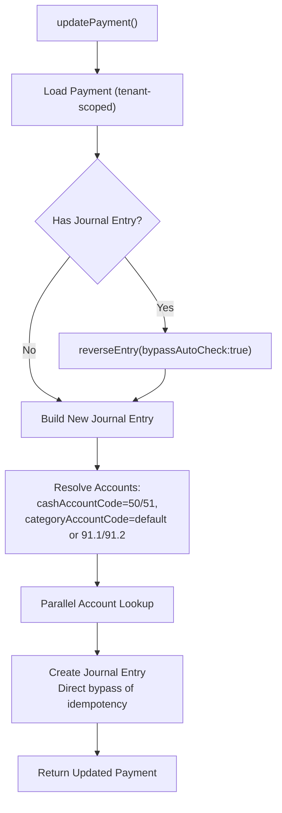
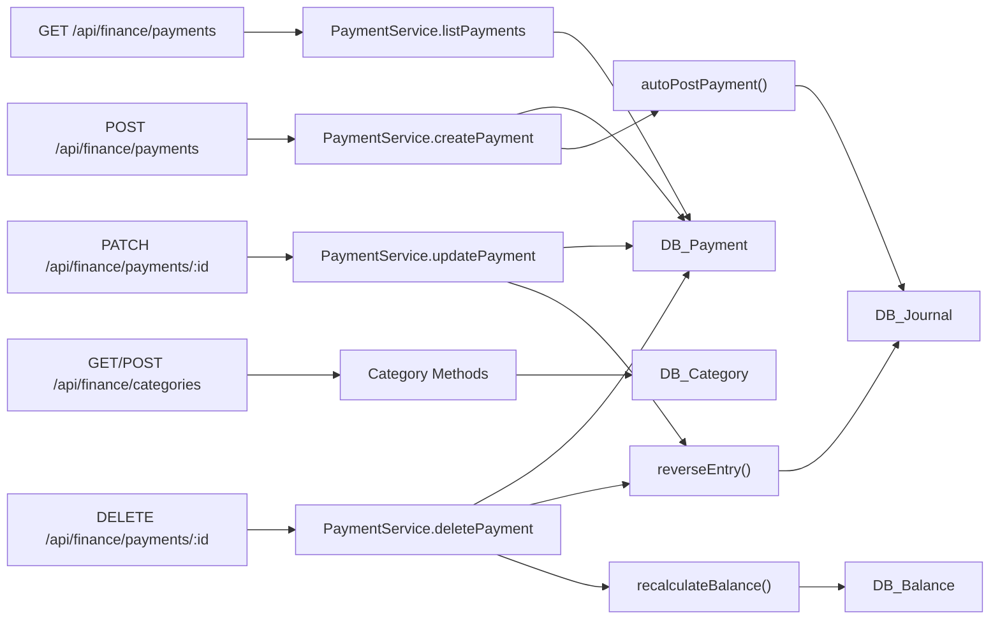

# Payment Processing

<cite>
**Referenced Files in This Document**
- [payment.service.ts](file://lib/modules/finance/services/payment.service.ts)
- [route.ts](file://app/api/finance/payments/route.ts)
- [route.ts](file://app/api/finance/payments/[id]/route.ts)
- [route.ts](file://app/api/finance/categories/route.ts)
- [actions.ts](file://app/(finance)/payments/actions.ts)
- [schema.prisma](file://prisma/schema.prisma)
- [page.tsx](file://app/(finance)/finance/payments/page.tsx)
- [journal.ts](file://lib/modules/accounting/journal.ts)
- [verify-payment-tenant-gate.ts](file://scripts/verify-payment-tenant-gate.ts)
- [backfill-payment-tenant.ts](file://scripts/backfill-payment-tenant.ts)
- [financial-business-logic.test.ts](file://tests/integration/finance/financial-business-logic.test.ts)
- [payment-handler.test.ts](file://tests/unit/lib/payment-handler.test.ts)
</cite>

## Update Summary
**Changes Made**
- Added comprehensive tenant isolation support with Payment.tenantId enforcement
- Enhanced PaymentService with centralized service layer for payment operations
- Updated API endpoints to use PaymentService with tenant-aware operations
- Improved payment validation and error handling
- Added enhanced journal posting with better account resolution
- Updated payment cancellation workflows with document dependency checks
- Enhanced payment reporting with tenant-scoped aggregations

## Table of Contents
1. [Introduction](#introduction)
2. [Project Structure](#project-structure)
3. [Core Components](#core-components)
4. [Architecture Overview](#architecture-overview)
5. [Detailed Component Analysis](#detailed-component-analysis)
6. [Dependency Analysis](#dependency-analysis)
7. [Performance Considerations](#performance-considerations)
8. [Troubleshooting Guide](#troubleshooting-guide)
9. [Conclusion](#conclusion)
10. [Appendices](#appendices)

## Introduction
This document describes the payment processing subsystem within the finance module, featuring a new comprehensive payment service with tenant isolation, enhanced payment processing workflows, and improved API endpoints for payment management. The system covers the complete lifecycle for incoming and outgoing payments, payment method management, automatic journal posting, payment categories, and reporting with strict tenant boundaries.

## Project Structure
The payment subsystem now features a centralized service layer with enhanced tenant isolation:
- PaymentService provides unified payment operations with tenant awareness
- API endpoints route through PaymentService for all payment operations
- Database schema enforces tenant isolation with Payment.tenantId constraints
- Enhanced validation and error handling throughout the payment lifecycle

**Diagram sources**
- [payment.service.ts:51-321](file://lib/modules/finance/services/payment.service.ts#L51-L321)
- [route.ts:29-60](file://app/api/finance/payments/route.ts#L29-L60)
- [route.ts:16-70](file://app/api/finance/payments/[id]/route.ts#L16-L70)
- [route.ts:12-42](file://app/api/finance/categories/route.ts#L12-L42)
- [actions.ts:11-95](file://app/(finance)/payments/actions.ts#L11-L95)
- [schema.prisma:789-812](file://prisma/schema.prisma#L789-L812)
- [schema.prisma:767-781](file://prisma/schema.prisma#L767-L781)
- [schema.prisma:28-44](file://prisma/schema.prisma#L28-L44)

**Section sources**
- [payment.service.ts:51-321](file://lib/modules/finance/services/payment.service.ts#L51-L321)
- [route.ts:29-60](file://app/api/finance/payments/route.ts#L29-L60)
- [route.ts:16-70](file://app/api/finance/payments/[id]/route.ts#L16-L70)
- [route.ts:12-42](file://app/api/finance/categories/route.ts#L12-L42)
- [actions.ts:11-95](file://app/(finance)/payments/actions.ts#L11-L95)
- [schema.prisma:789-812](file://prisma/schema.prisma#L789-L812)
- [schema.prisma:767-781](file://prisma/schema.prisma#L767-L781)
- [schema.prisma:28-44](file://prisma/schema.prisma#L28-L44)

## Core Components
The payment subsystem now features a comprehensive service layer with tenant isolation:

### PaymentService
- Centralized payment operations with tenant awareness
- Tenant-scoped payment listing, creation, updates, and deletions
- Enhanced validation and error handling
- Integrated journal posting with improved account resolution
- Balance recalculation for counterparties

### Tenant Isolation
- Payment.tenantId is now NOT NULL (schema-enforced)
- All payment operations automatically scoped to tenant
- Tenant verification through dedicated scripts and gates
- Foreign key integrity maintained against Tenant table

### Enhanced Journal Integration
- Improved account resolution with better error handling
- Direct journal entry creation bypassing idempotency checks
- Enhanced cash flow calculations with tenant scoping

**Section sources**
- [payment.service.ts:51-321](file://lib/modules/finance/services/payment.service.ts#L51-L321)
- [verify-payment-tenant-gate.ts:1-88](file://scripts/verify-payment-tenant-gate.ts#L1-L88)
- [backfill-payment-tenant.ts:1-80](file://scripts/backfill-payment-tenant.ts#L1-L80)
- [schema.prisma:802](file://prisma/schema.prisma#L802)

## Architecture Overview
The enhanced payment lifecycle now includes comprehensive tenant isolation and centralized service operations:

**Diagram sources**
- [payment.service.ts:97-123](file://lib/modules/finance/services/payment.service.ts#L97-L123)
- [payment.service.ts:129-213](file://lib/modules/finance/services/payment.service.ts#L129-L213)
- [payment.service.ts:215-241](file://lib/modules/finance/services/payment.service.ts#L215-L241)
- [route.ts:42-60](file://app/api/finance/payments/route.ts#L42-L60)
- [route.ts:16-70](file://app/api/finance/payments/[id]/route.ts#L16-L70)

## Detailed Component Analysis

### Enhanced PaymentService Operations
The PaymentService now provides comprehensive tenant-aware operations:

#### Tenant-Scoped Payment Management
- **listPayments**: Filters by tenantId, supports pagination, aggregation, and includes related entities
- **createPayment**: Generates tenant-specific payment numbers, validates tenant context
- **updatePayment**: Enforces tenant ownership, handles journal reversals, creates new entries
- **deletePayment**: Reverses journal entries, recalculates balances, maintains tenant boundaries

#### Enhanced Validation and Error Handling
- Comprehensive Zod validation for all payment operations
- Tenant ownership verification for all CRUD operations
- Graceful error handling with appropriate HTTP status codes
- Non-critical journal operations don't block payment operations

**Diagram sources**
- [payment.service.ts:52-95](file://lib/modules/finance/services/payment.service.ts#L52-L95)
- [payment.service.ts:97-123](file://lib/modules/finance/services/payment.service.ts#L97-L123)
- [payment.service.ts:129-213](file://lib/modules/finance/services/payment.service.ts#L129-L213)
- [payment.service.ts:215-241](file://lib/modules/finance/services/payment.service.ts#L215-L241)

**Section sources**
- [payment.service.ts:51-321](file://lib/modules/finance/services/payment.service.ts#L51-L321)
- [route.ts:29-60](file://app/api/finance/payments/route.ts#L29-L60)
- [route.ts:16-70](file://app/api/finance/payments/[id]/route.ts#L16-L70)

### Tenant Isolation and Security
The system now enforces strict tenant boundaries:

#### Schema-Level Enforcement
- Payment.tenantId is NOT NULL (schema-enforced)
- Foreign key constraint ensures all payments reference valid tenants
- Tenant verification through dedicated scripts and gates

#### Runtime Enforcement
- All API endpoints pass tenantId from session context
- PaymentService methods enforce tenant ownership
- Server actions validate tenant context before database operations

#### Verification and Backfill
- `verify-payment-tenant-gate.ts`: Ensures 100% FK integrity coverage
- `backfill-payment-tenant.ts`: Idempotent verification of tenant references
- Migration scripts ensure data consistency across tenant boundaries

**Section sources**
- [schema.prisma:802](file://prisma/schema.prisma#L802)
- [verify-payment-tenant-gate.ts:1-88](file://scripts/verify-payment-tenant-gate.ts#L1-L88)
- [backfill-payment-tenant.ts:1-80](file://scripts/backfill-payment-tenant.ts#L1-L80)
- [payment.service.ts:63](file://lib/modules/finance/services/payment.service.ts#L63)

### Enhanced Journal Posting and Reversal
The journal integration now features improved reliability:

#### Direct Journal Entry Creation
- Updates bypass idempotency checks for better control
- Enhanced account resolution with fallback logic
- Improved error handling for non-critical journal operations

#### Enhanced Account Resolution
- Better cash account detection (50 for cash, 51 for bank)
- Flexible category account resolution with default fallbacks
- Parallel account lookup for improved performance

**Diagram sources**
- [payment.service.ts:146-213](file://lib/modules/finance/services/payment.service.ts#L146-L213)
- [journal.ts:193-244](file://lib/modules/accounting/journal.ts#L193-L244)

**Section sources**
- [payment.service.ts:146-213](file://lib/modules/finance/services/payment.service.ts#L146-L213)
- [journal.ts:193-244](file://lib/modules/accounting/journal.ts#L193-L244)

### API Endpoints with Enhanced Service Layer

#### GET /api/finance/payments
- **Enhanced**: Now uses PaymentService.listPayments with tenant isolation
- **Query Parameters**: type, categoryId, counterpartyId, dateFrom, dateTo, page, limit
- **Response**: Enhanced with tenant-scoped aggregations and included entities

#### POST /api/finance/payments
- **Enhanced**: Uses PaymentService.createPayment with comprehensive validation
- **Request Body**: Enhanced Zod validation with tenantId injection
- **Response**: Payment with tenant context and included relations

#### PATCH /api/finance/payments/[id]
- **Enhanced**: PaymentService.updatePayment with tenant ownership verification
- **Request Body**: Partial updates with enhanced validation
- **Response**: Updated payment with tenant context

#### DELETE /api/finance/payments/[id]
- **Enhanced**: PaymentService.deletePayment with journal reversal and balance recalculation
- **Response**: Success object with counterpartyId for cache invalidation

#### GET/POST /api/finance/categories
- **Enhanced**: PaymentService methods for category management
- **Response**: Tenant-aware category operations

**Section sources**
- [route.ts:29-60](file://app/api/finance/payments/route.ts#L29-L60)
- [route.ts:16-70](file://app/api/finance/payments/[id]/route.ts#L16-L70)
- [route.ts:12-42](file://app/api/finance/categories/route.ts#L12-L42)
- [payment.service.ts:52-95](file://lib/modules/finance/services/payment.service.ts#L52-L95)

### Enhanced Payment Scenarios and Workflows

#### Document-Linked Payments
- Payments can be linked to documents with tenant context
- Cancellation workflows prevent document cancellation when payments exist
- Enhanced error messages for payment-linked documents

#### Counterparty Integration
- Automatic counterparty balance recalculation on payment deletion
- Enhanced cache invalidation for counterparty-related pages
- Improved mutual settlement accuracy

#### Enhanced Cancellation Workflows
- Payment deletion triggers counterparty balance recalculation
- Document cancellation blocked when payments are linked
- Improved audit trail for payment operations

**Section sources**
- [financial-business-logic.test.ts:373-403](file://tests/integration/finance/financial-business-logic.test.ts#L373-L403)
- [payment.service.ts:231-241](file://lib/modules/finance/services/payment.service.ts#L231-L241)
- [payment-handler.test.ts:40-73](file://tests/unit/lib/payment-handler.test.ts#L40-L73)

### Enhanced Validation Rules and Data Integrity
- **Comprehensive Zod Validation**: Enhanced schema validation for all payment operations
- **Tenant Ownership**: All operations verify tenant ownership before execution
- **Journal Operation Resilience**: Non-critical journal failures don't block payment operations
- **Enhanced Error Handling**: Appropriate HTTP status codes and error messages

**Section sources**
- [route.ts:8-17](file://app/api/finance/payments/route.ts#L8-L17)
- [route.ts:7-14](file://app/api/finance/payments/[id]/route.ts#L7-L14)
- [payment.service.ts:148-210](file://lib/modules/finance/services/payment.service.ts#L148-L210)

### Enhanced Reporting and Summaries
- **Tenant-Scoped Aggregations**: All payment summaries respect tenant boundaries
- **Enhanced Cash Flow**: Improved cash flow calculations with better accuracy
- **Real-time Cache Invalidation**: Automatic cache invalidation for all related pages

**Section sources**
- [payment.service.ts:74-95](file://lib/modules/finance/services/payment.service.ts#L74-L95)
- [payment.service.ts:306-320](file://lib/modules/finance/services/payment.service.ts#L306-L320)
- [route.ts:53-60](file://app/api/finance/payments/[id]/route.ts#L53-L60)

## Dependency Analysis
The enhanced payment system features a centralized service layer with clear dependency boundaries:

**Diagram sources**
- [route.ts:29-60](file://app/api/finance/payments/route.ts#L29-L60)
- [route.ts:16-70](file://app/api/finance/payments/[id]/route.ts#L16-L70)
- [payment.service.ts:51-321](file://lib/modules/finance/services/payment.service.ts#L51-L321)
- [schema.prisma:789-812](file://prisma/schema.prisma#L789-L812)
- [schema.prisma:767-781](file://prisma/schema.prisma#L767-L781)

**Section sources**
- [route.ts:29-60](file://app/api/finance/payments/route.ts#L29-L60)
- [route.ts:16-70](file://app/api/finance/payments/[id]/route.ts#L16-L70)
- [payment.service.ts:51-321](file://lib/modules/finance/services/payment.service.ts#L51-L321)
- [schema.prisma:789-812](file://prisma/schema.prisma#L789-L812)
- [schema.prisma:767-781](file://prisma/schema.prisma#L767-L781)

## Performance Considerations
- **Centralized Service Layer**: Reduced code duplication and improved maintainability
- **Enhanced Parallel Operations**: Parallel account resolution and database queries
- **Improved Cache Invalidation**: Targeted cache invalidation reduces unnecessary reloads
- **Tenant-Scoped Queries**: Optimized database queries with proper indexing
- **Non-Critical Journal Operations**: Journal failures don't impact payment creation/update

## Troubleshooting Guide
Enhanced troubleshooting for the new comprehensive payment service:

### Tenant Isolation Issues
- **Payment not found despite existence**
  - Symptom: 404 responses for payments that appear to exist
  - Resolution: Verify tenantId in session matches payment tenantId; check tenant verification scripts

- **Tenant FK integrity violations**
  - Symptom: Payment tenantId references invalid tenant
  - Resolution: Run `verify-payment-tenant-gate.ts`; ensure all payments have valid tenant references

### Enhanced Service Layer Issues
- **Payment creation fails with validation errors**
  - Symptom: 400 responses with enhanced error details
  - Resolution: Check PaymentService validation schemas; verify tenant context

- **Payment updates don't persist**
  - Symptom: 404 responses on update operations
  - Resolution: Verify tenant ownership; check PaymentService tenant verification logic

### Journal Integration Problems
- **Journal entries not created during updates**
  - Symptom: Payments updated but no journal entries
  - Resolution: Check account resolution; verify cash/category account codes exist

- **Enhanced error handling**
  - Symptom: Silent failures in journal operations
  - Resolution: PaymentService catches and logs journal errors; check logs for details

### Cache and State Issues
- **Stale payment data after operations**
  - Symptom: UI shows old payment information
  - Resolution: Enhanced cache invalidation for all related pages; check revalidation logic

**Section sources**
- [verify-payment-tenant-gate.ts:23-82](file://scripts/verify-payment-tenant-gate.ts#L23-L82)
- [payment.service.ts:148-210](file://lib/modules/finance/services/payment.service.ts#L148-L210)
- [route.ts:53-60](file://app/api/finance/payments/[id]/route.ts#L53-L60)

## Conclusion
The enhanced payment processing subsystem now provides comprehensive tenant isolation, centralized service operations, and improved reliability. The new PaymentService architecture ensures strict tenant boundaries while providing enhanced validation, error handling, and journal integration. The system maintains backward compatibility while offering significant improvements in security, performance, and maintainability.

## Appendices

### Enhanced API Endpoint Reference

#### GET /api/finance/payments
- **Enhanced**: Tenant-scoped payment listing with comprehensive filtering
- **Query**: type, categoryId, counterpartyId, dateFrom, dateTo, page, limit
- **Response**: payments[], total, page, limit, incomeTotal, expenseTotal, netCashFlow

#### POST /api/finance/payments
- **Enhanced**: PaymentService-based creation with comprehensive validation
- **Body**: type, categoryId, counterpartyId?, documentId?, amount, paymentMethod, date?, description?
- **Response**: Payment object with tenant context and included relations

#### PATCH /api/finance/payments/[id]
- **Enhanced**: Tenant-aware updates with journal operation resilience
- **Body**: categoryId?, counterpartyId?, amount?, paymentMethod?, date?, description?
- **Response**: Updated Payment object with tenant context

#### DELETE /api/finance/payments/[id]
- **Enhanced**: Comprehensive cleanup with journal reversal and balance recalculation
- **Response**: { success: true, counterpartyId: string? }

#### GET/POST /api/finance/categories
- **Enhanced**: PaymentService-based category operations
- **GET**: Query: type?
- **POST**: Body: name, type, defaultAccountCode?

**Section sources**
- [route.ts:29-60](file://app/api/finance/payments/route.ts#L29-L60)
- [route.ts:16-70](file://app/api/finance/payments/[id]/route.ts#L16-L70)
- [route.ts:12-42](file://app/api/finance/categories/route.ts#L12-L42)
- [payment.service.ts:51-321](file://lib/modules/finance/services/payment.service.ts#L51-L321)