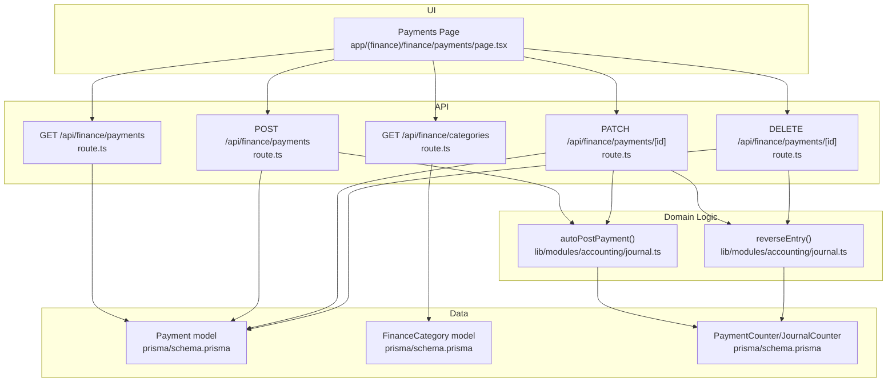
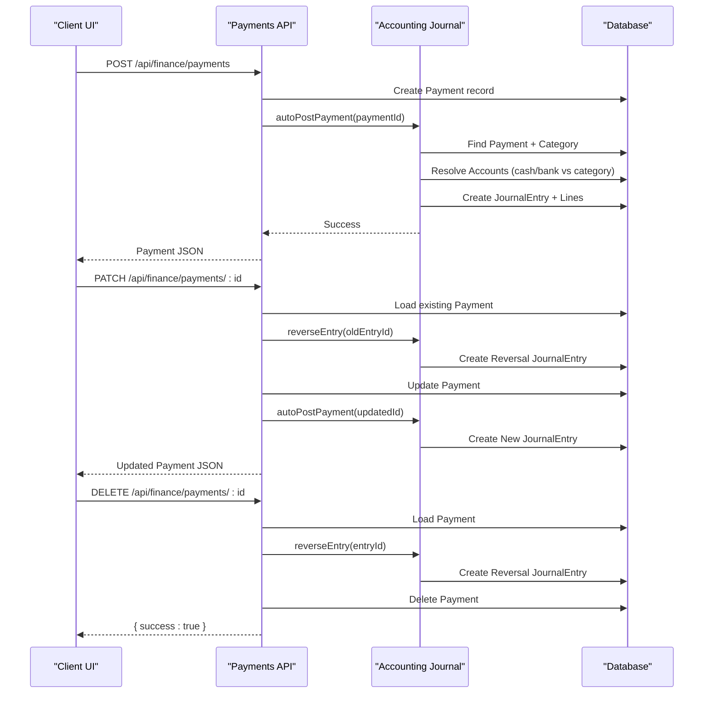
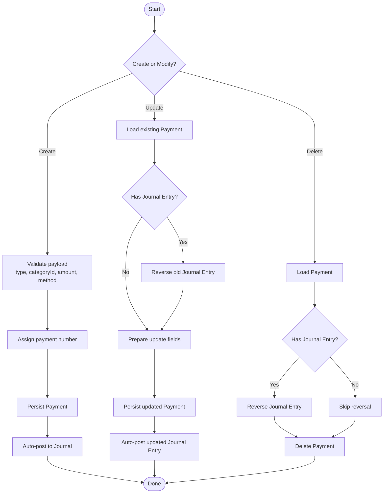
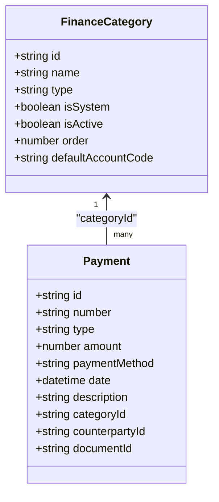
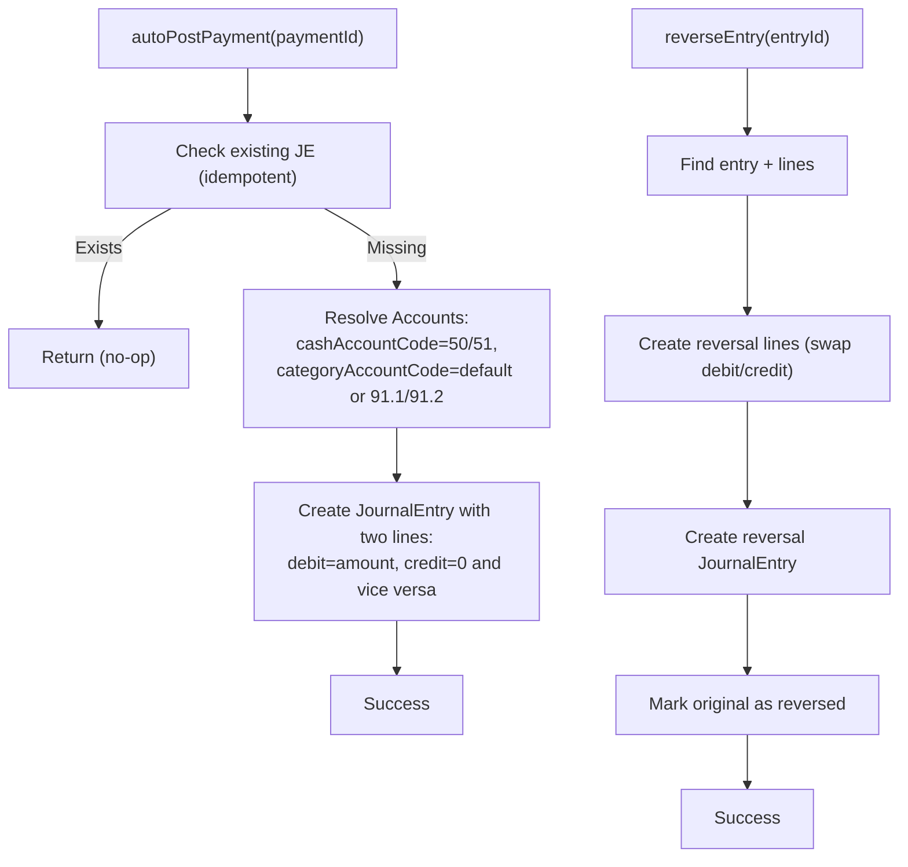
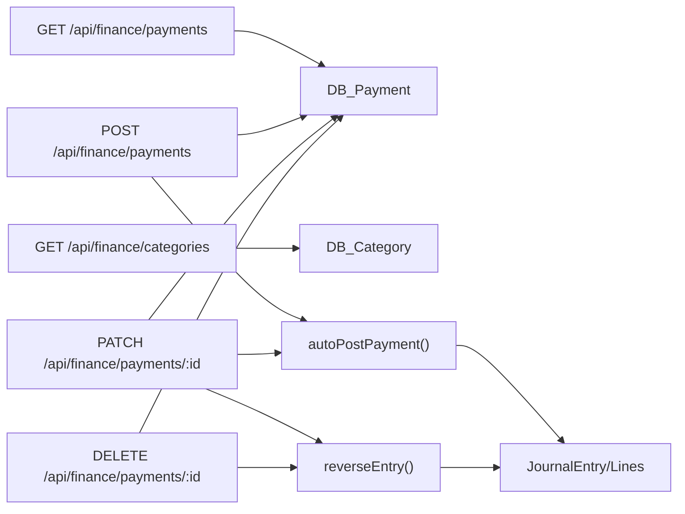

# Payment Processing

<cite>
**Referenced Files in This Document**
- [route.ts](file://app/api/finance/payments/route.ts)
- [route.ts](file://app/api/finance/payments/[id]/route.ts)
- [journal.ts](file://lib/modules/accounting/journal.ts)
- [schema.prisma](file://prisma/schema.prisma)
- [page.tsx](file://app/(finance)/finance/payments/page.tsx)
- [route.ts](file://app/api/finance/categories/route.ts)
</cite>

## Table of Contents
1. [Introduction](#introduction)
2. [Project Structure](#project-structure)
3. [Core Components](#core-components)
4. [Architecture Overview](#architecture-overview)
5. [Detailed Component Analysis](#detailed-component-analysis)
6. [Dependency Analysis](#dependency-analysis)
7. [Performance Considerations](#performance-considerations)
8. [Troubleshooting Guide](#troubleshooting-guide)
9. [Conclusion](#conclusion)
10. [Appendices](#appendices)

## Introduction
This document describes the payment processing subsystem within the finance module. It covers the complete lifecycle for incoming and outgoing payments, payment method management, automatic journal posting, payment categories, and reporting. It also documents the API endpoints for creating, updating, and deleting payments, along with practical scenarios (customer payments, supplier payments, internal transfers), validation rules, currency handling, and troubleshooting guidance.

## Project Structure
The payment subsystem spans API routes, database models, and UI pages:
- API endpoints under `/api/finance/payments` implement CRUD operations and integrate with the accounting journal.
- The database schema defines payment records, categories, and counters.
- The finance UI page provides filtering, summaries, and forms to manage payments.

**Diagram sources**
- [route.ts:26-112](file://app/api/finance/payments/route.ts#L26-L112)
- [route.ts:16-128](file://app/api/finance/payments/[id]/route.ts#L16-L128)
- [journal.ts:251-325](file://lib/modules/accounting/journal.ts#L251-L325)
- [schema.prisma:892-913](file://prisma/schema.prisma#L892-L913)
- [schema.prisma:870-884](file://prisma/schema.prisma#L870-L884)
- [schema.prisma:886-890](file://prisma/schema.prisma#L886-L890)
- [route.ts:12-29](file://app/api/finance/categories/route.ts#L12-L29)

**Section sources**
- [route.ts:1-113](file://app/api/finance/payments/route.ts#L1-L113)
- [route.ts:1-129](file://app/api/finance/payments/[id]/route.ts#L1-L129)
- [journal.ts:251-325](file://lib/modules/accounting/journal.ts#L251-L325)
- [schema.prisma:892-913](file://prisma/schema.prisma#L892-L913)
- [schema.prisma:870-884](file://prisma/schema.prisma#L870-L884)
- [schema.prisma:886-890](file://prisma/schema.prisma#L886-L890)
- [page.tsx](file://app/(finance)/finance/payments/page.tsx#L48-L117)
- [route.ts:12-29](file://app/api/finance/categories/route.ts#L12-L29)

## Core Components
- Payment entity: stores number, type (income/expense), amount, payment method, date, optional counterparty/document, and category linkage.
- Finance categories: define income/expense buckets with optional default account codes.
- Journal integration: automatic posting of payments to the double-entry ledger with reversal support.
- UI: filters, totals, pagination, and dialogs for create/update/delete.

Key behaviors:
- Payment numbering uses a dedicated counter.
- Auto-posting creates journal entries with debits/credits based on payment type and method.
- Updates trigger a reversal of prior journal entry followed by a new posting.
- Deletes reverse the associated journal entry before removing the payment.

**Section sources**
- [schema.prisma:892-913](file://prisma/schema.prisma#L892-L913)
- [schema.prisma:870-884](file://prisma/schema.prisma#L870-L884)
- [schema.prisma:886-890](file://prisma/schema.prisma#L886-L890)
- [journal.ts:251-325](file://lib/modules/accounting/journal.ts#L251-L325)
- [route.ts:75-112](file://app/api/finance/payments/route.ts#L75-L112)
- [route.ts:16-128](file://app/api/finance/payments/[id]/route.ts#L16-L128)
- [page.tsx](file://app/(finance)/finance/payments/page.tsx#L48-L117)

## Architecture Overview
The payment lifecycle integrates UI, API, domain logic, and persistence:

**Diagram sources**
- [route.ts:75-112](file://app/api/finance/payments/route.ts#L75-L112)
- [route.ts:16-128](file://app/api/finance/payments/[id]/route.ts#L16-L128)
- [journal.ts:251-325](file://lib/modules/accounting/journal.ts#L251-L325)

## Detailed Component Analysis

### Payment Entity and Lifecycle
- Creation: Validates type, category, amount, method, optional counterparty/document, and date; assigns a numbered sequence; auto-posts to journal.
- Update: Supports category, counterparty, amount, method, date, and description; reverses prior journal entry and posts updated entry.
- Deletion: Reverses the journal entry before deletion.

**Diagram sources**
- [route.ts:75-112](file://app/api/finance/payments/route.ts#L75-L112)
- [route.ts:16-128](file://app/api/finance/payments/[id]/route.ts#L16-L128)
- [journal.ts:193-244](file://lib/modules/accounting/journal.ts#L193-L244)

**Section sources**
- [route.ts:7-16](file://app/api/finance/payments/route.ts#L7-L16)
- [route.ts:75-112](file://app/api/finance/payments/route.ts#L75-L112)
- [route.ts:7-14](file://app/api/finance/payments/[id]/route.ts#L7-L14)
- [route.ts:16-128](file://app/api/finance/payments/[id]/route.ts#L16-L128)
- [journal.ts:193-244](file://lib/modules/accounting/journal.ts#L193-L244)

### Payment Categories System
- Categories are income or expense buckets with optional default account codes.
- UI filters payments by category and type; category lists are loaded dynamically.
- Default account codes influence journal posting accounts for auto-posting.

**Diagram sources**
- [schema.prisma:870-884](file://prisma/schema.prisma#L870-L884)
- [schema.prisma:892-913](file://prisma/schema.prisma#L892-L913)

**Section sources**
- [schema.prisma:870-884](file://prisma/schema.prisma#L870-L884)
- [route.ts:6-10](file://app/api/finance/categories/route.ts#L6-L10)
- [route.ts:12-29](file://app/api/finance/categories/route.ts#L12-L29)
- [page.tsx](file://app/(finance)/finance/payments/page.tsx#L121-L132)

### Journal Posting and Reversal
- Auto-posting rules:
  - Income: debit cash/bank, credit category account (or defaults).
  - Expense: debit category account (or defaults), credit cash/bank.
- Reversal creates a new journal entry swapping debit/credit; marks original as reversed.
- Both operations use sequential numbering counters.

**Diagram sources**
- [journal.ts:251-325](file://lib/modules/accounting/journal.ts#L251-L325)
- [journal.ts:193-244](file://lib/modules/accounting/journal.ts#L193-L244)

**Section sources**
- [journal.ts:251-325](file://lib/modules/accounting/journal.ts#L251-L325)
- [journal.ts:193-244](file://lib/modules/accounting/journal.ts#L193-L244)

### API Endpoints

- GET /api/finance/payments
  - Query parameters: type, categoryId, counterpartyId, dateFrom, dateTo, page, limit.
  - Returns: payments list, total count, pagination info, incomeTotal, expenseTotal, netCashFlow.
  - Filtering and aggregation computed server-side.

- POST /api/finance/payments
  - Request body validated against type, categoryId, counterpartyId, documentId, amount, paymentMethod, date, description.
  - Assigns payment number via counter and persists the record.
  - Triggers auto-posting to journal (non-critical failure does not fail the request).

- PATCH /api/finance/payments/[id]
  - Partial updates supported: categoryId, counterpartyId, amount, paymentMethod, date, description.
  - Reverses existing journal entry if present, then re-posts with updated data.

- DELETE /api/finance/payments/[id]
  - Reverses the associated journal entry if present, then deletes the payment.

- GET /api/finance/categories
  - Lists active categories optionally filtered by type.
  - Used by UI to populate category selectors.

**Section sources**
- [route.ts:26-73](file://app/api/finance/payments/route.ts#L26-L73)
- [route.ts:75-112](file://app/api/finance/payments/route.ts#L75-L112)
- [route.ts:16-99](file://app/api/finance/payments/[id]/route.ts#L16-L99)
- [route.ts:102-128](file://app/api/finance/payments/[id]/route.ts#L102-L128)
- [route.ts:12-29](file://app/api/finance/categories/route.ts#L12-L29)

### Payment Scenarios and Workflows

- Customer payment (income)
  - Type: income; method: bank_transfer or card; optional counterparty.
  - Journal: debit cash/bank, credit sales/revenue category.
  - UI: select category (e.g., “Sales”), enter amount, date, optional description.

- Supplier payment (expense)
  - Type: expense; method: bank_transfer or cash; optional counterparty.
  - Journal: debit expenses category, credit cash/bank.
  - UI: select category (e.g., “Supplies”), enter amount, date, optional description.

- Internal transfer (expense/income)
  - Use separate categories for “Cash” and “Bank” to reflect internal movement.
  - Journal: debit one cash/bank, credit another (both sides remain within cash assets).
  - UI: choose appropriate categories and amounts.

- Automatic creation from documents
  - Payments may be linked to documents; UI indicates when a payment was auto-created from a document and disallows deletion.

**Section sources**
- [page.tsx](file://app/(finance)/finance/payments/page.tsx#L360-L422)
- [journal.ts:251-325](file://lib/modules/accounting/journal.ts#L251-L325)

### Validation Rules and Data Integrity
- Amount must be positive.
- Type must be income or expense.
- Category is mandatory; must reference an existing category.
- Payment method must be cash, bank_transfer, or card.
- Optional fields: counterpartyId, documentId, description.
- Auto-posting is idempotent; if a journal entry exists for a payment, it will not be reposted.

**Section sources**
- [route.ts:7-16](file://app/api/finance/payments/route.ts#L7-L16)
- [route.ts:7-14](file://app/api/finance/payments/[id]/route.ts#L7-L14)
- [journal.ts:251-256](file://lib/modules/accounting/journal.ts#L251-L256)

### Currency Handling and Multi-Currency Support
- Current implementation uses RUB for all journal lines and amounts.
- Multi-currency support is not present in the current schema or posting logic.

**Section sources**
- [journal.ts:74-118](file://lib/modules/accounting/journal.ts#L74-L118)
- [journal.ts:293-324](file://lib/modules/accounting/journal.ts#L293-L324)

### Reporting and Summaries
- The payments list endpoint returns aggregated totals for income, expense, and net cash flow for the current filter set.
- UI displays summary cards for income, expense, and net cash flow.

**Section sources**
- [route.ts:49-69](file://app/api/finance/payments/route.ts#L49-L69)
- [page.tsx](file://app/(finance)/finance/payments/page.tsx#L262-L281)

## Dependency Analysis
- API routes depend on:
  - Prisma models for Payment, FinanceCategory, PaymentCounter, JournalCounter.
  - Accounting journal functions for auto-posting and reversing entries.
- UI depends on:
  - API endpoints for listing, creating, updating, deleting payments.
  - Category API for category lists.

**Diagram sources**
- [route.ts:26-112](file://app/api/finance/payments/route.ts#L26-L112)
- [route.ts:16-128](file://app/api/finance/payments/[id]/route.ts#L16-L128)
- [journal.ts:251-325](file://lib/modules/accounting/journal.ts#L251-L325)
- [schema.prisma:892-913](file://prisma/schema.prisma#L892-L913)
- [schema.prisma:870-884](file://prisma/schema.prisma#L870-L884)

**Section sources**
- [route.ts:26-112](file://app/api/finance/payments/route.ts#L26-L112)
- [route.ts:16-128](file://app/api/finance/payments/[id]/route.ts#L16-L128)
- [journal.ts:251-325](file://lib/modules/accounting/journal.ts#L251-L325)
- [schema.prisma:892-913](file://prisma/schema.prisma#L892-L913)
- [schema.prisma:870-884](file://prisma/schema.prisma#L870-L884)

## Performance Considerations
- Aggregated queries: The list endpoint computes income/expense totals and counts in a single request using aggregation.
- Pagination: Server-side pagination reduces payload sizes.
- Auto-posting is non-blocking; failures are caught and logged silently to avoid blocking payment creation.
- Journal posting uses parallel account resolution and idempotency checks to prevent duplicate postings.

[No sources needed since this section provides general guidance]

## Troubleshooting Guide
Common issues and resolutions:
- Unauthorized access
  - Symptom: 401 responses on API calls.
  - Resolution: Ensure authentication middleware is configured and user has required permissions.

- Validation errors on create/update
  - Symptom: 400 responses with validation details.
  - Resolution: Verify amount > 0, type is income/expense, category exists, and paymentMethod is valid.

- Journal entry not created
  - Symptom: Payment created but no journal entry.
  - Resolution: Check that accounts (cash/bank and category) are seeded; auto-posting skips if accounts are missing.

- Duplicate journal entries
  - Symptom: Duplicate postings after updates.
  - Resolution: Ensure reversal occurs before reposting; verify idempotency check passes.

- Cannot delete payment
  - Symptom: Attempted deletion fails or UI prevents deletion.
  - Resolution: Payments linked to documents cannot be deleted; unlink or remove the document association first.

- Currency mismatch
  - Symptom: Unexpected RUB-only amounts in journal.
  - Resolution: Multi-currency is not supported; ensure all transactions are in RUB.

**Section sources**
- [route.ts:106-111](file://app/api/finance/payments/route.ts#L106-L111)
- [route.ts:94-99](file://app/api/finance/payments/[id]/route.ts#L94-L99)
- [journal.ts:251-256](file://lib/modules/accounting/journal.ts#L251-L256)
- [page.tsx](file://app/(finance)/finance/payments/page.tsx#L399-L418)

## Conclusion
The payment processing subsystem provides a robust, auditable, and user-friendly mechanism for managing financial transactions. It enforces strong validation, integrates tightly with the double-entry journal, supports flexible categorization, and offers powerful UI-driven filtering and reporting. While multi-currency is not currently supported, the design leaves room for extension.

## Appendices

### API Endpoint Reference

- GET /api/finance/payments
  - Query: type, categoryId, counterpartyId, dateFrom, dateTo, page, limit
  - Response: payments[], total, page, limit, incomeTotal, expenseTotal, netCashFlow

- POST /api/finance/payments
  - Body: type, categoryId, counterpartyId?, documentId?, amount, paymentMethod, date?, description?
  - Response: Payment object

- PATCH /api/finance/payments/[id]
  - Body: categoryId?, counterpartyId?, amount?, paymentMethod?, date?, description?
  - Response: Payment object

- DELETE /api/finance/payments/[id]
  - Response: { success: true }

- GET /api/finance/categories
  - Query: type?
  - Response: categories[]

**Section sources**
- [route.ts:26-73](file://app/api/finance/payments/route.ts#L26-L73)
- [route.ts:75-112](file://app/api/finance/payments/route.ts#L75-L112)
- [route.ts:16-99](file://app/api/finance/payments/[id]/route.ts#L16-L99)
- [route.ts:102-128](file://app/api/finance/payments/[id]/route.ts#L102-L128)
- [route.ts:12-29](file://app/api/finance/categories/route.ts#L12-L29)