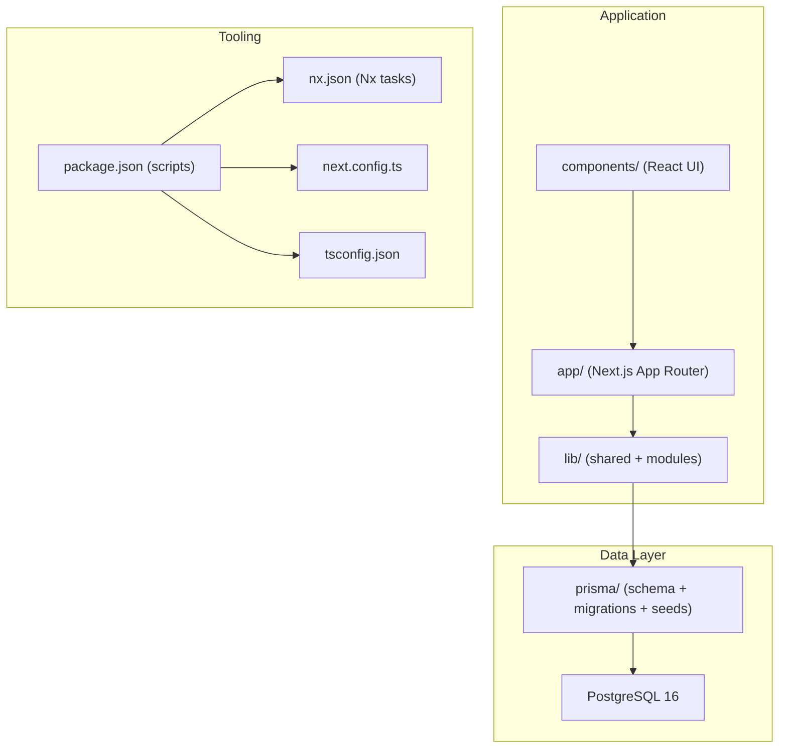
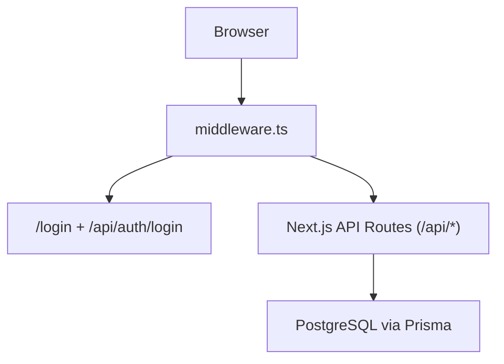
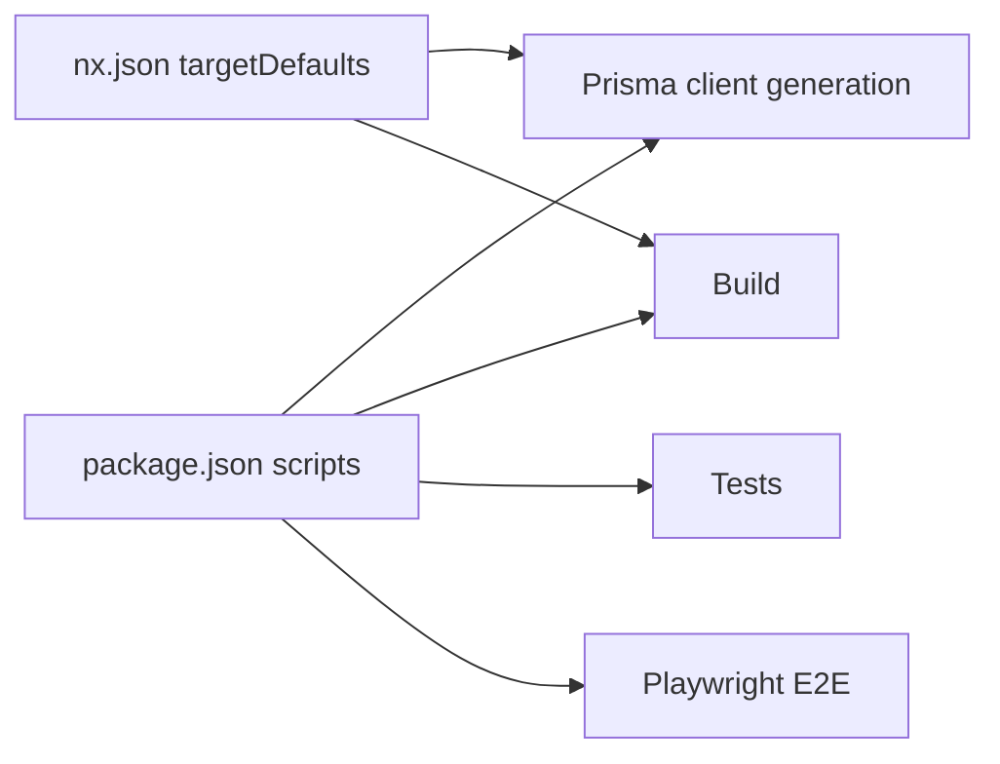

# Getting Started

<cite>
**Referenced Files in This Document**
- [README.md](file://README.md)
- [package.json](file://package.json)
- [Dockerfile.dev](file://Dockerfile.dev)
- [docker-compose.dev.yml](file://docker-compose.dev.yml)
- [ARCHITECTURE.md](file://ARCHITECTURE.md)
- [prisma/schema.prisma](file://prisma/schema.prisma)
- [prisma/seed.ts](file://prisma/seed.ts)
- [prisma/seed-accounts.ts](file://prisma/seed-accounts.ts)
- [nx.json](file://nx.json)
- [next.config.ts](file://next.config.ts)
- [middleware.ts](file://middleware.ts)
- [ecosystem.config.js](file://ecosystem.config.js)
- [deploy-quick.ps1](file://deploy-quick.ps1)
- [check_db.sh](file://check_db.sh)
- [tsconfig.json](file://tsconfig.json)
- [tsconfig.base.json](file://tsconfig.base.json)
</cite>

## Table of Contents
1. [Introduction](#introduction)
2. [Project Structure](#project-structure)
3. [Core Components](#core-components)
4. [Architecture Overview](#architecture-overview)
5. [Detailed Component Analysis](#detailed-component-analysis)
6. [Dependency Analysis](#dependency-analysis)
7. [Performance Considerations](#performance-considerations)
8. [Troubleshooting Guide](#troubleshooting-guide)
9. [Conclusion](#conclusion)
10. [Appendices](#appendices)

## Introduction
This guide helps you install, configure, and run ListOpt ERP locally for development. It covers prerequisites, environment setup, database configuration, dependency installation, applying migrations, seeding test data, and first-time execution. It also includes troubleshooting tips, verification steps, and guidance for both manual setup and Docker-based automation. After following this guide, you will be able to launch the application, log in with the default credentials, and begin exploring the modules.

## Project Structure
ListOpt ERP is a Next.js 16 application with an App Router, TypeScript, Prisma ORM, and PostgreSQL. The repository is organized into:
- app/: Next.js App Router pages and API routes grouped by functional modules
- components/: reusable React components (UI primitives and module-specific components)
- lib/: shared utilities, authentication, authorization, and business logic modules
- prisma/: Prisma schema, migrations, and seed scripts
- tests/: unit, integration, and E2E tests
- Docker and deployment assets for local development and production

**Diagram sources**
- [ARCHITECTURE.md](file://ARCHITECTURE.md)
- [nx.json](file://nx.json)
- [next.config.ts](file://next.config.ts)
- [tsconfig.json](file://tsconfig.json)

**Section sources**
- [ARCHITECTURE.md](file://ARCHITECTURE.md)
- [README.md](file://README.md)

## Core Components
- Frontend: Next.js 16 App Router, React 19, TailwindCSS, shadcn/ui
- Backend: Next.js API Routes
- Database: PostgreSQL 16 with Prisma ORM
- Build/Test: Nx workspaces, Vitest, Playwright
- Deployment: PM2 + Nginx (manual deployment supported)

Key capabilities include product catalog and variants, warehouse stock, document workflows (purchases, sales, transfers, inventory), financial payments and reporting, e-commerce store with cart and orders, and integrations (Telegram bot, webhooks).

**Section sources**
- [README.md](file://README.md)
- [ARCHITECTURE.md](file://ARCHITECTURE.md)

## Architecture Overview
The system enforces authentication and authorization via cookies and middleware, with CSRF protection for API routes. Middleware handles redirects for legacy routes and protects ERP routes while allowing public storefront access.

**Diagram sources**
- [middleware.ts](file://middleware.ts)
- [prisma/schema.prisma](file://prisma/schema.prisma)

**Section sources**
- [middleware.ts](file://middleware.ts)
- [ARCHITECTURE.md](file://ARCHITECTURE.md)

## Detailed Component Analysis

### Manual Setup (Local Development)
Follow these steps to set up ListOpt ERP manually on your machine.

1) Prerequisites
- Node.js 20.x installed
- PostgreSQL 16 installed and running
- Git installed

2) Clone the repository
- Clone the repository and navigate into the project directory.

3) Install dependencies
- Install project dependencies using the package manager.

4) Configure environment variables
- Copy the example environment file to .env and edit DATABASE_URL to point to your PostgreSQL instance.

5) Apply database migrations
- Generate Prisma client and apply migrations to create tables.

6) Seed test data (optional)
- Seed default units, warehouse, document counters, admin user, finance categories, and payment counters.
- Optionally seed the Russian Chart of Accounts.

7) Start the development server
- Launch the Next.js dev server using Nx.

8) First-time access
- Open the application in your browser and log in with the default credentials.

Verification steps
- Confirm the app runs on the expected port.
- Verify the login endpoint responds successfully.
- Check that the database connection is established and seeded data is present.

**Section sources**
- [README.md](file://README.md)
- [package.json](file://package.json)
- [prisma/schema.prisma](file://prisma/schema.prisma)
- [prisma/seed.ts](file://prisma/seed.ts)
- [prisma/seed-accounts.ts](file://prisma/seed-accounts.ts)
- [middleware.ts](file://middleware.ts)

### Automated Setup (Docker Compose)
Use the provided Docker Compose configuration to spin up the app and a local PostgreSQL database with a single command.

- Build and start services
- The compose file defines:
  - app service: builds the app image, mounts source code for hot reload, sets environment variables, and runs Prisma generation, migrations, and dev server
  - db service: PostgreSQL 16 with persistent volume

- Access the application at the mapped port

- Environment variables configured in compose include database URL, session secret, and cookie security flags suitable for development.

**Section sources**
- [Dockerfile.dev](file://Dockerfile.dev)
- [docker-compose.dev.yml](file://docker-compose.dev.yml)

### Database Configuration
Prisma is configured to connect to PostgreSQL. The schema defines core entities such as Users, Products, Warehouses, Documents, Stock Movements, Counterparties, and e-commerce models. Migrations are managed via Prisma CLI commands.

- Prisma client generation and database operations are orchestrated through npm scripts.
- The schema file defines enums, models, relations, and indexes.

**Section sources**
- [prisma/schema.prisma](file://prisma/schema.prisma)
- [package.json](file://package.json)

### Initial Configuration
- Environment variables
  - DATABASE_URL: connection string to PostgreSQL
  - SESSION_SECRET: secret for session signing
  - SECURE_COOKIES: toggle secure cookie behavior
  - NODE_ENV: development or production

- Middleware behavior
  - Public routes and storefront routes are exempt from session checks
  - ERP routes require a valid session cookie
  - CSRF protection is enforced for API routes (except whitelisted)

- Next.js configuration
  - Security headers are applied globally
  - Redirects legacy ERP paths to new locations

**Section sources**
- [ARCHITECTURE.md](file://ARCHITECTURE.md)
- [middleware.ts](file://middleware.ts)
- [next.config.ts](file://next.config.ts)

### First-Time Execution
- Start the dev server using Nx.
- Navigate to the login page and sign in with the default credentials.
- Explore modules such as Catalog, Stock, Purchases, Sales, Finance, Counterparties, References, and Settings.

**Section sources**
- [README.md](file://README.md)
- [middleware.ts](file://middleware.ts)

### Testing
- Unit and integration tests
- E2E tests with Playwright
- Coverage reporting

**Section sources**
- [README.md](file://README.md)
- [package.json](file://package.json)

### Deployment (Manual Archive Method)
The project supports deploying to a VPS via SSH using an archive method. The process includes creating a compressed archive (excluding certain directories), transferring to the server, extracting, installing dependencies, building, and restarting the application via PM2.

- Archive creation and deployment steps are scripted for convenience.

**Section sources**
- [README.md](file://README.md)
- [ecosystem.config.js](file://ecosystem.config.js)
- [deploy-quick.ps1](file://deploy-quick.ps1)

## Dependency Analysis
The project uses Nx for orchestration and task caching. Scripts in package.json define commands for dev/build/start, testing, Prisma operations, and E2E tests. Nx target defaults ensure Prisma client generation runs before build and tests.

**Diagram sources**
- [package.json](file://package.json)
- [nx.json](file://nx.json)

**Section sources**
- [package.json](file://package.json)
- [nx.json](file://nx.json)

## Performance Considerations
- Use Nx caching for faster builds and tests during development.
- Keep database indexes aligned with frequently queried fields (as defined in the schema).
- Prefer incremental builds and avoid unnecessary re-runs of heavy tasks.

[No sources needed since this section provides general guidance]

## Troubleshooting Guide
Common setup issues and resolutions:

- Database connectivity
  - Ensure PostgreSQL is running and reachable.
  - Verify DATABASE_URL in .env matches your database credentials.
  - Use the provided check script to test login and review PM2 logs.

- Prisma client and migrations
  - Re-run Prisma client generation and migrations if schema changes.
  - Confirm migrations are applied successfully before starting the app.

- Authentication and cookies
  - Ensure SESSION_SECRET is set in the environment.
  - For local development, SECURE_COOKIES can be disabled; for HTTPS environments, enable it.

- Docker-related issues
  - Confirm Docker and Docker Compose are installed and running.
  - Rebuild images if dependencies change.
  - Check service logs for errors in the app and db containers.

- First-time login
  - Use the default admin credentials provided in the repository documentation.
  - If redirected to login, verify session cookies and middleware configuration.

Verification checklist
- Application starts without errors.
- Login endpoint responds successfully.
- Database tables exist and seeded data is visible.
- ERP routes redirect to login when unauthenticated; storefront remains accessible.

**Section sources**
- [README.md](file://README.md)
- [check_db.sh](file://check_db.sh)
- [middleware.ts](file://middleware.ts)
- [docker-compose.dev.yml](file://docker-compose.dev.yml)

## Conclusion
You now have the essentials to install ListOpt ERP locally, configure the database, seed initial data, and run the application. Use the manual steps for granular control or the Docker Compose setup for a turnkey local environment. Explore the modules, run tests, and prepare for deployment using the provided scripts and configurations.

[No sources needed since this section summarizes without analyzing specific files]

## Appendices

### Appendix A: Environment Variables Reference
- DATABASE_URL: PostgreSQL connection string
- SESSION_SECRET: Secret for signing sessions
- SECURE_COOKIES: Enable secure cookies for HTTPS
- NODE_ENV: development or production

**Section sources**
- [ARCHITECTURE.md](file://ARCHITECTURE.md)

### Appendix B: Useful Commands
- Install dependencies
- Run dev server
- Generate Prisma client
- Apply migrations
- Seed data
- Run tests (unit/integration/E2E)
- Build and preview

**Section sources**
- [package.json](file://package.json)

### Appendix C: TypeScript Configuration
- Path aliases configured for clean imports
- Strict compiler options enabled

**Section sources**
- [tsconfig.json](file://tsconfig.json)
- [tsconfig.base.json](file://tsconfig.base.json)