# External API Integrations

<cite>
**Referenced Files in This Document**
- [index.ts](file://lib/modules/integrations/index.ts)
- [types.ts](file://lib/modules/integrations/types.ts)
- [telegram.ts](file://lib/modules/integrations/telegram.ts)
- [telegram.schema.ts](file://lib/modules/integrations/schemas/telegram.schema.ts)
- [route.ts](file://app/api/accounting/integrations/telegram/route.ts)
- [route.ts](file://app/api/integrations/telegram/route.ts)
- [route.ts](file://app/api/accounting/integrations/route.ts)
- [auth.ts](file://lib/shared/auth.ts)
- [authorization.ts](file://lib/shared/authorization.ts)
- [validation.ts](file://lib/shared/validation.ts)
- [rate-limit.ts](file://lib/shared/rate-limit.ts)
- [csrf.ts](file://lib/client/csrf.ts)
- [middleware.ts](file://middleware.ts)
- [api-client.ts](file://tests/helpers/api-client.ts)
- [rate-limit.test.ts](file://tests/unit/lib/rate-limit.test.ts)
</cite>

## Table of Contents
1. [Introduction](#introduction)
2. [Project Structure](#project-structure)
3. [Core Components](#core-components)
4. [Architecture Overview](#architecture-overview)
5. [Detailed Component Analysis](#detailed-component-analysis)
6. [Dependency Analysis](#dependency-analysis)
7. [Performance Considerations](#performance-considerations)
8. [Troubleshooting Guide](#troubleshooting-guide)
9. [Conclusion](#conclusion)
10. [Appendices](#appendices)

## Introduction
This document explains the external API integration patterns and implementation in the project. It focuses on how the system connects with third-party services, specifically the Telegram Bot integration, and outlines the framework for building secure, reliable integrations. It covers HTTP client configuration, request/response handling, error management, authentication methods, data mapping between internal ERP entities and external API schemas, retry policies, timeout handling, circuit breaker patterns, rate limiting, quota management, API versioning, and guidelines for adding new integrations. Monitoring, logging, and alerting strategies are also included.

## Project Structure
The integration framework is organized around:
- A dedicated integrations module under lib/modules/integrations that encapsulates configuration, settings, and verification logic for integrations.
- API routes under app/api that expose endpoints for managing integration settings and for public consumption.
- Shared utilities for authentication, authorization, validation, rate limiting, CSRF protection, and middleware configuration.

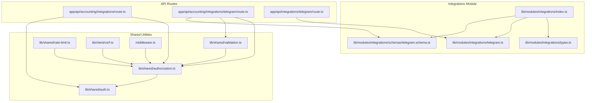

**Diagram sources**
- [index.ts:1-5](file://lib/modules/integrations/index.ts#L1-L5)
- [types.ts:1-27](file://lib/modules/integrations/types.ts#L1-L27)
- [telegram.ts:1-108](file://lib/modules/integrations/telegram.ts#L1-L108)
- [telegram.schema.ts:1-15](file://lib/modules/integrations/schemas/telegram.schema.ts#L1-L15)
- [route.ts:1-19](file://app/api/accounting/integrations/route.ts#L1-L19)
- [route.ts:1-110](file://app/api/accounting/integrations/telegram/route.ts#L1-L110)
- [route.ts:1-30](file://app/api/integrations/telegram/route.ts#L1-L30)
- [auth.ts:1-89](file://lib/shared/auth.ts#L1-L89)
- [authorization.ts:1-160](file://lib/shared/authorization.ts#L1-L160)
- [validation.ts:1-63](file://lib/shared/validation.ts#L1-L63)
- [rate-limit.ts:1-114](file://lib/shared/rate-limit.ts#L1-L114)
- [csrf.ts:1-53](file://lib/client/csrf.ts#L1-L53)
- [middleware.ts:26-26](file://middleware.ts#L26-L26)

**Section sources**
- [index.ts:1-5](file://lib/modules/integrations/index.ts#L1-L5)
- [route.ts:1-19](file://app/api/accounting/integrations/route.ts#L1-L19)
- [route.ts:1-110](file://app/api/accounting/integrations/telegram/route.ts#L1-L110)
- [route.ts:1-30](file://app/api/integrations/telegram/route.ts#L1-L30)
- [auth.ts:1-89](file://lib/shared/auth.ts#L1-L89)
- [authorization.ts:1-160](file://lib/shared/authorization.ts#L1-L160)
- [validation.ts:1-63](file://lib/shared/validation.ts#L1-L63)
- [rate-limit.ts:1-114](file://lib/shared/rate-limit.ts#L1-L114)
- [csrf.ts:1-53](file://lib/client/csrf.ts#L1-L53)
- [middleware.ts:26-26](file://middleware.ts#L26-L26)

## Core Components
- Integration types and configuration model define the shape of stored integration settings and status reporting.
- Telegram integration service encapsulates retrieval, saving, status computation, and Telegram Login Widget verification.
- API routes manage admin settings and expose public settings for consumers.
- Shared utilities enforce authentication and permissions, validate payloads, and provide rate limiting and CSRF support.

Key responsibilities:
- Types and Schemas: Define integration configuration and input validation for Telegram settings.
- Service Layer: Persist and compute integration status; verify Telegram authentication data.
- API Layer: Enforce permissions, mask sensitive data, and return public settings.
- Security and Reliability: Authentication, authorization, validation, rate limiting, and CSRF utilities.

**Section sources**
- [types.ts:1-27](file://lib/modules/integrations/types.ts#L1-L27)
- [telegram.ts:1-108](file://lib/modules/integrations/telegram.ts#L1-L108)
- [telegram.schema.ts:1-15](file://lib/modules/integrations/schemas/telegram.schema.ts#L1-L15)
- [route.ts:1-110](file://app/api/accounting/integrations/telegram/route.ts#L1-L110)
- [route.ts:1-30](file://app/api/integrations/telegram/route.ts#L1-L30)
- [authorization.ts:1-160](file://lib/shared/authorization.ts#L1-L160)
- [validation.ts:1-63](file://lib/shared/validation.ts#L1-L63)
- [rate-limit.ts:1-114](file://lib/shared/rate-limit.ts#L1-L114)
- [csrf.ts:1-53](file://lib/client/csrf.ts#L1-L53)

## Architecture Overview
The integration architecture follows a layered pattern:
- Presentation: API routes handle HTTP requests and responses.
- Application: Validation and authorization checks, masking of secrets, and orchestration of service calls.
- Domain: Integration service functions operate on persisted settings and compute status.
- Persistence: Settings are stored via Prisma ORM queries.

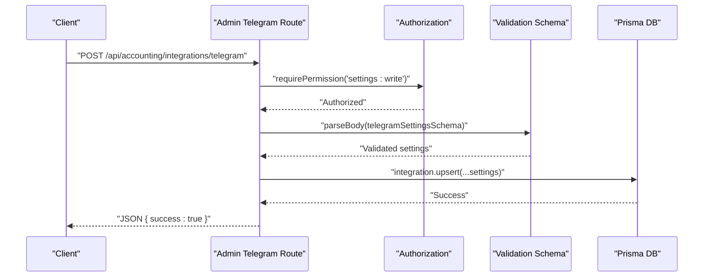

**Diagram sources**
- [route.ts:47-92](file://app/api/accounting/integrations/telegram/route.ts#L47-L92)
- [authorization.ts:123-135](file://lib/shared/authorization.ts#L123-L135)
- [validation.ts:14-30](file://lib/shared/validation.ts#L14-L30)
- [telegram.schema.ts:4-12](file://lib/modules/integrations/schemas/telegram.schema.ts#L4-L12)

## Detailed Component Analysis

### Telegram Integration Service
The Telegram integration service manages settings persistence, status computation, and authentication verification for the Telegram Login Widget.

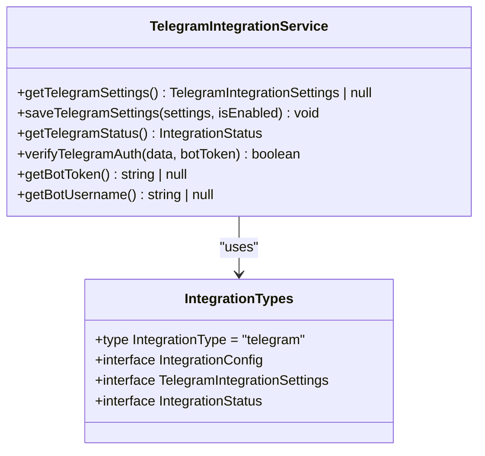

**Diagram sources**
- [telegram.ts:1-108](file://lib/modules/integrations/telegram.ts#L1-L108)
- [types.ts:1-27](file://lib/modules/integrations/types.ts#L1-L27)

**Section sources**
- [telegram.ts:1-108](file://lib/modules/integrations/telegram.ts#L1-L108)
- [types.ts:1-27](file://lib/modules/integrations/types.ts#L1-L27)

### Telegram Settings API (Admin)
Admin endpoints manage Telegram settings with strict permissions and input validation. They mask sensitive tokens in responses and persist validated settings.

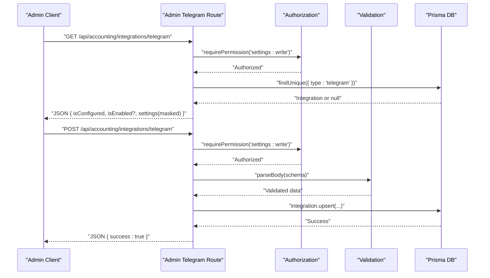

**Diagram sources**
- [route.ts:8-44](file://app/api/accounting/integrations/telegram/route.ts#L8-L44)
- [route.ts:47-92](file://app/api/accounting/integrations/telegram/route.ts#L47-L92)
- [authorization.ts:123-135](file://lib/shared/authorization.ts#L123-L135)
- [validation.ts:14-30](file://lib/shared/validation.ts#L14-L30)

**Section sources**
- [route.ts:1-110](file://app/api/accounting/integrations/telegram/route.ts#L1-L110)
- [authorization.ts:1-160](file://lib/shared/authorization.ts#L1-L160)
- [validation.ts:1-63](file://lib/shared/validation.ts#L1-L63)
- [telegram.schema.ts:1-15](file://lib/modules/integrations/schemas/telegram.schema.ts#L1-L15)

### Public Telegram Settings API
Public endpoint exposes non-sensitive settings without authentication, enabling clients to discover integration availability and capabilities.

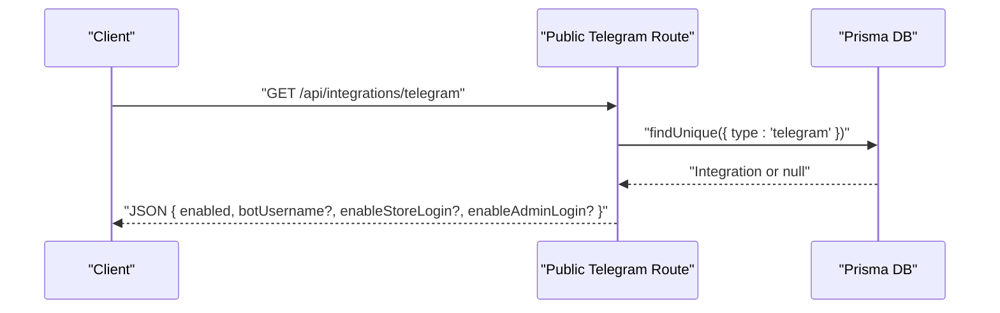

**Diagram sources**
- [route.ts:5-29](file://app/api/integrations/telegram/route.ts#L5-L29)

**Section sources**
- [route.ts:1-30](file://app/api/integrations/telegram/route.ts#L1-L30)

### Authentication and Authorization Patterns
- Session-based authentication signs and verifies session tokens with expiration checks.
- Permission-based authorization enforces role hierarchies and permission sets.
- Middleware configures public routes and protects admin endpoints.

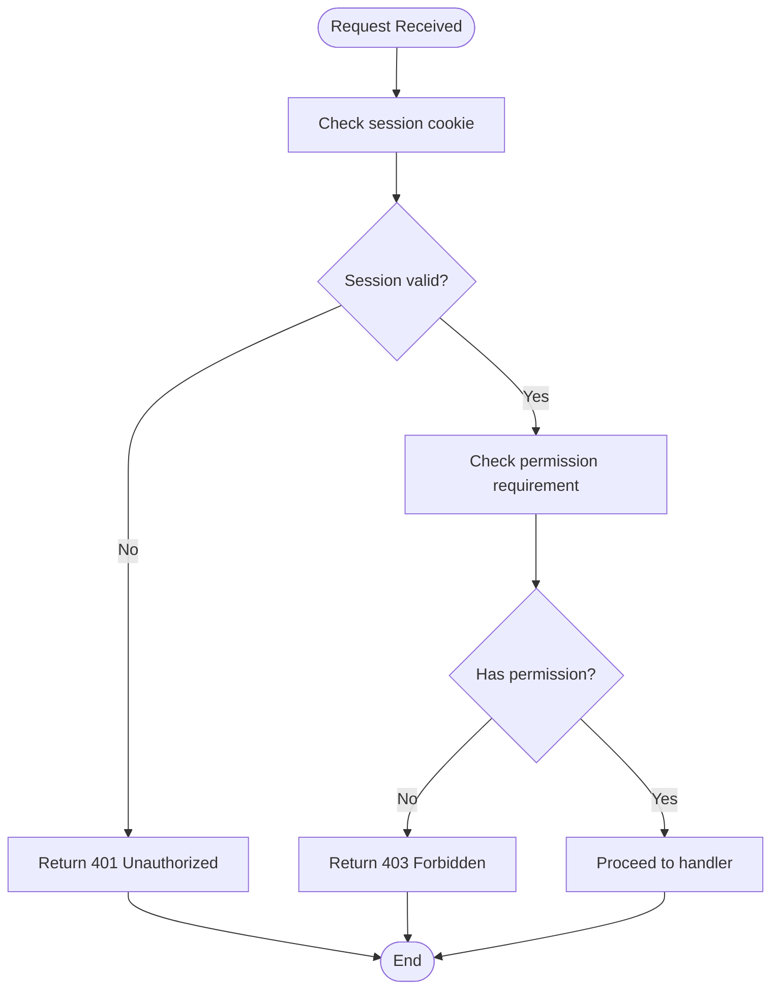

**Diagram sources**
- [auth.ts:62-83](file://lib/shared/auth.ts#L62-L83)
- [authorization.ts:104-135](file://lib/shared/authorization.ts#L104-L135)
- [middleware.ts:26-26](file://middleware.ts#L26-L26)

**Section sources**
- [auth.ts:1-89](file://lib/shared/auth.ts#L1-L89)
- [authorization.ts:1-160](file://lib/shared/authorization.ts#L1-L160)
- [middleware.ts:26-26](file://middleware.ts#L26-L26)

### Request Validation and Error Handling
- Zod-based validation parses and validates request bodies and query parameters.
- Validation errors are returned with structured field-level messages.
- Authorization errors are normalized and logged.

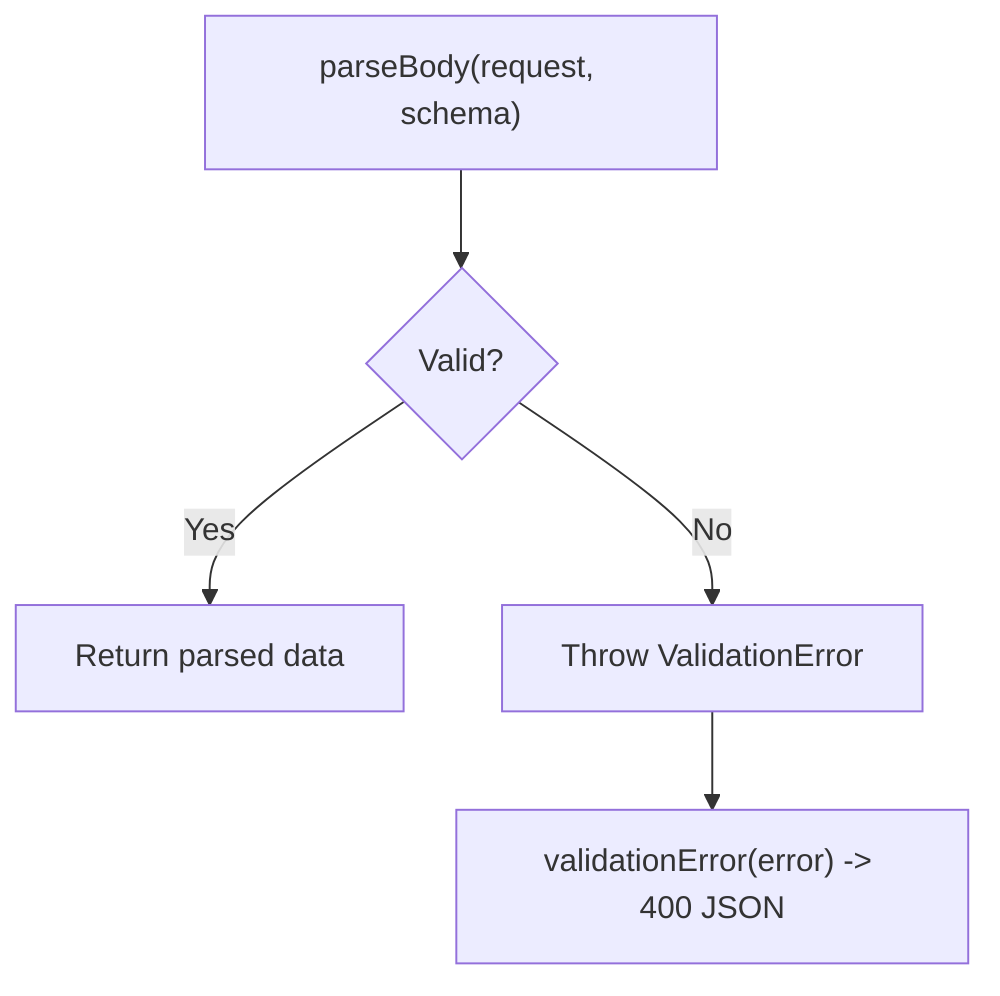

**Diagram sources**
- [validation.ts:14-62](file://lib/shared/validation.ts#L14-L62)

**Section sources**
- [validation.ts:1-63](file://lib/shared/validation.ts#L1-L63)

### Rate Limiting and Quota Management
- In-memory rate limiter tracks counts per identifier within time windows.
- Supports configurable limits and windows; includes lazy cleanup.
- Provides client IP extraction from request headers.

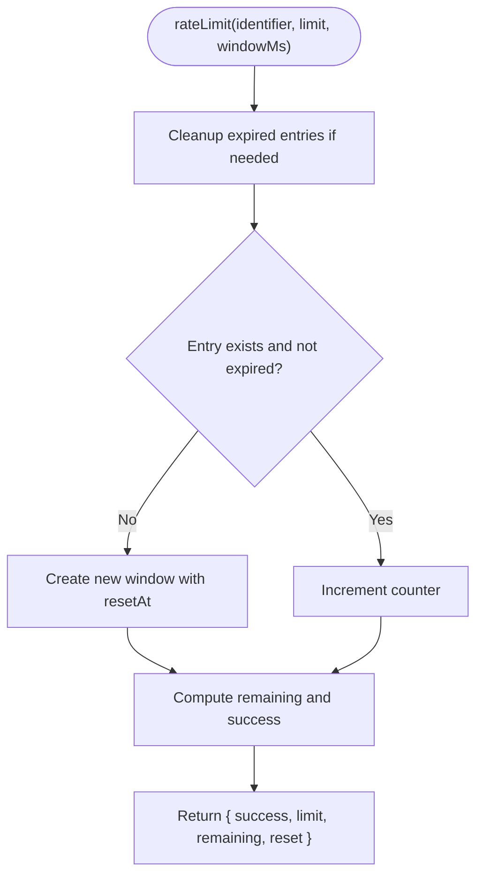

**Diagram sources**
- [rate-limit.ts:58-96](file://lib/shared/rate-limit.ts#L58-L96)

**Section sources**
- [rate-limit.ts:1-114](file://lib/shared/rate-limit.ts#L1-L114)
- [rate-limit.test.ts:1-130](file://tests/unit/lib/rate-limit.test.ts#L1-L130)

### CSRF Protection
- Client-side CSRF utilities fetch and cache tokens, attach headers for mutating requests, and clear tokens on logout.

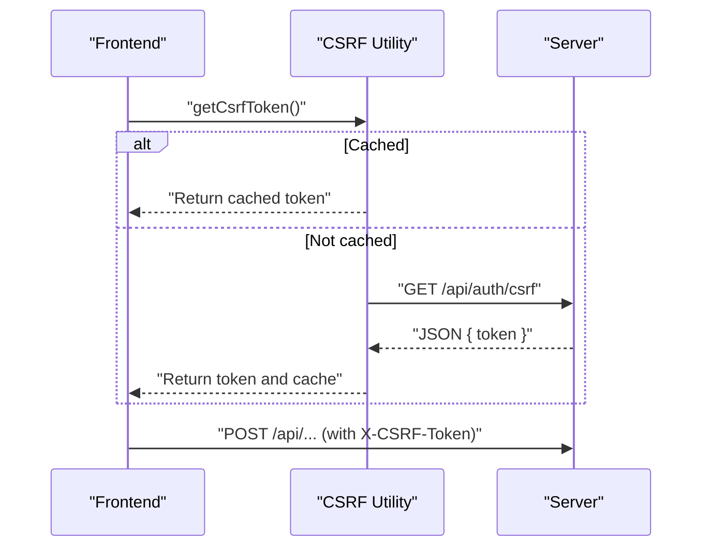

**Diagram sources**
- [csrf.ts:15-53](file://lib/client/csrf.ts#L15-L53)

**Section sources**
- [csrf.ts:1-53](file://lib/client/csrf.ts#L1-L53)

### Data Mapping Between Internal ERP Entities and External API Schemas
- Integration settings are stored as generic key-value pairs with typed interfaces for Telegram.
- Validation ensures incoming data conforms to Telegram-specific constraints (e.g., bot username format).
- Responses mask sensitive fields (e.g., bot token) when returning to clients.

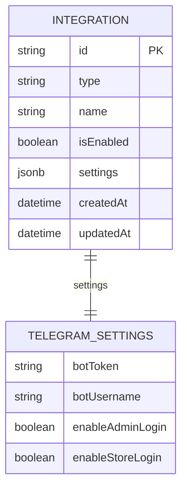

**Diagram sources**
- [types.ts:4-19](file://lib/modules/integrations/types.ts#L4-L19)
- [telegram.schema.ts:4-12](file://lib/modules/integrations/schemas/telegram.schema.ts#L4-L12)
- [route.ts:28-41](file://app/api/accounting/integrations/telegram/route.ts#L28-L41)

**Section sources**
- [types.ts:1-27](file://lib/modules/integrations/types.ts#L1-L27)
- [telegram.schema.ts:1-15](file://lib/modules/integrations/schemas/telegram.schema.ts#L1-L15)
- [route.ts:1-110](file://app/api/accounting/integrations/telegram/route.ts#L1-L110)

### Retry Policies, Timeouts, and Circuit Breaker Patterns
- Current codebase does not implement explicit retry policies, timeouts, or circuit breaker patterns for external API calls.
- Recommendations:
  - Introduce exponential backoff with jitter for retries.
  - Configure request timeouts and socket timeouts.
  - Implement circuit breaker logic to prevent cascading failures during outages.
  - Track and alert on consecutive failures and latency spikes.

[No sources needed since this section provides general guidance]

### API Versioning
- No explicit API versioning mechanism is present in the current codebase.
- Recommendations:
  - Use URL path versioning (/api/v1/...) or Accept-Version header.
  - Maintain backward compatibility or introduce deprecation timelines.

[No sources needed since this section provides general guidance]

### Guidelines for Implementing New External Integrations
- Define integration type and settings schema.
- Implement service functions for CRUD operations and status computation.
- Create admin and public API routes with appropriate permissions and validation.
- Apply masking for sensitive fields in responses.
- Integrate logging and error handling consistently.
- Add rate limiting where applicable.
- Consider authentication mechanisms (API keys, OAuth, token-based) and implement securely.

[No sources needed since this section provides general guidance]

## Dependency Analysis
The integration module depends on shared utilities for authentication, authorization, validation, and persistence. API routes depend on the integration service and shared utilities.

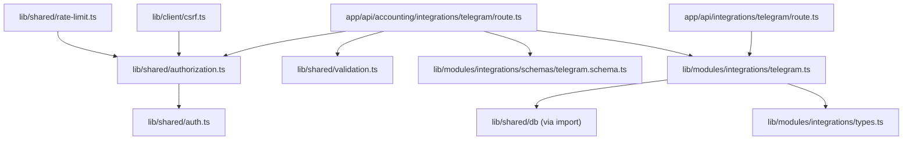

**Diagram sources**
- [telegram.ts:1-108](file://lib/modules/integrations/telegram.ts#L1-L108)
- [route.ts:1-110](file://app/api/accounting/integrations/telegram/route.ts#L1-L110)
- [route.ts:1-30](file://app/api/integrations/telegram/route.ts#L1-L30)
- [authorization.ts:1-160](file://lib/shared/authorization.ts#L1-L160)
- [validation.ts:1-63](file://lib/shared/validation.ts#L1-L63)
- [rate-limit.ts:1-114](file://lib/shared/rate-limit.ts#L1-L114)
- [csrf.ts:1-53](file://lib/client/csrf.ts#L1-L53)

**Section sources**
- [telegram.ts:1-108](file://lib/modules/integrations/telegram.ts#L1-L108)
- [route.ts:1-110](file://app/api/accounting/integrations/telegram/route.ts#L1-L110)
- [route.ts:1-30](file://app/api/integrations/telegram/route.ts#L1-L30)
- [authorization.ts:1-160](file://lib/shared/authorization.ts#L1-L160)
- [validation.ts:1-63](file://lib/shared/validation.ts#L1-L63)
- [rate-limit.ts:1-114](file://lib/shared/rate-limit.ts#L1-L114)
- [csrf.ts:1-53](file://lib/client/csrf.ts#L1-L53)

## Performance Considerations
- Rate limiting is in-memory and unsuitable for multi-instance deployments; consider Redis-backed solutions for production.
- Logging and error handling should be structured to minimize overhead and provide actionable insights.
- Caching strategies can reduce repeated computations and database load for frequently accessed settings.

[No sources needed since this section provides general guidance]

## Troubleshooting Guide
Common issues and resolutions:
- Unauthorized or forbidden responses indicate missing or insufficient permissions; verify session validity and role assignments.
- Validation errors surface structured field-level messages; inspect the fields object in the response.
- CSRF failures occur when tokens are missing or mismatched; ensure tokens are fetched and attached to mutating requests.
- Rate limiting blocks requests exceeding configured thresholds; adjust limits or implement client-side backoff.

**Section sources**
- [authorization.ts:152-159](file://lib/shared/authorization.ts#L152-L159)
- [validation.ts:54-62](file://lib/shared/validation.ts#L54-L62)
- [csrf.ts:15-53](file://lib/client/csrf.ts#L15-L53)
- [rate-limit.ts:58-96](file://lib/shared/rate-limit.ts#L58-L96)

## Conclusion
The project’s integration framework centers on a clean separation of concerns: a service layer for integration logic, robust validation and authorization, and well-defined API routes. While the current implementation focuses on Telegram, the modular design supports extending to other external systems. Enhancements such as retry policies, timeouts, circuit breakers, and Redis-backed rate limiting would further improve reliability and scalability.

## Appendices

### Example Scenarios and Implementation Notes
- Shipping label generation: Model provider-specific settings, implement request/response mapping, apply rate limiting, and log outcomes.
- Payment processing: Securely store provider credentials, implement webhook verification, and maintain audit logs.
- Inventory synchronization: Normalize product schemas, batch updates, handle partial failures, and reconcile discrepancies.

[No sources needed since this section provides general guidance]

### Testing Utilities for API Routes
- Test request builder and mocked authentication helpers streamline unit and integration tests for API routes.

**Section sources**
- [api-client.ts:1-48](file://tests/helpers/api-client.ts#L1-L48)
- [rate-limit.test.ts:1-130](file://tests/unit/lib/rate-limit.test.ts#L1-L130)