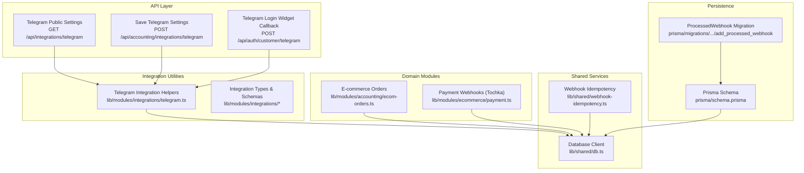
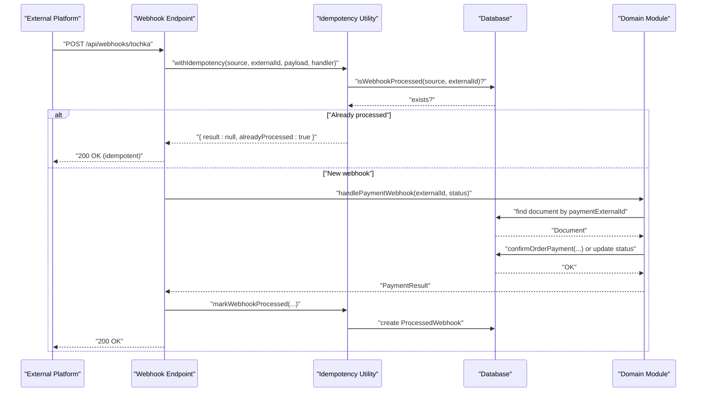
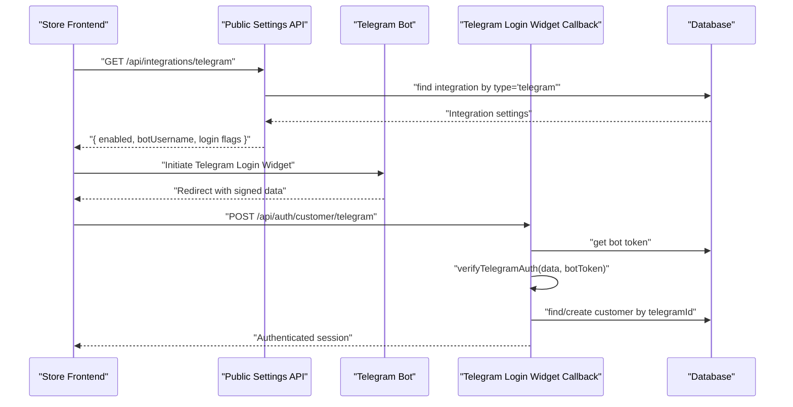
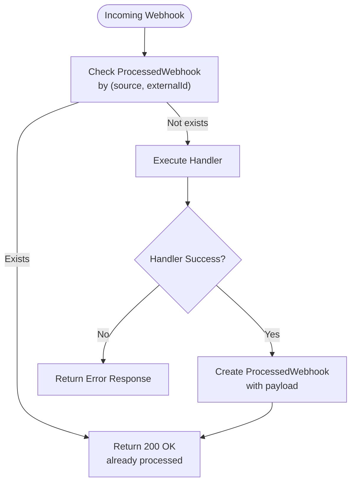
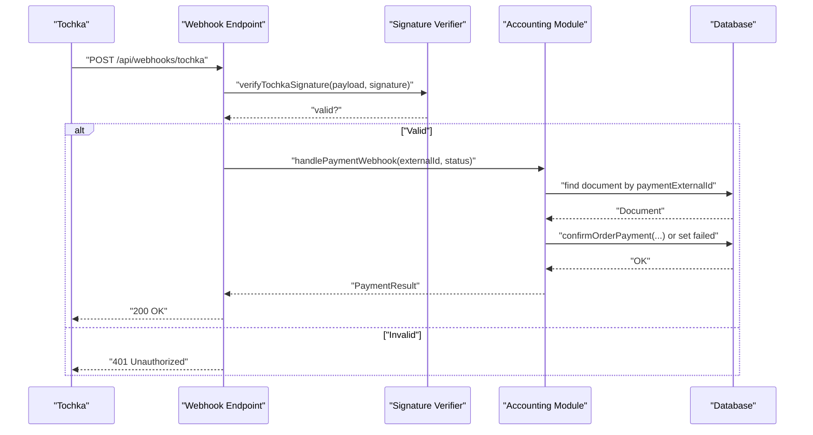
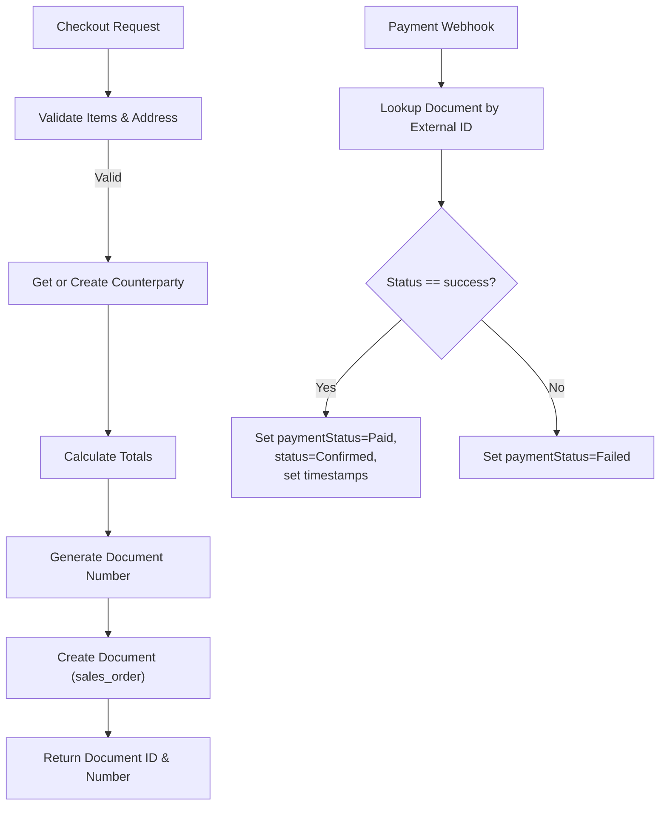
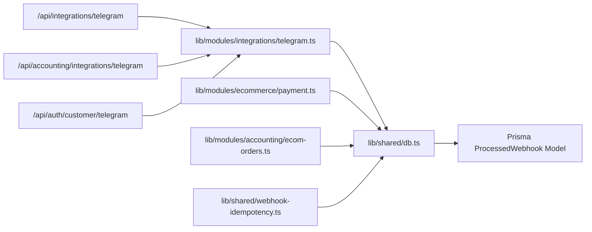

# Integration Module

<cite>
**Referenced Files in This Document**
- [route.ts](file://app/api/integrations/telegram/route.ts)
- [route.ts](file://app/api/accounting/integrations/telegram/route.ts)
- [route.ts](file://app/api/auth/customer/telegram/route.ts)
- [telegram.ts](file://lib/modules/integrations/telegram.ts)
- [types.ts](file://lib/modules/integrations/types.ts)
- [telegram.schema.ts](file://lib/modules/integrations/schemas/telegram.schema.ts)
- [index.ts](file://lib/modules/integrations/index.ts)
- [index.ts](file://lib/modules/integrations/schemas/index.ts)
- [webhook-idempotency.ts](file://lib/shared/webhook-idempotency.ts)
- [schema.prisma](file://prisma/schema.prisma)
- [migration.sql](file://prisma/migrations/20260312_add_processed_webhook/migration.sql)
- [payment.ts](file://lib/modules/ecommerce/payment.ts)
- [ecom-orders.ts](file://lib/modules/accounting/ecom-orders.ts)
- [db.ts](file://lib/shared/db.ts)
- [middleware.ts](file://middleware.ts)
</cite>

## Table of Contents
1. [Introduction](#introduction)
2. [Project Structure](#project-structure)
3. [Core Components](#core-components)
4. [Architecture Overview](#architecture-overview)
5. [Detailed Component Analysis](#detailed-component-analysis)
6. [Dependency Analysis](#dependency-analysis)
7. [Performance Considerations](#performance-considerations)
8. [Troubleshooting Guide](#troubleshooting-guide)
9. [Conclusion](#conclusion)
10. [Appendices](#appendices)

## Introduction
This document describes the Integration Module for ListOpt ERP, focusing on:
- Connecting the ERP with external services and platforms
- Telegram bot integration (setup, command handling, and notifications)
- Webhook system for processing external events (validation, idempotency, retries, and error handling)
- Integration patterns for external APIs, data synchronization, and real-time updates
- Configuration, authentication, and security considerations
- Examples of common integration scenarios (inventory sync, order processing, automated reporting)
- Monitoring, logging, and troubleshooting guidance
- Guidelines for extending the integration framework with new external systems

## Project Structure
The integration module spans API routes, shared utilities, Prisma models, and domain modules:
- API surface for integrations and authentication
- Shared database client and webhook idempotency utilities
- Prisma schema defining integration records and webhook processing history
- Domain modules orchestrating e-commerce order lifecycle and payment webhooks
- Middleware allowing webhook routes without CSRF checks

**Diagram sources**
- [route.ts:1-29](file://app/api/integrations/telegram/route.ts#L1-L29)
- [route.ts:1-88](file://app/api/accounting/integrations/telegram/route.ts#L1-L88)
- [route.ts:44-67](file://app/api/auth/customer/telegram/route.ts#L44-L67)
- [telegram.ts:1-107](file://lib/modules/integrations/telegram.ts#L1-L107)
- [webhook-idempotency.ts:1-59](file://lib/shared/webhook-idempotency.ts#L1-L59)
- [db.ts:1-25](file://lib/shared/db.ts#L1-L25)
- [ecom-orders.ts:1-420](file://lib/modules/accounting/ecom-orders.ts#L1-L420)
- [payment.ts:1-84](file://lib/modules/ecommerce/payment.ts#L1-L84)
- [schema.prisma:1054-1063](file://prisma/schema.prisma#L1054-L1063)
- [migration.sql:1-16](file://prisma/migrations/20260312_add_processed_webhook/migration.sql#L1-L16)

**Section sources**
- [route.ts:1-29](file://app/api/integrations/telegram/route.ts#L1-L29)
- [route.ts:1-88](file://app/api/accounting/integrations/telegram/route.ts#L1-L88)
- [route.ts:44-67](file://app/api/auth/customer/telegram/route.ts#L44-L67)
- [telegram.ts:1-107](file://lib/modules/integrations/telegram.ts#L1-L107)
- [webhook-idempotency.ts:1-59](file://lib/shared/webhook-idempotency.ts#L1-L59)
- [db.ts:1-25](file://lib/shared/db.ts#L1-L25)
- [ecom-orders.ts:1-420](file://lib/modules/accounting/ecom-orders.ts#L1-L420)
- [payment.ts:1-84](file://lib/modules/ecommerce/payment.ts#L1-L84)
- [schema.prisma:1054-1063](file://prisma/schema.prisma#L1054-L1063)
- [migration.sql:1-16](file://prisma/migrations/20260312_add_processed_webhook/migration.sql#L1-L16)

## Core Components
- Telegram Integration Management
  - Public settings retrieval for embedding Telegram Login Widget
  - Secure storage and masking of bot credentials
  - Telegram Login Widget authentication verification
- Webhook Idempotency
  - Duplicate prevention via processed webhook records
  - Handler wrapper for safe, idempotent processing
- E-commerce Order Lifecycle
  - Creation of sales orders from cart
  - Payment confirmation and status transitions
  - Order queries and cancellation rules
- Payment Provider Webhooks (Tochka)
  - Signature verification
  - Payment status updates and failure handling
- Middleware and Routing
  - Webhook routes bypass CSRF checks
  - Authentication enforced for administrative endpoints

**Section sources**
- [route.ts:5-29](file://app/api/integrations/telegram/route.ts#L5-L29)
- [route.ts:7-45](file://app/api/accounting/integrations/telegram/route.ts#L7-L45)
- [route.ts:44-67](file://app/api/auth/customer/telegram/route.ts#L44-L67)
- [telegram.ts:7-107](file://lib/modules/integrations/telegram.ts#L7-L107)
- [webhook-idempotency.ts:11-59](file://lib/shared/webhook-idempotency.ts#L11-L59)
- [ecom-orders.ts:68-154](file://lib/modules/accounting/ecom-orders.ts#L68-L154)
- [ecom-orders.ts:160-196](file://lib/modules/accounting/ecom-orders.ts#L160-L196)
- [payment.ts:20-74](file://lib/modules/ecommerce/payment.ts#L20-L74)
- [middleware.ts:67-70](file://middleware.ts#L67-L70)

## Architecture Overview
The integration module follows a layered architecture:
- API routes expose integration endpoints and customer authentication callbacks
- Integration utilities encapsulate Telegram configuration and verification
- Domain modules orchestrate ERP-side order and payment operations
- Shared utilities provide database access and idempotent webhook handling
- Prisma models persist integration settings and webhook processing history

**Diagram sources**
- [webhook-idempotency.ts:45-59](file://lib/shared/webhook-idempotency.ts#L45-L59)
- [payment.ts:29-74](file://lib/modules/ecommerce/payment.ts#L29-L74)
- [ecom-orders.ts:160-196](file://lib/modules/accounting/ecom-orders.ts#L160-L196)
- [schema.prisma:1054-1063](file://prisma/schema.prisma#L1054-L1063)

## Detailed Component Analysis

### Telegram Bot Integration
The Telegram integration supports:
- Public settings retrieval for the Telegram Login Widget
- Administrative configuration with secure token masking
- Customer authentication via Telegram Login Widget using HMAC-SHA256 verification

**Diagram sources**
- [route.ts:5-29](file://app/api/integrations/telegram/route.ts#L5-L29)
- [route.ts:44-67](file://app/api/auth/customer/telegram/route.ts#L44-L67)
- [telegram.ts:71-101](file://lib/modules/integrations/telegram.ts#L71-L101)
- [route.ts:7-45](file://app/api/accounting/integrations/telegram/route.ts#L7-L45)

**Section sources**
- [route.ts:5-29](file://app/api/integrations/telegram/route.ts#L5-L29)
- [route.ts:44-67](file://app/api/auth/customer/telegram/route.ts#L44-L67)
- [telegram.ts:7-107](file://lib/modules/integrations/telegram.ts#L7-L107)
- [route.ts:7-88](file://app/api/accounting/integrations/telegram/route.ts#L7-L88)
- [types.ts:14-19](file://lib/modules/integrations/types.ts#L14-L19)
- [telegram.schema.ts:4-12](file://lib/modules/integrations/schemas/telegram.schema.ts#L4-L12)
- [index.ts:1-4](file://lib/modules/integrations/index.ts#L1-L4)
- [index.ts:1-2](file://lib/modules/integrations/schemas/index.ts#L1-L2)

### Webhook System and Idempotency
The webhook system ensures reliable event processing:
- Idempotency guard prevents duplicate processing
- Unique index on (source, externalId) guarantees uniqueness
- Optional payload storage aids debugging and replay

**Diagram sources**
- [webhook-idempotency.ts:11-59](file://lib/shared/webhook-idempotency.ts#L11-L59)
- [schema.prisma:1054-1063](file://prisma/schema.prisma#L1054-L1063)
- [migration.sql:1-16](file://prisma/migrations/20260312_add_processed_webhook/migration.sql#L1-L16)

**Section sources**
- [webhook-idempotency.ts:1-59](file://lib/shared/webhook-idempotency.ts#L1-L59)
- [schema.prisma:1054-1063](file://prisma/schema.prisma#L1054-L1063)
- [migration.sql:1-16](file://prisma/migrations/20260312_add_processed_webhook/migration.sql#L1-L16)

### Payment Provider Webhooks (Tochka)
Payment webhooks integrate with Tochka via:
- HMAC-SHA256 signature verification using a shared secret
- Lookup of ERP document by external payment ID
- Idempotent payment confirmation or failure handling

**Diagram sources**
- [payment.ts:20-74](file://lib/modules/ecommerce/payment.ts#L20-L74)
- [ecom-orders.ts:160-196](file://lib/modules/accounting/ecom-orders.ts#L160-L196)

**Section sources**
- [payment.ts:1-84](file://lib/modules/ecommerce/payment.ts#L1-L84)
- [ecom-orders.ts:156-196](file://lib/modules/accounting/ecom-orders.ts#L156-L196)

### E-commerce Order Lifecycle
The accounting module manages order creation and state transitions:
- Create sales order from cart items with validation
- Confirm payment and update statuses
- Retrieve customer orders and enforce cancellation rules

**Diagram sources**
- [ecom-orders.ts:68-154](file://lib/modules/accounting/ecom-orders.ts#L68-L154)
- [ecom-orders.ts:160-196](file://lib/modules/accounting/ecom-orders.ts#L160-L196)

**Section sources**
- [ecom-orders.ts:28-62](file://lib/modules/accounting/ecom-orders.ts#L28-L62)
- [ecom-orders.ts:68-154](file://lib/modules/accounting/ecom-orders.ts#L68-L154)
- [ecom-orders.ts:160-196](file://lib/modules/accounting/ecom-orders.ts#L160-L196)
- [ecom-orders.ts:286-315](file://lib/modules/accounting/ecom-orders.ts#L286-L315)

### Integration Configuration and Security
- Configuration persistence
  - Integration records stored with type, name, enabled flag, and settings
  - Telegram settings include bot token, username, and login toggles
- Security measures
  - Token masking in administrative responses
  - HMAC-SHA256 verification for Telegram Login Widget
  - Signature verification for Tochka webhooks
  - Environment variables for secrets
- Access control
  - Administrative endpoints require permission
  - Webhook routes bypass CSRF checks

**Section sources**
- [route.ts:7-45](file://app/api/accounting/integrations/telegram/route.ts#L7-L45)
- [telegram.ts:71-101](file://lib/modules/integrations/telegram.ts#L71-L101)
- [payment.ts:20-27](file://lib/modules/ecommerce/payment.ts#L20-L27)
- [middleware.ts:67-70](file://middleware.ts#L67-L70)
- [db.ts:1-25](file://lib/shared/db.ts#L1-L25)

## Dependency Analysis
The integration module exhibits clear separation of concerns:
- API routes depend on integration utilities and shared database
- Integration utilities depend on shared database and environment
- Domain modules depend on shared database for persistence
- Idempotency utility depends on shared database and Prisma model

**Diagram sources**
- [route.ts:1-29](file://app/api/integrations/telegram/route.ts#L1-L29)
- [route.ts:1-88](file://app/api/accounting/integrations/telegram/route.ts#L1-L88)
- [route.ts:44-67](file://app/api/auth/customer/telegram/route.ts#L44-L67)
- [telegram.ts:1-107](file://lib/modules/integrations/telegram.ts#L1-L107)
- [payment.ts:1-84](file://lib/modules/ecommerce/payment.ts#L1-L84)
- [ecom-orders.ts:1-420](file://lib/modules/accounting/ecom-orders.ts#L1-L420)
- [webhook-idempotency.ts:1-59](file://lib/shared/webhook-idempotency.ts#L1-L59)
- [db.ts:1-25](file://lib/shared/db.ts#L1-L25)
- [schema.prisma:1054-1063](file://prisma/schema.prisma#L1054-L1063)

**Section sources**
- [index.ts:1-4](file://lib/modules/integrations/index.ts#L1-L4)
- [index.ts:1-2](file://lib/modules/integrations/schemas/index.ts#L1-L2)
- [db.ts:1-25](file://lib/shared/db.ts#L1-L25)

## Performance Considerations
- Database indexing
  - Unique index on (source, externalId) for fast idempotency checks
  - Index on (source, processedAt) for cleanup and analytics
- Transaction boundaries
  - Use database transactions for order creation to maintain consistency
- Payload storage
  - Store original webhook payload for debugging; consider size limits and retention policies
- Rate limiting and retries
  - External providers typically retry on transient errors; implement exponential backoff and dead-letter handling

[No sources needed since this section provides general guidance]

## Troubleshooting Guide
Common issues and resolutions:
- Telegram Login Widget fails
  - Verify HMAC signature using the bot token
  - Ensure auth_date is recent and required fields are present
- Telegram settings not applied
  - Check administrative endpoint permissions
  - Confirm token masking behavior and re-save settings
- Duplicate webhook processing
  - Inspect ProcessedWebhook entries
  - Use idempotency utility to detect and prevent duplicates
- Payment webhook errors
  - Validate Tochka signature using the configured secret
  - Confirm document lookup by external payment ID
  - Check payment status transitions and idempotency

**Section sources**
- [telegram.ts:71-101](file://lib/modules/integrations/telegram.ts#L71-L101)
- [route.ts:54-64](file://app/api/accounting/integrations/telegram/route.ts#L54-L64)
- [webhook-idempotency.ts:11-59](file://lib/shared/webhook-idempotency.ts#L11-L59)
- [payment.ts:20-27](file://lib/modules/ecommerce/payment.ts#L20-L27)
- [ecom-orders.ts:160-196](file://lib/modules/accounting/ecom-orders.ts#L160-L196)

## Conclusion
The Integration Module provides a robust foundation for connecting ListOpt ERP with external services:
- Secure Telegram integration with verified authentication
- Reliable webhook processing with idempotency and persistence
- Clear patterns for payment provider webhooks and order lifecycle management
- Extensible architecture supporting additional integrations

[No sources needed since this section summarizes without analyzing specific files]

## Appendices

### Integration Scenarios

- Inventory Sync with External Systems
  - Use idempotent handlers to process stock updates
  - Maintain unique identifiers for products and variants
  - Log discrepancies and reconcile differences

- Order Processing from External Platforms
  - Validate signatures for platform webhooks
  - Create ERP sales orders from cart payloads
  - Update payment and shipping statuses via webhooks

- Automated Reporting
  - Schedule periodic exports of sales, stock, and financial metrics
  - Use webhook-triggered updates for real-time dashboards

[No sources needed since this section provides general guidance]

### Extending the Integration Framework
Steps to add a new external system:
1. Define integration settings schema and validation rules
2. Implement configuration endpoints (GET/POST) with permission checks
3. Add webhook endpoint(s) with signature verification
4. Wrap handlers with idempotency utility
5. Persist processed events and maintain logs
6. Add domain actions to synchronize ERP state
7. Configure middleware to bypass CSRF for webhook routes

**Section sources**
- [telegram.schema.ts:4-12](file://lib/modules/integrations/schemas/telegram.schema.ts#L4-L12)
- [route.ts:47-88](file://app/api/accounting/integrations/telegram/route.ts#L47-L88)
- [webhook-idempotency.ts:45-59](file://lib/shared/webhook-idempotency.ts#L45-L59)
- [middleware.ts:67-70](file://middleware.ts#L67-L70)