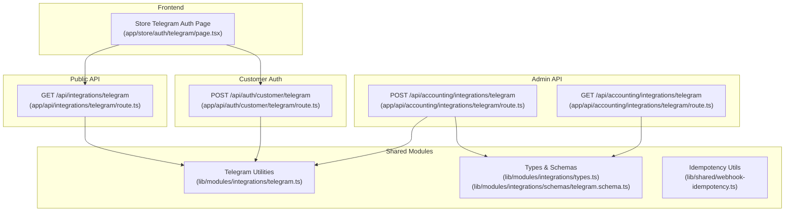
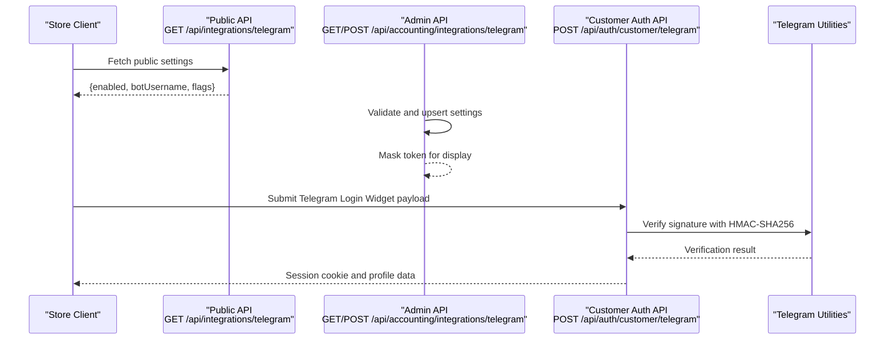
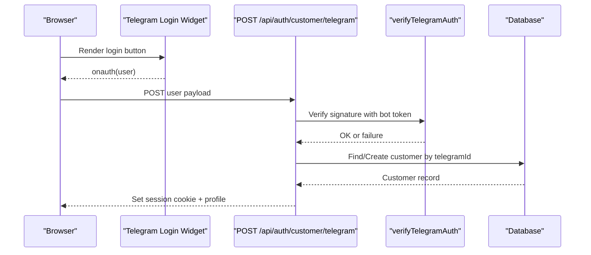
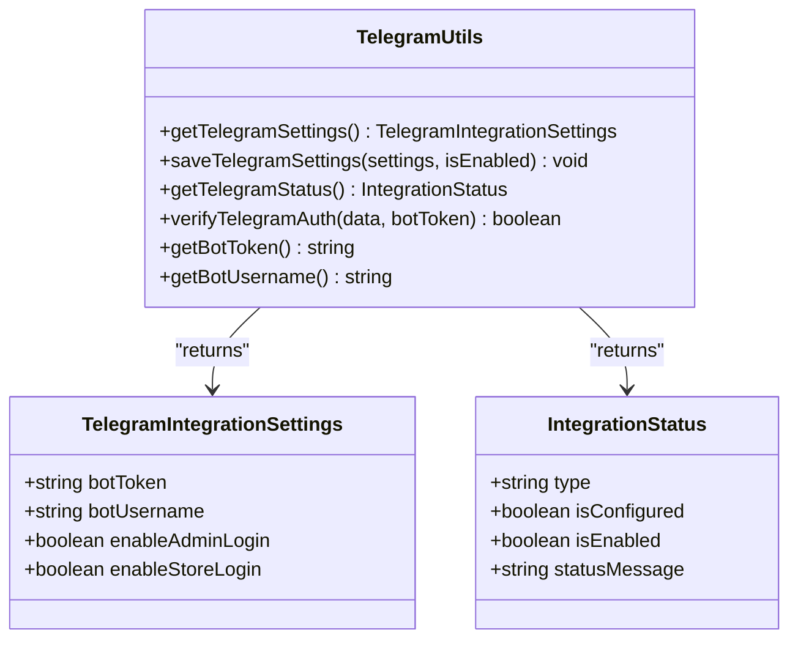
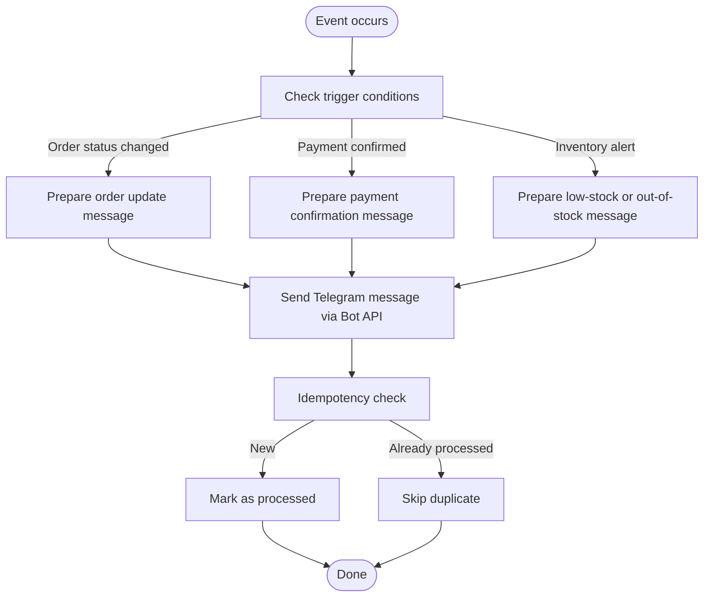
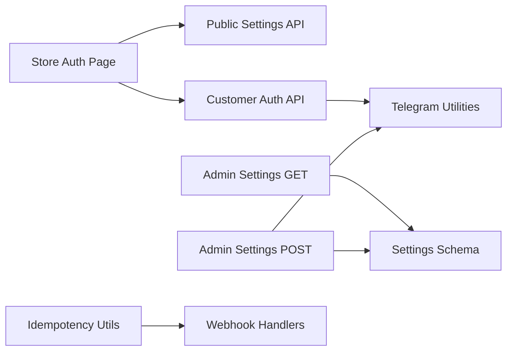

# Telegram Bot Integration

<cite>
**Referenced Files in This Document**
- [route.ts](file://app/api/integrations/telegram/route.ts)
- [route.ts](file://app/api/accounting/integrations/telegram/route.ts)
- [route.ts](file://app/api/auth/customer/telegram/route.ts)
- [page.tsx](file://app/store/auth/telegram/page.tsx)
- [telegram.ts](file://lib/modules/integrations/telegram.ts)
- [types.ts](file://lib/modules/integrations/types.ts)
- [telegram.schema.ts](file://lib/modules/integrations/schemas/telegram.schema.ts)
- [webhook-idempotency.ts](file://lib/shared/webhook-idempotency.ts)
- [route.ts](file://app/api/ecommerce/orders/route.ts)
</cite>

## Table of Contents
1. [Introduction](#introduction)
2. [Project Structure](#project-structure)
3. [Core Components](#core-components)
4. [Architecture Overview](#architecture-overview)
5. [Detailed Component Analysis](#detailed-component-analysis)
6. [Dependency Analysis](#dependency-analysis)
7. [Performance Considerations](#performance-considerations)
8. [Troubleshooting Guide](#troubleshooting-guide)
9. [Conclusion](#conclusion)

## Introduction
This document explains the Telegram bot integration for connecting customer Telegram accounts to the ERP system. It covers:
- How customers link their Telegram accounts to customer profiles
- Public and admin-facing APIs for Telegram settings
- Authentication flow using Telegram Login Widget and server-side verification
- Notification triggers and message formatting
- Available commands and administrative functions
- Security measures, error handling, and retry strategies
- Troubleshooting common integration issues

## Project Structure
The Telegram integration spans frontend, backend API routes, and shared modules:
- Frontend widget and page for customer login
- Public API for retrieving Telegram settings
- Admin API for saving Telegram settings
- Customer authentication endpoint verifying Telegram Login Widget signatures
- Shared integration utilities and types
- Idempotency utilities for webhook safety

**Diagram sources**
- [page.tsx:1-147](file://app/store/auth/telegram/page.tsx#L1-L147)
- [route.ts:1-29](file://app/api/integrations/telegram/route.ts#L1-L29)
- [route.ts:1-88](file://app/api/accounting/integrations/telegram/route.ts#L1-L88)
- [route.ts:1-119](file://app/api/auth/customer/telegram/route.ts#L1-L119)
- [telegram.ts:1-108](file://lib/modules/integrations/telegram.ts#L1-L108)
- [types.ts:1-27](file://lib/modules/integrations/types.ts#L1-L27)
- [telegram.schema.ts:1-15](file://lib/modules/integrations/schemas/telegram.schema.ts#L1-L15)
- [webhook-idempotency.ts:1-60](file://lib/shared/webhook-idempotency.ts#L1-L60)

**Section sources**
- [page.tsx:1-147](file://app/store/auth/telegram/page.tsx#L1-L147)
- [route.ts:1-29](file://app/api/integrations/telegram/route.ts#L1-L29)
- [route.ts:1-88](file://app/api/accounting/integrations/telegram/route.ts#L1-L88)
- [route.ts:1-119](file://app/api/auth/customer/telegram/route.ts#L1-L119)
- [telegram.ts:1-108](file://lib/modules/integrations/telegram.ts#L1-L108)
- [types.ts:1-27](file://lib/modules/integrations/types.ts#L1-L27)
- [telegram.schema.ts:1-15](file://lib/modules/integrations/schemas/telegram.schema.ts#L1-L15)
- [webhook-idempotency.ts:1-60](file://lib/shared/webhook-idempotency.ts#L1-L60)

## Core Components
- Telegram utilities: retrieval, saving, verification, and status helpers
- Telegram settings schema: validation for admin configuration
- Public settings endpoint: exposes bot username and flags for store login
- Admin settings endpoint: retrieves and saves Telegram settings with masking and validation
- Customer authentication endpoint: verifies Telegram Login Widget signature and creates/updates customer sessions
- Store Telegram auth page: loads public settings, renders Telegram Login Widget, and handles auth callback

**Section sources**
- [telegram.ts:1-108](file://lib/modules/integrations/telegram.ts#L1-L108)
- [telegram.schema.ts:1-15](file://lib/modules/integrations/schemas/telegram.schema.ts#L1-L15)
- [route.ts:1-29](file://app/api/integrations/telegram/route.ts#L1-L29)
- [route.ts:1-88](file://app/api/accounting/integrations/telegram/route.ts#L1-L88)
- [route.ts:1-119](file://app/api/auth/customer/telegram/route.ts#L1-L119)
- [page.tsx:1-147](file://app/store/auth/telegram/page.tsx#L1-L147)

## Architecture Overview
The integration consists of three primary flows:
- Public settings retrieval for the store UI
- Admin configuration of Telegram settings
- Customer Telegram login via Telegram Login Widget with server-side verification

**Diagram sources**
- [route.ts:1-29](file://app/api/integrations/telegram/route.ts#L1-L29)
- [route.ts:1-88](file://app/api/accounting/integrations/telegram/route.ts#L1-L88)
- [route.ts:1-119](file://app/api/auth/customer/telegram/route.ts#L1-L119)
- [telegram.ts:1-108](file://lib/modules/integrations/telegram.ts#L1-L108)

## Detailed Component Analysis

### Public Settings Endpoint
- Purpose: Expose minimal Telegram configuration to the frontend without leaking secrets
- Behavior:
  - Returns enabled flag and botUsername
  - Honors enableStoreLogin and enableAdminLogin flags
  - Masks sensitive token in admin API; public endpoint intentionally excludes token

**Section sources**
- [route.ts:1-29](file://app/api/integrations/telegram/route.ts#L1-L29)

### Admin Settings Management
- Purpose: Configure Telegram bot credentials and login flags
- Validation:
  - Enforces non-empty bot token and username
  - Username must match allowed pattern
- Persistence:
  - Upserts integration record
  - Masks token in responses for security
- Flags:
  - enableAdminLogin: controls admin login via Telegram
  - enableStoreLogin: controls store customer login via Telegram

**Section sources**
- [route.ts:1-88](file://app/api/accounting/integrations/telegram/route.ts#L1-L88)
- [telegram.schema.ts:1-15](file://lib/modules/integrations/schemas/telegram.schema.ts#L1-L15)
- [types.ts:1-27](file://lib/modules/integrations/types.ts#L1-L27)

### Customer Authentication Flow
- Frontend:
  - Loads public settings and injects Telegram Login Widget script
  - Submits user object to backend on auth
- Backend:
  - Retrieves bot token from DB or environment
  - Verifies Telegram signature using HMAC-SHA256
  - Creates or updates customer record with Telegram ID and metadata
  - Sets secure customer session cookie

**Diagram sources**
- [page.tsx:53-99](file://app/store/auth/telegram/page.tsx#L53-L99)
- [route.ts:1-119](file://app/api/auth/customer/telegram/route.ts#L1-L119)
- [telegram.ts:71-95](file://lib/modules/integrations/telegram.ts#L71-L95)

**Section sources**
- [page.tsx:1-147](file://app/store/auth/telegram/page.tsx#L1-L147)
- [route.ts:1-119](file://app/api/auth/customer/telegram/route.ts#L1-L119)
- [telegram.ts:1-108](file://lib/modules/integrations/telegram.ts#L1-L108)

### Telegram Utilities and Types
- Utilities:
  - Retrieve and merge settings
  - Verify Telegram Login Widget signature with HMAC-SHA256
  - Check age of auth_date (max 1 day)
  - Get bot token/username from DB or environment
- Types:
  - IntegrationConfig, TelegramIntegrationSettings, IntegrationStatus

**Diagram sources**
- [types.ts:1-27](file://lib/modules/integrations/types.ts#L1-L27)
- [telegram.ts:1-108](file://lib/modules/integrations/telegram.ts#L1-L108)

**Section sources**
- [types.ts:1-27](file://lib/modules/integrations/types.ts#L1-L27)
- [telegram.ts:1-108](file://lib/modules/integrations/telegram.ts#L1-L108)

### Notification Triggers and Message Formatting
- Current repository coverage:
  - Public settings endpoint supports enableStoreLogin and enableAdminLogin flags
  - No explicit Telegram bot message sending or command handling code is present in the repository
- Recommended approach:
  - Use Telegram Bot API to send messages to customers linked by telegramId
  - Trigger notifications on order status change, payment confirmation, and inventory alerts
  - Implement idempotent webhook processing to avoid duplicate notifications

Note: The following diagram illustrates a conceptual notification pipeline using the existing idempotency utilities.

[No sources needed since this diagram shows conceptual workflow, not actual code structure]

**Section sources**
- [route.ts:1-29](file://app/api/integrations/telegram/route.ts#L1-L29)
- [webhook-idempotency.ts:1-60](file://lib/shared/webhook-idempotency.ts#L1-L60)

### Bot Commands and Administrative Functions
- Current repository coverage:
  - No explicit command handlers or command parsing logic for Telegram bot are present
  - Administrative functions include saving Telegram settings and retrieving masked tokens
- Recommendations:
  - Implement a webhook endpoint to receive Telegram updates
  - Parse commands and route to appropriate handlers
  - Use admin flags to control command availability

[No sources needed since this section provides general guidance]

## Dependency Analysis
- Frontend depends on public settings endpoint to render Telegram Login Widget
- Customer auth endpoint depends on Telegram utilities for signature verification
- Admin endpoints depend on settings schema and integration utilities
- Idempotency utilities support safe webhook processing

**Diagram sources**
- [page.tsx:1-147](file://app/store/auth/telegram/page.tsx#L1-L147)
- [route.ts:1-29](file://app/api/integrations/telegram/route.ts#L1-L29)
- [route.ts:1-119](file://app/api/auth/customer/telegram/route.ts#L1-L119)
- [telegram.ts:1-108](file://lib/modules/integrations/telegram.ts#L1-L108)
- [telegram.schema.ts:1-15](file://lib/modules/integrations/schemas/telegram.schema.ts#L1-L15)
- [webhook-idempotency.ts:1-60](file://lib/shared/webhook-idempotency.ts#L1-L60)

**Section sources**
- [page.tsx:1-147](file://app/store/auth/telegram/page.tsx#L1-L147)
- [route.ts:1-29](file://app/api/integrations/telegram/route.ts#L1-L29)
- [route.ts:1-119](file://app/api/auth/customer/telegram/route.ts#L1-L119)
- [telegram.ts:1-108](file://lib/modules/integrations/telegram.ts#L1-L108)
- [telegram.schema.ts:1-15](file://lib/modules/integrations/schemas/telegram.schema.ts#L1-L15)
- [webhook-idempotency.ts:1-60](file://lib/shared/webhook-idempotency.ts#L1-L60)

## Performance Considerations
- Signature verification uses HMAC-SHA256; cost is negligible for typical traffic
- Public settings endpoint avoids heavy computation and database reads
- Admin settings endpoint masks tokens to reduce risk during display
- Idempotency utilities prevent redundant processing of webhooks

[No sources needed since this section provides general guidance]

## Troubleshooting Guide
Common issues and resolutions:
- Telegram not configured
  - Symptom: Customer auth returns configuration error
  - Resolution: Admin must configure bot token and username via admin API
  - Section sources
    - [route.ts:46-49](file://app/api/auth/customer/telegram/route.ts#L46-L49)
    - [route.ts:48-88](file://app/api/accounting/integrations/telegram/route.ts#L48-L88)

- Invalid Telegram authentication
  - Symptom: 401 Unauthorized on customer auth
  - Causes: Signature mismatch, expired auth_date (>1 day), missing hash
  - Resolution: Verify bot token, ensure widget script is loaded, check network connectivity
  - Section sources
    - [route.ts:60-62](file://app/api/auth/customer/telegram/route.ts#L60-L62)
    - [telegram.ts:71-95](file://lib/modules/integrations/telegram.ts#L71-L95)

- Account deactivated
  - Symptom: Authentication fails with deactivation message
  - Resolution: Contact administrator to reactivate account
  - Section sources
    - [route.ts:91-93](file://app/api/auth/customer/telegram/route.ts#L91-L93)

- Token masking and partial visibility
  - Symptom: Token appears masked in admin UI
  - Behavior: By design for security; original token retained when unchanged
  - Section sources
    - [route.ts:28-41](file://app/api/accounting/integrations/telegram/route.ts#L28-L41)

- Duplicate notifications
  - Symptom: Repeated messages for same event
  - Resolution: Use idempotency utilities to prevent reprocessing
  - Section sources
    - [webhook-idempotency.ts:1-60](file://lib/shared/webhook-idempotency.ts#L1-L60)

- Public settings unavailable
  - Symptom: Login widget not shown
  - Resolution: Ensure integration is enabled and botUsername is set
  - Section sources
    - [route.ts:12-24](file://app/api/integrations/telegram/route.ts#L12-L24)

## Conclusion
The Telegram integration provides a secure and extensible foundation for customer authentication and future notification capabilities. Administrators can configure bot credentials and login flags, while customers authenticate seamlessly via Telegram Login Widget with server-side verification. To implement notifications and commands, extend the system with Bot API message sending and webhook command parsing, leveraging the existing idempotency utilities for reliability.