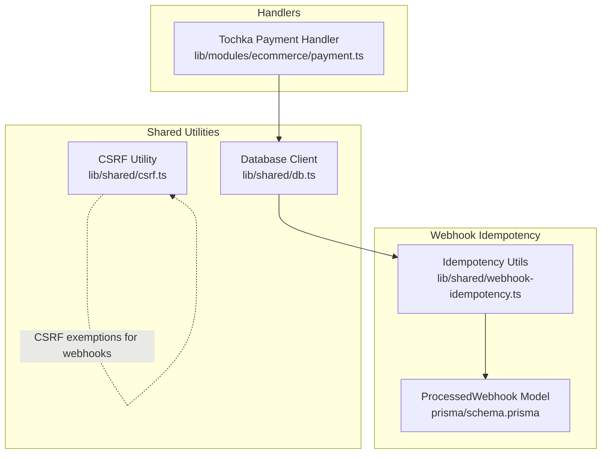
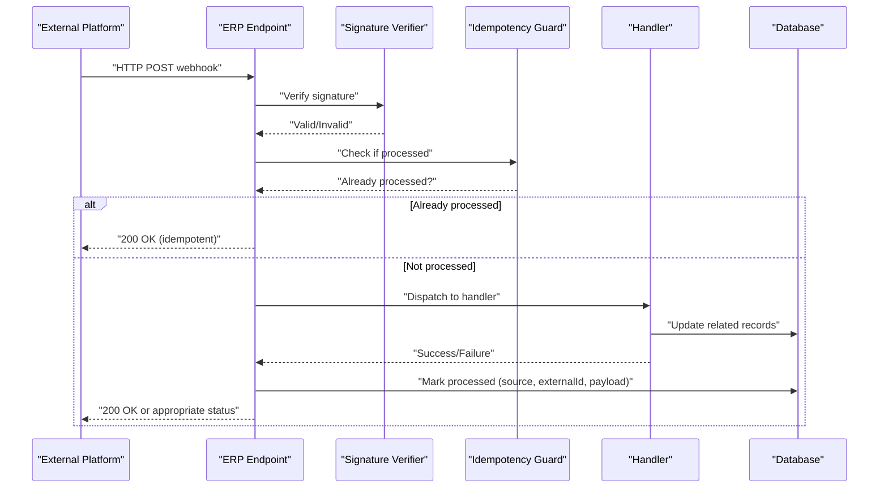
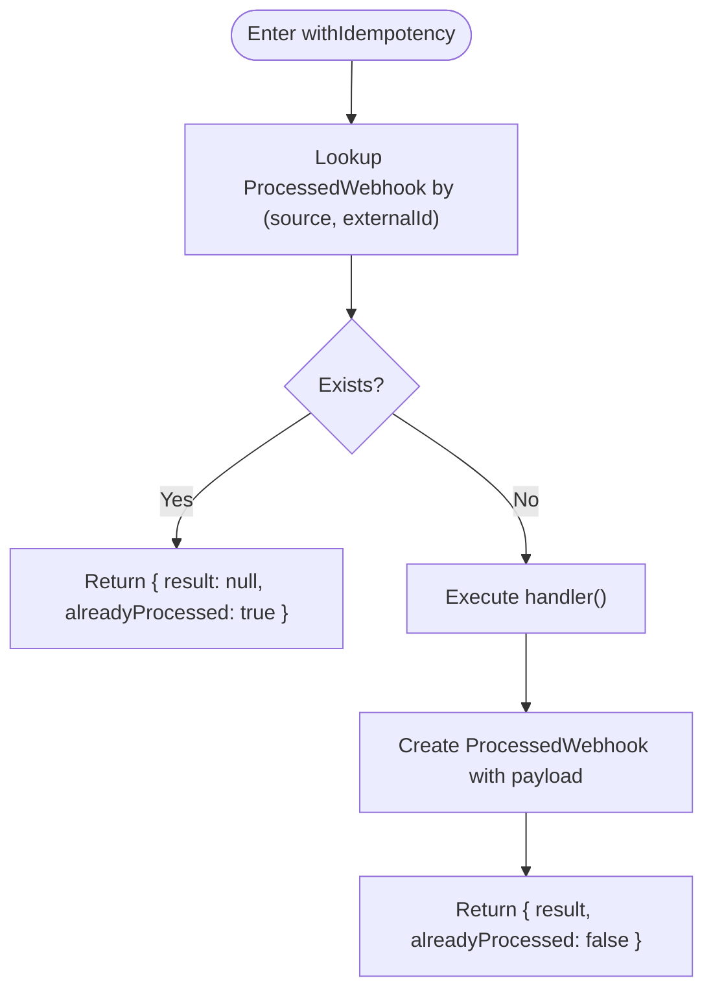
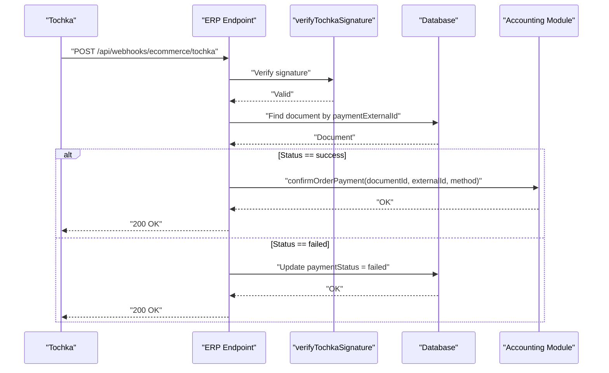
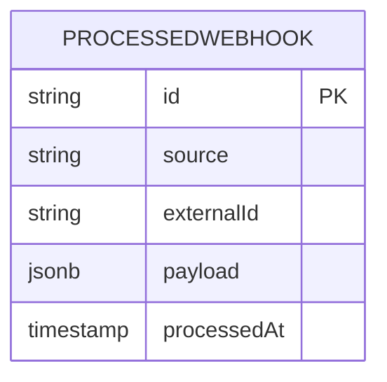
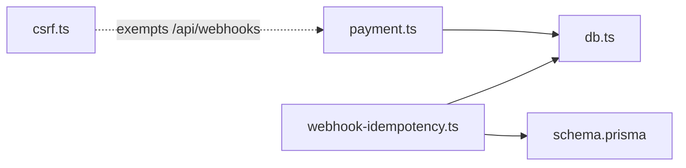

# Webhook Processing System

<cite>
**Referenced Files in This Document**
- [webhook-idempotency.ts](file://lib/shared/webhook-idempotency.ts)
- [payment.ts](file://lib/modules/ecommerce/payment.ts)
- [schema.prisma](file://prisma/schema.prisma)
- [migration.sql](file://prisma/migrations/20260312_add_processed_webhook/migration.sql)
- [db.ts](file://lib/shared/db.ts)
- [csrf.ts](file://lib/shared/csrf.ts)
- [route.ts](file://app/api/auth/customer/telegram/route.ts)
</cite>

## Table of Contents
1. [Introduction](#introduction)
2. [Project Structure](#project-structure)
3. [Core Components](#core-components)
4. [Architecture Overview](#architecture-overview)
5. [Detailed Component Analysis](#detailed-component-analysis)
6. [Dependency Analysis](#dependency-analysis)
7. [Performance Considerations](#performance-considerations)
8. [Security and Validation](#security-and-validation)
9. [Monitoring and Logging](#monitoring-and-logging)
10. [Troubleshooting Guide](#troubleshooting-guide)
11. [Conclusion](#conclusion)

## Introduction
This document describes the webhook processing system used to receive and process events from external systems and e-commerce platforms. It covers endpoint configuration, validation and signature verification, supported webhook types, processing workflow from reception to persistence, error handling, retry and dead-letter strategies, security controls (IP whitelisting, HMAC signatures, rate limiting), and operational monitoring and troubleshooting.

## Project Structure
The webhook system is composed of:
- A database-backed idempotency guard to prevent duplicate processing
- A payment webhook handler for Tochka (e-commerce platform)
- A PostgreSQL schema and migration defining the idempotency storage
- Shared database client and CSRF utilities
- Optional platform-specific signature verification (e.g., Telegram)

**Diagram sources**
- [db.ts:1-25](file://lib/shared/db.ts#L1-L25)
- [webhook-idempotency.ts:1-60](file://lib/shared/webhook-idempotency.ts#L1-L60)
- [schema.prisma:1057-1066](file://prisma/schema.prisma#L1057-L1066)
- [payment.ts:1-84](file://lib/modules/ecommerce/payment.ts#L1-L84)
- [csrf.ts:127-137](file://lib/shared/csrf.ts#L127-L137)

**Section sources**
- [webhook-idempotency.ts:1-60](file://lib/shared/webhook-idempotency.ts#L1-L60)
- [schema.prisma:1057-1066](file://prisma/schema.prisma#L1057-L1066)
- [migration.sql:1-17](file://prisma/migrations/20260312_add_processed_webhook/migration.sql#L1-L17)
- [db.ts:1-25](file://lib/shared/db.ts#L1-L25)
- [csrf.ts:127-137](file://lib/shared/csrf.ts#L127-L137)

## Core Components
- Idempotency utilities: Check and mark webhooks as processed to avoid duplicates.
- Payment webhook handler: Processes Tochka payment notifications and reconciles payments with sales orders.
- Database model and migration: Persist idempotency records with unique constraints and indexes.
- Database client: Centralized Prisma client for PostgreSQL.

Key responsibilities:
- Prevent duplicate processing via unique source+externalId keys
- Validate webhook authenticity (HMAC for Tochka)
- Map external identifiers to internal documents and update statuses
- Persist original payloads for debugging and audit

**Section sources**
- [webhook-idempotency.ts:11-59](file://lib/shared/webhook-idempotency.ts#L11-L59)
- [payment.ts:20-74](file://lib/modules/ecommerce/payment.ts#L20-L74)
- [schema.prisma:1057-1066](file://prisma/schema.prisma#L1057-L1066)
- [migration.sql:1-17](file://prisma/migrations/20260312_add_processed_webhook/migration.sql#L1-L17)
- [db.ts:1-25](file://lib/shared/db.ts#L1-L25)

## Architecture Overview
The webhook pipeline:
1. External system sends a webhook to the ERP endpoint.
2. Signature verification validates the request authenticity.
3. Idempotency check ensures the event is not duplicated.
4. Business handler processes the event (e.g., payment reconciliation).
5. On success, the event is marked as processed with the original payload.
6. Errors are handled gracefully; retries and dead-letter strategies are configured per platform.

**Diagram sources**
- [payment.ts:20-74](file://lib/modules/ecommerce/payment.ts#L20-L74)
- [webhook-idempotency.ts:45-59](file://lib/shared/webhook-idempotency.ts#L45-L59)
- [schema.prisma:1057-1066](file://prisma/schema.prisma#L1057-L1066)

## Detailed Component Analysis

### Idempotency Guard
- Purpose: Prevent duplicate processing of webhooks using a unique composite key (source, externalId).
- Behavior:
  - Check if a record exists for the given source and externalId.
  - If absent, execute the handler and persist the record with the original payload.
  - If present, skip execution and indicate already processed.

**Diagram sources**
- [webhook-idempotency.ts:45-59](file://lib/shared/webhook-idempotency.ts#L45-L59)
- [schema.prisma:1057-1066](file://prisma/schema.prisma#L1057-L1066)

**Section sources**
- [webhook-idempotency.ts:11-59](file://lib/shared/webhook-idempotency.ts#L11-L59)
- [schema.prisma:1057-1066](file://prisma/schema.prisma#L1057-L1066)
- [migration.sql:1-17](file://prisma/migrations/20260312_add_processed_webhook/migration.sql#L1-L17)

### Tochka Payment Webhook Handler
- Validates HMAC-SHA256 signature using a platform secret.
- Finds the associated sales order by external payment ID.
- On success: confirms payment via the accounting module and returns a success result.
- On failure: updates the order’s payment status to failed.
- Uses idempotency to avoid duplicate processing.

**Diagram sources**
- [payment.ts:20-74](file://lib/modules/ecommerce/payment.ts#L20-L74)
- [db.ts:1-25](file://lib/shared/db.ts#L1-L25)

**Section sources**
- [payment.ts:20-74](file://lib/modules/ecommerce/payment.ts#L20-L74)

### Database Model and Migration
- Model: ProcessedWebhook with fields for source, externalId, payload, and processedAt.
- Constraints: Unique composite key on (source, externalId); index on (source, processedAt).
- Migration: Creates the table and indexes.

**Diagram sources**
- [schema.prisma:1057-1066](file://prisma/schema.prisma#L1057-L1066)
- [migration.sql:1-17](file://prisma/migrations/20260312_add_processed_webhook/migration.sql#L1-L17)

**Section sources**
- [schema.prisma:1057-1066](file://prisma/schema.prisma#L1057-L1066)
- [migration.sql:1-17](file://prisma/migrations/20260312_add_processed_webhook/migration.sql#L1-L17)

## Dependency Analysis
- Idempotency utilities depend on the database client to query and insert processed-webhook records.
- Payment handler depends on the database client and the accounting module to reconcile payments.
- CSRF utility excludes webhook endpoints from CSRF checks.

**Diagram sources**
- [payment.ts:1-84](file://lib/modules/ecommerce/payment.ts#L1-L84)
- [webhook-idempotency.ts:1-60](file://lib/shared/webhook-idempotency.ts#L1-L60)
- [db.ts:1-25](file://lib/shared/db.ts#L1-L25)
- [csrf.ts:127-137](file://lib/shared/csrf.ts#L127-L137)
- [schema.prisma:1057-1066](file://prisma/schema.prisma#L1057-L1066)

**Section sources**
- [payment.ts:1-84](file://lib/modules/ecommerce/payment.ts#L1-L84)
- [webhook-idempotency.ts:1-60](file://lib/shared/webhook-idempotency.ts#L1-L60)
- [db.ts:1-25](file://lib/shared/db.ts#L1-L25)
- [csrf.ts:127-137](file://lib/shared/csrf.ts#L127-L137)

## Performance Considerations
- Indexes on (source, externalId) and (source, processedAt) optimize lookup and cleanup.
- Payload storage enables debugging but adds disk usage; consider retention policies.
- Idempotency check is O(1) due to unique index.
- For high-volume platforms, consider batching and asynchronous processing outside the request path.

[No sources needed since this section provides general guidance]

## Security and Validation
- Tochka signature verification: Uses HMAC-SHA256 with a shared secret; timing-safe comparison prevents timing attacks.
- CSRF exemptions: Webhook endpoints are excluded from CSRF protection to allow third-party posts.
- Telegram authentication: Demonstrates HMAC-based verification for platform auth; similar patterns apply to webhook signing.

Recommended controls:
- IP whitelisting for known platform IPs
- HMAC signature verification per platform
- Rate limiting at the gateway or middleware level
- Environment variables for secrets and timeouts
- TLS enforcement for inbound traffic

**Section sources**
- [payment.ts:20-27](file://lib/modules/ecommerce/payment.ts#L20-L27)
- [csrf.ts:127-137](file://lib/shared/csrf.ts#L127-L137)
- [route.ts:23-36](file://app/api/auth/customer/telegram/route.ts#L23-L36)

## Monitoring and Logging
- Store original payloads for debugging and auditability.
- Track processing latency and failure rates per source.
- Implement health checks for database connectivity and webhook endpoints.
- Log signature verification failures and idempotency bypasses.
- Use structured logs with correlation IDs to trace webhook lifecycles.

[No sources needed since this section provides general guidance]

## Troubleshooting Guide
Common issues and resolutions:
- Duplicate processing: Verify uniqueness of (source, externalId) and inspect ProcessedWebhook entries.
- Signature verification failures: Confirm platform secret configuration and header/body alignment.
- Missing order by externalId: Ensure the external payment ID is correctly propagated to the sales order.
- Database connectivity errors: Check DATABASE_URL and connection pool limits.
- Idempotency not preventing duplicates: Confirm unique index presence and absence of malformed payloads.

Debugging techniques:
- Inspect ProcessedWebhook rows for the source and externalId.
- Re-run handler with the stored payload to reproduce issues.
- Temporarily disable idempotency during testing to validate handler logic.

**Section sources**
- [webhook-idempotency.ts:11-39](file://lib/shared/webhook-idempotency.ts#L11-L39)
- [schema.prisma:1057-1066](file://prisma/schema.prisma#L1057-L1066)
- [migration.sql:1-17](file://prisma/migrations/20260312_add_processed_webhook/migration.sql#L1-L17)
- [payment.ts:30-74](file://lib/modules/ecommerce/payment.ts#L30-L74)

## Conclusion
The webhook system provides a robust, idempotent foundation for integrating with external platforms. It supports signature verification, deduplication, and extensible handlers. By enforcing strong security controls, monitoring, and resilient error handling, the system can reliably process payment notifications and can be extended to support additional webhook types such as order updates and inventory sync events.

[No sources needed since this section summarizes without analyzing specific files]