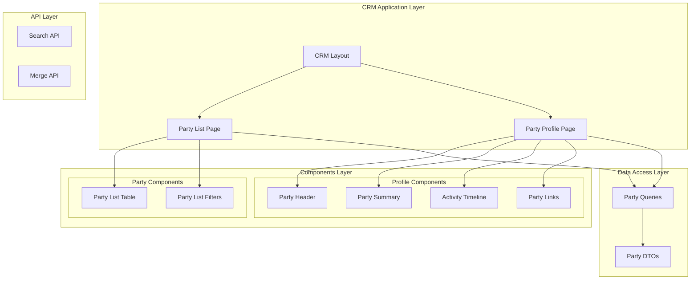
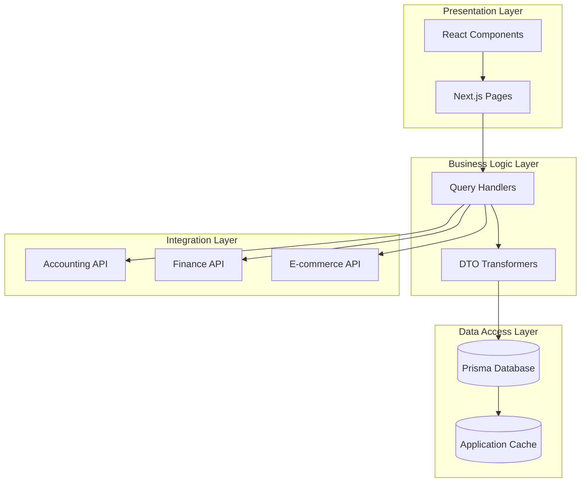
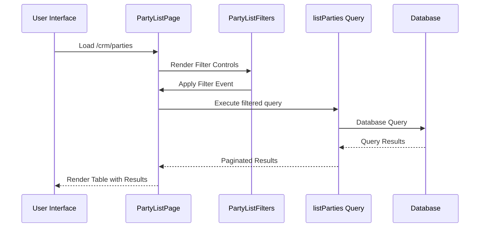
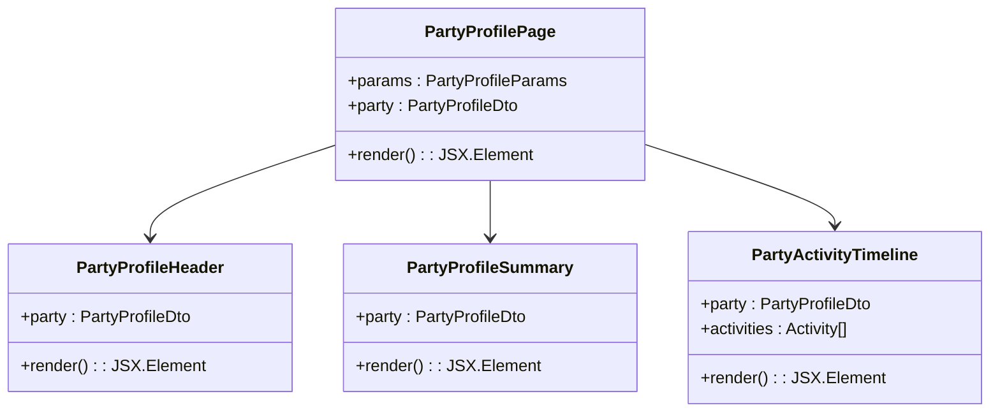
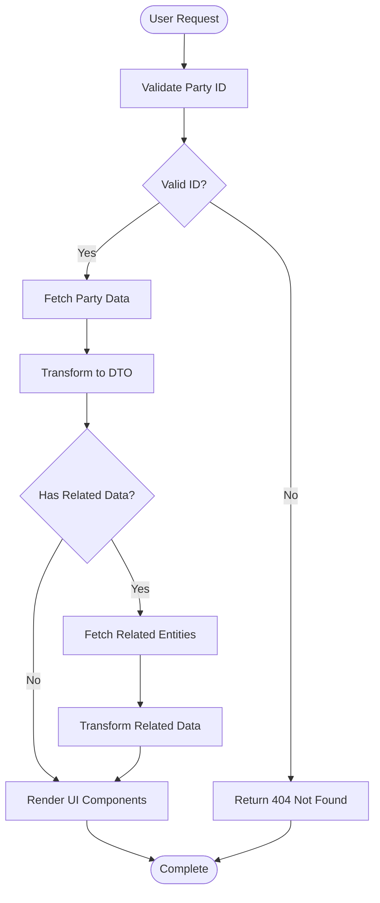
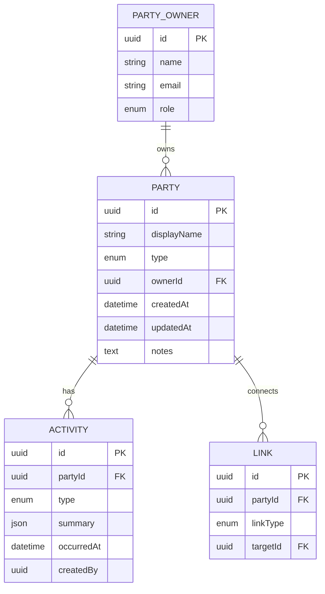

# Party & Customer Relationship Management

<cite>
**Referenced Files in This Document**
- [layout.tsx](file://app/(crm)/layout.tsx)
- [page.tsx](file://app/(crm)/crm/parties/[id]/page.tsx)
- [page.tsx](file://app/(crm)/crm/parties/page.tsx)
- [index.ts](file://components/crm/index.ts)
- [index.ts](file://components/crm/parties/index.ts)
- [index.ts](file://components/crm/party-profile/index.ts)
- [party-list-table.tsx](file://components/crm/parties/party-list-table.tsx)
- [party-list-filters.tsx](file://components/crm/parties/party-list-filters.tsx)
- [party-profile-header.tsx](file://components/crm/party-profile/party-profile-header.tsx)
- [party-profile-summary.tsx](file://components/crm/party-profile/party-profile-summary.tsx)
- [party-activity-timeline.tsx](file://components/crm/party-profile/party-activity-timeline.tsx)
- [queries/index.ts](file://lib/party/queries/index.ts)
- [list-parties.ts](file://lib/party/queries/list-parties.ts)
- [get-party-profile.ts](file://lib/party/queries/get-party-profile.ts)
- [dto.ts](file://lib/party/dto.ts)
- [index.ts](file://lib/party/index.ts)
</cite>

## Table of Contents
1. [Introduction](#introduction)
2. [Project Structure](#project-structure)
3. [Core Components](#core-components)
4. [Architecture Overview](#architecture-overview)
5. [Detailed Component Analysis](#detailed-component-analysis)
6. [Data Model](#data-model)
7. [API Endpoints](#api-endpoints)
8. [Performance Considerations](#performance-considerations)
9. [Troubleshooting Guide](#troubleshooting-guide)
10. [Conclusion](#conclusion)

## Introduction

The Party & Customer Relationship Management (CRM) system is a centralized component within the ERP platform that serves as the foundation for managing customer relationships and business parties. Built on Next.js 14 with TypeScript, this system provides a comprehensive 360-degree view of customers, organizations, and business relationships across multiple enterprise domains including accounting, finance, and e-commerce.

The CRM module operates as a strategic layer that unifies various business functions around the concept of "Party" - the central entity representing customers, suppliers, and business partners. This architecture enables seamless integration between financial operations, customer service, and business analytics while maintaining clean separation of concerns across different functional domains.

## Project Structure

The CRM system follows a modular architecture organized by functional areas and presentation layers:

**Diagram sources**
- [layout.tsx:1-13](file://app/(crm)/layout.tsx#L1-L13)
- [page.tsx:1-87](file://app/(crm)/crm/parties/page.tsx#L1-L87)
- [page.tsx:1-58](file://app/(crm)/crm/parties/[id]/page.tsx#L1-L58)

The system is structured with clear separation between presentation, business logic, and data access layers, enabling maintainability and extensibility across the enterprise platform.

**Section sources**
- [layout.tsx:1-13](file://app/(crm)/layout.tsx#L1-L13)
- [index.ts:1-10](file://components/crm/index.ts#L1-L10)

## Core Components

The CRM system consists of several interconnected components that work together to provide comprehensive party management functionality:

### Party Management Pages
- **Party List Page**: Displays searchable and filterable party listings with pagination
- **Party Profile Page**: Provides detailed 360-degree view of individual parties with activity timelines

### Component Architecture
- **Party List Components**: Table rendering and filtering controls
- **Party Profile Components**: Header, summary cards, activity timeline, and navigation links
- **CRM Exports**: Centralized exports for party-related components

**Section sources**
- [page.tsx:1-87](file://app/(crm)/crm/parties/page.tsx#L1-L87)
- [page.tsx:1-58](file://app/(crm)/crm/parties/[id]/page.tsx#L1-L58)
- [index.ts:1-10](file://components/crm/index.ts#L1-L10)

## Architecture Overview

The CRM system implements a layered architecture that separates concerns across multiple abstraction levels:

**Diagram sources**
- [queries/index.ts:1-9](file://lib/party/queries/index.ts#L1-L9)
- [list-parties.ts:13-74](file://lib/party/queries/list-parties.ts#L13-L74)
- [get-party-profile.ts:12-200](file://lib/party/queries/get-party-profile.ts#L12-L200)

The architecture ensures that party data flows seamlessly across different business domains while maintaining data consistency and performance optimization through caching and efficient query patterns.

## Detailed Component Analysis

### Party List Management System

The party list system provides comprehensive search and filtering capabilities with real-time updates:

**Diagram sources**
- [page.tsx:24-36](file://app/(crm)/crm/parties/page.tsx#L24-L36)
- [party-list-filters.tsx:27-44](file://components/crm/parties/party-list-filters.tsx#L27-L44)
- [list-parties.ts:13-69](file://lib/party/queries/list-parties.ts#L13-L69)

The system supports multiple filter criteria including search terms, party types (person/organization), and ownership assignments with intelligent parameter handling and URL state management.

### Party Profile Dashboard

The party profile page presents a comprehensive view combining static information with dynamic activity feeds:

**Diagram sources**
- [page.tsx:21-57](file://app/(crm)/crm/parties/[id]/page.tsx#L21-L57)
- [party-profile-header.tsx:16-25](file://components/crm/party-profile/party-profile-header.tsx#L16-L25)
- [party-profile-summary.tsx:16-59](file://components/crm/party-profile/party-profile-summary.tsx#L16-L59)
- [party-activity-timeline.tsx:24-76](file://components/crm/party-profile/party-activity-timeline.tsx#L24-L76)

Each component maintains single responsibility with clear data flow patterns and consistent styling through the shared UI component library.

**Section sources**
- [party-list-table.tsx:17-82](file://components/crm/parties/party-list-table.tsx#L17-L82)
- [party-list-filters.tsx:19-91](file://components/crm/parties/party-list-filters.tsx#L19-L91)

### Data Flow and Processing Logic

The system implements efficient data processing with proper error handling and loading states:

**Diagram sources**
- [page.tsx:25-27](file://app/(crm)/crm/parties/[id]/page.tsx#L25-L27)
- [get-party-profile.ts:12-200](file://lib/party/queries/get-party-profile.ts#L12-L200)

**Section sources**
- [party-activity-timeline.tsx:78-101](file://components/crm/party-profile/party-activity-timeline.tsx#L78-L101)

## Data Model

The party management system utilizes a comprehensive data model designed to support complex business relationships and multi-domain integration:

**Diagram sources**
- [dto.ts:1-200](file://lib/party/dto.ts#L1-L200)

The data model supports flexible party relationships, comprehensive activity tracking, and seamless integration with external systems through standardized link types and activity patterns.

## API Endpoints

The CRM system exposes RESTful APIs for party management operations:

| Endpoint | Method | Description | Authentication |
|----------|--------|-------------|----------------|
| `/api/crm/parties/search` | GET | Search and filter parties with pagination | Required |
| `/api/crm/parties/merge` | POST | Merge two parties into one | Required |
| `/api/accounting/counterparties/[id]` | GET/PUT/DELETE | Manage counterparties linked to parties | Required |

**Section sources**
- [queries/index.ts:1-9](file://lib/party/queries/index.ts#L1-L9)
- [list-parties.ts:13-74](file://lib/party/queries/list-parties.ts#L13-L74)

## Performance Considerations

The CRM system implements several performance optimization strategies:

- **Lazy Loading**: Components use React.lazy for optimal bundle splitting
- **Pagination**: Efficient server-side pagination prevents large dataset loading
- **Caching**: Strategic caching of frequently accessed party data
- **Optimized Queries**: Prisma queries with selective field projection
- **Debounced Search**: Input debouncing for search operations

## Troubleshooting Guide

Common issues and their resolutions:

### Party Data Loading Issues
- **Symptom**: Empty party list despite existing data
- **Cause**: Database connection or query permission issues
- **Solution**: Verify database connectivity and user permissions

### Search Functionality Problems
- **Symptom**: Search returns unexpected results
- **Cause**: Incorrect filter parameter handling
- **Solution**: Validate URL parameter encoding and query construction

### Performance Degradation
- **Symptom**: Slow page loads with large datasets
- **Cause**: Unoptimized database queries
- **Solution**: Implement proper indexing and query optimization

**Section sources**
- [page.tsx:25-27](file://app/(crm)/crm/parties/[id]/page.tsx#L25-L27)
- [party-list-filters.tsx:27-44](file://components/crm/parties/party-list-filters.tsx#L27-L44)

## Conclusion

The Party & Customer Relationship Management system represents a sophisticated approach to enterprise customer relationship management within the broader ERP ecosystem. Its modular architecture, comprehensive data model, and efficient component design enable scalable customer management across multiple business domains.

The system's strength lies in its ability to provide unified party management while maintaining clean separation of concerns and seamless integration with accounting, finance, and e-commerce operations. The 360-degree party view, combined with robust search and filtering capabilities, positions the CRM system as a cornerstone of the enterprise platform's customer relationship strategy.

Future enhancements could focus on advanced analytics integration, automated party enrichment, and expanded integration capabilities with external CRM systems and marketing platforms.