# Business Capabilities

<cite>
**Referenced Files in This Document**
- [README.md](file://README.md)
- [ARCHITECTURE.md](file://ARCHITECTURE.md)
- [prisma/schema.prisma](file://prisma/schema.prisma)
- [app/api/accounting/products/route.ts](file://app/api/accounting/products/route.ts)
- [app/api/accounting/documents/route.ts](file://app/api/accounting/documents/route.ts)
- [app/api/accounting/stock/route.ts](file://app/api/accounting/stock/route.ts)
- [app/api/finance/payments/route.ts](file://app/api/finance/payments/route.ts)
- [app/api/ecommerce/orders/route.ts](file://app/api/ecommerce/orders/route.ts)
- [app/api/ecommerce/cart/route.ts](file://app/api/ecommerce/cart/route.ts)
- [lib/modules/accounting/documents.ts](file://lib/modules/accounting/documents.ts)
- [lib/modules/accounting/stock.ts](file://lib/modules/accounting/stock.ts)
- [lib/modules/ecommerce/orders.ts](file://lib/modules/ecommerce/orders.ts)
- [lib/modules/finance/reports.ts](file://lib/modules/finance/reports.ts)
- [lib/modules/accounting/journal.ts](file://lib/modules/accounting/journal.ts)
- [app/api/accounting/reports/profit-loss/route.ts](file://app/api/accounting/reports/profit-loss/route.ts)
- [app/api/accounting/reports/cash-flow/route.ts](file://app/api/accounting/reports/cash-flow/route.ts)
- [lib/modules/integrations/telegram.ts](file://lib/modules/integrations/telegram.ts)
- [app/api/integrations/telegram/route.ts](file://app/api/integrations/telegram/route.ts)
- [components/accounting/catalog/ProductEditDialog.tsx](file://components/accounting/catalog/ProductEditDialog.tsx)
- [components/ecommerce/CartItemCard.tsx](file://components/ecommerce/CartItemCard.tsx)
</cite>

## Table of Contents
1. [Introduction](#introduction)
2. [Project Structure](#project-structure)
3. [Core Components](#core-components)
4. [Architecture Overview](#architecture-overview)
5. [Detailed Component Analysis](#detailed-component-analysis)
6. [Dependency Analysis](#dependency-analysis)
7. [Performance Considerations](#performance-considerations)
8. [Troubleshooting Guide](#troubleshooting-guide)
9. [Conclusion](#conclusion)
10. [Appendices](#appendices)

## Introduction
ListOpt ERP is a comprehensive ERP solution tailored for wholesale trade with strong support for the Russian market context. It integrates product catalog management (with variants and categories), warehouse inventory tracking with real-time stock updates and moving average cost calculations, document workflow automation across purchases, sales, transfers, and inventory operations, financial management with payment processing and reporting, e-commerce capabilities for online store, shopping cart, order management, and customer accounts, and integration capabilities with Telegram bots and webhook processing. The system emphasizes idempotent document confirmations, immutable stock movement logs, and double-entry journaling to ensure auditability and compliance.

## Project Structure
The project follows a modular architecture with:
- Next.js App Router for pages and API routes
- Prisma ORM for database modeling and migrations
- Business logic encapsulated under lib/modules
- UI components under components
- Tests under tests

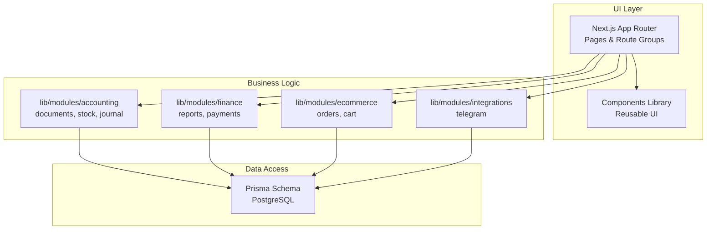

**Diagram sources**
- [ARCHITECTURE.md:1-308](file://ARCHITECTURE.md#L1-L308)
- [prisma/schema.prisma:1-1067](file://prisma/schema.prisma#L1-L1067)

**Section sources**
- [ARCHITECTURE.md:1-308](file://ARCHITECTURE.md#L1-L308)
- [README.md:1-193](file://README.md#L1-L193)

## Core Components
- Product Catalog Management: CRUD, search, filters, variants, categories, SEO fields, and e-commerce publishing flags.
- Warehouse Inventory Tracking: Real-time stock, reserve calculation, moving average cost, and cost/value computations.
- Document Workflow Automation: Purchase, sales, transfers, inventory operations with auto-numbering, confirm/cancel, and journal posting.
- Financial Management: Payments, reports (P&L, Cash Flow, Balance Sheet), and counterparty balances.
- E-commerce: Online store, shopping cart, order creation, payment confirmation, and customer account linkage.
- Integrations: Telegram bot settings retrieval and authentication verification.

**Section sources**
- [app/api/accounting/products/route.ts:1-226](file://app/api/accounting/products/route.ts#L1-L226)
- [app/api/accounting/stock/route.ts:1-192](file://app/api/accounting/stock/route.ts#L1-L192)
- [app/api/accounting/documents/route.ts:1-136](file://app/api/accounting/documents/route.ts#L1-L136)
- [lib/modules/accounting/documents.ts:1-144](file://lib/modules/accounting/documents.ts#L1-L144)
- [lib/modules/accounting/stock.ts:1-220](file://lib/modules/accounting/stock.ts#L1-L220)
- [app/api/finance/payments/route.ts:1-113](file://app/api/finance/payments/route.ts#L1-L113)
- [lib/modules/finance/reports.ts:1-98](file://lib/modules/finance/reports.ts#L1-L98)
- [app/api/ecommerce/cart/route.ts:1-189](file://app/api/ecommerce/cart/route.ts#L1-L189)
- [lib/modules/ecommerce/orders.ts:1-176](file://lib/modules/ecommerce/orders.ts#L1-L176)
- [app/api/ecommerce/orders/route.ts:1-64](file://app/api/ecommerce/orders/route.ts#L1-L64)
- [lib/modules/integrations/telegram.ts:1-108](file://lib/modules/integrations/telegram.ts#L1-L108)
- [app/api/integrations/telegram/route.ts:1-30](file://app/api/integrations/telegram/route.ts#L1-L30)

## Architecture Overview
The system separates concerns across modules while maintaining a unified API surface. Accounting documents drive stock and financial updates, with journal entries ensuring double-entry consistency. E-commerce orders are mirrored as ERP documents for seamless fulfillment and reporting.

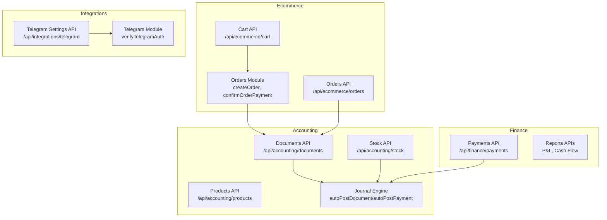

**Diagram sources**
- [app/api/accounting/documents/route.ts:1-136](file://app/api/accounting/documents/route.ts#L1-L136)
- [app/api/accounting/products/route.ts:1-226](file://app/api/accounting/products/route.ts#L1-L226)
- [app/api/accounting/stock/route.ts:1-192](file://app/api/accounting/stock/route.ts#L1-L192)
- [lib/modules/accounting/journal.ts:1-387](file://lib/modules/accounting/journal.ts#L1-L387)
- [app/api/finance/payments/route.ts:1-113](file://app/api/finance/payments/route.ts#L1-L113)
- [app/api/ecommerce/cart/route.ts:1-189](file://app/api/ecommerce/cart/route.ts#L1-L189)
- [lib/modules/ecommerce/orders.ts:1-176](file://lib/modules/ecommerce/orders.ts#L1-L176)
- [app/api/ecommerce/orders/route.ts:1-64](file://app/api/ecommerce/orders/route.ts#L1-L64)
- [app/api/integrations/telegram/route.ts:1-30](file://app/api/integrations/telegram/route.ts#L1-L30)
- [lib/modules/integrations/telegram.ts:1-108](file://lib/modules/integrations/telegram.ts#L1-L108)

## Detailed Component Analysis

### Product Catalog Management
- Features: Create/edit products, category tree, unit of measure, SEO fields, SKU generation, e-commerce publish flag, variant groups, and discounts.
- API: GET/POST endpoints with validation and enrichment (latest purchase/sale prices, discount metadata).
- UI: Edit dialog with units and categories populated from reference data.

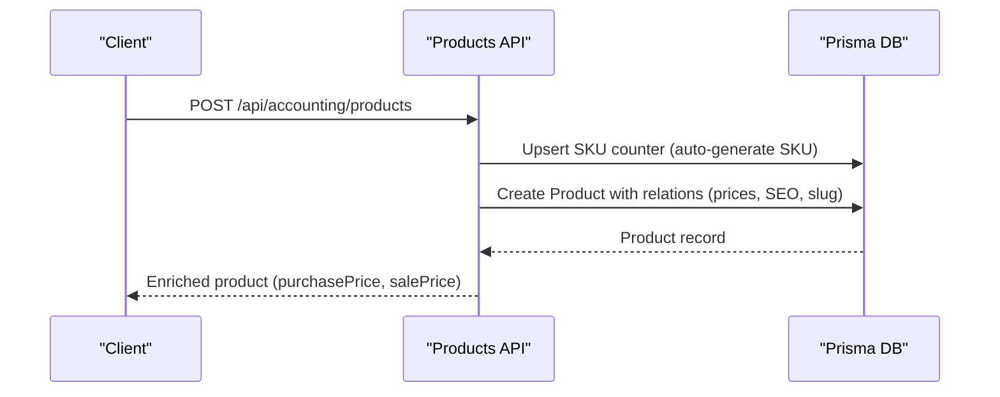

**Diagram sources**
- [app/api/accounting/products/route.ts:1-226](file://app/api/accounting/products/route.ts#L1-L226)

**Section sources**
- [app/api/accounting/products/route.ts:1-226](file://app/api/accounting/products/route.ts#L1-L226)
- [components/accounting/catalog/ProductEditDialog.tsx:1-47](file://components/accounting/catalog/ProductEditDialog.tsx#L1-L47)

### Warehouse Inventory Tracking
- Features: Real-time stock, reserve for draft outgoing documents, available quantity, moving average cost, cost/sale value computation.
- API: Enhanced stock endpoint aggregates reserve, latest purchase/sale prices, and computes totals.
- Business logic: Recalculation from confirmed documents, average cost updates on receipts/transfers, and total cost value recalculation.

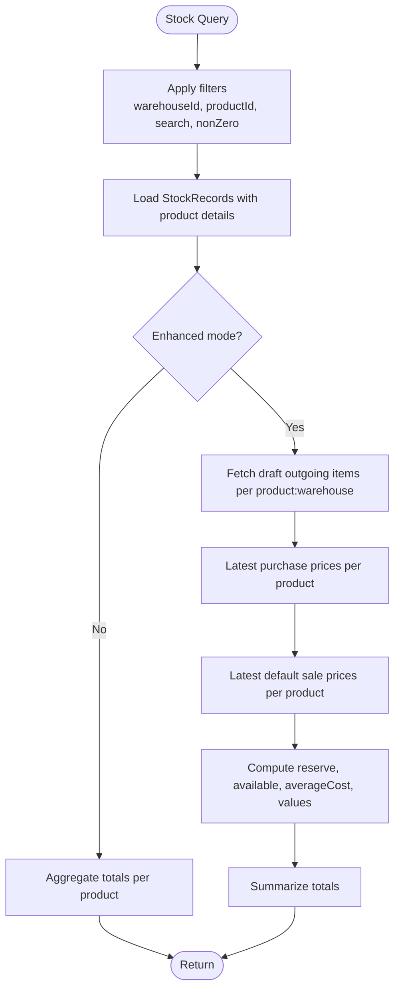

**Diagram sources**
- [app/api/accounting/stock/route.ts:1-192](file://app/api/accounting/stock/route.ts#L1-L192)
- [lib/modules/accounting/stock.ts:1-220](file://lib/modules/accounting/stock.ts#L1-L220)

**Section sources**
- [app/api/accounting/stock/route.ts:1-192](file://app/api/accounting/stock/route.ts#L1-L192)
- [lib/modules/accounting/stock.ts:1-220](file://lib/modules/accounting/stock.ts#L1-L220)

### Document Workflow Automation
- Types: Stock receipts, write-offs, transfers, inventory counts, purchase/sales orders, shipments, returns, payments.
- Features: Auto-numbering with localized prefixes, confirm/cancel actions, idempotent confirmations, and journal posting.
- Business logic: Document type classification, stock impact detection, and balance-affecting types.

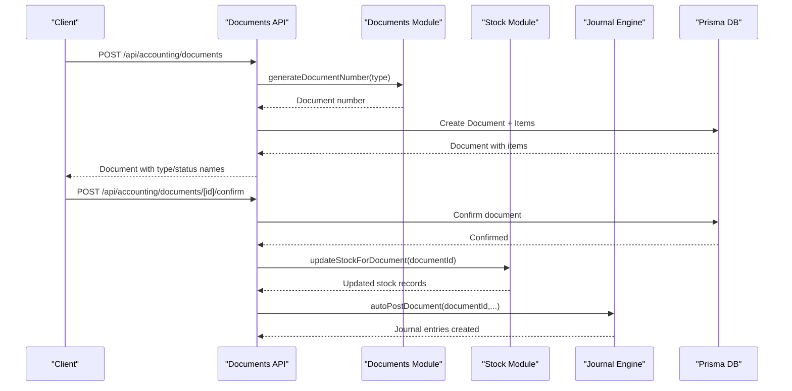

**Diagram sources**
- [app/api/accounting/documents/route.ts:1-136](file://app/api/accounting/documents/route.ts#L1-L136)
- [lib/modules/accounting/documents.ts:1-144](file://lib/modules/accounting/documents.ts#L1-L144)
- [lib/modules/accounting/stock.ts:1-220](file://lib/modules/accounting/stock.ts#L1-L220)
- [lib/modules/accounting/journal.ts:1-387](file://lib/modules/accounting/journal.ts#L1-L387)

**Section sources**
- [app/api/accounting/documents/route.ts:1-136](file://app/api/accounting/documents/route.ts#L1-L136)
- [lib/modules/accounting/documents.ts:1-144](file://lib/modules/accounting/documents.ts#L1-L144)
- [lib/modules/accounting/stock.ts:1-220](file://lib/modules/accounting/stock.ts#L1-L220)
- [lib/modules/accounting/journal.ts:1-387](file://lib/modules/accounting/journal.ts#L1-L387)

### Financial Management
- Payments: Income/expense categorization, cash/bank/card methods, auto-journal posting.
- Reports: P&L, Cash Flow, Balance Sheet; balances computed from confirmed documents.
- Counterparty balances: Aggregated from outgoing/incoming shipments, payments, returns.

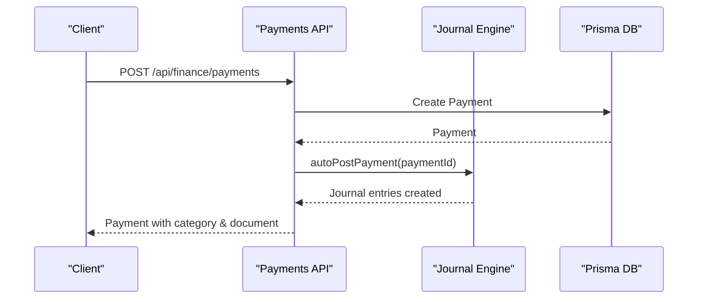

**Diagram sources**
- [app/api/finance/payments/route.ts:1-113](file://app/api/finance/payments/route.ts#L1-L113)
- [lib/modules/accounting/journal.ts:251-325](file://lib/modules/accounting/journal.ts#L251-L325)

**Section sources**
- [app/api/finance/payments/route.ts:1-113](file://app/api/finance/payments/route.ts#L1-L113)
- [lib/modules/finance/reports.ts:1-98](file://lib/modules/finance/reports.ts#L1-L98)
- [app/api/accounting/reports/profit-loss/route.ts:1-22](file://app/api/accounting/reports/profit-loss/route.ts#L1-L22)
- [app/api/accounting/reports/cash-flow/route.ts:1-22](file://app/api/accounting/reports/cash-flow/route.ts#L1-L22)

### E-commerce Functionality
- Shopping Cart: Add/update/remove items, snapshot pricing with discounts and variant adjustments.
- Orders: Create order from cart, confirm payment (link to ERP sales order), cancel logic.
- Customer Orders: Retrieve customer orders mapped to ERP sales orders.

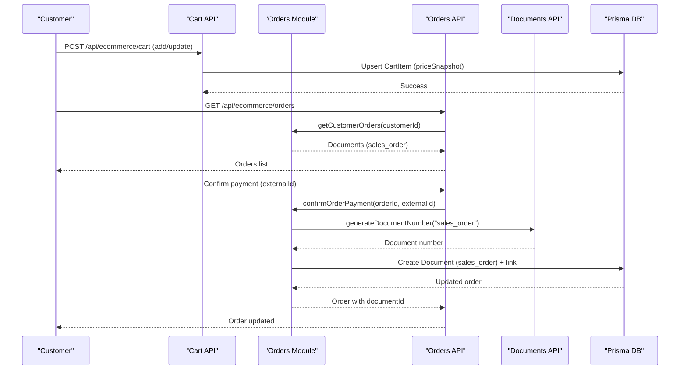

**Diagram sources**
- [app/api/ecommerce/cart/route.ts:1-189](file://app/api/ecommerce/cart/route.ts#L1-L189)
- [lib/modules/ecommerce/orders.ts:1-176](file://lib/modules/ecommerce/orders.ts#L1-L176)
- [app/api/ecommerce/orders/route.ts:1-64](file://app/api/ecommerce/orders/route.ts#L1-L64)
- [app/api/accounting/documents/route.ts:1-136](file://app/api/accounting/documents/route.ts#L1-L136)

**Section sources**
- [app/api/ecommerce/cart/route.ts:1-189](file://app/api/ecommerce/cart/route.ts#L1-L189)
- [lib/modules/ecommerce/orders.ts:1-176](file://lib/modules/ecommerce/orders.ts#L1-L176)
- [app/api/ecommerce/orders/route.ts:1-64](file://app/api/ecommerce/orders/route.ts#L1-L64)
- [components/ecommerce/CartItemCard.tsx:1-120](file://components/ecommerce/CartItemCard.tsx#L1-L120)

### Telegram Integration
- Public settings retrieval for Telegram bot configuration.
- Authentication verification using HMAC-SHA256 with bot token.

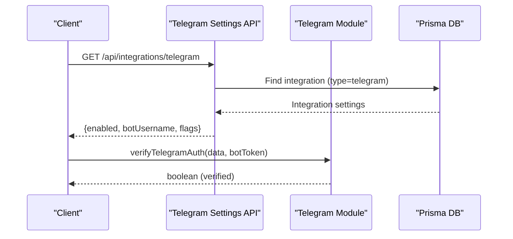

**Diagram sources**
- [app/api/integrations/telegram/route.ts:1-30](file://app/api/integrations/telegram/route.ts#L1-L30)
- [lib/modules/integrations/telegram.ts:1-108](file://lib/modules/integrations/telegram.ts#L1-L108)

**Section sources**
- [app/api/integrations/telegram/route.ts:1-30](file://app/api/integrations/telegram/route.ts#L1-L30)
- [lib/modules/integrations/telegram.ts:1-108](file://lib/modules/integrations/telegram.ts#L1-L108)

## Dependency Analysis
- Document types drive stock and financial impacts via helper functions and journal posting.
- Stock module depends on confirmed document items and transfer semantics.
- E-commerce orders depend on cart pricing and variant adjustments, then mirror as ERP documents.
- Payments integrate with journal entries and category default accounts.

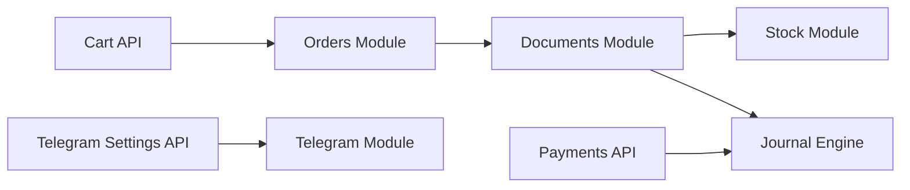

**Diagram sources**
- [lib/modules/accounting/documents.ts:1-144](file://lib/modules/accounting/documents.ts#L1-L144)
- [lib/modules/accounting/stock.ts:1-220](file://lib/modules/accounting/stock.ts#L1-L220)
- [lib/modules/accounting/journal.ts:1-387](file://lib/modules/accounting/journal.ts#L1-L387)
- [lib/modules/ecommerce/orders.ts:1-176](file://lib/modules/ecommerce/orders.ts#L1-L176)
- [app/api/ecommerce/cart/route.ts:1-189](file://app/api/ecommerce/cart/route.ts#L1-L189)
- [app/api/integrations/telegram/route.ts:1-30](file://app/api/integrations/telegram/route.ts#L1-L30)
- [lib/modules/integrations/telegram.ts:1-108](file://lib/modules/integrations/telegram.ts#L1-L108)

**Section sources**
- [lib/modules/accounting/documents.ts:1-144](file://lib/modules/accounting/documents.ts#L1-L144)
- [lib/modules/accounting/stock.ts:1-220](file://lib/modules/accounting/stock.ts#L1-L220)
- [lib/modules/accounting/journal.ts:1-387](file://lib/modules/accounting/journal.ts#L1-L387)
- [lib/modules/ecommerce/orders.ts:1-176](file://lib/modules/ecommerce/orders.ts#L1-L176)
- [app/api/ecommerce/cart/route.ts:1-189](file://app/api/ecommerce/cart/route.ts#L1-L189)
- [app/api/integrations/telegram/route.ts:1-30](file://app/api/integrations/telegram/route.ts#L1-L30)
- [lib/modules/integrations/telegram.ts:1-108](file://lib/modules/integrations/telegram.ts#L1-L108)

## Performance Considerations
- Batch queries and aggregations: Stock and product listings leverage aggregated counts and sums to minimize round-trips.
- Idempotent confirmations: Prevent duplicate postings and redundant stock recalculations.
- Moving average cost: Efficiently updates average cost on receipt and transfer without scanning full history.
- Pagination and filtering: API endpoints support pagination and indexed filters to scale with large datasets.

## Troubleshooting Guide
- Unauthorized access: Authentication and permission checks are enforced at API boundaries; errors return appropriate HTTP codes.
- Validation failures: Zod-based schemas validate request bodies; errors include structured details.
- Document confirmations: Idempotency ensures repeated confirm calls do not duplicate stock movements or journal entries.
- Journal balance: Unbalanced entries are rejected during journal creation to maintain double-entry integrity.

**Section sources**
- [app/api/accounting/products/route.ts:1-226](file://app/api/accounting/products/route.ts#L1-L226)
- [app/api/finance/payments/route.ts:1-113](file://app/api/finance/payments/route.ts#L1-L113)
- [lib/modules/accounting/journal.ts:98-104](file://lib/modules/accounting/journal.ts#L98-L104)

## Conclusion
ListOpt ERP delivers a robust, auditable platform for wholesale trade in the Russian market. Its integrated document workflow, real-time inventory tracking with moving average cost, comprehensive financial reporting, e-commerce capabilities, and Telegram integration streamline operations, improve accuracy, and enhance customer engagement. The modular architecture and idempotent operations ensure scalability and reliability for growing wholesale businesses.

## Appendices

### Business Value Propositions
- Operational Efficiency: Automated document confirmations, stock updates, and journal postings reduce manual work and errors.
- Visibility: Real-time stock, reserve, and valuation metrics support informed decision-making.
- Compliance: Immutable stock movements and double-entry journaling provide audit trails aligned with Russian accounting practices.
- Customer Experience: Seamless e-commerce checkout, order tracking, and customer account management.
- Market Responsiveness: Variant catalogs, discounts, and category management adapt quickly to seasonal and promotional demands.

### Workflow Automation Benefits
- Reduced lead times: Orders-to-delivery pipelines are streamlined with automatic ERP document creation upon payment confirmation.
- Accurate inventory: Moving average cost and reserve tracking prevent overpromising and stockouts.
- Financial clarity: Payments automatically posted to journals and reports enable timely cash flow insights.

### Operational Efficiency Improvements
- Centralized product data: Unified catalog with variants and categories reduces duplication and improves searchability.
- Scalable reporting: P&L, Cash Flow, and Balance Sheet reports generated from confirmed documents.
- Secure integrations: Telegram authentication and settings management support secure customer onboarding and communication.

### Use Case Scenarios and Business Process Mapping

#### Scenario 1: Purchase Order Fulfillment
- Steps: Create purchase order → Receive goods (incoming shipment) → Confirm document → Update stock and average cost → Post journal entries.
- Benefits: Accurate supplier tracking, cost reconciliation, and inventory valuation.

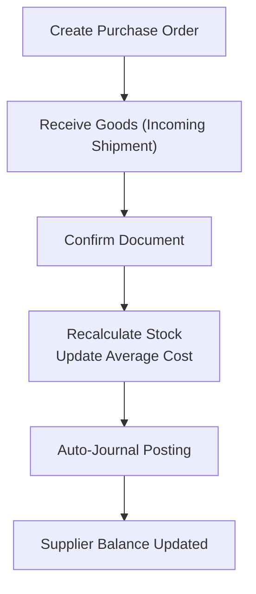

**Diagram sources**
- [lib/modules/accounting/documents.ts:1-144](file://lib/modules/accounting/documents.ts#L1-L144)
- [lib/modules/accounting/stock.ts:1-220](file://lib/modules/accounting/stock.ts#L1-L220)
- [lib/modules/accounting/journal.ts:125-187](file://lib/modules/accounting/journal.ts#L125-L187)
- [lib/modules/finance/reports.ts:43-89](file://lib/modules/finance/reports.ts#L43-L89)

#### Scenario 2: Sales Order Fulfillment
- Steps: Customer places order via e-commerce → Payment confirmed → Create ERP sales order → Reserve stock → Ship goods → Update stock and costs → Post journal entries.
- Benefits: Seamless order-to-delivery pipeline, accurate stock reservation, and financial closure.

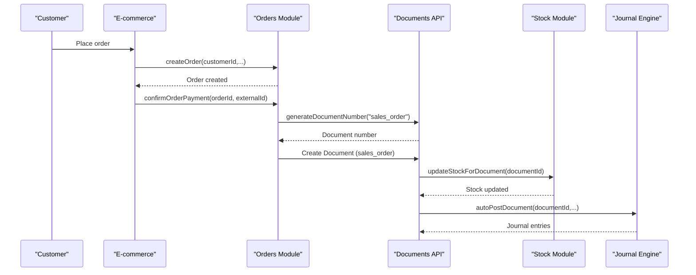

**Diagram sources**
- [lib/modules/ecommerce/orders.ts:1-176](file://lib/modules/ecommerce/orders.ts#L1-L176)
- [app/api/accounting/documents/route.ts:1-136](file://app/api/accounting/documents/route.ts#L1-L136)
- [lib/modules/accounting/stock.ts:80-96](file://lib/modules/accounting/stock.ts#L80-L96)
- [lib/modules/accounting/journal.ts:125-187](file://lib/modules/accounting/journal.ts#L125-L187)

#### Scenario 3: Inventory Adjustment
- Steps: Create inventory count document → System creates linked write-off or stock-receipt documents → Confirm documents → Update stock and journal entries.
- Benefits: Accurate inventory reconciliation without direct stock manipulation.

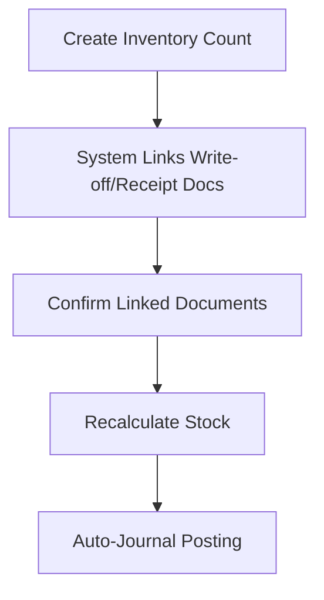

**Diagram sources**
- [lib/modules/accounting/documents.ts:102-104](file://lib/modules/accounting/documents.ts#L102-L104)
- [lib/modules/accounting/stock.ts:11-77](file://lib/modules/accounting/stock.ts#L11-L77)
- [lib/modules/accounting/journal.ts:125-187](file://lib/modules/accounting/journal.ts#L125-L187)

#### Scenario 4: Daily Payments and Reporting
- Steps: Record income/expense payments → Auto-post to journal → Generate P&L and Cash Flow reports → Monitor balances.
- Benefits: Real-time financial visibility and compliance-ready records.

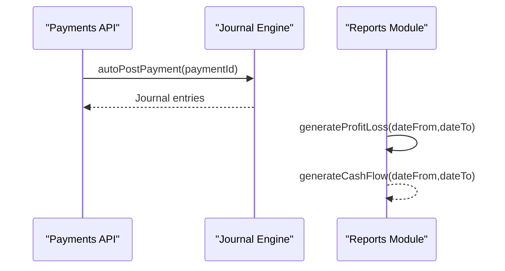

**Diagram sources**
- [app/api/finance/payments/route.ts:1-113](file://app/api/finance/payments/route.ts#L1-L113)
- [lib/modules/accounting/journal.ts:251-325](file://lib/modules/accounting/journal.ts#L251-L325)
- [lib/modules/finance/reports.ts:7-19](file://lib/modules/finance/reports.ts#L7-L19)