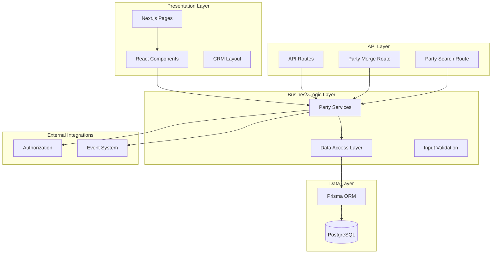
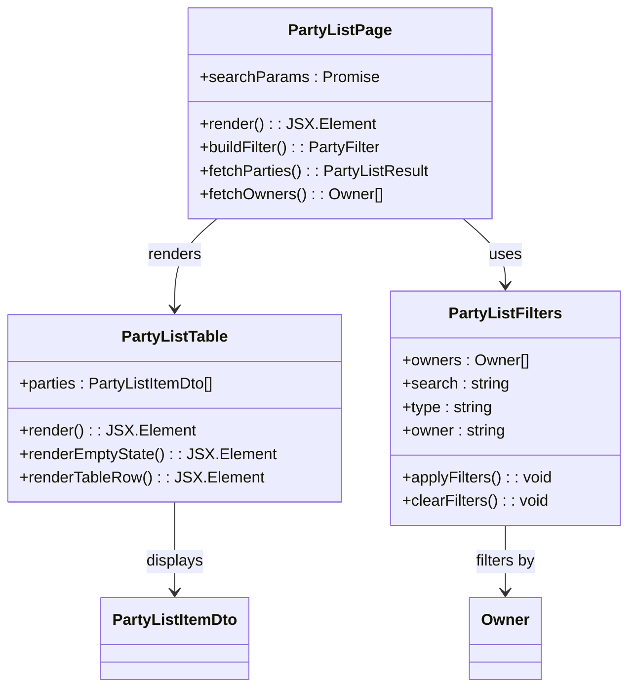
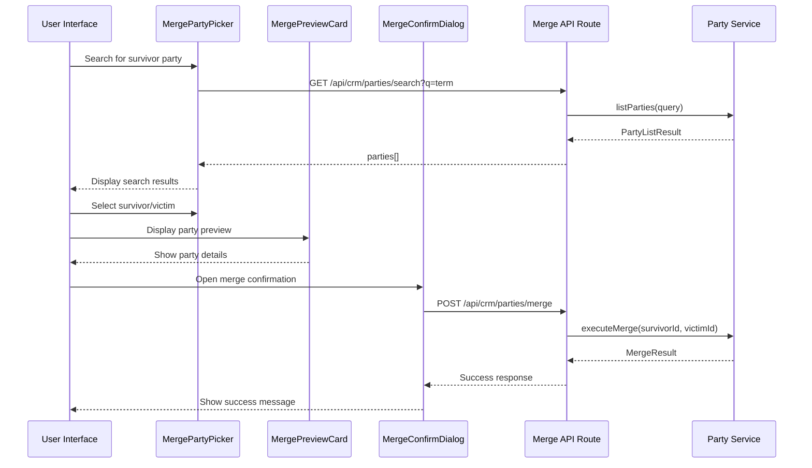
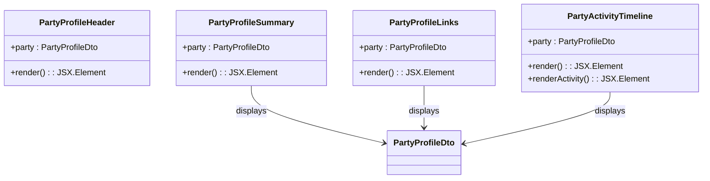
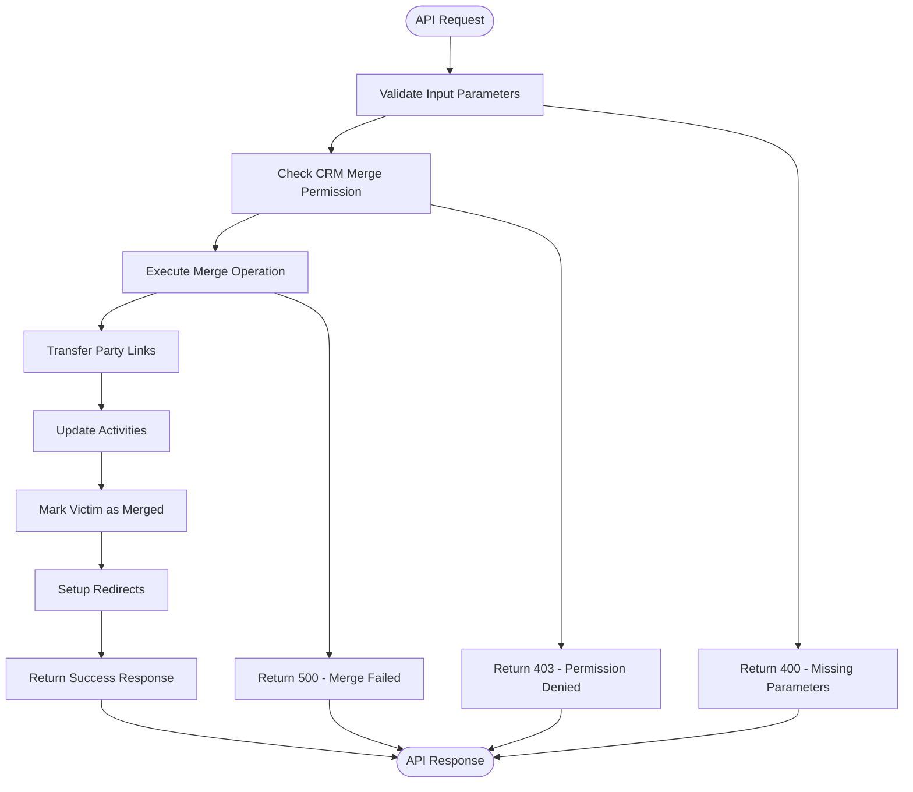
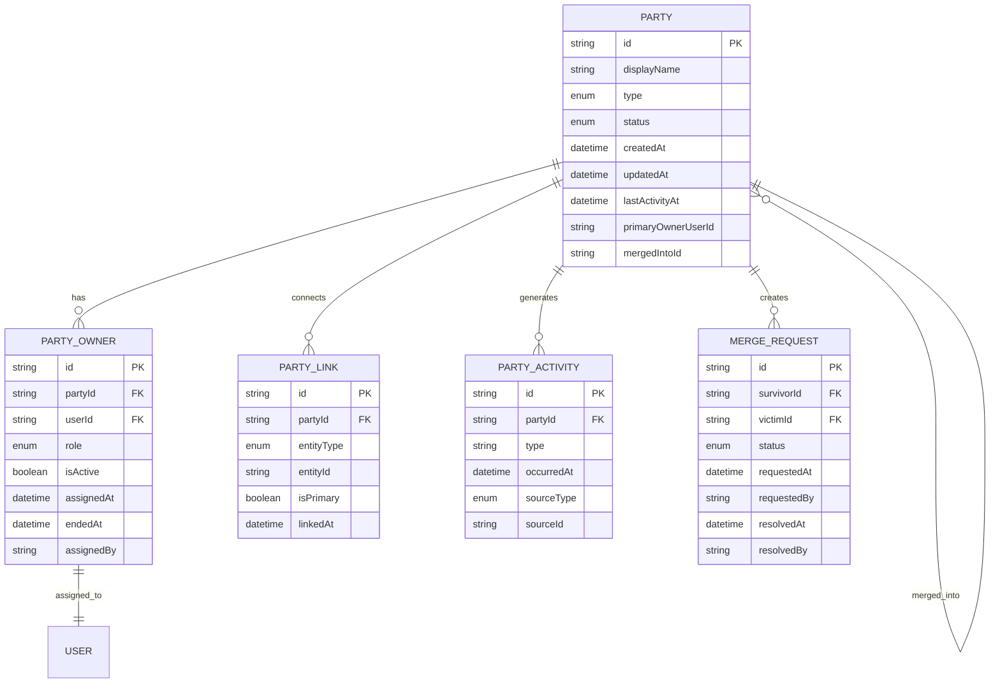

# CRM Module

<cite>
**Referenced Files in This Document**
- [layout.tsx](file://app/(crm)/layout.tsx)
- [page.tsx](file://app/(crm)/crm/parties/page.tsx)
- [page.tsx](file://app/(crm)/crm/admin/merge/page.tsx)
- [index.ts](file://components/crm/index.ts)
- [index.ts](file://components/crm/parties/index.ts)
- [party-list-table.tsx](file://components/crm/parties/party-list-table.tsx)
- [party-list-filters.tsx](file://components/crm/parties/party-list-filters.tsx)
- [index.ts](file://components/crm/merge/index.ts)
- [merge-party-picker.tsx](file://components/crm/merge/merge-party-picker.tsx)
- [merge-preview-card.tsx](file://components/crm/merge/merge-preview-card.tsx)
- [merge-confirm-dialog.tsx](file://components/crm/merge/merge-confirm-dialog.tsx)
- [index.ts](file://components/crm/party-profile/index.ts)
- [party-profile-header.tsx](file://components/crm/party-profile/party-profile-header.tsx)
- [party-profile-summary.tsx](file://components/crm/party-profile/party-profile-summary.tsx)
- [party-profile-links.tsx](file://components/crm/party-profile/party-profile-links.tsx)
- [party-activity-timeline.tsx](file://components/crm/party-profile/party-activity-timeline.tsx)
- [route.ts](file://app/api/crm/parties/merge/route.ts)
- [route.ts](file://app/api/crm/parties/search/route.ts)
- [index.ts](file://lib/party/dto/index.ts)
- [index.ts](file://lib/party/queries/index.ts)
- [party-owner.ts](file://lib/party/services/party-owner.ts)
- [schema.prisma](file://prisma/schema.prisma)
</cite>

## Table of Contents
1. [Introduction](#introduction)
2. [Project Structure](#project-structure)
3. [Core Components](#core-components)
4. [Architecture Overview](#architecture-overview)
5. [Detailed Component Analysis](#detailed-component-analysis)
6. [API Endpoints](#api-endpoints)
7. [Data Model](#data-model)
8. [Security and Permissions](#security-and-permissions)
9. [Performance Considerations](#performance-considerations)
10. [Troubleshooting Guide](#troubleshooting-guide)
11. [Conclusion](#conclusion)

## Introduction

The CRM Module is a comprehensive customer relationship management system built as part of the ERP platform. At its core, the module centers around the concept of "Parties" - entities that represent customers, prospects, and business partners within the system. The CRM module serves as a unified interface over existing business domains (accounting, finance, ecommerce), providing essential customer management capabilities including party discovery, merging, and detailed profiling.

The module follows modern React patterns with Next.js App Router architecture, implementing server-side rendering for optimal performance and SEO. It leverages TypeScript for type safety and Prisma ORM for database operations, ensuring robust data management and maintainable code structure.

## Project Structure

The CRM module is organized using Next.js App Router conventions with clear separation between UI components, API routes, and business logic:

```mermaid
graph TB
subgraph "App Router Structure"
CRM[app/(crm)/]
LAYOUT[layout.tsx]
subgraph "Pages"
PARTIES[crm/parties/page.tsx]
MERGE[crm/admin/merge/page.tsx]
end
subgraph "API Routes"
API[app/api/crm/]
MERGE_API[parties/merge/route.ts]
SEARCH_API[parties/search/route.ts]
end
end
subgraph "Components"
COMPONENTS[components/crm/]
subgraph "Parties"
P_LIST[parties/]
P_TABLE[party-list-table.tsx]
P_FILTERS[party-list-filters.tsx]
end
subgraph "Merge"
MERGE_COMP[merge/]
PICKER[merge-party-picker.tsx]
PREVIEW[merge-preview-card.tsx]
CONFIRM[merge-confirm-dialog.tsx]
end
subgraph "Profile"
PROFILE[party-profile/]
HEADER[party-profile-header.tsx]
SUMMARY[party-profile-summary.tsx]
LINKS[party-profile-links.tsx]
TIMELINE[party-activity-timeline.tsx]
end
end
subgraph "Libraries"
LIB[lib/]
DTO[dto/]
QUERIES[queries/]
SERVICES[services/]
end
CRM --> LAYOUT
CRM --> PARTIES
CRM --> MERGE
CRM --> API
API --> MERGE_API
API --> SEARCH_API
COMPONENTS --> P_LIST
COMPONENTS --> MERGE_COMP
COMPONENTS --> PROFILE
COMPONENTS --> DTO
COMPONENTS --> QUERIES
COMPONENTS --> SERVICES
```

**Diagram sources**
- [layout.tsx](file://app/(crm)/layout.tsx#L1-L13)
- [page.tsx](file://app/(crm)/crm/parties/page.tsx#L1-L87)
- [page.tsx](file://app/(crm)/crm/admin/merge/page.tsx#L1-L168)

**Section sources**
- [layout.tsx](file://app/(crm)/layout.tsx#L1-L13)
- [index.ts:1-10](file://components/crm/index.ts#L1-L10)

## Core Components

The CRM module consists of three primary functional areas, each serving distinct customer management needs:

### Party Management System
The Party Management System forms the backbone of the CRM module, providing comprehensive party discovery, filtering, and navigation capabilities. It enables users to search, filter, and manage customer relationships through an intuitive interface.

### Party Merge Operations
The Party Merge system allows administrators to consolidate duplicate customer records, ensuring data integrity and preventing fragmentation of customer information across the platform.

### Party Profile Dashboard
The Party Profile system delivers detailed insights into individual customer relationships, combining historical data, activity timelines, and linked entity information for comprehensive customer understanding.

**Section sources**
- [index.ts:1-10](file://components/crm/index.ts#L1-L10)
- [index.ts:1-7](file://components/crm/parties/index.ts#L1-L7)
- [index.ts:1-8](file://components/crm/merge/index.ts#L1-L8)
- [index.ts:1-9](file://components/crm/party-profile/index.ts#L1-L9)

## Architecture Overview

The CRM module implements a layered architecture pattern with clear separation of concerns:



**Diagram sources**
- [page.tsx](file://app/(crm)/crm/parties/page.tsx#L8-L12)
- [page.tsx](file://app/(crm)/crm/admin/merge/page.tsx#L9-L15)
- [route.ts:7-9](file://app/api/crm/parties/merge/route.ts#L7-L9)

The architecture emphasizes:
- **Separation of Concerns**: Clear boundaries between presentation, business logic, and data layers
- **Type Safety**: Comprehensive TypeScript implementation ensuring runtime reliability
- **Asynchronous Operations**: Proper handling of server-side rendering and client-side interactions
- **Modular Design**: Reusable components following React best practices

## Detailed Component Analysis

### Party List Management

The Party List component provides comprehensive party discovery and management capabilities through an integrated table and filtering system.



**Diagram sources**
- [page.tsx](file://app/(crm)/crm/parties/page.tsx#L15-L36)
- [party-list-table.tsx:13-15](file://components/crm/parties/party-list-table.tsx#L13-L15)
- [party-list-filters.tsx:15-17](file://components/crm/parties/party-list-filters.tsx#L15-L17)

The Party List system implements sophisticated filtering mechanisms with real-time search capabilities and pagination support. Users can filter parties by type (person/organization), owner assignment, and search terms, with results updating dynamically as filters change.

**Section sources**
- [page.tsx](file://app/(crm)/crm/parties/page.tsx#L1-L87)
- [party-list-table.tsx:1-83](file://components/crm/parties/party-list-table.tsx#L1-L83)
- [party-list-filters.tsx:1-92](file://components/crm/parties/party-list-filters.tsx#L1-L92)

### Party Merge System

The Party Merge system provides a sophisticated interface for consolidating duplicate customer records while maintaining data integrity and audit trails.



**Diagram sources**
- [merge-party-picker.tsx:32-54](file://components/crm/merge/merge-party-picker.tsx#L32-L54)
- [merge-confirm-dialog.tsx:39-50](file://components/crm/merge/merge-confirm-dialog.tsx#L39-L50)
- [route.ts:11-32](file://app/api/crm/parties/merge/route.ts#L11-L32)

The merge system implements several critical safeguards:
- **Duplicate Prevention**: Prevents merging a party with itself
- **Data Integrity**: Transfers all links, activities, and associated data
- **Audit Trail**: Maintains historical records of merge operations
- **User Confirmation**: Requires explicit confirmation before executing merges

**Section sources**
- [page.tsx](file://app/(crm)/crm/admin/merge/page.tsx#L1-L168)
- [merge-party-picker.tsx:1-136](file://components/crm/merge/merge-party-picker.tsx#L1-L136)
- [merge-preview-card.tsx:1-66](file://components/crm/merge/merge-preview-card.tsx#L1-L66)
- [merge-confirm-dialog.tsx:1-112](file://components/crm/merge/merge-confirm-dialog.tsx#L1-L112)

### Party Profile Dashboard

The Party Profile system delivers comprehensive customer insights through an integrated dashboard displaying key metrics, activity timelines, and linked entity information.



**Diagram sources**
- [party-profile-header.tsx:12-14](file://components/crm/party-profile/party-profile-header.tsx#L12-L14)
- [party-profile-summary.tsx:12-14](file://components/crm/party-profile/party-profile-summary.tsx#L12-L14)
- [party-profile-links.tsx:14-16](file://components/crm/party-profile/party-profile-links.tsx#L14-L16)
- [party-activity-timeline.tsx:12-14](file://components/crm/party-profile/party-activity-timeline.tsx#L12-L14)

The profile dashboard presents information in a structured, hierarchical manner:
- **Header Section**: Displays party name and type badges
- **Summary Section**: Shows ownership, activity dates, creation date, and ID
- **Linked Entities**: Lists all connected business entities with navigation links
- **Activity Timeline**: Chronological display of customer interactions and transactions

**Section sources**
- [party-profile-header.tsx:1-26](file://components/crm/party-profile/party-profile-header.tsx#L1-L26)
- [party-profile-summary.tsx:1-60](file://components/crm/party-profile/party-profile-summary.tsx#L1-L60)
- [party-profile-links.tsx:1-67](file://components/crm/party-profile/party-profile-links.tsx#L1-L67)
- [party-activity-timeline.tsx:1-102](file://components/crm/party-profile/party-activity-timeline.tsx#L1-L102)

## API Endpoints

The CRM module exposes two primary API endpoints for party management operations:

### Party Search Endpoint
The search endpoint provides real-time party discovery for merge operations with intelligent filtering and result limiting.

**Endpoint**: `GET /api/crm/parties/search`
**Parameters**: `q` (search query string)
**Response**: `{ parties: PartyListItemDto[] }`

### Party Merge Endpoint
The merge endpoint executes party consolidation operations with comprehensive validation and error handling.

**Endpoint**: `POST /api/crm/parties/merge`
**Request Body**: `{ survivorId: string, victimId: string }`
**Response**: `{ success: boolean, survivorId: string, victimId: string }`



**Diagram sources**
- [route.ts:11-32](file://app/api/crm/parties/merge/route.ts#L11-L32)
- [route.ts:10-24](file://app/api/crm/parties/search/route.ts#L10-L24)

**Section sources**
- [route.ts:1-63](file://app/api/crm/parties/merge/route.ts#L1-L63)
- [route.ts:1-26](file://app/api/crm/parties/search/route.ts#L1-L26)

## Data Model

The CRM module utilizes a comprehensive data model centered around the Party entity and its relationships with other business entities.



**Diagram sources**
- [schema.prisma:1238-1279](file://prisma/schema.prisma#L1238-L1279)

The data model supports advanced CRM functionality including:
- **Hierarchical Ownership**: Primary and backup ownership assignments
- **Multi-entity Linking**: Connections to customers, counterparties, and other entities
- **Activity Tracking**: Comprehensive audit trail of customer interactions
- **Merge History**: Complete history of party consolidation operations
- **Status Management**: Active, inactive, and merged party states

**Section sources**
- [schema.prisma:1238-1279](file://prisma/schema.prisma#L1238-L1279)
- [party-owner.ts:67-111](file://lib/party/services/party-owner.ts#L67-L111)

## Security and Permissions

The CRM module implements robust security measures to protect sensitive customer data and prevent unauthorized operations:

### Permission-Based Access Control
All merge operations require explicit permission verification through the authorization system. The `requirePermission("crm:merge")` function ensures only authorized users can perform party consolidation operations.

### Input Validation and Sanitization
Both API endpoints implement comprehensive input validation:
- Parameter validation for required fields
- Type checking for ID parameters
- Duplicate prevention checks
- Status validation for existing parties

### Audit Logging
All merge operations are logged with detailed information including:
- Timestamps of merge operations
- User who performed the merge
- Parties involved in the operation
- System-generated merge identifiers

**Section sources**
- [route.ts:13-13](file://app/api/crm/parties/merge/route.ts#L13-L13)
- [route.ts:18-30](file://app/api/crm/parties/merge/route.ts#L18-L30)

## Performance Considerations

The CRM module implements several performance optimization strategies:

### Server-Side Rendering
Party lists utilize server-side rendering for improved initial load performance and SEO benefits. The `listParties` function handles pagination and filtering on the server side, reducing client-side processing overhead.

### Client-Side Caching
The merge picker component implements intelligent caching with debounced search requests, preventing excessive API calls during rapid typing.

### Lazy Loading
Party profile components use React.lazy loading for non-critical sections, deferring heavy computations until needed.

### Database Indexing
The Prisma schema includes strategic indexing on frequently queried fields:
- Party type and status for filtering
- Last activity timestamps for sorting
- Owner assignments for ownership queries

## Troubleshooting Guide

### Common Issues and Solutions

**Party Search Not Working**
- Verify minimum 2-character search requirement
- Check network connectivity to API endpoints
- Ensure proper query parameter encoding

**Merge Operation Fails**
- Confirm both parties exist and are active
- Verify user has required permissions
- Check for duplicate merge attempts
- Review server logs for detailed error messages

**Performance Issues**
- Monitor API response times
- Check database query performance
- Verify proper pagination implementation
- Review component re-rendering patterns

**Data Integrity Concerns**
- Verify merge operations complete successfully
- Check audit trail for merge history
- Validate party link transfers
- Confirm activity timeline updates

**Section sources**
- [merge-party-picker.tsx:38-54](file://components/crm/merge/merge-party-picker.tsx#L38-L54)
- [route.ts:39-61](file://app/api/crm/parties/merge/route.ts#L39-L61)

## Conclusion

The CRM Module represents a comprehensive customer relationship management solution built with modern React and Next.js technologies. Its modular architecture, robust data model, and extensive feature set provide a solid foundation for managing customer relationships within the broader ERP ecosystem.

Key strengths of the implementation include:
- **Type Safety**: Comprehensive TypeScript implementation ensuring runtime reliability
- **Modular Design**: Clear separation of concerns enabling maintainable code
- **Performance Optimization**: Server-side rendering and efficient client-side interactions
- **Security**: Robust permission systems and input validation
- **Extensibility**: Well-defined APIs and component interfaces supporting future enhancements

The module successfully addresses core CRM requirements while maintaining integration with existing business domains, providing a unified interface for customer management across the organization.