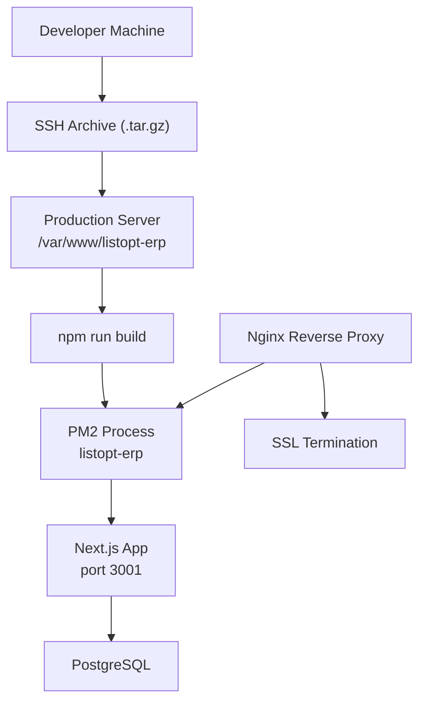
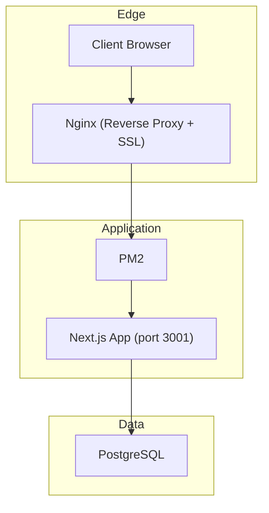
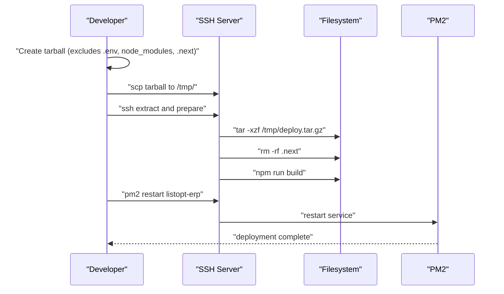
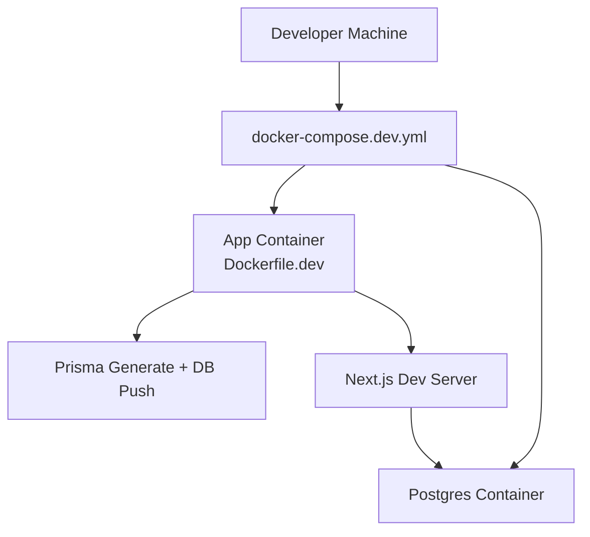
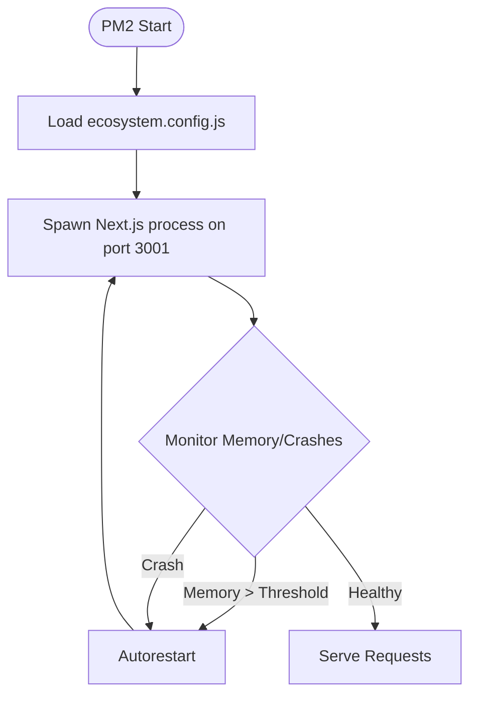
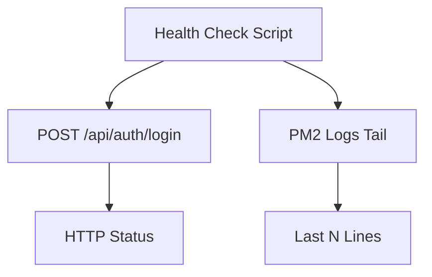
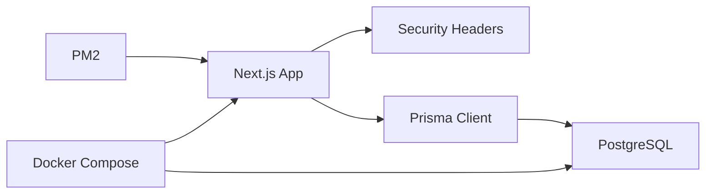

# Deployment & Operations

<cite>
**Referenced Files in This Document**
- [package.json](file://package.json)
- [ecosystem.config.js](file://ecosystem.config.js)
- [Dockerfile.dev](file://Dockerfile.dev)
- [docker-compose.dev.yml](file://docker-compose.dev.yml)
- [next.config.ts](file://next.config.ts)
- [check_db.sh](file://check_db.sh)
- [deploy-quick.ps1](file://deploy-quick.ps1)
- [ARCHITECTURE.md](file://ARCHITECTURE.md)
- [nx.json](file://nx.json)
- [prisma/config.ts](file://prisma.config.ts)
- [prisma/schema.prisma](file://prisma/schema.prisma)
- [lib/shared/db.ts](file://lib/shared/db.ts)
- [lib/shared/auth.ts](file://lib/shared/auth.ts)
- [lib/shared/logger.ts](file://lib/shared/logger.ts)
- [app/api/auth/csrf/route.ts](file://app/api/auth/csrf/route.ts)
- [tests/e2e/fixtures/auth.fixture.ts](file://tests/e2e/fixtures/auth.fixture.ts)
</cite>

## Table of Contents
1. [Introduction](#introduction)
2. [Project Structure](#project-structure)
3. [Core Components](#core-components)
4. [Architecture Overview](#architecture-overview)
5. [Detailed Component Analysis](#detailed-component-analysis)
6. [Dependency Analysis](#dependency-analysis)
7. [Performance Considerations](#performance-considerations)
8. [Troubleshooting Guide](#troubleshooting-guide)
9. [Conclusion](#conclusion)
10. [Appendices](#appendices)

## Introduction
This document provides comprehensive deployment and operations guidance for ListOpt ERP. It covers:
- Production deployment via SSH archive method
- Docker development environment with Docker Compose
- Nginx reverse proxy and SSL termination configuration
- PM2 ecosystem configuration for process management
- Environment variable management
- Database backup strategies
- Monitoring and logging
- Operational procedures for updates, scaling, and maintenance
- Security considerations and troubleshooting

## Project Structure
ListOpt ERP is a Next.js application with a monorepo-like Nx setup, PostgreSQL via Prisma, and a PM2-managed runtime. Key operational files include deployment scripts, Docker configuration, PM2 ecosystem config, and Next.js configuration for security headers.

**Diagram sources**
- [deploy-quick.ps1:1-20](file://deploy-quick.ps1#L1-L20)
- [ecosystem.config.js:1-22](file://ecosystem.config.js#L1-L22)
- [next.config.ts:1-29](file://next.config.ts#L1-L29)
- [prisma/config.ts:1-16](file://prisma.config.ts#L1-L16)

**Section sources**
- [ARCHITECTURE.md:280-293](file://ARCHITECTURE.md#L280-L293)
- [nx.json:1-34](file://nx.json#L1-L34)

## Core Components
- Application runtime: Next.js started by PM2
- Process manager: PM2 ecosystem configuration
- Database: PostgreSQL via Prisma client
- Development environment: Docker Compose with Postgres
- Security: Next.js headers, CSRF endpoints, session secret enforcement
- Logging: Structured logger writing to stdout/stderr for PM2 capture

**Section sources**
- [ecosystem.config.js:1-22](file://ecosystem.config.js#L1-L22)
- [prisma/config.ts:1-16](file://prisma.config.ts#L1-L16)
- [lib/shared/db.ts:1-24](file://lib/shared/db.ts#L1-L24)
- [next.config.ts:14-26](file://next.config.ts#L14-L26)
- [lib/shared/logger.ts:1-35](file://lib/shared/logger.ts#L1-L35)

## Architecture Overview
The production runtime runs Next.js behind PM2, listening on port 3001. Nginx terminates SSL and proxies to PM2. The application connects to PostgreSQL using Prisma with a connection string from environment variables.

**Diagram sources**
- [ecosystem.config.js:4-6](file://ecosystem.config.js#L4-L6)
- [next.config.ts:14-26](file://next.config.ts#L14-L26)
- [prisma/config.ts:11-14](file://prisma.config.ts#L11-L14)

## Detailed Component Analysis

### Production Deployment (SSH Archive Method)
- Create a tarball excluding sensitive and build artifacts
- Transfer to remote server and extract under /var/www/listopt-erp
- Remove .next cache to avoid stale artifacts
- Build the application
- Restart PM2 service

**Diagram sources**
- [ARCHITECTURE.md:282-293](file://ARCHITECTURE.md#L282-L293)
- [deploy-quick.ps1:4-17](file://deploy-quick.ps1#L4-L17)

**Section sources**
- [ARCHITECTURE.md:282-293](file://ARCHITECTURE.md#L282-L293)
- [deploy-quick.ps1:1-20](file://deploy-quick.ps1#L1-L20)

### Docker Development Environment (Docker Compose)
- Dev container builds the app with Prisma generation and DB push
- Postgres service provides the database
- Hot reload enabled via environment variables
- Volumes mounted for code and caching behavior

**Diagram sources**
- [docker-compose.dev.yml:1-39](file://docker-compose.dev.yml#L1-L39)
- [Dockerfile.dev:1-27](file://Dockerfile.dev#L1-L27)

**Section sources**
- [docker-compose.dev.yml:1-39](file://docker-compose.dev.yml#L1-L39)
- [Dockerfile.dev:1-27](file://Dockerfile.dev#L1-L27)

### Nginx Reverse Proxy and SSL Termination
- Configure Nginx to proxy to PM2’s Next.js process on port 3001
- Terminate TLS at Nginx and forward to the internal port
- Ensure upstream health checks and timeouts are tuned for the app

[No sources needed since this section provides general guidance]

### PM2 Ecosystem Configuration
- Single-instance process managed by PM2
- Autorestart enabled, memory threshold configured
- Environment variables include NODE_ENV and PORT
- Script path points to Next.js binary

**Diagram sources**
- [ecosystem.config.js:1-22](file://ecosystem.config.js#L1-L22)

**Section sources**
- [ecosystem.config.js:1-22](file://ecosystem.config.js#L1-L22)

### Environment Variable Management
- Required variables:
  - DATABASE_URL: PostgreSQL connection string
  - SESSION_SECRET: Secret for signing session tokens
  - SECURE_COOKIES: Enable secure cookies for HTTPS
  - NODE_ENV: production
  - PORT: 3001 (as per PM2 config)
- Development defaults are provided in Docker Compose for local testing

**Section sources**
- [ARCHITECTURE.md:295-308](file://ARCHITECTURE.md#L295-L308)
- [docker-compose.dev.yml:17-21](file://docker-compose.dev.yml#L17-L21)
- [lib/shared/auth.ts:5-11](file://lib/shared/auth.ts#L5-L11)
- [app/api/auth/csrf/route.ts:32-38](file://app/api/auth/csrf/route.ts#L32-L38)

### Database Backup Strategies
- PostgreSQL logical backups using pg_dump for point-in-time recovery
- Consider WAL archiving for incremental backups
- Automate backups with cron jobs and retention policies
- Test restoration procedures regularly

[No sources needed since this section provides general guidance]

### Monitoring Setup
- PM2 logs capture stdout/stderr; ensure log rotation and aggregation
- Application-level logging via structured logger for observability
- Health checks: curl endpoint to verify login and PM2 logs

**Diagram sources**
- [check_db.sh:1-11](file://check_db.sh#L1-L11)

**Section sources**
- [check_db.sh:1-11](file://check_db.sh#L1-L11)
- [lib/shared/logger.ts:1-35](file://lib/shared/logger.ts#L1-L35)

### Operational Procedures

#### Updates
- Build locally, create tarball, upload, extract, rebuild, restart PM2
- Clear .next cache before build to avoid stale artifacts

**Section sources**
- [deploy-quick.ps1:7-14](file://deploy-quick.ps1#L7-L14)
- [ARCHITECTURE.md:282-293](file://ARCHITECTURE.md#L282-L293)

#### Scaling Considerations
- PM2 currently runs a single instance; scale horizontally by adding instances and enabling load balancing at Nginx
- Ensure sticky sessions if required by session storage or stateless design

[No sources needed since this section provides general guidance]

#### Maintenance Tasks
- Regular pruning of node_modules and .next caches during deployments
- Database migrations via Prisma CLI
- Rotate secrets and update environment variables securely

**Section sources**
- [nx.json:12-26](file://nx.json#L12-L26)
- [prisma/config.ts:7-10](file://prisma.config.ts#L7-L10)

### Security Considerations
- Enforce SECURE_COOKIES=true in production for HTTPS
- SESSION_SECRET must be strong and rotated periodically
- Next.js security headers configured (X-Content-Type-Options, X-Frame-Options, etc.)
- CSRF protection via signed tokens and HttpOnly cookies

**Section sources**
- [next.config.ts:14-26](file://next.config.ts#L14-L26)
- [app/api/auth/csrf/route.ts:32-38](file://app/api/auth/csrf/route.ts#L32-L38)
- [lib/shared/auth.ts:5-11](file://lib/shared/auth.ts#L5-L11)
- [tests/e2e/fixtures/auth.fixture.ts:5](file://tests/e2e/fixtures/auth.fixture.ts#L5)

### Log Management
- Application logs are emitted to stdout/stderr and captured by PM2
- Use PM2 log rotation and aggregation tools
- Filter logs by context and level using structured logging

**Section sources**
- [lib/shared/logger.ts:1-35](file://lib/shared/logger.ts#L1-L35)

## Dependency Analysis
The application depends on:
- Next.js runtime and security headers
- PM2 for process management
- PostgreSQL via Prisma client
- Docker Compose for local development

**Diagram sources**
- [next.config.ts:14-26](file://next.config.ts#L14-L26)
- [prisma/config.ts:11-14](file://prisma.config.ts#L11-L14)
- [lib/shared/db.ts:5-14](file://lib/shared/db.ts#L5-L14)
- [docker-compose.dev.yml:26-35](file://docker-compose.dev.yml#L26-L35)

**Section sources**
- [package.json:34-83](file://package.json#L34-L83)
- [nx.json:12-26](file://nx.json#L12-L26)

## Performance Considerations
- Keep PM2 memory thresholds aligned with workload
- Use Nginx gzip/static compression for assets
- Tune database connection pooling and Prisma client settings
- Monitor Next.js build and static generation impact

[No sources needed since this section provides general guidance]

## Troubleshooting Guide

### Common Deployment Issues
- Permission denied on server: verify SSH keys and sudo-less deployment steps
- Port conflicts: ensure port 3001 is free and Nginx is proxying correctly
- Missing environment variables: confirm DATABASE_URL and SESSION_SECRET are present

**Section sources**
- [ecosystem.config.js:12-18](file://ecosystem.config.js#L12-L18)
- [ARCHITECTURE.md:295-308](file://ARCHITECTURE.md#L295-L308)

### Health Checks
- Use the provided script to test login and inspect PM2 logs

**Section sources**
- [check_db.sh:1-11](file://check_db.sh#L1-L11)

### Authentication and CSRF
- Ensure SESSION_SECRET is set and SECURE_COOKIES matches deployment (HTTPS)
- Verify CSRF cookie is HttpOnly and SameSite strict

**Section sources**
- [lib/shared/auth.ts:5-11](file://lib/shared/auth.ts#L5-L11)
- [app/api/auth/csrf/route.ts:32-38](file://app/api/auth/csrf/route.ts#L32-L38)
- [tests/e2e/fixtures/auth.fixture.ts:5](file://tests/e2e/fixtures/auth.fixture.ts#L5)

### Database Connectivity
- Confirm DATABASE_URL format and connectivity
- Use Prisma CLI to validate schema and migrations

**Section sources**
- [prisma/config.ts:11-14](file://prisma.config.ts#L11-L14)
- [prisma/schema.prisma:1-10](file://prisma/schema.prisma#L1-L10)

## Conclusion
ListOpt ERP’s deployment relies on a straightforward SSH archive method, a robust PM2-managed Next.js runtime, and a clear separation between development and production environments. By adhering to the outlined procedures for environment variables, security, monitoring, and maintenance, teams can operate the system reliably at scale.

## Appendices

### Appendix A: Environment Variables Reference
- DATABASE_URL: PostgreSQL connection string
- SESSION_SECRET: Secret for session signing
- SECURE_COOKIES: Enable secure cookies for HTTPS
- NODE_ENV: production
- PORT: 3001

**Section sources**
- [ARCHITECTURE.md:295-308](file://ARCHITECTURE.md#L295-L308)
- [docker-compose.dev.yml:17-21](file://docker-compose.dev.yml#L17-L21)

### Appendix B: Database Schema Highlights
- Prisma client generator and datasource configured
- Extensive domain models for ERP and e-commerce

**Section sources**
- [prisma/config.ts:1-16](file://prisma.config.ts#L1-L16)
- [prisma/schema.prisma:1-10](file://prisma/schema.prisma#L1-L10)