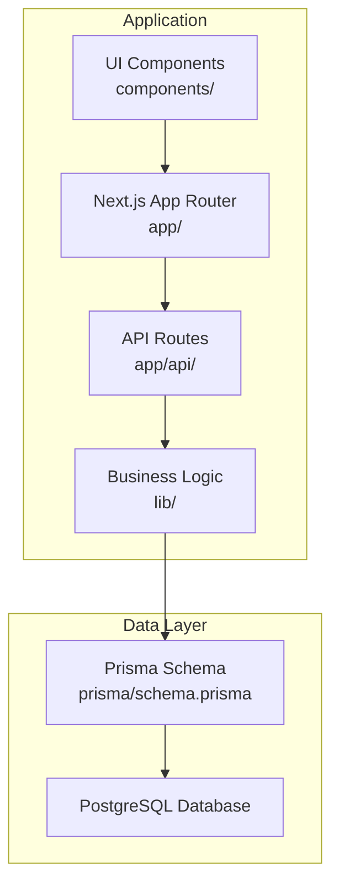
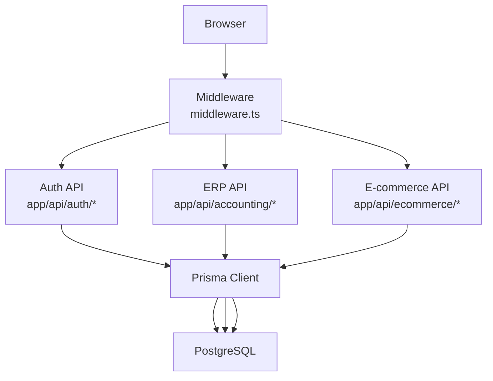
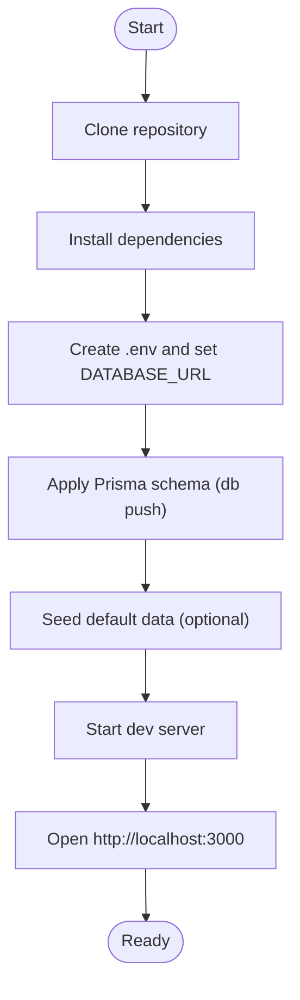
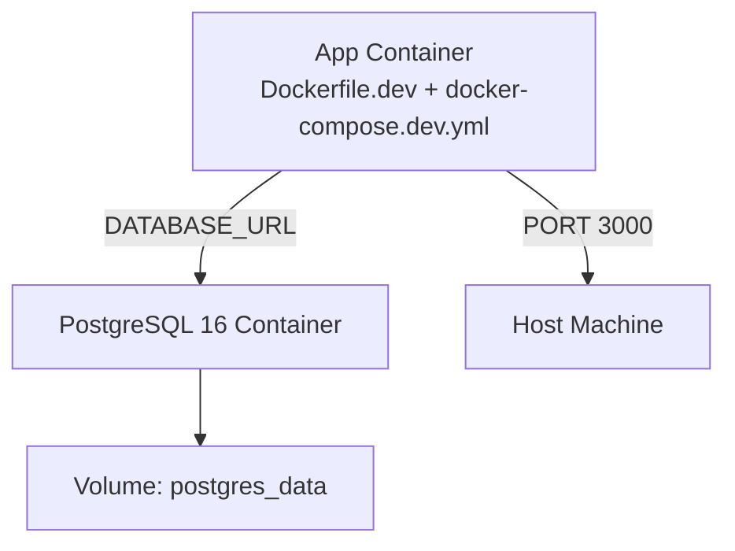
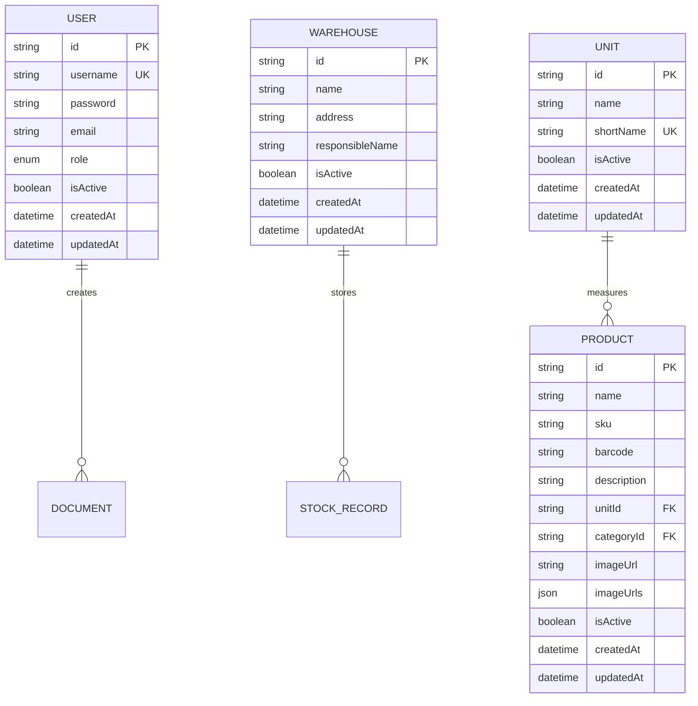
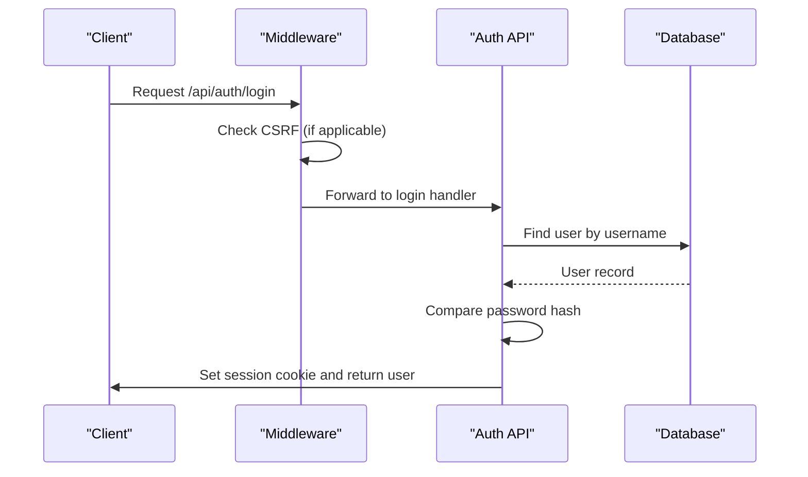
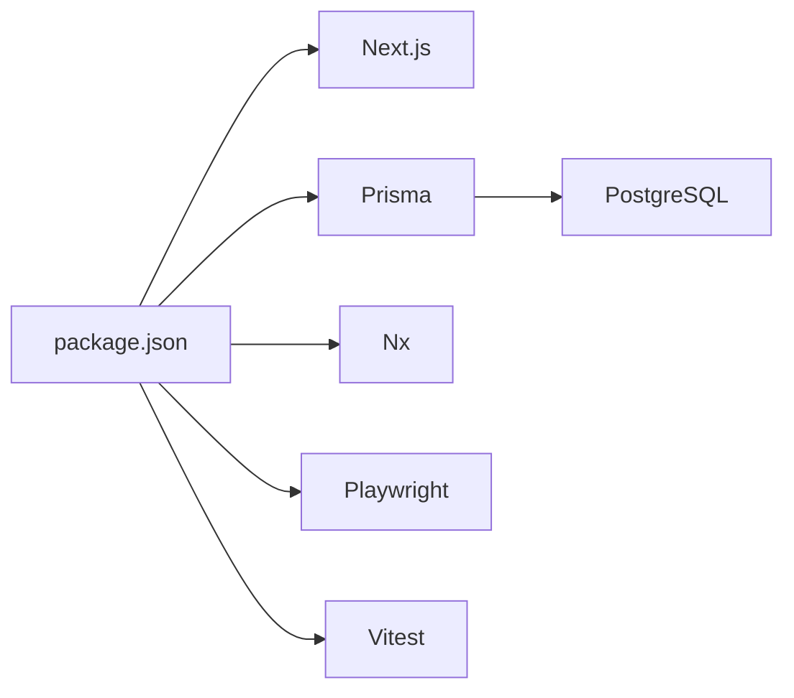

# Getting Started

<cite>
**Referenced Files in This Document**
- [README.md](file://README.md)
- [package.json](file://package.json)
- [Dockerfile.dev](file://Dockerfile.dev)
- [docker-compose.dev.yml](file://docker-compose.dev.yml)
- [prisma/schema.prisma](file://prisma/schema.prisma)
- [prisma/seed.ts](file://prisma/seed.ts)
- [prisma/seed-accounts.ts](file://prisma/seed-accounts.ts)
- [next.config.ts](file://next.config.ts)
- [middleware.ts](file://middleware.ts)
- [.github/workflows/ci.yml](file://.github/workflows/ci.yml)
- [ecosystem.config.js](file://ecosystem.config.js)
- [check_db.sh](file://check_db.sh)
- [deploy-quick.ps1](file://deploy-quick.ps1)
- [nx.json](file://nx.json)
- [tsconfig.json](file://tsconfig.json)
</cite>

## Table of Contents
1. [Introduction](#introduction)
2. [Project Structure](#project-structure)
3. [Core Components](#core-components)
4. [Architecture Overview](#architecture-overview)
5. [Detailed Component Analysis](#detailed-component-analysis)
6. [Dependency Analysis](#dependency-analysis)
7. [Performance Considerations](#performance-considerations)
8. [Troubleshooting Guide](#troubleshooting-guide)
9. [Conclusion](#conclusion)
10. [Appendices](#appendices)

## Introduction
This guide helps you install and run ListOpt ERP from repository cloning to first login. It covers system requirements, dependency installation, database setup, environment configuration, development server startup, and verification steps. It also includes Docker Compose setup, environment variables, database migration and seeding, initial access credentials, and troubleshooting tips.

## Project Structure
ListOpt ERP is a Next.js 16 App Router application with:
- Frontend pages under app/ and reusable components under components/
- Backend API routes under app/api/
- Business logic and modules under lib/
- Database schema and migrations under prisma/
- Tests under tests/

**Diagram sources**
- [README.md:93-110](file://README.md#L93-L110)
- [prisma/schema.prisma:1-10](file://prisma/schema.prisma#L1-L10)

**Section sources**
- [README.md:93-110](file://README.md#L93-L110)

## Core Components
- Application runtime: Next.js 16 with App Router and API routes
- Database: PostgreSQL 16 with Prisma ORM
- Authentication: Session-based cookie auth protected by CSRF middleware
- DevOps: Nx monorepo tooling, CI pipeline, PM2 process manager, optional Docker Compose

Key capabilities include product catalog, warehouse stock, document workflows (purchases/sales/transfers/inventory), finance (payments/reports), e-commerce storefront, and integrations.

**Section sources**
- [README.md:14-21](file://README.md#L14-L21)
- [middleware.ts:14-156](file://middleware.ts#L14-L156)

## Architecture Overview
The system enforces authentication and CSRF protection centrally via middleware. API routes handle auth, ERP modules, and e-commerce endpoints. Prisma connects to PostgreSQL and seeds default data.

**Diagram sources**
- [middleware.ts:45-151](file://middleware.ts#L45-L151)
- [prisma/schema.prisma:1-10](file://prisma/schema.prisma#L1-L10)

**Section sources**
- [middleware.ts:14-156](file://middleware.ts#L14-L156)
- [prisma/schema.prisma:1-10](file://prisma/schema.prisma#L1-L10)

## Detailed Component Analysis

### Installation and Environment Setup
Follow these steps to install and configure ListOpt ERP locally:

- Clone the repository and enter the project directory
- Install Node.js dependencies
- Configure environment variables (.env)
- Apply Prisma schema to the database
- Seed default data (optional)
- Start the development server

**Diagram sources**
- [README.md:22-48](file://README.md#L22-L48)
- [package.json:17-21](file://package.json#L17-L21)

Step-by-step instructions:
1) Clone and enter the repository
2) Install dependencies
3) Create .env from .env.example and set DATABASE_URL pointing to your PostgreSQL instance
4) Generate Prisma client and apply schema to the database
5) Optionally seed default data (users, units, warehouses, document counters, finance categories, payment counters)
6) Start the development server

Verification:
- Access http://localhost:3000
- Use admin/admin123 to log in

**Section sources**
- [README.md:22-54](file://README.md#L22-L54)
- [package.json:17-21](file://package.json#L17-L21)
- [prisma/seed.ts:65-76](file://prisma/seed.ts#L65-L76)

### Docker Compose Development Environment
Use Docker Compose to run the app with a managed PostgreSQL service. The compose file defines:
- app service: builds from Dockerfile.dev, mounts source code, exposes port 3000, sets DATABASE_URL and session secret
- db service: PostgreSQL 16 with persistent volume

**Diagram sources**
- [docker-compose.dev.yml:3-39](file://docker-compose.dev.yml#L3-L39)
- [Dockerfile.dev:1-27](file://Dockerfile.dev#L1-L27)

Environment variables configured by compose:
- NODE_ENV=development
- DATABASE_URL=postgresql://postgres:postgres@db:5432/listopt_erp
- SESSION_SECRET=dev-secret-key-change-in-production
- SECURE_COOKIES=false

Command executed inside the app container:
- Generate Prisma client
- Push schema to database
- Clear .next cache
- Start dev server

Port configuration:
- App: 3000
- Database: 5432 (exposed for local Prisma commands)

**Section sources**
- [docker-compose.dev.yml:17-24](file://docker-compose.dev.yml#L17-L24)
- [Dockerfile.dev:18-26](file://Dockerfile.dev#L18-L26)

### Database Schema and Seeding
Prisma schema defines core models for users, products, stock, documents, finances, and e-commerce. The schema is generated into lib/generated/prisma.

**Diagram sources**
- [prisma/schema.prisma:21-32](file://prisma/schema.prisma#L21-L32)
- [prisma/schema.prisma:81-90](file://prisma/schema.prisma#L81-L90)
- [prisma/schema.prisma:108-166](file://prisma/schema.prisma#L108-L166)

Default data seeding creates:
- Units
- Default warehouse
- Document counters for all document types
- Admin user (role=admin)
- Finance categories (system defaults)
- Payment counter

**Section sources**
- [prisma/schema.prisma:14-32](file://prisma/schema.prisma#L14-L32)
- [prisma/seed.ts:16-109](file://prisma/seed.ts#L16-L109)

### Authentication and CSRF Middleware
Authentication and CSRF protection are enforced centrally:
- Public routes: /login, /setup, and specific API endpoints
- ERP requires a session cookie; missing sessions redirect to /login
- CSRF validation is applied to API routes (except exempt paths)
- Rate limiting and request tracing via request ID header

**Diagram sources**
- [middleware.ts:45-151](file://middleware.ts#L45-L151)
- [app/api/auth/login/route.ts:9-59](file://app/api/auth/login/route.ts#L9-L59)

**Section sources**
- [middleware.ts:14-156](file://middleware.ts#L14-L156)
- [app/api/auth/login/route.ts:9-59](file://app/api/auth/login/route.ts#L9-L59)

### First-Time User Access
- Default admin credentials:
  - Username: admin
  - Password: admin123
- After first run, the system initializes schema and seeds default data, including the admin user

Access the application at http://localhost:3000 and log in with the admin credentials.

**Section sources**
- [README.md:50-54](file://README.md#L50-L54)
- [prisma/seed.ts:65-76](file://prisma/seed.ts#L65-L76)

### Development Server Startup and Port Configuration
- Local development server:
  - Command: npm run dev
  - Port: 3000
- Docker Compose:
  - App port mapped: 3000:3000
  - Database exposed: 5432:5432

Optional Next.js configuration:
- Redirects and security headers are configured in next.config.ts

**Section sources**
- [README.md:44-48](file://README.md#L44-L48)
- [docker-compose.dev.yml:8-19](file://docker-compose.dev.yml#L8-L19)
- [Dockerfile.dev:18-19](file://Dockerfile.dev#L18-L19)
- [next.config.ts:3-28](file://next.config.ts#L3-L28)

### Verification Steps
After startup, verify the installation:
- Open http://localhost:3000 in your browser
- Log in with admin/admin123
- Navigate to core modules (e.g., Catalog, Documents, Finance)
- Confirm that seeded data appears (units, warehouse, counters)
- Optional: Use the provided curl script to test login API

**Section sources**
- [README.md:44-54](file://README.md#L44-L54)
- [check_db.sh:3-6](file://check_db.sh#L3-L6)

## Dependency Analysis
- Node.js and npm: application runtime and package manager
- Next.js 16: frontend framework and API routes
- Prisma: ORM with PostgreSQL adapter and client generation
- PostgreSQL 16: relational database
- Nx: monorepo orchestration and caching
- Playwright/Vitest: testing frameworks

**Diagram sources**
- [package.json:29-77](file://package.json#L29-L77)

**Section sources**
- [package.json:29-77](file://package.json#L29-L77)

## Performance Considerations
- Use Nx caching for build and test tasks
- Keep Prisma client generated and schema aligned
- Monitor database queries and indexes defined in the schema
- Prefer migrations over db push in production environments

[No sources needed since this section provides general guidance]

## Troubleshooting Guide
Common issues and resolutions:
- Database connection errors:
  - Ensure DATABASE_URL is set correctly in .env
  - Verify PostgreSQL is reachable on the specified host/port
- Prisma client generation failures:
  - Run Prisma generate and db push again
  - Confirm Prisma schema is valid
- Login failures:
  - Confirm admin user exists (seeded by default)
  - Check session cookie settings (SECURE_COOKIES, sameSite)
- Docker Compose issues:
  - Rebuild images and recreate containers
  - Check volume permissions for postgres_data
- CI/CD differences:
  - CI uses migrations instead of db push; ensure migrations are applied in production

**Section sources**
- [README.md:34-42](file://README.md#L34-L42)
- [docker-compose.dev.yml:17-24](file://docker-compose.dev.yml#L17-L24)
- [.github/workflows/ci.yml:62-67](file://.github/workflows/ci.yml#L62-L67)

## Conclusion
You now have the complete picture to install ListOpt ERP locally or in Docker, configure the database, seed default data, start the development server, and log in for the first time. Use the verification steps to confirm functionality and refer to the troubleshooting section for common issues.

[No sources needed since this section summarizes without analyzing specific files]

## Appendices

### Environment Variables
Essential variables for local development:
- DATABASE_URL: PostgreSQL connection string
- SESSION_SECRET: Secret for signing session cookies
- SECURE_COOKIES: Controls secure flag on cookies

Compose-defined defaults:
- DATABASE_URL=postgresql://postgres:postgres@db:5432/listopt_erp
- SESSION_SECRET=dev-secret-key-change-in-production
- SECURE_COOKIES=false

Production note:
- Set DATABASE_URL and SESSION_SECRET on the server
- Use migration-based deployments (migrate deploy) instead of db push

**Section sources**
- [docker-compose.dev.yml:17-21](file://docker-compose.dev.yml#L17-L21)
- [.github/workflows/ci.yml:37-39](file://.github/workflows/ci.yml#L37-L39)
- [ecosystem.config.js:12-18](file://ecosystem.config.js#L12-L18)

### Deployment Notes
- Archive and deploy using the provided scripts and CI workflow
- Production uses PM2 to manage the Next.js production server on port 3001

**Section sources**
- [README.md:60-78](file://README.md#L60-L78)
- [deploy-quick.ps1:1-20](file://deploy-quick.ps1#L1-L20)
- [ecosystem.config.js:6](file://ecosystem.config.js#L6)