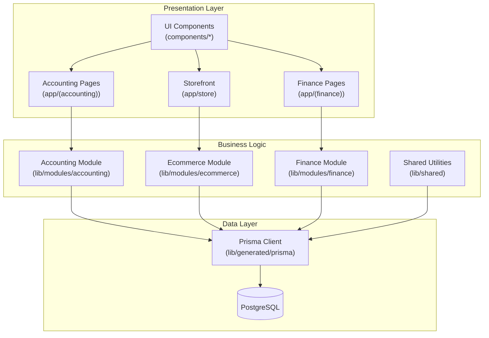
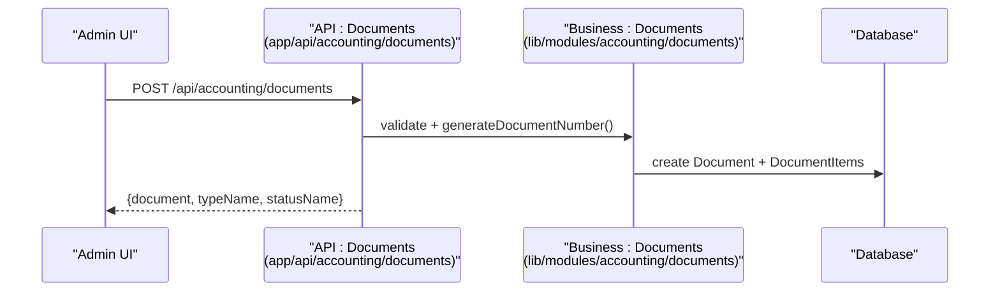
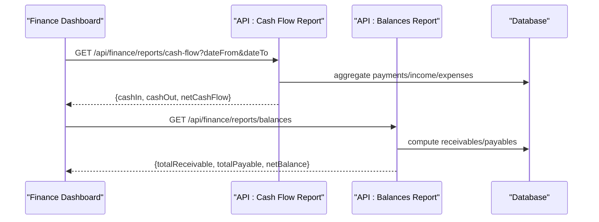
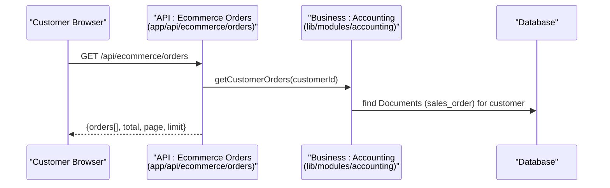
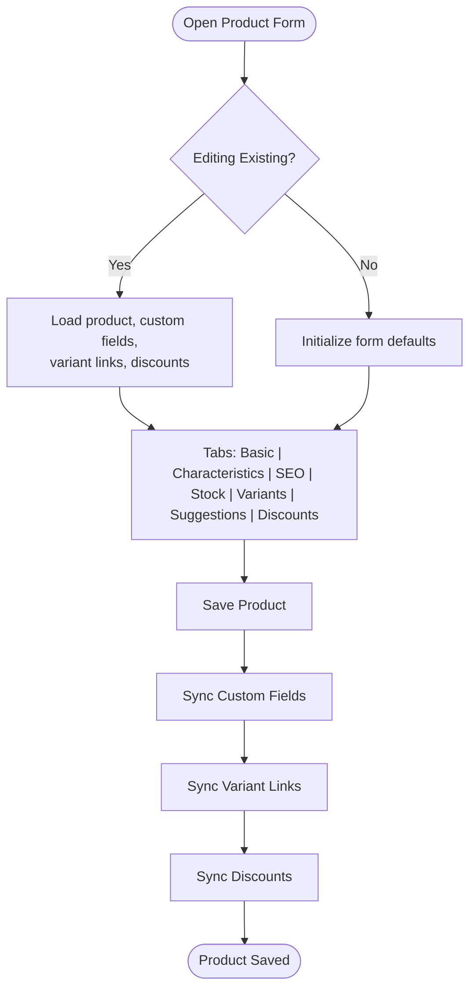
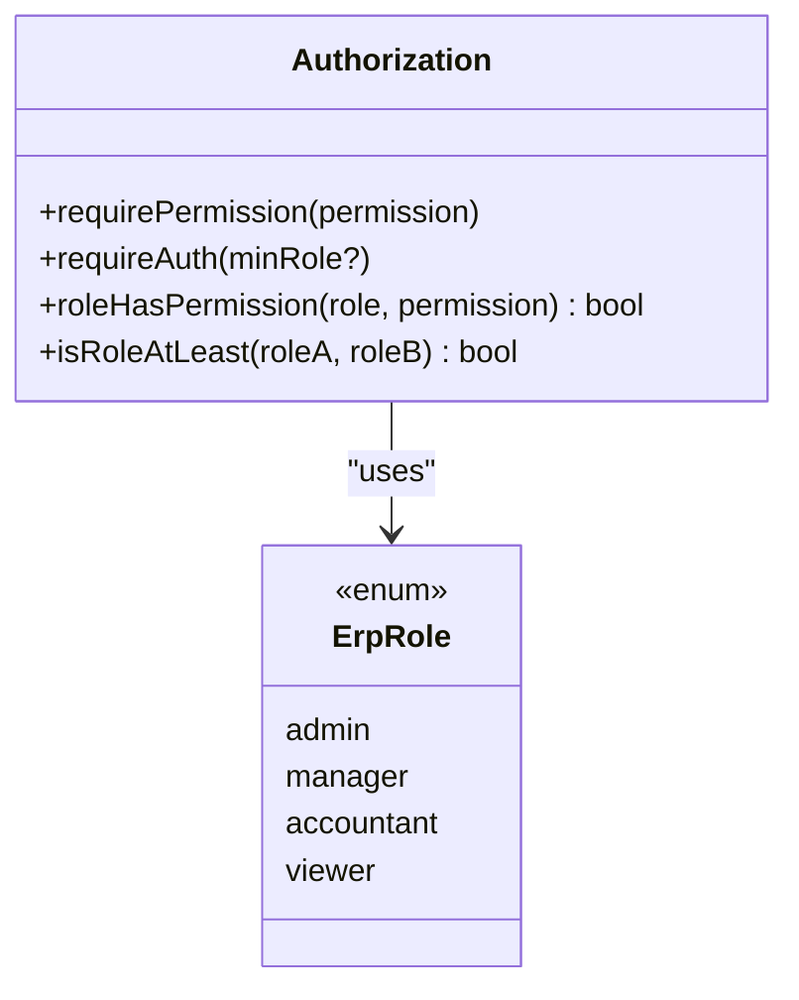
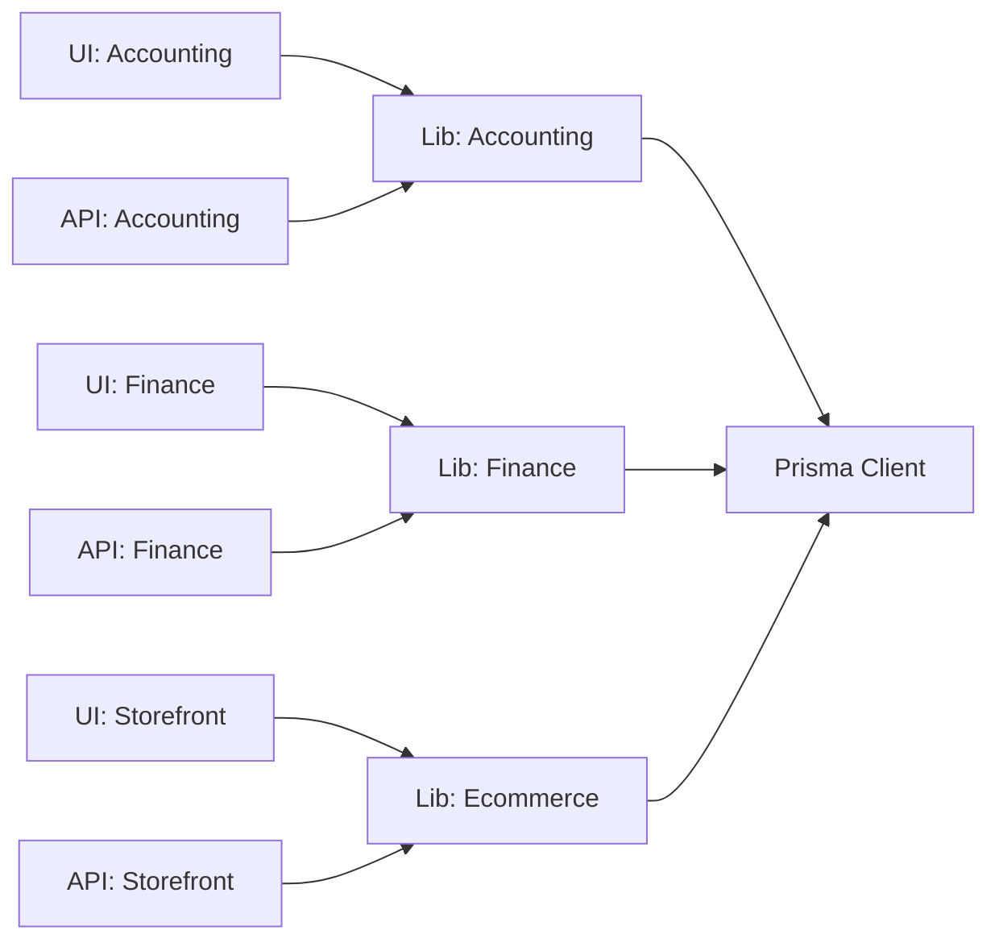

# Project Overview

<cite>
**Referenced Files in This Document**
- [README.md](file://README.md)
- [ARCHITECTURE.md](file://ARCHITECTURE.md)
- [package.json](file://package.json)
- [prisma/schema.prisma](file://prisma/schema.prisma)
- [app/layout.tsx](file://app/layout.tsx)
- [app/(accounting)/page.tsx](file://app/(accounting)/page.tsx)
- [app/(finance)/dashboard/page.tsx](file://app/(finance)/dashboard/page.tsx)
- [app/api/accounting/documents/route.ts](file://app/api/accounting/documents/route.ts)
- [app/api/accounting/products/route.ts](file://app/api/accounting/products/route.ts)
- [app/api/ecommerce/orders/route.ts](file://app/api/ecommerce/orders/route.ts)
- [app/api/integrations/telegram/route.ts](file://app/api/integrations/telegram/route.ts)
- [lib/modules/accounting/documents.ts](file://lib/modules/accounting/documents.ts)
- [lib/modules/accounting/stock.ts](file://lib/modules/accounting/stock.ts)
- [lib/modules/ecommerce/delivery.ts](file://lib/modules/ecommerce/delivery.ts)
- [lib/shared/authorization.ts](file://lib/shared/authorization.ts)
- [components/accounting/ProductsTable.tsx](file://components/accounting/ProductsTable.tsx)
- [components/accounting/catalog/ProductFormContent.tsx](file://components/accounting/catalog/ProductFormContent.tsx)
- [app/store/page.tsx](file://app/store/page.tsx)
- [tests/e2e/specs/accounting/catalog.spec.ts](file://tests/e2e/specs/accounting/catalog.spec.ts)
- [tests/e2e/specs/accounting/documents.spec.ts](file://tests/e2e/specs/accounting/documents.spec.ts)
</cite>

## Table of Contents
1. [Introduction](#introduction)
2. [Project Structure](#project-structure)
3. [Core Components](#core-components)
4. [Architecture Overview](#architecture-overview)
5. [Detailed Component Analysis](#detailed-component-analysis)
6. [Dependency Analysis](#dependency-analysis)
7. [Performance Considerations](#performance-considerations)
8. [Troubleshooting Guide](#troubleshooting-guide)
9. [Conclusion](#conclusion)

## Introduction
ListOpt ERP is a full-stack enterprise resource planning system designed specifically for wholesale trade operations in Russia. It unifies core business domains—product catalog and variants, warehouse stock, document workflows (purchases, sales, transfers, inventory), financial reporting (P&L, cash flow, balances), and e-commerce—into a single platform. The system emphasizes practical operations for wholesale businesses: managing product variants, precise stock tracking, document-driven accounting, counterparty financials, and an integrated online store with order-to-document synchronization.

Key value propositions:
- Unified wholesale operations: seamless alignment between warehouse, documents, and e-commerce.
- Practical Russian-market compliance: localized document numbering, statuses, and financial reporting semantics.
- Integrated e-commerce: orders automatically convert to sales documents, enabling end-to-end visibility.
- Strong access control: role-based permissions tailored for managers, accountants, and viewers.

Target users:
- Wholesalers and distributors managing multi-location stock and supply chains.
- Storefront operators handling online orders with backend ERP integration.
- Controllers and managers requiring real-time visibility into stock, receivables/payables, and financial KPIs.

Russian market focus and wholesale requirements reflected in the codebase:
- Document numbering and statuses use Russian terms and logic aligned with domestic operations (e.g., stock receipts, inventory counts, supplier/customer returns).
- Financial reporting modules support profit-and-loss and cash flow analysis.
- E-commerce delivery cost calculation is extensible for local logistics providers.

**Section sources**
- [README.md:1-129](file://README.md#L1-L129)
- [ARCHITECTURE.md:267-279](file://ARCHITECTURE.md#L267-L279)

## Project Structure
The project follows a modular, domain-driven structure with Next.js App Router route groups for modules and a centralized business logic library.

High-level structure highlights:
- app/: UI pages organized by modules (accounting, finance, store), API routes under app/api/, and shared layouts.
- components/: reusable UI components grouped by domain (accounting, ecommerce, ui).
- lib/: business logic organized per module (accounting, ecommerce, finance), shared utilities, and generated Prisma client.
- prisma/: schema and migrations for PostgreSQL-backed data model.
- tests/: unit, integration, and E2E tests.

Technology choices rationale:
- Frontend: Next.js 16 App Router with React 19 and TailwindCSS for responsive UI.
- Backend: Next.js API routes for concise serverless-style endpoints.
- Data: PostgreSQL 16 with Prisma ORM for type-safe schema and queries.
- DevOps: PM2 + Nginx for deployment; Nx for monorepo tooling.
- Testing: Vitest for unit/integration, Playwright for E2E.

**Section sources**
- [ARCHITECTURE.md:3-77](file://ARCHITECTURE.md#L3-L77)
- [package.json:1-79](file://package.json#L1-L79)

## Core Components
- Accounting module: product catalog (with variants and custom fields), stock balances, purchase/sale documents, counterparties, pricing, and reports.
- Finance module: payments, reports (cash flow, balances, profit/loss), and dashboards.
- E-commerce module: storefront, categories, products, cart, checkout, orders, reviews, and delivery cost calculation.
- Integrations: Telegram bot settings and webhooks for external systems.

Feature categories:
- Catalog and pricing: products, variants, custom fields, price lists, discounts.
- Stock and warehouse: receipts, transfers, inventory counts, stock records, average cost updates.
- Documents: purchase orders, incoming/outgoing shipments, returns, confirm/cancel workflows.
- Counterparties: customers/suppliers, interactions, balances.
- Finance: payments, reports, balances.
- E-commerce: storefront, orders, delivery, reviews, favorites.

**Section sources**
- [ARCHITECTURE.md:79-130](file://ARCHITECTURE.md#L79-L130)
- [README.md:5-12](file://README.md#L5-L12)

## Architecture Overview
The system uses a layered architecture:
- Presentation: Next.js App Router pages and components.
- Business logic: lib/modules with domain-specific functions.
- Data access: Prisma ORM via a shared client.
- APIs: Next.js API routes implementing CRUD and action endpoints with validation and permissions.

**Diagram sources**
- [ARCHITECTURE.md:43-77](file://ARCHITECTURE.md#L43-L77)
- [prisma/schema.prisma:1-1063](file://prisma/schema.prisma#L1-L1063)

**Section sources**
- [ARCHITECTURE.md:131-204](file://ARCHITECTURE.md#L131-L204)

## Detailed Component Analysis

### Accounting Domain
The accounting domain orchestrates wholesale operations:
- Documents: standardized CRUD plus action endpoints (confirm, cancel). Russian-type names and statuses are resolved for display.
- Stock: recalculations, availability checks, average cost updates, and total cost value maintenance.
- Products: catalog management, variant linking, custom fields, discounts, and CSV import/export.
- Counterparties: balances, interactions, and payment tracking.
- Reports: balances, cash flow, and profitability.

**Diagram sources**
- [app/api/accounting/documents/route.ts:63-136](file://app/api/accounting/documents/route.ts#L63-L136)
- [lib/modules/accounting/documents.ts:69-78](file://lib/modules/accounting/documents.ts#L69-L78)

Key workflows:
- Create a draft document, add items, confirm to trigger stock and financial updates.
- Stock availability checks before confirming outgoing documents.
- Average cost updates on receipts and transfers.

**Section sources**
- [app/api/accounting/documents/route.ts:8-61](file://app/api/accounting/documents/route.ts#L8-L61)
- [lib/modules/accounting/documents.ts:90-144](file://lib/modules/accounting/documents.ts#L90-L144)
- [lib/modules/accounting/stock.ts:79-128](file://lib/modules/accounting/stock.ts#L79-L128)

### Finance Domain
The finance module provides dashboards and reports:
- Cash flow and balances reports with date-range filtering.
- Profit and loss calculations using accounting ledger semantics.

**Diagram sources**
- [app/(finance)/dashboard/page.tsx:22-48](file://app/(finance)/dashboard/page.tsx#L22-L48)

**Section sources**
- [app/(finance)/dashboard/page.tsx:16-48](file://app/(finance)/dashboard/page.tsx#L16-L48)

### E-commerce Domain
The e-commerce module integrates with the accounting domain:
- Storefront homepage with categories and featured products.
- Orders retrieved from Documents (sales_order) for authenticated customers.
- Delivery cost calculation is pluggable for local providers.

**Diagram sources**
- [app/api/ecommerce/orders/route.ts:7-63](file://app/api/ecommerce/orders/route.ts#L7-L63)

**Section sources**
- [app/store/page.tsx:25-95](file://app/store/page.tsx#L25-L95)
- [app/api/ecommerce/orders/route.ts:7-63](file://app/api/ecommerce/orders/route.ts#L7-L63)
- [lib/modules/ecommerce/delivery.ts:18-40](file://lib/modules/ecommerce/delivery.ts#L18-L40)

### Product Catalog and Variants
The product catalog supports:
- Rich product forms with images, SEO fields, custom fields, and discounts.
- Variant linking and suggestions to group related variants.
- Bulk actions, CSV import/export, and filters.

**Diagram sources**
- [components/accounting/catalog/ProductFormContent.tsx:62-414](file://components/accounting/catalog/ProductFormContent.tsx#L62-L414)

**Section sources**
- [components/accounting/ProductsTable.tsx:59-495](file://components/accounting/ProductsTable.tsx#L59-L495)
- [app/api/accounting/products/route.ts:7-145](file://app/api/accounting/products/route.ts#L7-L145)

### Access Control and Roles
Role-based permissions govern module access:
- Roles: admin, manager, accountant, viewer.
- Permissions scoped per domain (products, documents, payments, reports, settings).
- API routes enforce permissions and roles.

**Diagram sources**
- [lib/shared/authorization.ts:16-160](file://lib/shared/authorization.ts#L16-L160)

**Section sources**
- [lib/shared/authorization.ts:31-82](file://lib/shared/authorization.ts#L31-L82)

## Dependency Analysis
Module cohesion and coupling:
- UI components depend on shared UI primitives and business logic via lib modules.
- API routes depend on shared auth and validation utilities and delegate business logic to lib modules.
- Database access is centralized through Prisma client.

**Diagram sources**
- [ARCHITECTURE.md:131-204](file://ARCHITECTURE.md#L131-L204)
- [prisma/schema.prisma:1-1063](file://prisma/schema.prisma#L1-L1063)

**Section sources**
- [ARCHITECTURE.md:192-204](file://ARCHITECTURE.md#L192-L204)

## Performance Considerations
- Use of Prisma’s generated client ensures efficient queries and reduces boilerplate.
- Batch operations: bulk product actions and document confirmations minimize round-trips.
- Pagination and filtering in API endpoints reduce payload sizes.
- Stock recalculations aggregate at database level to avoid in-memory loops.

[No sources needed since this section provides general guidance]

## Troubleshooting Guide
Common issues and resolutions:
- Authentication failures: ensure session cookies and secure cookie settings are configured for HTTPS environments.
- Permission denied: verify user role and required permissions for the endpoint.
- Validation errors: review request payloads against schema definitions used in API routes.
- Stock discrepancies: re-run stock recalculation for affected warehouse/product combinations.

**Section sources**
- [lib/shared/authorization.ts:137-160](file://lib/shared/authorization.ts#L137-L160)
- [app/api/accounting/documents/route.ts:56-61](file://app/api/accounting/documents/route.ts#L56-L61)
- [lib/modules/accounting/stock.ts:11-77](file://lib/modules/accounting/stock.ts#L11-L77)

## Conclusion
ListOpt ERP delivers a practical, domain-focused solution for wholesale trade in Russia. Its unified document-centric approach connects stock, finances, and e-commerce, while robust permissions and localization tailor it to regional needs. The modular architecture and strong testing strategy support maintainability and scalability for growing wholesale operations.

[No sources needed since this section summarizes without analyzing specific files]