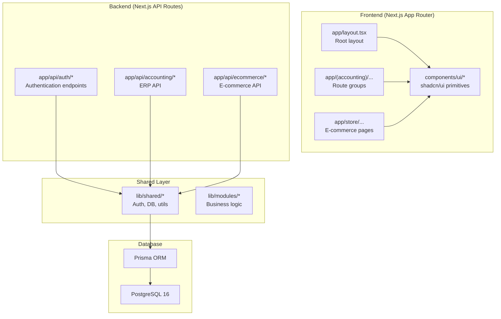
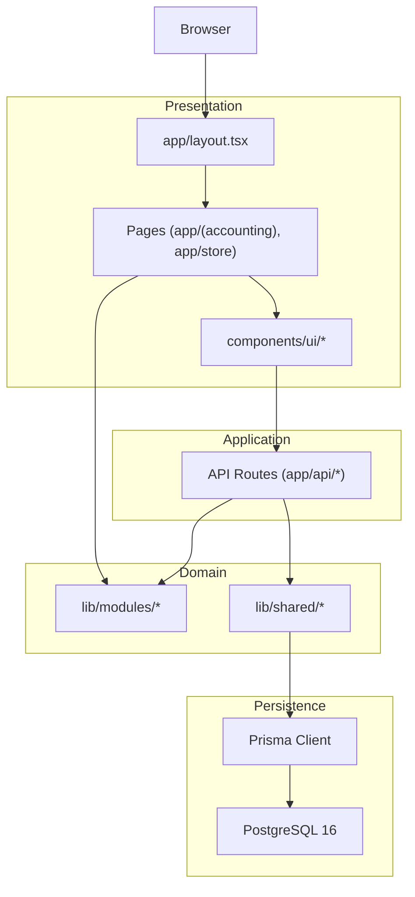
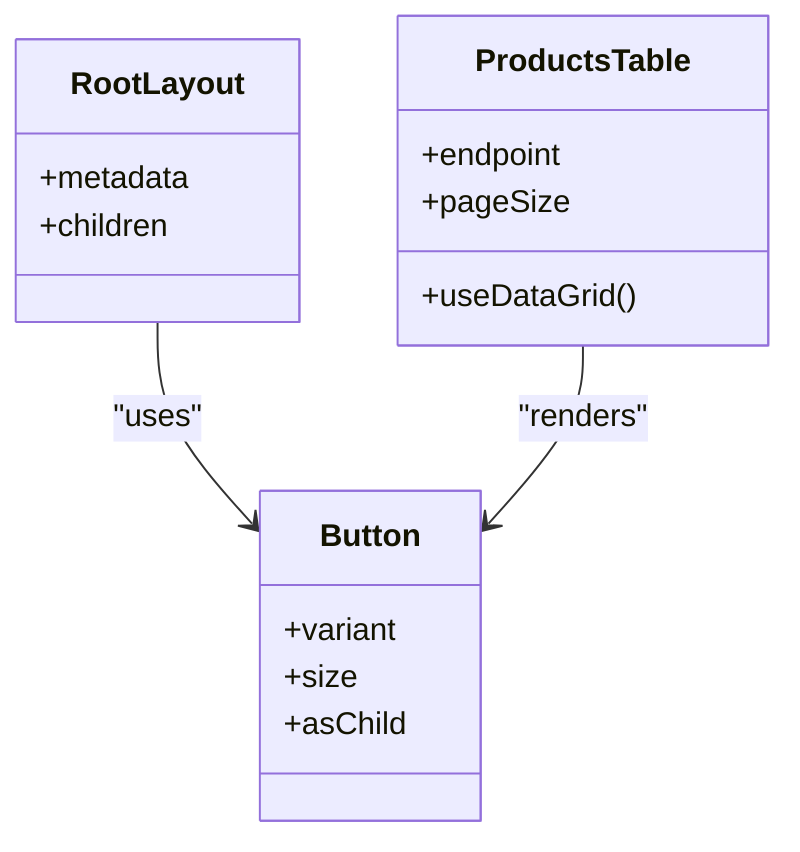
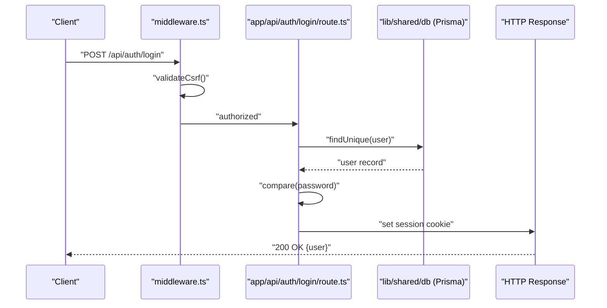
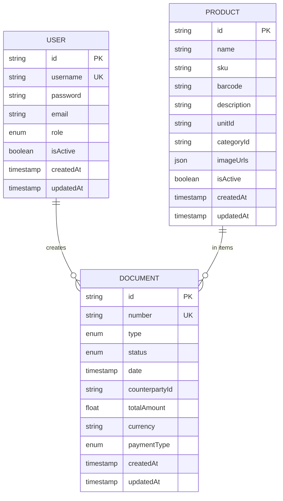
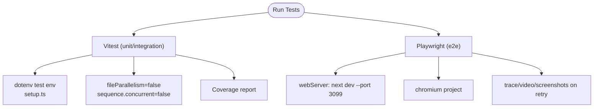
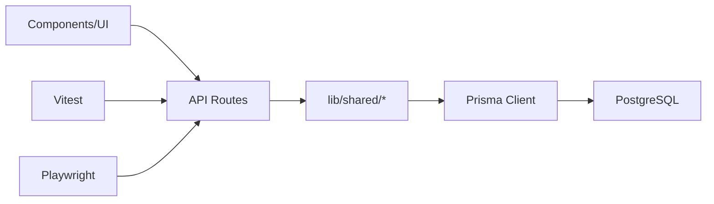

# Technology Stack

<cite>
**Referenced Files in This Document**
- [package.json](file://package.json)
- [next.config.ts](file://next.config.ts)
- [tsconfig.json](file://tsconfig.json)
- [prisma/schema.prisma](file://prisma/schema.prisma)
- [ecosystem.config.js](file://ecosystem.config.js)
- [vitest.config.ts](file://vitest.config.ts)
- [playwright.config.ts](file://playwright.config.ts)
- [postcss.config.mjs](file://postcss.config.mjs)
- [eslint.config.mjs](file://eslint.config.mjs)
- [components.json](file://components.json)
- [middleware.ts](file://middleware.ts)
- [app/layout.tsx](file://app/layout.tsx)
- [lib/index.ts](file://lib/index.ts)
- [prisma.config.ts](file://prisma.config.ts)
- [nx.json](file://nx.json)
- [README.md](file://README.md)
- [ARCHITECTURE.md](file://ARCHITECTURE.md)
- [app/api/auth/login/route.ts](file://app/api/auth/login/route.ts)
- [components/ui/button.tsx](file://components/ui/button.tsx)
- [components/accounting/ProductsTable.tsx](file://components/accounting/ProductsTable.tsx)
</cite>

## Table of Contents
1. [Introduction](#introduction)
2. [Project Structure](#project-structure)
3. [Core Components](#core-components)
4. [Architecture Overview](#architecture-overview)
5. [Detailed Component Analysis](#detailed-component-analysis)
6. [Dependency Analysis](#dependency-analysis)
7. [Performance Considerations](#performance-considerations)
8. [Troubleshooting Guide](#troubleshooting-guide)
9. [Conclusion](#conclusion)
10. [Appendices](#appendices)

## Introduction
This document details the complete technology stack for ListOpt ERP, covering frontend (Next.js 16 with App Router, React 19, TypeScript, TailwindCSS, and shadcn/ui), backend (Next.js API Routes and Node.js runtime), database (PostgreSQL 16 with Prisma ORM), deployment (PM2 and Nginx), testing (Vitest and Playwright), and developer tooling (Nx, ESLint, PostCSS/Tailwind). It also explains technology choices, version compatibility, upgrade paths, and performance/scalability implications.

## Project Structure
ListOpt ERP follows a modular monolith organized around Next.js App Router route groups and Nx workspaces:
- Frontend pages under app/ grouped by functional domains (accounting, finance, store).
- Backend API routes under app/api/.
- UI primitives under components/ui/ built with shadcn/ui.
- Business logic under lib/modules/ with shared utilities under lib/shared/.
- Database schema and migrations under prisma/.

**Diagram sources**
- [app/layout.tsx:1-37](file://app/layout.tsx#L1-L37)
- [components/ui/button.tsx:1-65](file://components/ui/button.tsx#L1-L65)
- [lib/index.ts:1-6](file://lib/index.ts#L1-L6)
- [prisma/schema.prisma:1-1067](file://prisma/schema.prisma#L1-L1067)

**Section sources**
- [README.md:93-110](file://README.md#L93-L110)
- [ARCHITECTURE.md:3-77](file://ARCHITECTURE.md#L3-L77)

## Core Components
- Frontend framework: Next.js 16 with App Router and React 19.
- Styling: TailwindCSS v4 with PostCSS plugin and shadcn/ui component library.
- Type safety: TypeScript strict mode with bundler resolution.
- Backend: Next.js API Routes running on Node.js runtime.
- Database: PostgreSQL 16 with Prisma ORM and generated client.
- Deployment: PM2 process manager with ecosystem configuration.
- Testing: Vitest for unit/integration tests; Playwright for end-to-end tests.
- Build and orchestration: Nx workspace with caching and target defaults.

**Section sources**
- [package.json:29-77](file://package.json#L29-L77)
- [next.config.ts:1-29](file://next.config.ts#L1-L29)
- [tsconfig.json:1-44](file://tsconfig.json#L1-L44)
- [prisma/schema.prisma:1-10](file://prisma/schema.prisma#L1-L10)
- [ecosystem.config.js:1-22](file://ecosystem.config.js#L1-L22)
- [vitest.config.ts:1-30](file://vitest.config.ts#L1-L30)
- [playwright.config.ts:1-40](file://playwright.config.ts#L1-L40)
- [nx.json:1-34](file://nx.json#L1-L34)

## Architecture Overview
The system uses a layered architecture:
- Presentation layer: Next.js App Router pages and shadcn/ui components.
- Application layer: Next.js API Routes implementing REST-like endpoints.
- Domain layer: Business logic under lib/modules/.
- Persistence layer: Prisma client interacting with PostgreSQL.

**Diagram sources**
- [middleware.ts:1-169](file://middleware.ts#L1-L169)
- [lib/index.ts:1-6](file://lib/index.ts#L1-L6)
- [prisma/schema.prisma:1-1067](file://prisma/schema.prisma#L1-L1067)

## Detailed Component Analysis

### Frontend: Next.js 16, React 19, TypeScript, TailwindCSS, shadcn/ui
- Next.js App Router: Pages and route groups organize domain areas (accounting, finance, store).
- React 19: Latest React runtime with concurrent features and improved rendering.
- TypeScript: Strict compiler options, ESNext modules, and bundler resolution for modern DX.
- TailwindCSS v4: PostCSS pipeline configured via @tailwindcss/postcss plugin.
- shadcn/ui: Component library with RSC support, TSX, and aliased imports.

**Diagram sources**
- [app/layout.tsx:16-36](file://app/layout.tsx#L16-L36)
- [components/ui/button.tsx:41-62](file://components/ui/button.tsx#L41-L62)
- [components/accounting/ProductsTable.tsx:59-85](file://components/accounting/ProductsTable.tsx#L59-L85)

**Section sources**
- [components.json:1-24](file://components.json#L1-L24)
- [postcss.config.mjs:1-8](file://postcss.config.mjs#L1-L8)
- [tsconfig.json:1-44](file://tsconfig.json#L1-L44)
- [app/layout.tsx:1-37](file://app/layout.tsx#L1-L37)

### Backend: Next.js API Routes and Node.js Runtime
- API Routes: Located under app/api/, implementing CRUD and action endpoints.
- Middleware: Centralized auth, CSRF protection, rate limiting, and redirects.
- Runtime: Node.js with Next.js runtime; production managed by PM2.

**Diagram sources**
- [middleware.ts:132-156](file://middleware.ts#L132-L156)
- [app/api/auth/login/route.ts:9-59](file://app/api/auth/login/route.ts#L9-L59)
- [lib/index.ts:1-6](file://lib/index.ts#L1-L6)

**Section sources**
- [middleware.ts:1-169](file://middleware.ts#L1-L169)
- [app/api/auth/login/route.ts:1-60](file://app/api/auth/login/route.ts#L1-L60)
- [ecosystem.config.js:1-22](file://ecosystem.config.js#L1-L22)

### Database: PostgreSQL 16 and Prisma ORM
- Schema: Strongly typed models for ERP (users, documents, products, stock, e-commerce) and enums for statuses and types.
- Client generation: Prisma generates a strongly-typed client under lib/generated/prisma.
- Migrations: Managed under prisma/migrations with Nx target dependency on build.

**Diagram sources**
- [prisma/schema.prisma:21-32](file://prisma/schema.prisma#L21-L32)
- [prisma/schema.prisma:108-166](file://prisma/schema.prisma#L108-L166)
- [prisma/schema.prisma:452-517](file://prisma/schema.prisma#L452-L517)

**Section sources**
- [prisma/schema.prisma:1-1067](file://prisma/schema.prisma#L1-L1067)
- [nx.json:12-26](file://nx.json#L12-L26)
- [prisma.config.ts:1-16](file://prisma.config.ts#L1-L16)

### Testing Stack: Vitest and Playwright
- Vitest: Node environment, setup files, sequential execution to avoid DB races, aliases for @ path.
- Playwright: E2E tests with a local Next.js dev server, Chromium, and retry/tracing on failure.

**Diagram sources**
- [vitest.config.ts:5-29](file://vitest.config.ts#L5-L29)
- [playwright.config.ts:6-39](file://playwright.config.ts#L6-L39)

**Section sources**
- [vitest.config.ts:1-30](file://vitest.config.ts#L1-L30)
- [playwright.config.ts:1-40](file://playwright.config.ts#L1-L40)

### Build Tools, Linters, and Development Dependencies
- Nx: Orchestrator with caching, named inputs, and target defaults; prisma-generate depends on build.
- ESLint: Next.js core-web-vitals and TypeScript configs plus Nx plugin; enforces module boundaries and restricted imports.
- PostCSS/Tailwind: Tailwind v4 plugin configured via @tailwindcss/postcss.

**Section sources**
- [nx.json:1-34](file://nx.json#L1-L34)
- [eslint.config.mjs:1-148](file://eslint.config.mjs#L1-L148)
- [postcss.config.mjs:1-8](file://postcss.config.mjs#L1-L8)

## Dependency Analysis
- Frontend-to-backend: Pages and components call API routes via fetch; shadcn/ui components encapsulate styling and behavior.
- Backend-to-database: API routes import db from lib/shared/db; Prisma client is generated and cached by Nx.
- Testing-to-backend: Vitest runs against API endpoints; Playwright launches a local Next.js server for e2e.

**Diagram sources**
- [lib/index.ts:1-6](file://lib/index.ts#L1-L6)
- [prisma/schema.prisma:1-1067](file://prisma/schema.prisma#L1-L1067)
- [nx.json:12-26](file://nx.json#L12-L26)

**Section sources**
- [lib/index.ts:1-6](file://lib/index.ts#L1-L6)
- [nx.json:12-26](file://nx.json#L12-L26)

## Performance Considerations
- Next.js App Router: Server-side rendering and static generation where applicable reduce initial load; API Routes provide efficient SSR-friendly endpoints.
- React 19: Concurrent features improve responsiveness; keep components small and memoized.
- TailwindCSS v4: Utility-first CSS reduces bundle bloat when purged; ensure purge globs exclude generated files.
- Prisma: Generated client improves type safety and reduces SQL errors; use transactions for multi-entity writes and add indexes on hot query paths.
- PM2: Single-instance process with memory limits; scale horizontally by adding instances behind a reverse proxy.
- Middleware: CSRF and rate limiting add overhead; tune thresholds and caching for high traffic.

[No sources needed since this section provides general guidance]

## Troubleshooting Guide
- Authentication failures: Verify session cookie presence and CSRF validation in middleware; check login route response and hashing.
- Database connectivity: Confirm DATABASE_URL and Prisma datasource configuration; ensure migrations are applied.
- Test flakiness: Vitest sequential execution avoids DB races; Playwright retries and traces help isolate failures.
- Linting errors: Module boundary rules restrict cross-module imports; fix imports to use barrel exports.

**Section sources**
- [middleware.ts:132-156](file://middleware.ts#L132-L156)
- [app/api/auth/login/route.ts:20-35](file://app/api/auth/login/route.ts#L20-L35)
- [prisma.config.ts:5-15](file://prisma.config.ts#L5-L15)
- [eslint.config.mjs:13-47](file://eslint.config.mjs#L13-L47)

## Conclusion
ListOpt ERP leverages a modern, scalable stack centered on Next.js 16 with App Router, React 19, TypeScript, TailwindCSS, and shadcn/ui for the frontend; Next.js API Routes and Node.js for the backend; PostgreSQL 16 with Prisma ORM for persistence; PM2 and Nginx for deployment; and Vitest and Playwright for testing. The architecture emphasizes modularity, type safety, and maintainability, with clear upgrade paths and performance-conscious patterns.

[No sources needed since this section summarizes without analyzing specific files]

## Appendices

### Version Compatibility and Upgrade Paths
- Next.js 16: Align with latest LTS Node.js; verify App Router features and middleware updates.
- React 19: Keep React and React DOM in lockstep; test concurrent features and hooks.
- TypeScript: Maintain strict mode; update tsconfig for new language features.
- TailwindCSS v4: Update PostCSS plugin and Tailwind directives; review JIT vs legacy behavior.
- Prisma: Keep client and adapter aligned; manage migrations carefully; consider schema validation in CI.
- PM2: Use ecosystem files for environment isolation; monitor memory and restart policies.
- Vitest/Playwright: Pin versions for reproducible CI; leverage coverage and retries.

**Section sources**
- [package.json:43-48](file://package.json#L43-L48)
- [package.json:75-76](file://package.json#L75-L76)
- [prisma/schema.prisma:1-10](file://prisma/schema.prisma#L1-L10)
- [ecosystem.config.js:12-18](file://ecosystem.config.js#L12-L18)
- [next.config.ts:1-29](file://next.config.ts#L1-L29)