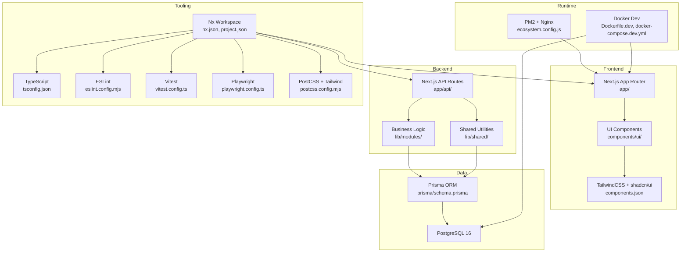
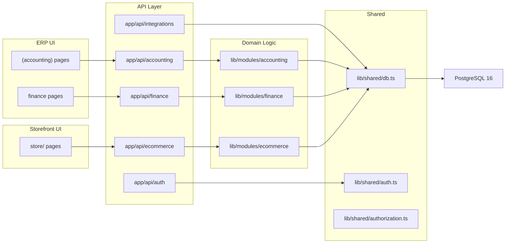
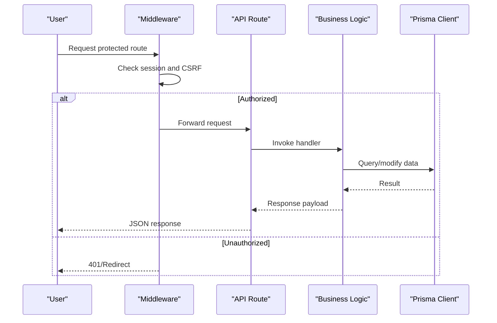
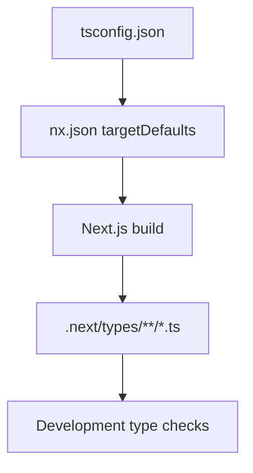
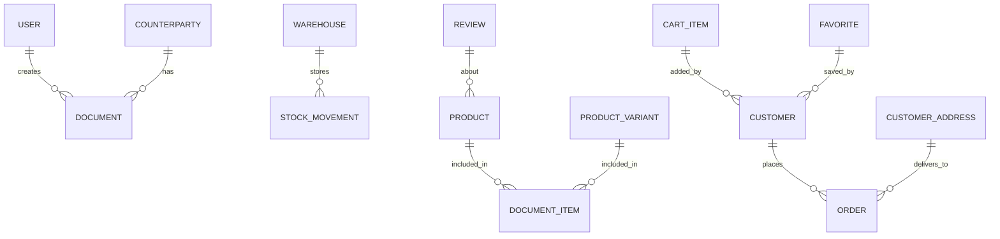
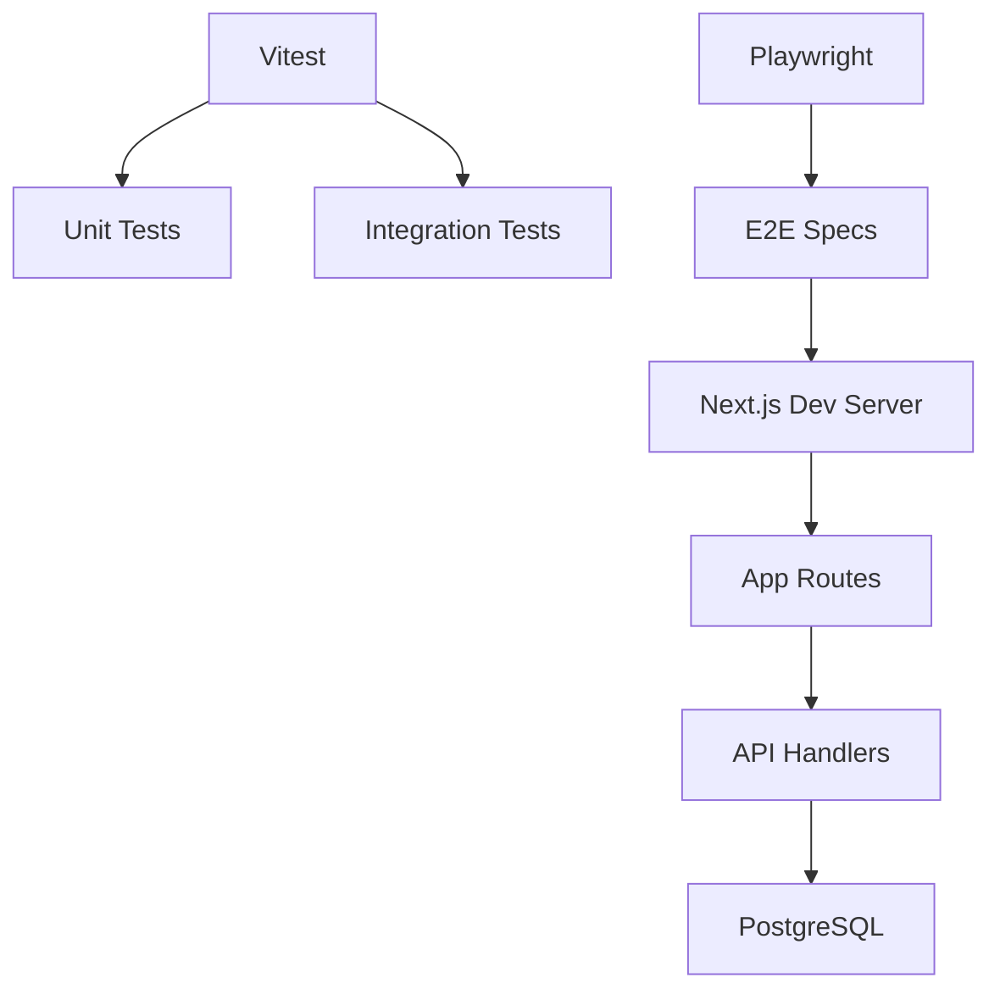
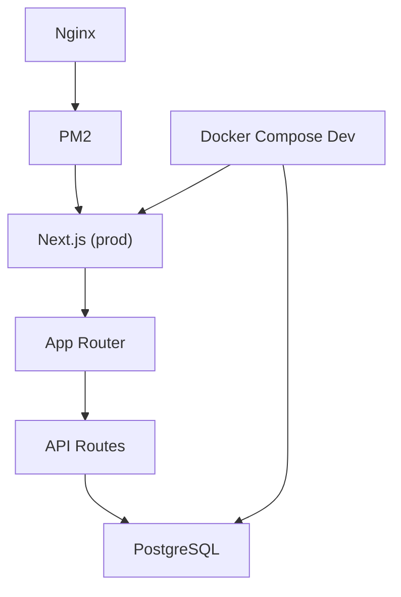
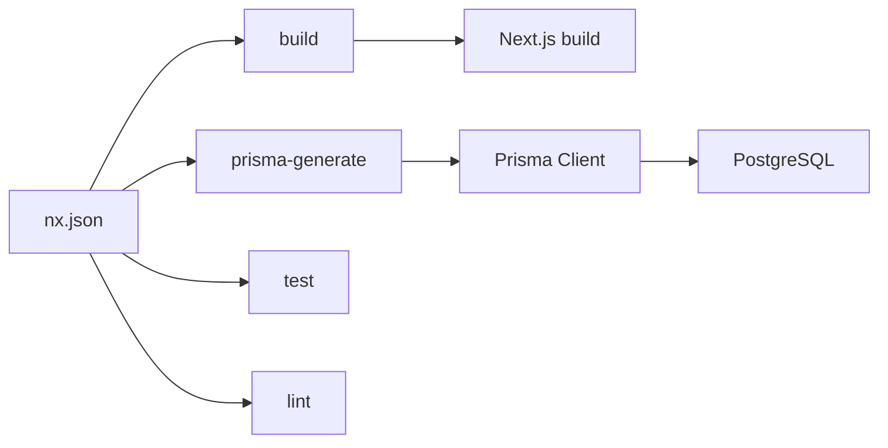

# Technology Stack

<cite>
**Referenced Files in This Document**
- [package.json](file://package.json)
- [next.config.ts](file://next.config.ts)
- [tsconfig.json](file://tsconfig.json)
- [eslint.config.mjs](file://eslint.config.mjs)
- [vitest.config.ts](file://vitest.config.ts)
- [playwright.config.ts](file://playwright.config.ts)
- [prisma/schema.prisma](file://prisma/schema.prisma)
- [components.json](file://components.json)
- [postcss.config.mjs](file://postcss.config.mjs)
- [nx.json](file://nx.json)
- [project.json](file://project.json)
- [ecosystem.config.js](file://ecosystem.config.js)
- [Dockerfile.dev](file://Dockerfile.dev)
- [docker-compose.dev.yml](file://docker-compose.dev.yml)
- [ARCHITECTURE.md](file://ARCHITECTURE.md)
- [README.md](file://README.md)
- [components/ui/button.tsx](file://components/ui/button.tsx)
- [components/ui/card.tsx](file://components/ui/card.tsx)
- [lib/shared/db.ts](file://lib/shared/db.ts)
- [lib/shared/auth.ts](file://lib/shared/auth.ts)
- [app/layout.tsx](file://app/layout.tsx)
- [middleware.ts](file://middleware.ts)
</cite>

## Table of Contents
1. [Introduction](#introduction)
2. [Project Structure](#project-structure)
3. [Core Components](#core-components)
4. [Architecture Overview](#architecture-overview)
5. [Detailed Component Analysis](#detailed-component-analysis)
6. [Dependency Analysis](#dependency-analysis)
7. [Performance Considerations](#performance-considerations)
8. [Troubleshooting Guide](#troubleshooting-guide)
9. [Conclusion](#conclusion)
10. [Appendices](#appendices)

## Introduction
This document provides a comprehensive technology stack overview for ListOpt ERP. It covers frontend and backend frameworks, database and ORM, styling and UI libraries, testing tools, deployment infrastructure, and developer tooling. It also outlines version requirements, compatibility considerations, and upgrade paths for major technologies.

## Project Structure
ListOpt ERP follows a modular monolith architecture built with Next.js App Router. The repository is organized into:
- app/: Next.js App Router pages and API routes
- components/: UI primitives and module-specific components (shadcn/ui)
- lib/: shared utilities, business logic modules, and generated Prisma client
- prisma/: schema and migrations
- tests/: unit, integration, and E2E test suites
- Tooling configs for Next.js, TypeScript, ESLint, Vitest, Playwright, PostCSS/Tailwind, Nx workspaces, and PM2

**Diagram sources**
- [ARCHITECTURE.md](file://ARCHITECTURE.md)
- [nx.json](file://nx.json)
- [project.json](file://project.json)
- [prisma/schema.prisma](file://prisma/schema.prisma)
- [components.json](file://components.json)
- [ecosystem.config.js](file://ecosystem.config.js)
- [Dockerfile.dev](file://Dockerfile.dev)
- [docker-compose.dev.yml](file://docker-compose.dev.yml)

**Section sources**
- [ARCHITECTURE.md](file://ARCHITECTURE.md)
- [nx.json](file://nx.json)
- [project.json](file://project.json)

## Core Components
- Frontend framework: Next.js 16 with App Router
- UI framework: React 19
- Styling: TailwindCSS v4 with PostCSS
- UI components: shadcn/ui primitives
- Backend runtime: Next.js API Routes
- Database: PostgreSQL 16
- ORM: Prisma with Prisma Client and @prisma/adapter-pg
- State and theming: next-themes
- Rich text: TipTap extensions
- Icons: Lucide React
- Utilities: class-variance-authority, clsx, tailwind-merge, radix-ui, sonner
- Build and orchestration: Nx workspace
- Type safety: TypeScript 5.x
- Linting: ESLint 9 with Next.js configs and Nx plugin
- Testing: Vitest (unit/integration), Playwright (E2E)
- Deployment: PM2 + Nginx; Docker Compose for dev; SSH archive deployment

**Section sources**
- [package.json](file://package.json)
- [README.md](file://README.md)
- [ARCHITECTURE.md](file://ARCHITECTURE.md)

## Architecture Overview
The system separates concerns across modules:
- Accounting and Finance domains under route groups
- E-commerce storefront under a dedicated route group
- Shared business logic in lib/modules
- Shared utilities and database access in lib/shared
- UI primitives in components/ui using shadcn/ui

**Diagram sources**
- [ARCHITECTURE.md](file://ARCHITECTURE.md)
- [lib/shared/db.ts](file://lib/shared/db.ts)
- [lib/shared/auth.ts](file://lib/shared/auth.ts)

**Section sources**
- [ARCHITECTURE.md](file://ARCHITECTURE.md)

## Detailed Component Analysis

### Next.js 16 with App Router
- App Router pages and route groups organize domain boundaries (accounting, finance, store).
- Middleware enforces authentication, CSRF protection, and redirects for legacy routes.
- Next.js configuration sets security headers, redirects, and runtime behavior.

**Diagram sources**
- [middleware.ts](file://middleware.ts)
- [lib/shared/auth.ts](file://lib/shared/auth.ts)
- [lib/shared/db.ts](file://lib/shared/db.ts)

**Section sources**
- [middleware.ts](file://middleware.ts)
- [app/layout.tsx](file://app/layout.tsx)
- [next.config.ts](file://next.config.ts)

### React 19
- The project uses React 19.x for client-side rendering and component composition.
- UI primitives are implemented with React components and shadcn/ui.

**Section sources**
- [package.json](file://package.json)
- [components/ui/button.tsx](file://components/ui/button.tsx)
- [components/ui/card.tsx](file://components/ui/card.tsx)

### TypeScript and Type Safety
- Strict TypeScript configuration with ESNext modules and bundler resolution.
- Path aliases configured to simplify imports.
- Nx workspace integrates TypeScript compilation and caching.

**Diagram sources**
- [tsconfig.json](file://tsconfig.json)
- [nx.json](file://nx.json)

**Section sources**
- [tsconfig.json](file://tsconfig.json)
- [nx.json](file://nx.json)

### PostgreSQL with Prisma ORM
- PostgreSQL 16 as the primary datastore.
- Prisma schema defines models, enums, relations, and indexes.
- Prisma Client is generated into lib/generated/prisma.
- Database access is centralized via a shared Prisma client instance.

**Diagram sources**
- [prisma/schema.prisma](file://prisma/schema.prisma)

**Section sources**
- [prisma/schema.prisma](file://prisma/schema.prisma)
- [lib/shared/db.ts](file://lib/shared/db.ts)

### TailwindCSS and shadcn/ui
- TailwindCSS v4 configured via PostCSS.
- shadcn/ui is configured for RSC, TSX, and New York style.
- UI primitives are implemented in components/ui and composed via cn/tailwind-merge.

**Section sources**
- [postcss.config.mjs](file://postcss.config.mjs)
- [components.json](file://components.json)
- [components/ui/button.tsx](file://components/ui/button.tsx)
- [components/ui/card.tsx](file://components/ui/card.tsx)

### Testing Stack
- Vitest: unit and integration tests with sequential execution to prevent DB race conditions.
- Playwright: E2E tests with a local Next.js server and test environment variables.
- Nx orchestrates test targets and caches.

**Diagram sources**
- [vitest.config.ts](file://vitest.config.ts)
- [playwright.config.ts](file://playwright.config.ts)
- [nx.json](file://nx.json)

**Section sources**
- [vitest.config.ts](file://vitest.config.ts)
- [playwright.config.ts](file://playwright.config.ts)
- [nx.json](file://nx.json)

### ESLint Configuration
- Extends Next.js core-web-vitals and TypeScript configs.
- Enforces Nx module boundaries and restricts internal module imports.
- Ignores generated and cache directories.

**Section sources**
- [eslint.config.mjs](file://eslint.config.mjs)

### Deployment Technologies
- PM2 manages the production Next.js process with environment variables.
- Nginx typically fronts the app (configuration not included here).
- Docker Compose supports local development with hot reload and database persistence.
- Archive-based SSH deployment supported for manual releases.

**Diagram sources**
- [ecosystem.config.js](file://ecosystem.config.js)
- [docker-compose.dev.yml](file://docker-compose.dev.yml)

**Section sources**
- [ecosystem.config.js](file://ecosystem.config.js)
- [docker-compose.dev.yml](file://docker-compose.dev.yml)
- [README.md](file://README.md)

## Dependency Analysis
The project uses Nx to manage targets and dependencies across build, test, lint, and Prisma generation steps. Prisma generation is a prerequisite for builds.

**Diagram sources**
- [nx.json](file://nx.json)
- [project.json](file://project.json)

**Section sources**
- [nx.json](file://nx.json)
- [project.json](file://project.json)

## Performance Considerations
- Use Next.js static generation and ISR where appropriate to reduce server load.
- Leverage Prisma indexes defined in the schema for query performance.
- Keep middleware logic minimal and cacheable where possible.
- Use Vitest’s sequential test execution to avoid DB contention during CI runs.
- Enable Nx caching for faster incremental builds.

## Troubleshooting Guide
Common areas to check:
- Database connectivity: ensure DATABASE_URL is set and reachable.
- Session secrets: SESSION_SECRET must be present for auth and CSRF.
- Prisma client: regenerate after schema changes using the provided scripts.
- Environment variables: configure .env.test for Playwright and Vitest.

**Section sources**
- [lib/shared/db.ts](file://lib/shared/db.ts)
- [lib/shared/auth.ts](file://lib/shared/auth.ts)
- [playwright.config.ts](file://playwright.config.ts)
- [vitest.config.ts](file://vitest.config.ts)

## Conclusion
ListOpt ERP combines modern frontend and backend technologies with a clear separation of concerns. The stack emphasizes type safety, modular architecture, robust testing, and pragmatic deployment tooling. Following the outlined configurations and upgrade paths ensures maintainability and scalability.

## Appendices

### Version Requirements and Compatibility Matrix
- Next.js 16.1.6
- React 19.2.3
- TypeScript 5.x
- Next.js ESLint config 16.1.6
- Nx 22.5.2
- Prisma 7.4.1
- PostgreSQL 16
- TailwindCSS 4.x
- Vitest 4.x
- Playwright 1.58.2
- Node.js 20 (as used in Docker dev image)

**Section sources**
- [package.json](file://package.json)
- [Dockerfile.dev](file://Dockerfile.dev)

### Upgrade Paths
- Next.js: Align TypeScript and ESLint configs with the Next.js version; verify App Router behavior and middleware changes.
- React: Validate component APIs and hooks; ensure shadcn/ui components remain compatible.
- TypeScript: Incrementally update tsconfig and resolve strictness-related issues.
- Prisma: Run schema introspection and migrations; regenerate Prisma Client; verify generated types.
- PostgreSQL: Back up before upgrades; test migrations in staging.
- TailwindCSS: Review breaking changes in v4; update PostCSS and component classes accordingly.
- Testing: Update Playwright and Vitest configs to match new versions; adjust timeouts and environment settings.

**Section sources**
- [package.json](file://package.json)
- [prisma/schema.prisma](file://prisma/schema.prisma)
- [postcss.config.mjs](file://postcss.config.mjs)
- [playwright.config.ts](file://playwright.config.ts)
- [vitest.config.ts](file://vitest.config.ts)