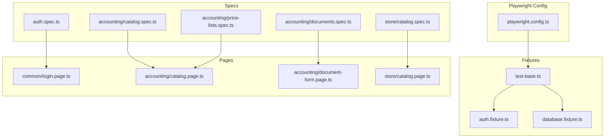
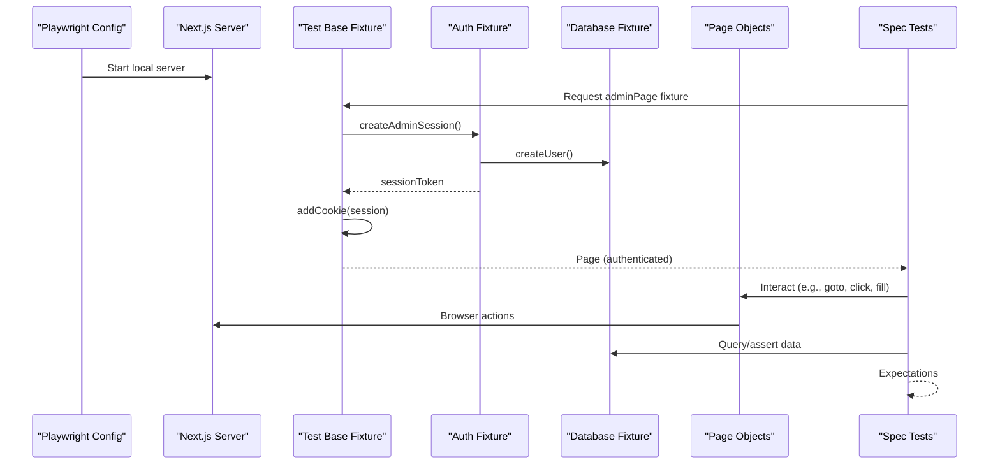
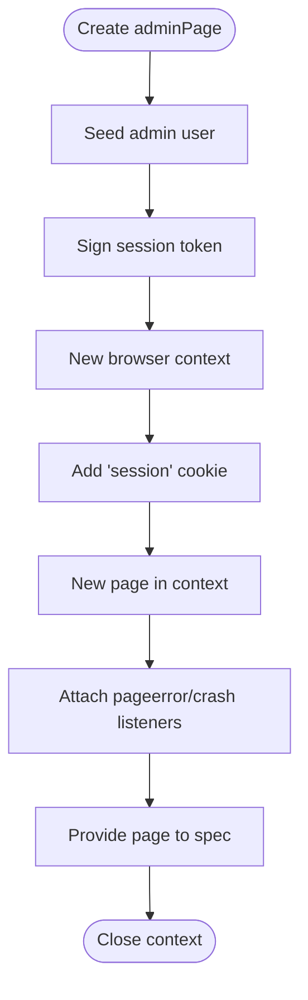
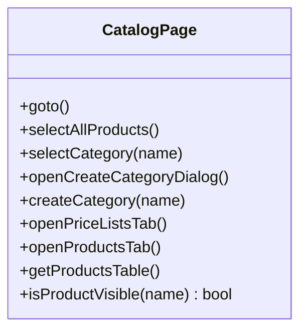
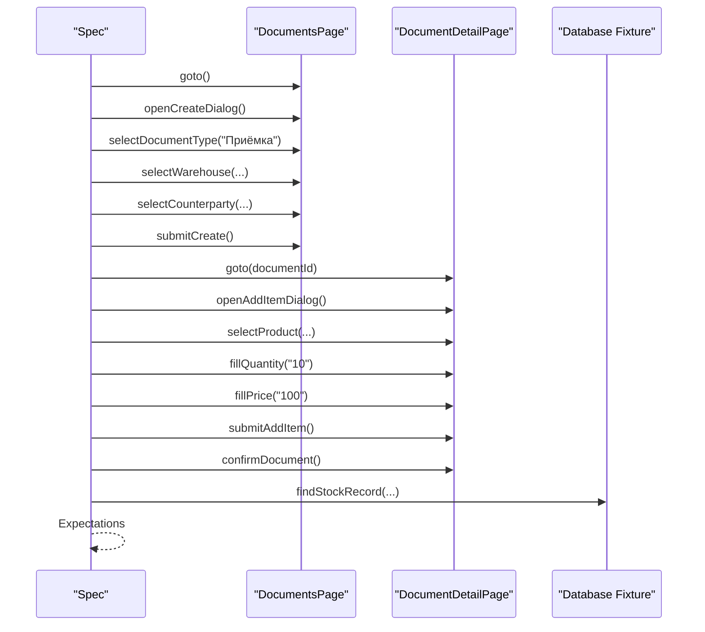
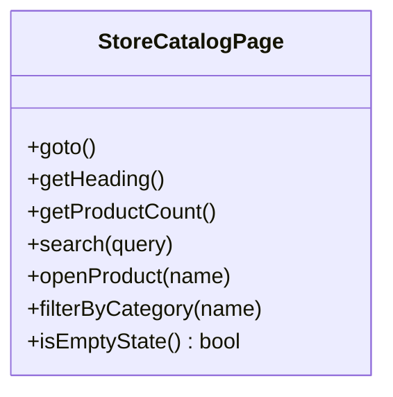
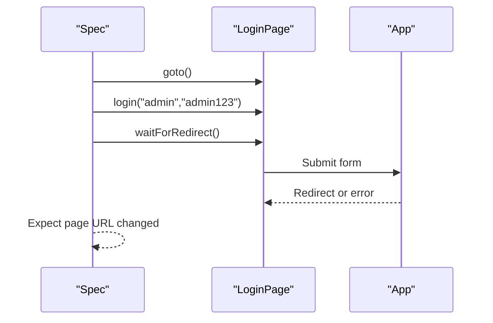
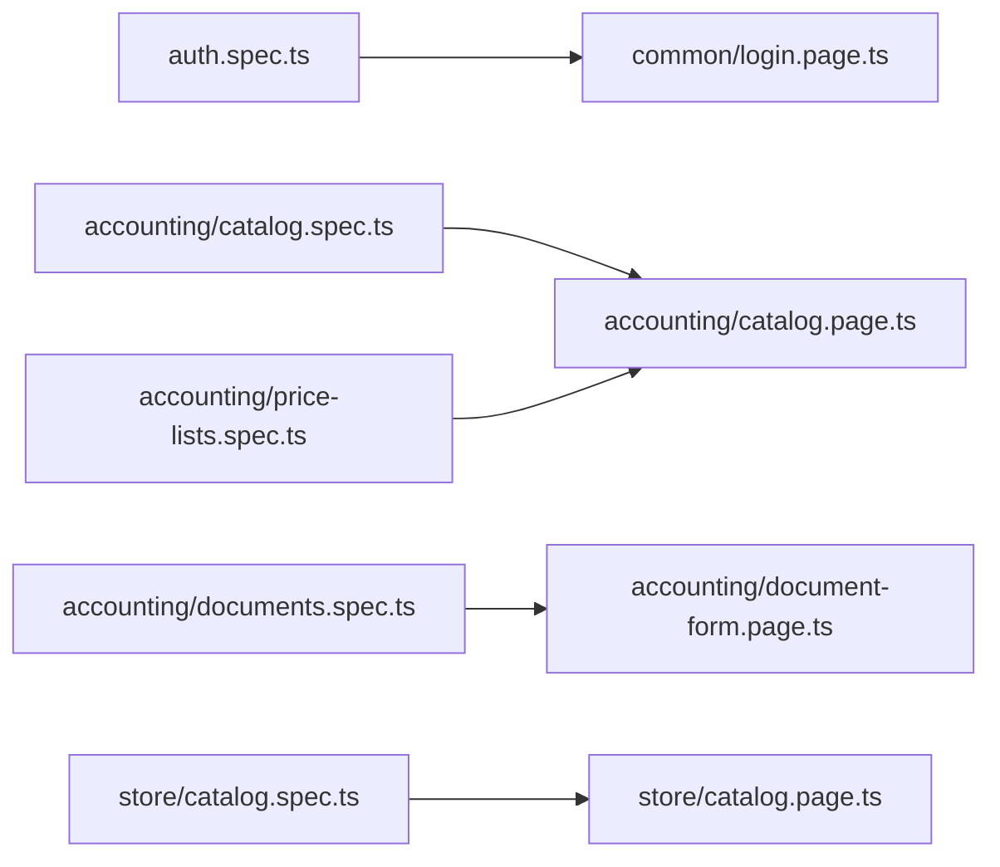
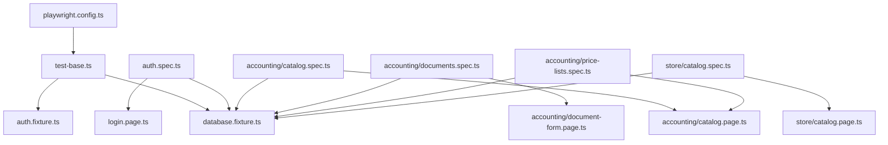

# End-to-End Testing

<cite>
**Referenced Files in This Document**
- [playwright.config.ts](file://playwright.config.ts)
- [tests/setup.ts](file://tests/setup.ts)
- [tests/e2e/fixtures/test-base.ts](file://tests/e2e/fixtures/test-base.ts)
- [tests/e2e/fixtures/auth.fixture.ts](file://tests/e2e/fixtures/auth.fixture.ts)
- [tests/e2e/fixtures/database.fixture.ts](file://tests/e2e/fixtures/database.fixture.ts)
- [tests/e2e/pages/common/login.page.ts](file://tests/e2e/pages/common/login.page.ts)
- [tests/e2e/pages/accounting/catalog.page.ts](file://tests/e2e/pages/accounting/catalog.page.ts)
- [tests/e2e/pages/accounting/document-form.page.ts](file://tests/e2e/pages/accounting/document-form.page.ts)
- [tests/e2e/pages/store/catalog.page.ts](file://tests/e2e/pages/store/catalog.page.ts)
- [tests/e2e/specs/auth.spec.ts](file://tests/e2e/specs/auth.spec.ts)
- [tests/e2e/specs/accounting/catalog.spec.ts](file://tests/e2e/specs/accounting/catalog.spec.ts)
- [tests/e2e/specs/accounting/documents.spec.ts](file://tests/e2e/specs/accounting/documents.spec.ts)
- [tests/e2e/specs/accounting/price-lists.spec.ts](file://tests/e2e/specs/accounting/price-lists.spec.ts)
- [tests/e2e/specs/store/catalog.spec.ts](file://tests/e2e/specs/store/catalog.spec.ts)
</cite>

## Table of Contents
1. [Introduction](#introduction)
2. [Project Structure](#project-structure)
3. [Core Components](#core-components)
4. [Architecture Overview](#architecture-overview)
5. [Detailed Component Analysis](#detailed-component-analysis)
6. [Dependency Analysis](#dependency-analysis)
7. [Performance Considerations](#performance-considerations)
8. [Troubleshooting Guide](#troubleshooting-guide)
9. [Conclusion](#conclusion)
10. [Appendices](#appendices)

## Introduction
This document describes the end-to-end testing architecture for ListOpt ERP using Playwright. It covers the test setup, page object models (POMs), fixtures, and reusable page objects for key modules (authentication, accounting catalog, accounting documents, and store catalog). It also documents test scenarios, data preparation, and execution strategies. Guidance is included for reliable E2E testing, handling asynchronous operations, managing test data, debugging, and integrating with CI/CD.

## Project Structure
The E2E tests are organized under tests/e2e with three primary areas:
- fixtures: Shared test setup, authentication, and database helpers
- pages: Reusable page objects for UI interactions
- specs: Scenario-driven tests grouped by module

**Diagram sources**
- [playwright.config.ts:1-40](file://playwright.config.ts#L1-L40)
- [tests/e2e/fixtures/test-base.ts:1-41](file://tests/e2e/fixtures/test-base.ts#L1-L41)
- [tests/e2e/fixtures/auth.fixture.ts:1-33](file://tests/e2e/fixtures/auth.fixture.ts#L1-L33)
- [tests/e2e/fixtures/database.fixture.ts:1-334](file://tests/e2e/fixtures/database.fixture.ts#L1-L334)
- [tests/e2e/pages/common/login.page.ts:1-30](file://tests/e2e/pages/common/login.page.ts#L1-L30)
- [tests/e2e/pages/accounting/catalog.page.ts:1-62](file://tests/e2e/pages/accounting/catalog.page.ts#L1-L62)
- [tests/e2e/pages/accounting/document-form.page.ts](file://tests/e2e/pages/accounting/document-form.page.ts)
- [tests/e2e/pages/store/catalog.page.ts:1-45](file://tests/e2e/pages/store/catalog.page.ts#L1-L45)
- [tests/e2e/specs/auth.spec.ts:1-46](file://tests/e2e/specs/auth.spec.ts#L1-L46)
- [tests/e2e/specs/accounting/catalog.spec.ts:1-60](file://tests/e2e/specs/accounting/catalog.spec.ts#L1-L60)
- [tests/e2e/specs/accounting/documents.spec.ts:1-165](file://tests/e2e/specs/accounting/documents.spec.ts#L1-L165)
- [tests/e2e/specs/accounting/price-lists.spec.ts:1-71](file://tests/e2e/specs/accounting/price-lists.spec.ts#L1-L71)
- [tests/e2e/specs/store/catalog.spec.ts:1-63](file://tests/e2e/specs/store/catalog.spec.ts#L1-L63)

**Section sources**
- [playwright.config.ts:1-40](file://playwright.config.ts#L1-L40)
- [tests/e2e/fixtures/test-base.ts:1-41](file://tests/e2e/fixtures/test-base.ts#L1-L41)
- [tests/e2e/fixtures/auth.fixture.ts:1-33](file://tests/e2e/fixtures/auth.fixture.ts#L1-L33)
- [tests/e2e/fixtures/database.fixture.ts:1-334](file://tests/e2e/fixtures/database.fixture.ts#L1-L334)
- [tests/e2e/pages/common/login.page.ts:1-30](file://tests/e2e/pages/common/login.page.ts#L1-L30)
- [tests/e2e/pages/accounting/catalog.page.ts:1-62](file://tests/e2e/pages/accounting/catalog.page.ts#L1-L62)
- [tests/e2e/pages/accounting/document-form.page.ts](file://tests/e2e/pages/accounting/document-form.page.ts)
- [tests/e2e/pages/store/catalog.page.ts:1-45](file://tests/e2e/pages/store/catalog.page.ts#L1-L45)
- [tests/e2e/specs/auth.spec.ts:1-46](file://tests/e2e/specs/auth.spec.ts#L1-L46)
- [tests/e2e/specs/accounting/catalog.spec.ts:1-60](file://tests/e2e/specs/accounting/catalog.spec.ts#L1-L60)
- [tests/e2e/specs/accounting/documents.spec.ts:1-165](file://tests/e2e/specs/accounting/documents.spec.ts#L1-L165)
- [tests/e2e/specs/accounting/price-lists.spec.ts:1-71](file://tests/e2e/specs/accounting/price-lists.spec.ts#L1-L71)
- [tests/e2e/specs/store/catalog.spec.ts:1-63](file://tests/e2e/specs/store/catalog.spec.ts#L1-L63)

## Core Components
- Playwright configuration defines test directory, worker count, timeouts, traces, screenshots, videos, and a local Next.js server for the app under test.
- Fixtures provide a pre-authenticated admin page and database helpers to prepare realistic test data.
- Page objects encapsulate UI interactions for common flows (login, accounting catalog, document forms, store catalog).
- Test specs organize scenarios per module, leveraging fixtures and POMs.

Key responsibilities:
- playwright.config.ts: Defines runtime behavior, browser selection, web server lifecycle, and environment variables.
- test-base.ts: Creates an authenticated admin session by injecting a signed session cookie into a new browser context.
- auth.fixture.ts: Signs a session token suitable for the backend’s auth scheme.
- database.fixture.ts: Provides factory functions and queries to seed and assert against the test database.
- POMs: LoginPage, CatalogPage, DocumentDetailPage, StoreCatalogPage.

**Section sources**
- [playwright.config.ts:1-40](file://playwright.config.ts#L1-L40)
- [tests/e2e/fixtures/test-base.ts:1-41](file://tests/e2e/fixtures/test-base.ts#L1-L41)
- [tests/e2e/fixtures/auth.fixture.ts:1-33](file://tests/e2e/fixtures/auth.fixture.ts#L1-L33)
- [tests/e2e/fixtures/database.fixture.ts:1-334](file://tests/e2e/fixtures/database.fixture.ts#L1-L334)
- [tests/e2e/pages/common/login.page.ts:1-30](file://tests/e2e/pages/common/login.page.ts#L1-L30)
- [tests/e2e/pages/accounting/catalog.page.ts:1-62](file://tests/e2e/pages/accounting/catalog.page.ts#L1-L62)
- [tests/e2e/pages/accounting/document-form.page.ts](file://tests/e2e/pages/accounting/document-form.page.ts)
- [tests/e2e/pages/store/catalog.page.ts:1-45](file://tests/e2e/pages/store/catalog.page.ts#L1-L45)

## Architecture Overview
The E2E architecture follows a layered approach:
- Configuration layer: Playwright config and environment
- Fixture layer: Pre-authenticated sessions and database helpers
- Page layer: Encapsulated UI interactions
- Spec layer: Scenario-driven tests

**Diagram sources**
- [playwright.config.ts:28-38](file://playwright.config.ts#L28-L38)
- [tests/e2e/fixtures/test-base.ts:9-37](file://tests/e2e/fixtures/test-base.ts#L9-L37)
- [tests/e2e/fixtures/auth.fixture.ts:15-32](file://tests/e2e/fixtures/auth.fixture.ts#L15-L32)
- [tests/e2e/fixtures/database.fixture.ts:94-110](file://tests/e2e/fixtures/database.fixture.ts#L94-L110)
- [tests/e2e/pages/common/login.page.ts:6-20](file://tests/e2e/pages/common/login.page.ts#L6-L20)
- [tests/e2e/specs/auth.spec.ts:11-20](file://tests/e2e/specs/auth.spec.ts#L11-L20)

## Detailed Component Analysis

### Authentication and Session Fixture
The admin session fixture signs a session token and injects it as a cookie to bypass login in tests. It also attaches page error listeners for robust debugging.

**Diagram sources**
- [tests/e2e/fixtures/test-base.ts:9-37](file://tests/e2e/fixtures/test-base.ts#L9-L37)
- [tests/e2e/fixtures/auth.fixture.ts:15-32](file://tests/e2e/fixtures/auth.fixture.ts#L15-L32)
- [tests/e2e/fixtures/database.fixture.ts:94-110](file://tests/e2e/fixtures/database.fixture.ts#L94-L110)

**Section sources**
- [tests/e2e/fixtures/test-base.ts:1-41](file://tests/e2e/fixtures/test-base.ts#L1-L41)
- [tests/e2e/fixtures/auth.fixture.ts:1-33](file://tests/e2e/fixtures/auth.fixture.ts#L1-L33)
- [tests/e2e/fixtures/database.fixture.ts:1-334](file://tests/e2e/fixtures/database.fixture.ts#L1-L334)

### Accounting Catalog Page Object
Encapsulates navigation and interactions in the accounting catalog, including category filtering, creation, and tab switching.

**Diagram sources**
- [tests/e2e/pages/accounting/catalog.page.ts:1-62](file://tests/e2e/pages/accounting/catalog.page.ts#L1-L62)

**Section sources**
- [tests/e2e/pages/accounting/catalog.page.ts:1-62](file://tests/e2e/pages/accounting/catalog.page.ts#L1-L62)

### Accounting Document Form Pages
The document form page objects support navigating to the documents list, opening the create dialog, selecting type and entities, adding items, confirming, and deleting drafts. Assertions validate stock records and UI messages.

**Diagram sources**
- [tests/e2e/pages/accounting/document-form.page.ts](file://tests/e2e/pages/accounting/document-form.page.ts)
- [tests/e2e/specs/accounting/documents.spec.ts:24-73](file://tests/e2e/specs/accounting/documents.spec.ts#L24-L73)
- [tests/e2e/fixtures/database.fixture.ts:282-301](file://tests/e2e/fixtures/database.fixture.ts#L282-L301)

**Section sources**
- [tests/e2e/pages/accounting/document-form.page.ts](file://tests/e2e/pages/accounting/document-form.page.ts)
- [tests/e2e/specs/accounting/documents.spec.ts:1-165](file://tests/e2e/specs/accounting/documents.spec.ts#L1-L165)
- [tests/e2e/fixtures/database.fixture.ts:199-244](file://tests/e2e/fixtures/database.fixture.ts#L199-L244)

### Store Catalog Page Object
Implements public store catalog interactions: navigation, search, category filtering, and empty-state detection.

**Diagram sources**
- [tests/e2e/pages/store/catalog.page.ts:1-45](file://tests/e2e/pages/store/catalog.page.ts#L1-L45)

**Section sources**
- [tests/e2e/pages/store/catalog.page.ts:1-45](file://tests/e2e/pages/store/catalog.page.ts#L1-L45)

### Login Page Object
Handles visiting the login page, filling credentials, submitting, and verifying redirect or error messages.

**Diagram sources**
- [tests/e2e/pages/common/login.page.ts:6-20](file://tests/e2e/pages/common/login.page.ts#L6-L20)
- [tests/e2e/specs/auth.spec.ts:11-20](file://tests/e2e/specs/auth.spec.ts#L11-L20)

**Section sources**
- [tests/e2e/pages/common/login.page.ts:1-30](file://tests/e2e/pages/common/login.page.ts#L1-L30)
- [tests/e2e/specs/auth.spec.ts:1-46](file://tests/e2e/specs/auth.spec.ts#L1-L46)

### Test Scenarios and Organization
- Authentication: Successful login, invalid credentials, unauthenticated redirect, and admin cookie access.
- Accounting Catalog: Create category, view products, filter by category, switch tabs.
- Accounting Documents: Create draft receipt, add items, confirm, verify stock, delete draft, inter-warehouse transfer.
- Price Lists: Isolate base vs list-specific pricing, create via UI tab.
- Store Catalog: Public catalog display, search, category filter, empty state.

**Diagram sources**
- [tests/e2e/specs/auth.spec.ts:1-46](file://tests/e2e/specs/auth.spec.ts#L1-L46)
- [tests/e2e/pages/common/login.page.ts:1-30](file://tests/e2e/pages/common/login.page.ts#L1-L30)
- [tests/e2e/specs/accounting/catalog.spec.ts:1-60](file://tests/e2e/specs/accounting/catalog.spec.ts#L1-L60)
- [tests/e2e/pages/accounting/catalog.page.ts:1-62](file://tests/e2e/pages/accounting/catalog.page.ts#L1-L62)
- [tests/e2e/specs/accounting/documents.spec.ts:1-165](file://tests/e2e/specs/accounting/documents.spec.ts#L1-L165)
- [tests/e2e/pages/accounting/document-form.page.ts](file://tests/e2e/pages/accounting/document-form.page.ts)
- [tests/e2e/specs/accounting/price-lists.spec.ts:1-71](file://tests/e2e/specs/accounting/price-lists.spec.ts#L1-L71)
- [tests/e2e/specs/store/catalog.spec.ts:1-63](file://tests/e2e/specs/store/catalog.spec.ts#L1-L63)
- [tests/e2e/pages/store/catalog.page.ts:1-45](file://tests/e2e/pages/store/catalog.page.ts#L1-L45)

**Section sources**
- [tests/e2e/specs/auth.spec.ts:1-46](file://tests/e2e/specs/auth.spec.ts#L1-L46)
- [tests/e2e/specs/accounting/catalog.spec.ts:1-60](file://tests/e2e/specs/accounting/catalog.spec.ts#L1-L60)
- [tests/e2e/specs/accounting/documents.spec.ts:1-165](file://tests/e2e/specs/accounting/documents.spec.ts#L1-L165)
- [tests/e2e/specs/accounting/price-lists.spec.ts:1-71](file://tests/e2e/specs/accounting/price-lists.spec.ts#L1-L71)
- [tests/e2e/specs/store/catalog.spec.ts:1-63](file://tests/e2e/specs/store/catalog.spec.ts#L1-L63)

## Dependency Analysis
The test suite exhibits clear separation of concerns:
- Specs depend on fixtures and POMs
- Fixtures depend on database helpers
- POMs depend on Playwright Page Locators
- Configuration drives the web server lifecycle and test execution

**Diagram sources**
- [playwright.config.ts:1-40](file://playwright.config.ts#L1-L40)
- [tests/e2e/fixtures/test-base.ts:1-41](file://tests/e2e/fixtures/test-base.ts#L1-L41)
- [tests/e2e/fixtures/auth.fixture.ts:1-33](file://tests/e2e/fixtures/auth.fixture.ts#L1-L33)
- [tests/e2e/fixtures/database.fixture.ts:1-334](file://tests/e2e/fixtures/database.fixture.ts#L1-L334)
- [tests/e2e/pages/common/login.page.ts:1-30](file://tests/e2e/pages/common/login.page.ts#L1-L30)
- [tests/e2e/pages/accounting/catalog.page.ts:1-62](file://tests/e2e/pages/accounting/catalog.page.ts#L1-L62)
- [tests/e2e/pages/accounting/document-form.page.ts](file://tests/e2e/pages/accounting/document-form.page.ts)
- [tests/e2e/pages/store/catalog.page.ts:1-45](file://tests/e2e/pages/store/catalog.page.ts#L1-L45)
- [tests/e2e/specs/auth.spec.ts:1-46](file://tests/e2e/specs/auth.spec.ts#L1-L46)
- [tests/e2e/specs/accounting/catalog.spec.ts:1-60](file://tests/e2e/specs/accounting/catalog.spec.ts#L1-L60)
- [tests/e2e/specs/accounting/documents.spec.ts:1-165](file://tests/e2e/specs/accounting/documents.spec.ts#L1-L165)
- [tests/e2e/specs/accounting/price-lists.spec.ts:1-71](file://tests/e2e/specs/accounting/price-lists.spec.ts#L1-L71)
- [tests/e2e/specs/store/catalog.spec.ts:1-63](file://tests/e2e/specs/store/catalog.spec.ts#L1-L63)

**Section sources**
- [playwright.config.ts:1-40](file://playwright.config.ts#L1-L40)
- [tests/e2e/fixtures/test-base.ts:1-41](file://tests/e2e/fixtures/test-base.ts#L1-L41)
- [tests/e2e/fixtures/auth.fixture.ts:1-33](file://tests/e2e/fixtures/auth.fixture.ts#L1-L33)
- [tests/e2e/fixtures/database.fixture.ts:1-334](file://tests/e2e/fixtures/database.fixture.ts#L1-L334)
- [tests/e2e/pages/common/login.page.ts:1-30](file://tests/e2e/pages/common/login.page.ts#L1-L30)
- [tests/e2e/pages/accounting/catalog.page.ts:1-62](file://tests/e2e/pages/accounting/catalog.page.ts#L1-L62)
- [tests/e2e/pages/accounting/document-form.page.ts](file://tests/e2e/pages/accounting/document-form.page.ts)
- [tests/e2e/pages/store/catalog.page.ts:1-45](file://tests/e2e/pages/store/catalog.page.ts#L1-L45)
- [tests/e2e/specs/auth.spec.ts:1-46](file://tests/e2e/specs/auth.spec.ts#L1-L46)
- [tests/e2e/specs/accounting/catalog.spec.ts:1-60](file://tests/e2e/specs/accounting/catalog.spec.ts#L1-L60)
- [tests/e2e/specs/accounting/documents.spec.ts:1-165](file://tests/e2e/specs/accounting/documents.spec.ts#L1-L165)
- [tests/e2e/specs/accounting/price-lists.spec.ts:1-71](file://tests/e2e/specs/accounting/price-lists.spec.ts#L1-L71)
- [tests/e2e/specs/store/catalog.spec.ts:1-63](file://tests/e2e/specs/store/catalog.spec.ts#L1-L63)

## Performance Considerations
- Use networkidle after navigations to ensure dynamic content is ready.
- Prefer explicit waits for critical UI states rather than arbitrary timeouts.
- Keep worker count low during development to reduce resource contention; increase for CI.
- Use trace, screenshot, and video selectively to avoid excessive storage overhead.
- Seed only necessary data per test to minimize database operations.

## Troubleshooting Guide
Common issues and remedies:
- Unauthenticated redirects: Ensure the admin session fixture is used and cookies are set before navigation.
- Flaky UI interactions: Add explicit waits for element visibility or load states.
- Database connectivity: Wrap database cleanup in try/catch blocks to handle missing DB gracefully in unit-only runs.
- Page crashes or JS errors: Use pageerror and crash listeners attached in the fixture to capture logs.
- Slow server startup: Increase web server timeout in configuration for CI environments.

Practical references:
- Admin session setup and logging: [tests/e2e/fixtures/test-base.ts:9-37](file://tests/e2e/fixtures/test-base.ts#L9-L37)
- Database cleanup and isolation: [tests/setup.ts:8-16](file://tests/setup.ts#L8-L16)
- Playwright configuration defaults and web server: [playwright.config.ts:6-38](file://playwright.config.ts#L6-L38)

**Section sources**
- [tests/e2e/fixtures/test-base.ts:1-41](file://tests/e2e/fixtures/test-base.ts#L1-L41)
- [tests/setup.ts:1-26](file://tests/setup.ts#L1-L26)
- [playwright.config.ts:1-40](file://playwright.config.ts#L1-L40)

## Conclusion
The E2E testing framework for ListOpt ERP leverages Playwright with a clear separation of concerns: configuration, fixtures, page objects, and scenario-driven specs. The admin session fixture and database helpers enable realistic, isolated tests across accounting and store modules. By following the documented patterns for navigation, form submission, asynchronous flows, and data preparation, teams can build reliable end-to-end validations that mirror real user journeys.

## Appendices

### Playwright Configuration Highlights
- Test directory: tests/e2e/specs
- Workers: 1 (can be increased in CI)
- Retries: 1
- Default timeout: 60 seconds; expect timeout: 10 seconds
- Tracing and recording enabled on first retry
- Local Next.js server on port 3099 with test environment variables

**Section sources**
- [playwright.config.ts:1-40](file://playwright.config.ts#L1-L40)

### Writing Reliable E2E Tests
- Use page objects to encapsulate UI interactions.
- Prefer role-based selectors and text-based locators for robustness.
- Wait for networkidle or explicit element states after navigations and submissions.
- Inject minimal, deterministic test data via fixtures.
- Assert both UI feedback and backend state via database queries.

### Handling Asynchronous Operations
- Use waitForLoadState after navigation.
- Use waitForTimeout judiciously; prefer waitFor for specific conditions.
- For real-time updates, assert presence of updated text or counters.

### Managing Test Data
- Clean database before each test using the provided helper.
- Seed only required entities for the current scenario.
- Use factories to generate consistent identifiers and relationships.

### Debugging Techniques
- Enable trace, screenshot, and video on first retry.
- Capture page errors and crashes via listeners in the fixture.
- Inspect network requests and responses using built-in request APIs in authenticated contexts.

### CI/CD Integration
- Reuse existing server in CI to speed up runs.
- Configure environment variables for DATABASE_URL and SESSION_SECRET.
- Archive artifacts (trace, video, screenshots) on failure for later inspection.