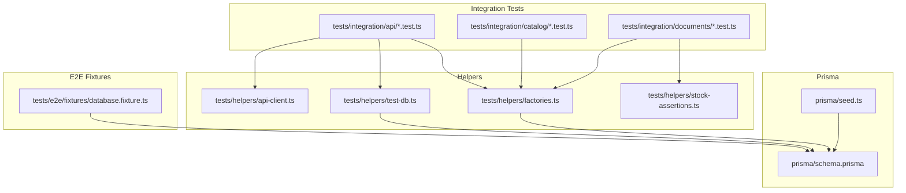
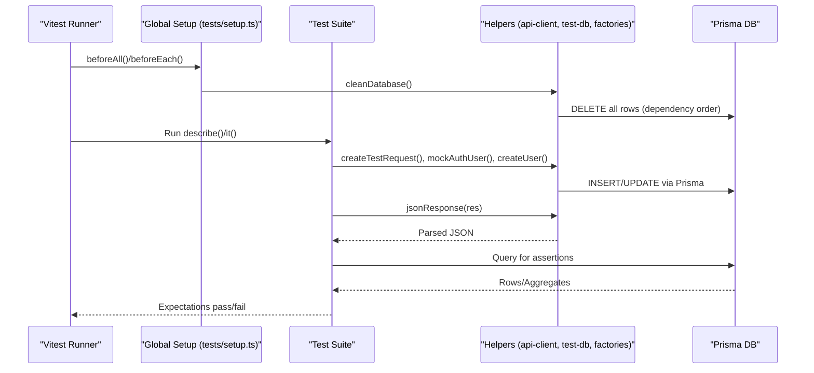
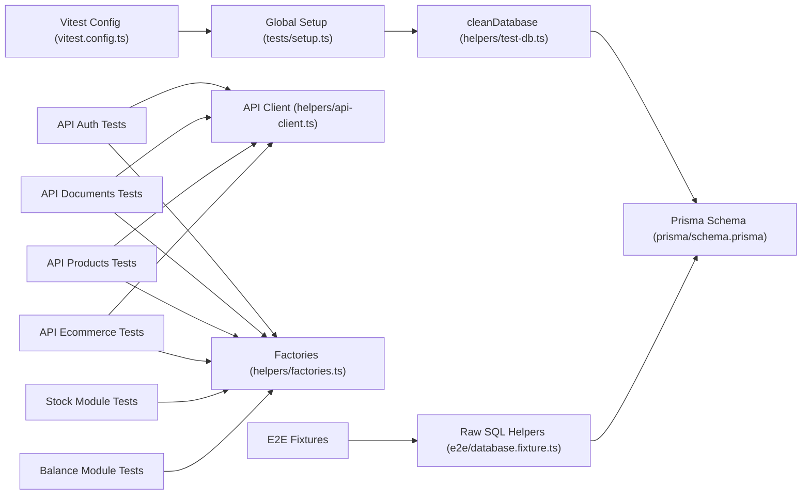

# Integration Testing

<cite>
**Referenced Files in This Document**
- [tests/setup.ts](file://tests/setup.ts)
- [vitest.config.ts](file://vitest.config.ts)
- [tests/helpers/api-client.ts](file://tests/helpers/api-client.ts)
- [tests/helpers/test-db.ts](file://tests/helpers/test-db.ts)
- [tests/helpers/factories.ts](file://tests/helpers/factories.ts)
- [tests/helpers/stock-assertions.ts](file://tests/helpers/stock-assertions.ts)
- [tests/integration/api/auth.test.ts](file://tests/integration/api/auth.test.ts)
- [tests/integration/api/documents.test.ts](file://tests/integration/api/documents.test.ts)
- [tests/integration/api/products.test.ts](file://tests/integration/api/products.test.ts)
- [tests/integration/api/ecommerce.test.ts](file://tests/integration/api/ecommerce.test.ts)
- [tests/integration/catalog/features.test.ts](file://tests/integration/catalog/features.test.ts)
- [tests/integration/documents/balance.test.ts](file://tests/integration/documents/balance.test.ts)
- [tests/integration/documents/stock.test.ts](file://tests/integration/documents/stock.test.ts)
- [tests/e2e/fixtures/database.fixture.ts](file://tests/e2e/fixtures/database.fixture.ts)
- [prisma/schema.prisma](file://prisma/schema.prisma)
- [prisma/seed.ts](file://prisma/seed.ts)
- [package.json](file://package.json)
</cite>

## Table of Contents
1. [Introduction](#introduction)
2. [Project Structure](#project-structure)
3. [Core Components](#core-components)
4. [Architecture Overview](#architecture-overview)
5. [Detailed Component Analysis](#detailed-component-analysis)
6. [Dependency Analysis](#dependency-analysis)
7. [Performance Considerations](#performance-considerations)
8. [Troubleshooting Guide](#troubleshooting-guide)
9. [Conclusion](#conclusion)
10. [Appendices](#appendices)

## Introduction
This document describes the integration testing architecture for ListOpt ERP, focusing on API endpoint coverage, database fixture management, request/response validation, and reusable testing utilities. It explains how tests are structured, how database fixtures are created and cleaned, and how to test authentication, business operations, e-commerce workflows, and stock/balance modules. It also covers environment setup, configuration, and best practices for maintainable integration tests.

## Project Structure
The integration tests live under the tests directory with a layered organization:
- tests/integration: API and domain module tests
- tests/helpers: shared utilities for API requests, database setup, factories, and assertions
- tests/e2e: end-to-end fixtures and helpers for raw database operations
- prisma: schema and seed scripts for database initialization

**Diagram sources**
- [tests/integration/api/auth.test.ts:1-197](file://tests/integration/api/auth.test.ts#L1-L197)
- [tests/helpers/api-client.ts:1-70](file://tests/helpers/api-client.ts#L1-L70)
- [tests/helpers/test-db.ts:1-58](file://tests/helpers/test-db.ts#L1-L58)
- [tests/helpers/factories.ts:1-636](file://tests/helpers/factories.ts#L1-L636)
- [tests/helpers/stock-assertions.ts:1-163](file://tests/helpers/stock-assertions.ts#L1-L163)
- [tests/e2e/fixtures/database.fixture.ts:1-334](file://tests/e2e/fixtures/database.fixture.ts#L1-L334)
- [prisma/schema.prisma:1-1067](file://prisma/schema.prisma#L1-L1067)
- [prisma/seed.ts:1-120](file://prisma/seed.ts#L1-L120)

**Section sources**
- [tests/integration/api/auth.test.ts:1-197](file://tests/integration/api/auth.test.ts#L1-L197)
- [tests/helpers/api-client.ts:1-70](file://tests/helpers/api-client.ts#L1-L70)
- [tests/helpers/test-db.ts:1-58](file://tests/helpers/test-db.ts#L1-L58)
- [tests/helpers/factories.ts:1-636](file://tests/helpers/factories.ts#L1-L636)
- [tests/helpers/stock-assertions.ts:1-163](file://tests/helpers/stock-assertions.ts#L1-L163)
- [tests/e2e/fixtures/database.fixture.ts:1-334](file://tests/e2e/fixtures/database.fixture.ts#L1-L334)
- [prisma/schema.prisma:1-1067](file://prisma/schema.prisma#L1-L1067)
- [prisma/seed.ts:1-120](file://prisma/seed.ts#L1-L120)

## Core Components
- Test runner configuration: Vitest with sequential execution and global setup for database cleanup.
- API client utilities: createTestRequest, mockAuth helpers, and JSON response parsing.
- Database helpers: cleanDatabase, disconnectTestDb, and getTestDb.
- Factories: Prisma-based factory functions for entities like users, products, documents, variants, discounts, and price lists.
- Stock assertions: reusable helpers to validate stock records and movement invariants.
- E2E database fixtures: raw SQL-based helpers for truncation and row insertion.

Key responsibilities:
- Isolation and cleanup via beforeEach and beforeAll hooks.
- Deterministic test data via factories and seed defaults.
- Consistent request construction and authentication mocking for API tests.
- Idempotent and invariant-preserving validations for stock and balance modules.

**Section sources**
- [tests/setup.ts:1-26](file://tests/setup.ts#L1-L26)
- [vitest.config.ts:1-30](file://vitest.config.ts#L1-L30)
- [tests/helpers/api-client.ts:1-70](file://tests/helpers/api-client.ts#L1-L70)
- [tests/helpers/test-db.ts:1-58](file://tests/helpers/test-db.ts#L1-L58)
- [tests/helpers/factories.ts:1-636](file://tests/helpers/factories.ts#L1-L636)
- [tests/helpers/stock-assertions.ts:1-163](file://tests/helpers/stock-assertions.ts#L1-L163)
- [tests/e2e/fixtures/database.fixture.ts:1-334](file://tests/e2e/fixtures/database.fixture.ts#L1-L334)

## Architecture Overview
The integration test architecture follows a layered pattern:
- Layer 1: Test suites for API endpoints and domain modules.
- Layer 2: Shared helpers for HTTP request creation, auth mocking, DB setup/cleanup, and data factories.
- Layer 3: Prisma schema and seed for consistent database state.
- Layer 4: Optional E2E fixtures for raw database operations.

**Diagram sources**
- [tests/setup.ts:1-26](file://tests/setup.ts#L1-L26)
- [tests/helpers/api-client.ts:1-70](file://tests/helpers/api-client.ts#L1-L70)
- [tests/helpers/test-db.ts:1-58](file://tests/helpers/test-db.ts#L1-L58)
- [tests/helpers/factories.ts:1-636](file://tests/helpers/factories.ts#L1-L636)
- [prisma/schema.prisma:1-1067](file://prisma/schema.prisma#L1-L1067)

## Detailed Component Analysis

### API Client Utilities
- createTestRequest: Builds a NextRequest-compatible object for route handlers, supporting method, body, and query parameters.
- mockAuthUser/mockAuthNone: Vi mocks for getAuthSession to simulate authenticated/unauthenticated sessions.
- jsonResponse: Parses Response JSON bodies for assertions.

Usage patterns:
- Import route handler under test.
- Construct NextRequest with createTestRequest.
- Call handler with mocked auth.
- Assert status codes and response shape.

**Section sources**
- [tests/helpers/api-client.ts:1-70](file://tests/helpers/api-client.ts#L1-L70)

### Database Fixture Management
- cleanDatabase: Deletes all rows in dependency order to prevent foreign key violations.
- disconnectTestDb/getTestDb: Manage Prisma connection lifecycle and expose DB client.
- E2E raw DB: truncate tables and insert rows via a dedicated Pool for E2E fixtures.

Best practices:
- Always clean before each test to ensure isolation.
- Prefer Prisma factories for ORM consistency; use E2E fixtures for raw SQL scenarios.
- Keep dependency order in cleanDatabase aligned with Prisma schema relations.

**Section sources**
- [tests/helpers/test-db.ts:1-58](file://tests/helpers/test-db.ts#L1-L58)
- [tests/e2e/fixtures/database.fixture.ts:1-334](file://tests/e2e/fixtures/database.fixture.ts#L1-L334)

### Request/Response Validation Patterns
- Status code assertions: expect(res.status).toBe(...) for positive/negative paths.
- Body assertions: parse JSON and assert fields, nested objects, arrays, and pagination metadata.
- Authentication checks: assert 401 for unauthenticated, 403 for insufficient roles.
- Error payload: assert presence of fields or error messages.

Examples in practice:
- Authentication endpoints validate setup/login/me flows and error cases.
- Documents CRUD validates create, list, filter, update, delete, confirm, cancel.
- Products CRUD validates create, list, filter, update, soft-delete.
- E-commerce endpoints validate cart, checkout, quick order, customer profile, and orders.

**Section sources**
- [tests/integration/api/auth.test.ts:1-197](file://tests/integration/api/auth.test.ts#L1-L197)
- [tests/integration/api/documents.test.ts:1-404](file://tests/integration/api/documents.test.ts#L1-L404)
- [tests/integration/api/products.test.ts:1-220](file://tests/integration/api/products.test.ts#L1-L220)
- [tests/integration/api/ecommerce.test.ts:1-384](file://tests/integration/api/ecommerce.test.ts#L1-L384)

### Authentication Endpoints Testing
- Setup: Create admin user when none exists; reject when users exist or password is invalid.
- Login: Accept valid credentials, reject invalid password/username, inactive user, and missing fields; verify session cookie.
- Me: Return current user when authenticated; 401 when not.

Testing approach:
- Mock getAuthSession to control session state.
- Use factories to provision users with varying roles and statuses.
- Validate cookies and response payload.

**Section sources**
- [tests/integration/api/auth.test.ts:1-197](file://tests/integration/api/auth.test.ts#L1-L197)

### Business Operation Endpoints Testing
- Documents CRUD:
  - Create draft document with items; validate totals and numbering.
  - Filter by type/status; paginate results.
  - Update replaces items; reject updates on confirmed documents.
  - Delete removes drafts; reject deletes on confirmed.
  - Confirm triggers stock updates and sets timestamps; reject invalid confirmations.
  - Cancel toggles status and timestamps; reject on draft.
- Products CRUD:
  - Create with auto-SKU generation; validate unit linkage.
  - Search/filter; update and soft-delete.

Validation:
- Use getTestDb to query DB after operations.
- Assert stock records and document totals.
- Enforce role-based access controls.

**Section sources**
- [tests/integration/api/documents.test.ts:1-404](file://tests/integration/api/documents.test.ts#L1-L404)
- [tests/integration/api/products.test.ts:1-220](file://tests/integration/api/products.test.ts#L1-L220)

### E-commerce Workflows Testing
- Cart:
  - GET returns empty/new cart; POST adds/upserts items; DELETE removes items.
  - Validate DB state and snapshot pricing.
- Checkout:
  - POST creates sales_order Document with items; clears cart; rejects empty cart.
- Quick Order:
  - POST creates order without authentication; auto-creates customer if needed; rejects inactive product.
- Customer Profile:
  - GET/patch profile; validate updates and constraints (email format).
- Orders:
  - GET returns customer orders with items.

Testing approach:
- Mock customer auth module to simulate logged-in/non-authenticated state.
- Use factories for products, prices, customers, cart items, orders.

**Section sources**
- [tests/integration/api/ecommerce.test.ts:1-384](file://tests/integration/api/ecommerce.test.ts#L1-L384)

### Catalog Features Testing
- SKU auto-generation counters and formatting.
- Custom field definitions (text/select/boolean/number) and soft-deletion behavior.
- Product custom field values (upsert, uniqueness, cascade delete).
- Variant types/options and soft-deletion.
- Product variants (uniqueness, cascade delete, variant-specific SKU).
- Discounts (percentage/fixed, validity periods, cost-price checks).
- SEO fields (title/description/keywords/slug) and uniqueness constraints.
- Bulk operations (archive/restore, hard delete with cascade, category changes).
- Product duplication (basic fields, custom fields, excluding stock/discounts).

Validation:
- Use Prisma queries to assert uniqueness, soft-delete flags, and cascading effects.

**Section sources**
- [tests/integration/catalog/features.test.ts:1-870](file://tests/integration/catalog/features.test.ts#L1-L870)

### Stock and Balance Modules Testing
- Stock:
  - recalculateStock: increases/decreases by document type; handles transfers; ignores draft/cancelled; supports multiple products.
  - Availability checks: shortage detection across multiple products.
  - Average cost calculations: moving average on receipts and blended average on transfers; total cost recalculation.
- Balance:
  - Recalculate/retrieve balances for counterparties; accounts payable/receivable; overpayment handling.

Validation:
- Use stock assertions helpers to ensure StockRecord mirrors movement sums.
- Cross-check movement counts and types for documents.

**Section sources**
- [tests/integration/documents/stock.test.ts:1-577](file://tests/integration/documents/stock.test.ts#L1-L577)
- [tests/integration/documents/balance.test.ts:1-321](file://tests/integration/documents/balance.test.ts#L1-L321)
- [tests/helpers/stock-assertions.ts:1-163](file://tests/helpers/stock-assertions.ts#L1-L163)

### Transaction Handling and Error Scenarios
- Document confirm/cancel transitions enforce state rules and trigger stock updates.
- Soft-delete semantics for products and variants; cascade deletes for dependent entities.
- Role-based access control: admin vs. viewer permissions.
- Validation errors: missing fields, invalid emails, insufficient stock.

Patterns:
- Use factories to construct valid baselines and mutate selectively to trigger errors.
- Assert both HTTP status and error payload structure.

**Section sources**
- [tests/integration/api/documents.test.ts:290-404](file://tests/integration/api/documents.test.ts#L290-L404)
- [tests/integration/api/products.test.ts:175-220](file://tests/integration/api/products.test.ts#L175-L220)
- [tests/integration/api/ecommerce.test.ts:180-278](file://tests/integration/api/ecommerce.test.ts#L180-L278)

### Webhook Handlers
- Webhook tests are organized under tests/integration/api/webhooks. Use the same patterns:
  - Create test request with appropriate payload.
  - Mock authentication if required.
  - Assert HTTP status and side effects in DB.

Note: The referenced webhook handler tests are part of the integration suite and follow the same API client and factory patterns described above.

[No sources needed since this section provides general guidance]

## Dependency Analysis
- Test runtime: Vitest with sequential execution to avoid DB race conditions.
- Global setup: beforeEach cleans DB; beforeAll/afterAll manage DB connection lifecycle.
- API tests depend on route handlers and auth mocks; they use factories for data.
- Domain tests depend on stock/balance modules and Prisma models.
- E2E fixtures depend on raw SQL and Prisma schema.

**Diagram sources**
- [vitest.config.ts:1-30](file://vitest.config.ts#L1-L30)
- [tests/setup.ts:1-26](file://tests/setup.ts#L1-L26)
- [tests/helpers/test-db.ts:1-58](file://tests/helpers/test-db.ts#L1-L58)
- [tests/helpers/api-client.ts:1-70](file://tests/helpers/api-client.ts#L1-L70)
- [tests/helpers/factories.ts:1-636](file://tests/helpers/factories.ts#L1-L636)
- [tests/integration/api/auth.test.ts:1-197](file://tests/integration/api/auth.test.ts#L1-L197)
- [tests/integration/api/documents.test.ts:1-404](file://tests/integration/api/documents.test.ts#L1-L404)
- [tests/integration/api/products.test.ts:1-220](file://tests/integration/api/products.test.ts#L1-L220)
- [tests/integration/api/ecommerce.test.ts:1-384](file://tests/integration/api/ecommerce.test.ts#L1-L384)
- [tests/integration/documents/stock.test.ts:1-577](file://tests/integration/documents/stock.test.ts#L1-L577)
- [tests/integration/documents/balance.test.ts:1-321](file://tests/integration/documents/balance.test.ts#L1-L321)
- [tests/e2e/fixtures/database.fixture.ts:1-334](file://tests/e2e/fixtures/database.fixture.ts#L1-L334)
- [prisma/schema.prisma:1-1067](file://prisma/schema.prisma#L1-L1067)

**Section sources**
- [vitest.config.ts:1-30](file://vitest.config.ts#L1-L30)
- [tests/setup.ts:1-26](file://tests/setup.ts#L1-L26)
- [tests/helpers/test-db.ts:1-58](file://tests/helpers/test-db.ts#L1-L58)
- [tests/helpers/api-client.ts:1-70](file://tests/helpers/api-client.ts#L1-L70)
- [tests/helpers/factories.ts:1-636](file://tests/helpers/factories.ts#L1-L636)
- [tests/integration/api/auth.test.ts:1-197](file://tests/integration/api/auth.test.ts#L1-L197)
- [tests/integration/api/documents.test.ts:1-404](file://tests/integration/api/documents.test.ts#L1-L404)
- [tests/integration/api/products.test.ts:1-220](file://tests/integration/api/products.test.ts#L1-L220)
- [tests/integration/api/ecommerce.test.ts:1-384](file://tests/integration/api/ecommerce.test.ts#L1-L384)
- [tests/integration/documents/stock.test.ts:1-577](file://tests/integration/documents/stock.test.ts#L1-L577)
- [tests/integration/documents/balance.test.ts:1-321](file://tests/integration/documents/balance.test.ts#L1-L321)
- [tests/e2e/fixtures/database.fixture.ts:1-334](file://tests/e2e/fixtures/database.fixture.ts#L1-L334)
- [prisma/schema.prisma:1-1067](file://prisma/schema.prisma#L1-L1067)

## Performance Considerations
- Sequential test execution: fileParallelism disabled and sequence.concurrent false to avoid DB contention.
- Minimal DB operations per test: rely on factories and cleanDatabase to reset state.
- Use targeted queries in assertions to avoid heavy scans.
- Prefer Prisma factories over raw SQL for ORM consistency and readability.

[No sources needed since this section provides general guidance]

## Troubleshooting Guide
Common issues and resolutions:
- Database connectivity failures during cleanup: tests silently skip cleaning when DB is unreachable; ensure DB is running.
- Race conditions: tests run sequentially; avoid parallelization to prevent conflicts.
- Authentication mismatches: verify mockAuthUser/mockAuthNone setup before calling handlers.
- Missing fields or validation errors: assert error payload fields and status codes.
- Stock/balance drift: use stock assertions to compare StockRecord quantities against movement sums.

**Section sources**
- [tests/setup.ts:1-26](file://tests/setup.ts#L1-L26)
- [tests/helpers/stock-assertions.ts:1-163](file://tests/helpers/stock-assertions.ts#L1-L163)

## Conclusion
The integration testing framework leverages Vitest, Prisma, and shared helpers to provide reliable, isolated tests across API endpoints and domain modules. By enforcing deterministic data creation via factories, strict cleanup, and robust validation patterns, the suite ensures correctness of business logic, authentication flows, and stock/balance invariants. Following the documented patterns and best practices will help maintain a scalable and trustworthy integration test suite.

[No sources needed since this section summarizes without analyzing specific files]

## Appendices

### Environment Setup and Scripts
- Test scripts: unit, service, integration, and all-in-one commands.
- Vitest config loads .env.test and disables parallelism for integration tests.
- Prisma seed initializes default units, warehouses, document counters, admin user, and finance categories.

**Section sources**
- [package.json:1-85](file://package.json#L1-L85)
- [vitest.config.ts:1-30](file://vitest.config.ts#L1-L30)
- [prisma/seed.ts:1-120](file://prisma/seed.ts#L1-L120)

### Example Workflows and Patterns
- Authentication workflow: setup → login → me → logout.
- Document workflow: create draft → confirm → cancel → delete.
- E-commerce workflow: add to cart → checkout → order created → cart cleared.
- Stock workflow: receipt → transfer → shipment → return → average cost updates.

[No sources needed since this section provides general guidance]