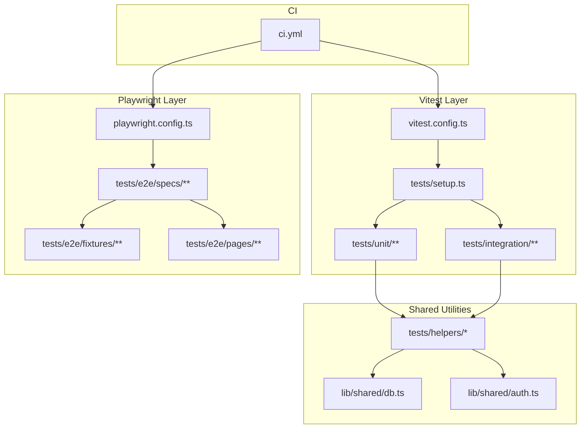
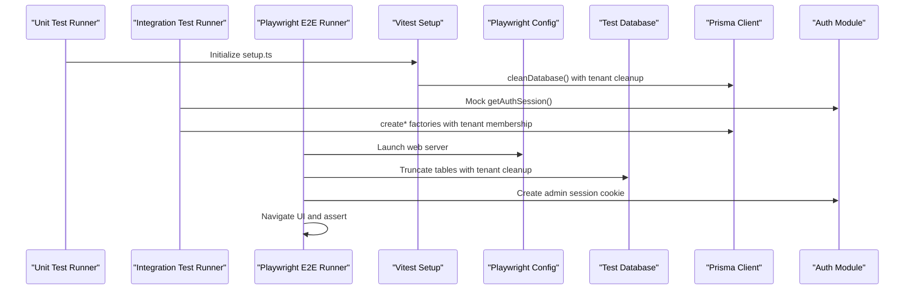
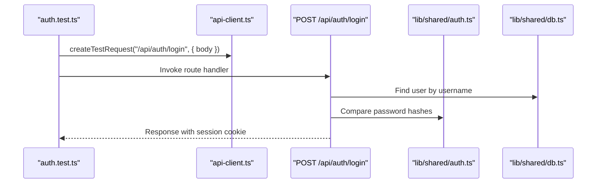
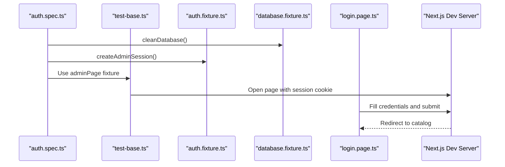
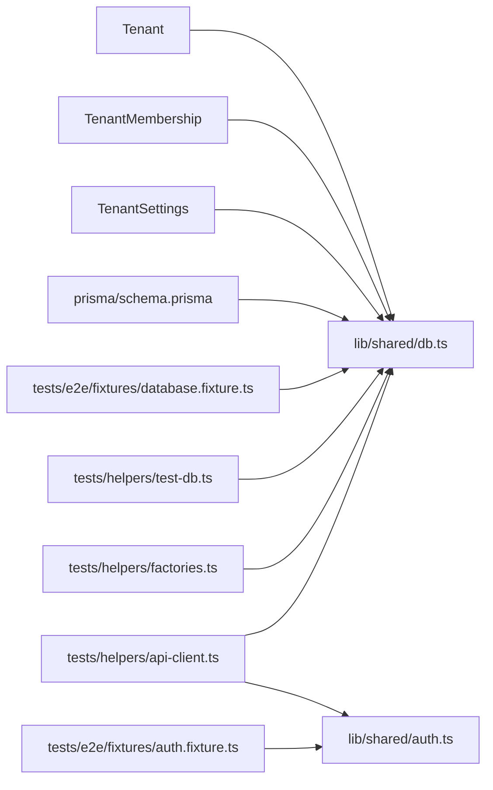

# Testing Infrastructure

<cite>
**Referenced Files in This Document**
- [tests/setup.ts](file://tests/setup.ts)
- [vitest.config.ts](file://vitest.config.ts)
- [playwright.config.ts](file://playwright.config.ts)
- [.github/workflows/ci.yml](file://.github/workflows/ci.yml)
- [tests/helpers/test-db.ts](file://tests/helpers/test-db.ts)
- [tests/helpers/api-client.ts](file://tests/helpers/api-client.ts)
- [tests/helpers/factories.ts](file://tests/helpers/factories.ts)
- [tests/e2e/fixtures/test-base.ts](file://tests/e2e/fixtures/test-base.ts)
- [tests/e2e/fixtures/auth.fixture.ts](file://tests/e2e/fixtures/auth.fixture.ts)
- [tests/e2e/fixtures/database.fixture.ts](file://tests/e2e/fixtures/database.fixture.ts)
- [tests/e2e/pages/common/login.page.ts](file://tests/e2e/pages/common/login.page.ts)
- [tests/integration/api/auth.test.ts](file://tests/integration/api/auth.test.ts)
- [tests/unit/lib/auth.test.ts](file://tests/unit/lib/auth.test.ts)
- [tests/e2e/specs/auth.spec.ts](file://tests/e2e/specs/auth.spec.ts)
- [lib/shared/db.ts](file://lib/shared/db.ts)
- [lib/shared/auth.ts](file://lib/shared/auth.ts)
- [prisma/schema.prisma](file://prisma/schema.prisma)
- [package.json](file://package.json)
</cite>

## Update Summary
**Changes Made**
- Enhanced database fixtures with automatic tenant membership creation in both Prisma and raw SQL factories
- Improved factory system with new tenant factory functions and automatic tenant membership creation
- Added cleanup procedures for TenantSettings, TenantMembership, and Tenant tables in database cleanup processes
- Updated tenant architecture documentation to reflect the new tenant-aware testing infrastructure

## Table of Contents
1. [Introduction](#introduction)
2. [Project Structure](#project-structure)
3. [Core Components](#core-components)
4. [Architecture Overview](#architecture-overview)
5. [Detailed Component Analysis](#detailed-component-analysis)
6. [Dependency Analysis](#dependency-analysis)
7. [Performance Considerations](#performance-considerations)
8. [Troubleshooting Guide](#troubleshooting-guide)
9. [Conclusion](#conclusion)
10. [Appendices](#appendices)

## Introduction
This document describes the ListOpt ERP testing ecosystem, focusing on shared testing utilities, test database management, and common test setup procedures. It explains how the test environment is configured, how database fixtures and factories work, and how testing helpers (API clients, database connections, and utilities) support unit, integration, and end-to-end (E2E) testing. It also covers continuous integration testing, execution strategies, and coverage reporting, along with best practices, naming conventions, and maintainability patterns. Finally, it provides troubleshooting guidance and performance optimization techniques.

**Updated** Enhanced with tenant-aware testing infrastructure including automatic tenant membership creation and improved factory system.

## Project Structure
The testing ecosystem is organized into three primary layers:
- Unit and Integration tests under tests/unit and tests/integration, orchestrated by Vitest.
- End-to-end tests under tests/e2e, orchestrated by Playwright.
- Shared helpers and fixtures under tests/helpers and tests/e2e/fixtures.

Key configuration and orchestration files:
- Vitest configuration defines environment, setup files, and test execution behavior.
- Playwright configuration defines E2E test directories, browser settings, and web server lifecycle.
- GitHub Actions workflow defines CI jobs, database service provisioning, and test execution.

**Diagram sources**
- [vitest.config.ts:1-30](file://vitest.config.ts#L1-L30)
- [playwright.config.ts:1-40](file://playwright.config.ts#L1-L40)
- [tests/setup.ts:1-26](file://tests/setup.ts#L1-L26)
- [tests/helpers/test-db.ts:1-75](file://tests/helpers/test-db.ts#L1-L75)
- [tests/helpers/api-client.ts:1-70](file://tests/helpers/api-client.ts#L1-L70)
- [tests/helpers/factories.ts:1-848](file://tests/helpers/factories.ts#L1-L848)
- [tests/e2e/fixtures/test-base.ts:1-41](file://tests/e2e/fixtures/test-base.ts#L1-L41)
- [tests/e2e/fixtures/database.fixture.ts:1-376](file://tests/e2e/fixtures/database.fixture.ts#L1-L376)
- [tests/e2e/pages/common/login.page.ts:1-30](file://tests/e2e/pages/common/login.page.ts#L1-L30)
- [.github/workflows/ci.yml:1-143](file://.github/workflows/ci.yml#L1-L143)

**Section sources**
- [vitest.config.ts:1-30](file://vitest.config.ts#L1-L30)
- [playwright.config.ts:1-40](file://playwright.config.ts#L1-L40)
- [.github/workflows/ci.yml:1-143](file://.github/workflows/ci.yml#L1-L143)

## Core Components
- Test database management:
  - Prisma-based cleanup for Vitest unit/integration tests with enhanced tenant table cleanup.
  - Raw SQL truncation for Playwright E2E tests with automatic tenant membership cleanup.
- API testing helpers:
  - Construct NextRequest objects for route handler tests.
  - Mock authentication sessions for API tests.
  - Utility to parse JSON responses.
- Factories:
  - Comprehensive Prisma-based factories for ERP entities with automatic tenant membership creation.
  - Specialized tenant factory functions for creating tenant-aware test data.
  - Enhanced user factory that automatically creates tenant and membership associations.
  - Specialized accounting/company seeding utilities.
- E2E fixtures:
  - Admin session creation and cookie injection with automatic tenant setup.
  - Raw database factory helpers for E2E tests with tenant-aware data generation.
- Authentication utilities:
  - Session signing and verification for unit tests.
  - Runtime session retrieval for API routes.

**Updated** Enhanced with tenant-aware factory system and automatic tenant membership creation.

**Section sources**
- [tests/helpers/test-db.ts:1-75](file://tests/helpers/test-db.ts#L1-L75)
- [tests/helpers/api-client.ts:1-70](file://tests/helpers/api-client.ts#L1-L70)
- [tests/helpers/factories.ts:1-848](file://tests/helpers/factories.ts#L1-L848)
- [tests/e2e/fixtures/test-base.ts:1-41](file://tests/e2e/fixtures/test-base.ts#L1-L41)
- [tests/e2e/fixtures/database.fixture.ts:1-376](file://tests/e2e/fixtures/database.fixture.ts#L1-L376)
- [lib/shared/auth.ts:1-89](file://lib/shared/auth.ts#L1-L89)

## Architecture Overview
The testing architecture separates concerns across layers with enhanced tenant awareness:
- Unit tests validate pure logic and isolated modules (e.g., session token verification) with tenant-aware factories.
- Integration tests validate API route handlers using mocked auth and Prisma-backed factories with automatic tenant membership creation.
- E2E tests validate browser-driven flows against a real server with a dedicated test database and automatic tenant setup.

**Diagram sources**
- [tests/setup.ts:1-26](file://tests/setup.ts#L1-L26)
- [tests/helpers/test-db.ts:1-75](file://tests/helpers/test-db.ts#L1-L75)
- [tests/helpers/api-client.ts:1-70](file://tests/helpers/api-client.ts#L1-L70)
- [tests/helpers/factories.ts:1-848](file://tests/helpers/factories.ts#L1-L848)
- [playwright.config.ts:1-40](file://playwright.config.ts#L1-L40)
- [tests/e2e/fixtures/test-base.ts:1-41](file://tests/e2e/fixtures/test-base.ts#L1-L41)
- [tests/e2e/fixtures/database.fixture.ts:1-376](file://tests/e2e/fixtures/database.fixture.ts#L1-L376)

## Detailed Component Analysis

### Test Environment Configuration
- Vitest:
  - Loads .env.test, sets environment to node, enables globals, and registers tests/setup.ts.
  - Disables file parallelism and concurrency to prevent database race conditions.
  - Includes pattern tests/**/*.test.ts.
- Playwright:
  - Loads .env.test, sets testDir and outputDir, and configures retries, timeouts, and traces.
  - Starts a Next.js dev server on a fixed port and passes DATABASE_URL and SESSION_SECRET.
  - Runs a single worker to avoid flakiness in E2E tests.

Best practices:
- Keep DATABASE_URL and SESSION_SECRET consistent across Vitest and Playwright configurations.
- Use NODE_ENV=test to isolate test-specific behavior.

**Section sources**
- [vitest.config.ts:1-30](file://vitest.config.ts#L1-L30)
- [playwright.config.ts:1-40](file://playwright.config.ts#L1-L40)

### Test Database Management
- Vitest:
  - beforeEach cleans the database using a dependency-aware deletion order with enhanced tenant table cleanup.
  - afterAll disconnects the Prisma client.
  - If the database is unreachable (e.g., pure unit tests), cleaning silently skips.
- E2E:
  - A raw SQL TRUNCATE CASCADE is used to reset the database quickly with automatic tenant membership cleanup.
  - A shared connection pool is exposed for E2E-specific operations.

Enhanced cleanup procedures:
- TenantSettings cleanup added to both Prisma and raw SQL cleanup processes.
- TenantMembership cleanup added to ensure referential integrity.
- Tenant table cleanup added as the final step to maintain proper dependency order.

**Updated** Enhanced with comprehensive tenant table cleanup procedures.

Guidelines:
- Prefer Prisma-based cleanup in Vitest for referential integrity with tenant-aware cleanup.
- Use raw SQL truncation in E2E for speed and simplicity with automatic tenant setup.
- Ensure cleanup happens before fixtures are applied in E2E with proper tenant table ordering.

**Section sources**
- [tests/setup.ts:1-26](file://tests/setup.ts#L1-L26)
- [tests/helpers/test-db.ts:1-75](file://tests/helpers/test-db.ts#L1-L75)
- [tests/e2e/fixtures/database.fixture.ts:1-376](file://tests/e2e/fixtures/database.fixture.ts#L1-L376)

### Database Fixtures and Factories
- Prisma factories (Vitest):
  - Create entities with deterministic uniqueness and optional overrides.
  - Automatically create dependent entities (e.g., Unit for Product) with tenant membership creation.
  - Enhanced tenant factory with automatic tenant membership creation for users.
  - Provide convenience builders (e.g., createDocumentWithItems).
  - Include accounting/company seeding utilities (seedTestAccounts, seedCompanySettings).
- Raw SQL factories (E2E):
  - Lightweight helpers to insert rows directly into tables.
  - Automatic tenant and membership creation for user entities.
  - Useful for E2E-specific data generation and assertions.

Enhanced tenant functionality:
- New createTenant factory function for creating tenant entities.
- Enhanced createUser factory automatically creates tenant and membership associations.
- E2E database fixture automatically creates tenant and membership for user creation.
- Both Prisma and raw SQL factories ensure tenant membership creation for proper authentication.

**Updated** Enhanced with comprehensive tenant-aware factory system.

Usage tips:
- Use factories to minimize duplication and ensure valid referential data with tenant membership.
- For complex accounting scenarios, seed minimal chart of accounts and company settings.
- Leverage automatic tenant membership creation to simplify test setup.

**Section sources**
- [tests/helpers/factories.ts:1-848](file://tests/helpers/factories.ts#L1-L848)
- [tests/e2e/fixtures/database.fixture.ts:1-376](file://tests/e2e/fixtures/database.fixture.ts#L1-L376)

### Testing Helpers: API Clients and Utilities
- API client:
  - createTestRequest builds a NextRequest suitable for route handler tests.
  - mockAuthUser and mockAuthNone control authentication in API tests.
  - jsonResponse parses JSON responses for assertions.
- Authentication utilities:
  - signSession and verifySessionToken in unit tests mirror production behavior.
  - getAuthSession retrieves the current user from cookies in API routes.

Patterns:
- Always mock auth in API tests to control session state deterministically.
- Use factories to create prerequisite entities before invoking route handlers.
- Leverage tenant-aware factories for authentication-dependent tests.

**Section sources**
- [tests/helpers/api-client.ts:1-70](file://tests/helpers/api-client.ts#L1-L70)
- [lib/shared/auth.ts:1-89](file://lib/shared/auth.ts#L1-L89)
- [tests/unit/lib/auth.test.ts:1-81](file://tests/unit/lib/auth.test.ts#L1-L81)

### E2E Fixtures and Pages
- test-base:
  - Extends Playwright test with an adminPage fixture that injects a signed session cookie.
  - Provides page error logging for easier debugging.
- auth.fixture:
  - Signs session tokens using the same algorithm as lib/shared/auth.ts.
  - Creates an admin user with automatic tenant and membership creation.
- database.fixture:
  - Provides raw SQL factories and queries for E2E tests with tenant-aware data generation.
- login.page:
  - Encapsulates common UI interactions for the login flow.

Enhanced E2E tenant functionality:
- Automatic tenant and membership creation in auth fixture for proper authentication.
- Tenant-aware user creation in database fixture with proper foreign key relationships.
- Seamless integration with tenant-aware testing infrastructure.

**Updated** Enhanced with automatic tenant membership creation in E2E fixtures.

**Section sources**
- [tests/e2e/fixtures/test-base.ts:1-41](file://tests/e2e/fixtures/test-base.ts#L1-L41)
- [tests/e2e/fixtures/auth.fixture.ts:1-33](file://tests/e2e/fixtures/auth.fixture.ts#L1-L33)
- [tests/e2e/fixtures/database.fixture.ts:1-376](file://tests/e2e/fixtures/database.fixture.ts#L1-L376)
- [tests/e2e/pages/common/login.page.ts:1-30](file://tests/e2e/pages/common/login.page.ts#L1-L30)

### Continuous Integration Testing Pipeline
- Job stages:
  - Postgres service provisioned with health checks.
  - Prisma client generation and schema push with tenant architecture support.
  - Nx affected lint, test, and build.
  - E2E tests executed with CI=true.
  - Artifacts uploaded on failure for debugging.
- Environment:
  - DATABASE_URL and SESSION_SECRET injected for test runs.

Recommendations:
- Keep CI database schema synchronized with local development including tenant tables.
- Use Nx affected to limit test scope during PRs.
- Ensure tenant migration is applied before running tests.

**Section sources**
- [.github/workflows/ci.yml:1-143](file://.github/workflows/ci.yml#L1-L143)

### Test Execution Strategies and Coverage
- Scripts:
  - test: runs all affected tests with sequential execution.
  - test:unit, test:service, test:integration: separate Vitest configs for different domains.
  - test:e2e: executes Playwright tests.
  - test:cov and test:coverage: enable coverage collection.
- Concurrency:
  - Vitest disables file parallelism and sequence concurrency to avoid DB races.
  - Playwright runs with a single worker.

**Section sources**
- [package.json:1-85](file://package.json#L1-L85)
- [vitest.config.ts:18-22](file://vitest.config.ts#L18-L22)

### Example Workflows

#### API Integration Test Flow

**Diagram sources**
- [tests/integration/api/auth.test.ts:1-197](file://tests/integration/api/auth.test.ts#L1-L197)
- [tests/helpers/api-client.ts:1-70](file://tests/helpers/api-client.ts#L1-L70)
- [lib/shared/auth.ts:1-89](file://lib/shared/auth.ts#L1-L89)
- [lib/shared/db.ts:1-25](file://lib/shared/db.ts#L1-L25)

#### E2E Authentication Flow

**Diagram sources**
- [tests/e2e/specs/auth.spec.ts:1-46](file://tests/e2e/specs/auth.spec.ts#L1-L46)
- [tests/e2e/fixtures/test-base.ts:1-41](file://tests/e2e/fixtures/test-base.ts#L1-L41)
- [tests/e2e/fixtures/auth.fixture.ts:1-33](file://tests/e2e/fixtures/auth.fixture.ts#L1-L33)
- [tests/e2e/fixtures/database.fixture.ts:1-376](file://tests/e2e/fixtures/database.fixture.ts#L1-L376)
- [tests/e2e/pages/common/login.page.ts:1-30](file://tests/e2e/pages/common/login.page.ts#L1-L30)

### Best Practices and Naming Conventions
- Test files:
  - Place unit tests under tests/unit/<domain>/<module>.test.ts.
  - Place integration tests under tests/integration/<category>/<module>.test.ts.
  - Place E2E specs under tests/e2e/specs/<category>/<scenario>.spec.ts.
- Fixtures and helpers:
  - Group E2E fixtures under tests/e2e/fixtures/.
  - Group shared helpers under tests/helpers/.
- Factories:
  - Use create<Entity>() for entity creation and create<Entity>WithItems() for composite entities.
  - Use createTenant() for tenant creation and leverage automatic tenant membership creation.
- Assertions:
  - Prefer explicit status checks and JSON parsing via jsonResponse() for API tests.
  - Use Playwright locators and page objects (e.g., login.page.ts) for E2E assertions.

Enhanced tenant practices:
- Use createTenant() factory for tenant creation in tests requiring multiple organizations.
- Leverage automatic tenant membership creation in createUser() for authentication tests.
- Ensure tenant cleanup order in database cleanup procedures.

Maintainability:
- Keep setup.ts minimal and centralized for global test initialization.
- Centralize database cleanup in tests/helpers/test-db.ts for Vitest and database.fixture.ts for E2E.
- Reuse factories to reduce duplication and ensure schema compliance.
- Utilize tenant-aware factories for multi-tenant testing scenarios.

**Updated** Enhanced with tenant-aware factory usage and practices.

**Section sources**
- [tests/helpers/factories.ts:1-848](file://tests/helpers/factories.ts#L1-L848)
- [tests/helpers/api-client.ts:1-70](file://tests/helpers/api-client.ts#L1-L70)
- [tests/e2e/pages/common/login.page.ts:1-30](file://tests/e2e/pages/common/login.page.ts#L1-L30)

## Dependency Analysis
The testing utilities depend on shared libraries and Prisma with enhanced tenant architecture:
- tests/helpers/* depend on lib/shared/db.ts and lib/shared/auth.ts.
- E2E fixtures depend on database.fixture.ts and auth.fixture.ts.
- Prisma schema defines the entities and relationships used by factories including tenant tables.
- Tenant-related dependencies include Tenant, TenantMembership, and TenantSettings models.

**Updated** Enhanced with tenant architecture dependencies.

**Diagram sources**
- [tests/helpers/factories.ts:1-848](file://tests/helpers/factories.ts#L1-L848)
- [tests/helpers/api-client.ts:1-70](file://tests/helpers/api-client.ts#L1-L70)
- [tests/helpers/test-db.ts:1-75](file://tests/helpers/test-db.ts#L1-L75)
- [tests/e2e/fixtures/auth.fixture.ts:1-33](file://tests/e2e/fixtures/auth.fixture.ts#L1-L33)
- [tests/e2e/fixtures/database.fixture.ts:1-376](file://tests/e2e/fixtures/database.fixture.ts#L1-L376)
- [lib/shared/db.ts:1-25](file://lib/shared/db.ts#L1-L25)
- [lib/shared/auth.ts:1-89](file://lib/shared/auth.ts#L1-L89)
- [prisma/schema.prisma:1-1338](file://prisma/schema.prisma#L1-L1338)

**Section sources**
- [lib/shared/db.ts:1-25](file://lib/shared/db.ts#L1-L25)
- [lib/shared/auth.ts:1-89](file://lib/shared/auth.ts#L1-L89)
- [prisma/schema.prisma:1-1338](file://prisma/schema.prisma#L1-L1338)

## Performance Considerations
- Database cleanup:
  - Use Prisma deleteMany in dependency order for Vitest to preserve referential integrity with tenant table cleanup.
  - Use TRUNCATE CASCADE for E2E to minimize overhead with automatic tenant membership cleanup.
  - Ensure proper cleanup order: User -> TenantMembership -> TenantSettings -> Tenant for referential integrity.
- Concurrency:
  - Disable Vitest file parallelism and sequence concurrency to avoid race conditions.
  - Run Playwright with a single worker to reduce flakiness.
- Test data:
  - Prefer lightweight factories and minimal seeds to reduce setup time.
  - Leverage automatic tenant membership creation to reduce test setup complexity.
- CI:
  - Cache node_modules and install Playwright browsers once per job.
  - Use Nx affected to limit test scope during PRs.
  - Ensure tenant migration is applied before running tests.

**Updated** Enhanced with tenant table cleanup considerations.

## Troubleshooting Guide
Common issues and resolutions:
- Database not reachable in Vitest:
  - Symptom: beforeEach fails to clean database.
  - Resolution: Ensure DATABASE_URL is set and reachable; tests silently skip cleanup when DB is down.
- Authentication failures in API tests:
  - Symptom: 401 Unauthorized responses.
  - Resolution: Mock getAuthSession via api-client.ts before invoking route handlers.
- E2E login not redirecting:
  - Symptom: Stays on /login after submitting credentials.
  - Resolution: Confirm admin session cookie is injected via test-base.ts; verify auth.fixture.ts signs tokens correctly.
- Session verification failures:
  - Symptom: verifySessionToken returns null.
  - Resolution: Ensure SESSION_SECRET matches between tests and server; check token format and expiration.
- CI flaky tests:
  - Symptom: Tests fail intermittently.
  - Resolution: Confirm single worker mode in Playwright; disable Vitest file parallelism; ensure Prisma schema is pushed before running tests.
- Tenant membership issues:
  - Symptom: Users cannot log in or access tenant data.
  - Resolution: Ensure tenant and membership are created together using enhanced factories; verify cleanup order in database setup.
- Tenant table cleanup failures:
  - Symptom: Tenant-related tables not properly cleaned between tests.
  - Resolution: Verify cleanup order includes TenantSettings, TenantMembership, and Tenant tables in proper sequence.

**Updated** Enhanced with tenant-related troubleshooting guidance.

**Section sources**
- [tests/setup.ts:8-25](file://tests/setup.ts#L8-L25)
- [tests/helpers/api-client.ts:48-62](file://tests/helpers/api-client.ts#L48-L62)
- [tests/e2e/fixtures/test-base.ts:9-38](file://tests/e2e/fixtures/test-base.ts#L9-L38)
- [tests/e2e/fixtures/auth.fixture.ts:7-13](file://tests/e2e/fixtures/auth.fixture.ts#L7-L13)
- [lib/shared/auth.ts:26-59](file://lib/shared/auth.ts#L26-L59)
- [playwright.config.ts:9-11](file://playwright.config.ts#L9-L11)
- [vitest.config.ts:18-22](file://vitest.config.ts#L18-L22)

## Conclusion
The ListOpt ERP testing ecosystem combines robust shared utilities, disciplined database management, and layered test strategies with enhanced tenant-aware capabilities. By centralizing setup, leveraging comprehensive factories with automatic tenant membership creation, and maintaining strict isolation, the suite supports reliable unit, integration, and E2E testing across multiple organizations. CI ensures consistent execution against a managed Postgres service with tenant architecture support, while scripts and configuration enforce safe concurrency and performance characteristics.

**Updated** Enhanced with tenant-aware testing infrastructure and automatic tenant membership creation capabilities.

## Appendices

### Appendix A: Test Execution Commands
- Run all affected tests: npm run test
- Run unit tests: npm run test:unit
- Run integration tests: npm run test:integration
- Run service tests: npm run test:service
- Run all tests: npm run test:all
- Watch mode: npm run test:watch
- Coverage: npm run test:coverage
- E2E tests: npm run test:e2e
- E2E with UI: npm run test:e2e:ui
- E2E headed: npm run test:e2e:headed
- E2E debug: npm run test:e2e:debug

**Section sources**
- [package.json:5-32](file://package.json#L5-L32)

### Appendix B: Prisma Schema Entities Used in Tests
- Core entities: User, Unit, ProductCategory, Product, Counterparty, Warehouse, StockRecord, Document, DocumentItem, PriceList, SalePrice, PurchasePrice, ProductVariant, VariantOption, VariantType, ProductDiscount, SkuCounter, Customer, CustomerAddress, CartItem, Order, OrderItem, Review, Favorite, and more.
- Tenant architecture entities: Tenant, TenantMembership, TenantSettings for multi-organization testing support.
- These entities are cleaned and seeded by factories and fixtures to support realistic test scenarios across multiple organizations.

**Updated** Enhanced with tenant architecture entities for multi-organization testing.

**Section sources**
- [prisma/schema.prisma:55-114](file://prisma/schema.prisma#L55-L114)
- [prisma/migrations/20260313_add_tenant_architecture/migration.sql:1-78](file://prisma/migrations/20260313_add_tenant_architecture/migration.sql#L1-L78)