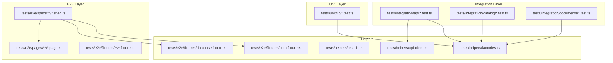
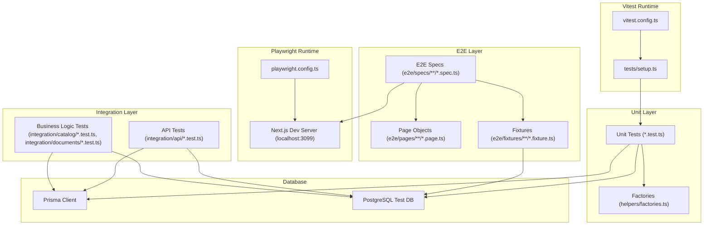
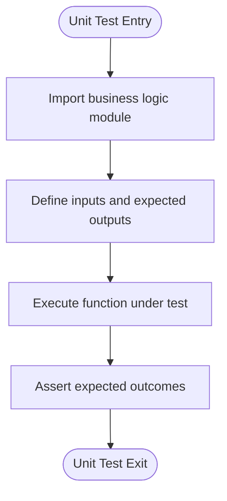
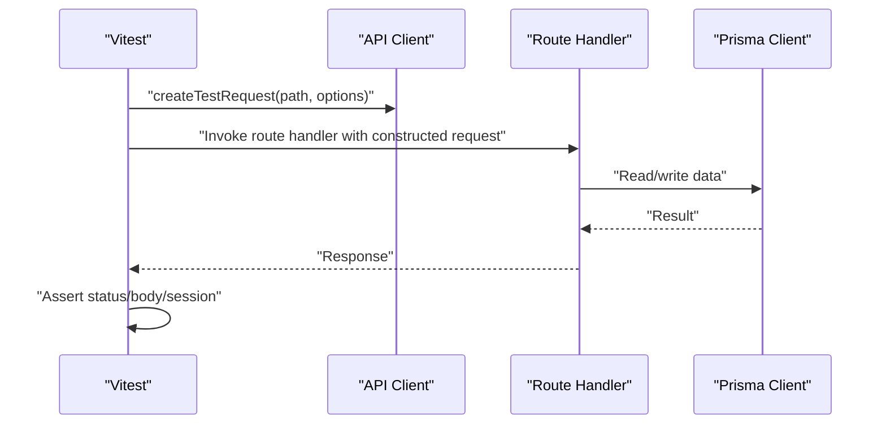
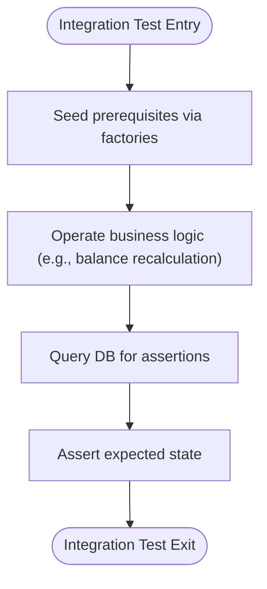
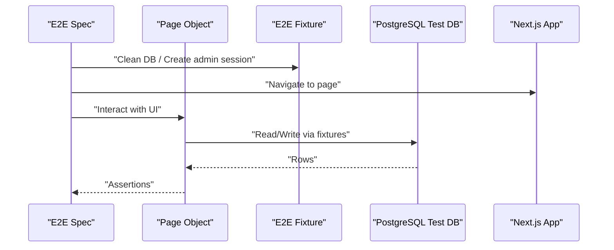
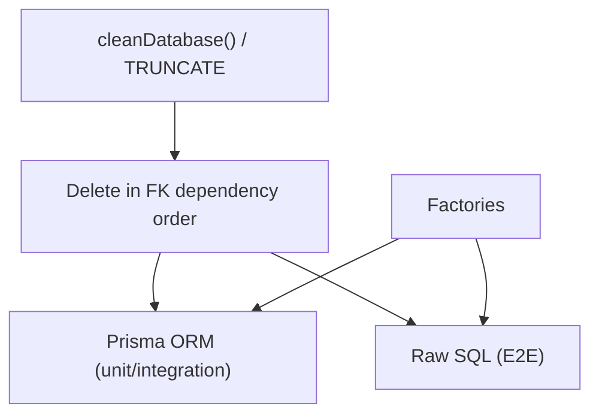
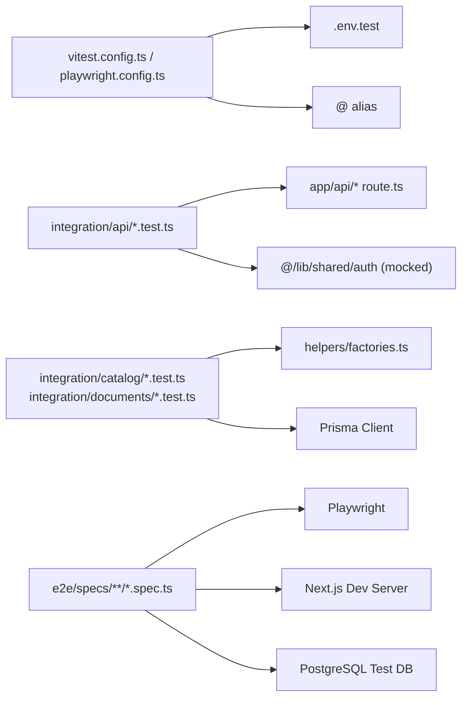

# Testing Strategy

<cite>
**Referenced Files in This Document**
- [vitest.config.ts](file://vitest.config.ts)
- [playwright.config.ts](file://playwright.config.ts)
- [tests/setup.ts](file://tests/setup.ts)
- [package.json](file://package.json)
- [.github/workflows/ci.yml](file://.github/workflows/ci.yml)
- [tests/helpers/test-db.ts](file://tests/helpers/test-db.ts)
- [tests/helpers/factories.ts](file://tests/helpers/factories.ts)
- [tests/helpers/api-client.ts](file://tests/helpers/api-client.ts)
- [tests/e2e/fixtures/database.fixture.ts](file://tests/e2e/fixtures/database.fixture.ts)
- [tests/e2e/fixtures/auth.fixture.ts](file://tests/e2e/fixtures/auth.fixture.ts)
- [tests/e2e/pages/accounting/catalog.page.ts](file://tests/e2e/pages/accounting/catalog.page.ts)
- [tests/e2e/specs/accounting/catalog.spec.ts](file://tests/e2e/specs/accounting/catalog.spec.ts)
- [tests/integration/api/auth.test.ts](file://tests/integration/api/auth.test.ts)
- [tests/unit/lib/auth.test.ts](file://tests/unit/lib/auth.test.ts)
- [tests/unit/lib/documents.test.ts](file://tests/unit/lib/documents.test.ts)
- [tests/integration/catalog/features.test.ts](file://tests/integration/catalog/features.test.ts)
- [tests/integration/documents/balance.test.ts](file://tests/integration/documents/balance.test.ts)
- [prisma/schema.prisma](file://prisma/schema.prisma)
- [prisma.config.ts](file://prisma.config.ts)
</cite>

## Table of Contents
1. [Introduction](#introduction)
2. [Project Structure](#project-structure)
3. [Core Components](#core-components)
4. [Architecture Overview](#architecture-overview)
5. [Detailed Component Analysis](#detailed-component-analysis)
6. [Dependency Analysis](#dependency-analysis)
7. [Performance Considerations](#performance-considerations)
8. [Troubleshooting Guide](#troubleshooting-guide)
9. [Conclusion](#conclusion)
10. [Appendices](#appendices)

## Introduction
This document defines a comprehensive testing strategy for ListOpt ERP, covering unit, integration, and end-to-end (E2E) layers. It explains the testing infrastructure, configuration, organization, and helper utilities. It also documents testing patterns for React components, API endpoints, business logic modules, and database operations, along with CI pipeline, coverage reporting, best practices, test data management, and environment setup.

## Project Structure
The repository organizes tests by layer and feature:
- Unit tests: focused on pure functions and small modules (e.g., business logic utilities).
- Integration tests: validate modules interacting with databases and external systems.
- E2E tests: validate real user workflows across the UI and backend.

Key directories and files:
- Unit tests: under tests/unit/<category>
- Integration tests: under tests/integration/<area>
- E2E tests: under tests/e2e/specs/<area>, with page objects under tests/e2e/pages/<area>
- Helpers: tests/helpers/* for shared utilities (factories, DB cleanup, API client)
- CI: .github/workflows/ci.yml orchestrates linting, unit/integration tests, and E2E

**Diagram sources**
- [tests/unit/lib/auth.test.ts:1-81](file://tests/unit/lib/auth.test.ts#L1-L81)
- [tests/integration/api/auth.test.ts:1-197](file://tests/integration/api/auth.test.ts#L1-L197)
- [tests/integration/catalog/features.test.ts:1-800](file://tests/integration/catalog/features.test.ts#L1-L800)
- [tests/integration/documents/balance.test.ts:1-321](file://tests/integration/documents/balance.test.ts#L1-L321)
- [tests/e2e/specs/accounting/catalog.spec.ts:1-60](file://tests/e2e/specs/accounting/catalog.spec.ts#L1-L60)
- [tests/e2e/pages/accounting/catalog.page.ts:1-62](file://tests/e2e/pages/accounting/catalog.page.ts#L1-L62)
- [tests/helpers/api-client.ts:1-70](file://tests/helpers/api-client.ts#L1-L70)
- [tests/helpers/factories.ts:1-636](file://tests/helpers/factories.ts#L1-L636)
- [tests/helpers/test-db.ts:1-57](file://tests/helpers/test-db.ts#L1-L57)
- [tests/e2e/fixtures/database.fixture.ts:1-334](file://tests/e2e/fixtures/database.fixture.ts#L1-L334)
- [tests/e2e/fixtures/auth.fixture.ts:1-33](file://tests/e2e/fixtures/auth.fixture.ts#L1-L33)

**Section sources**
- [tests/unit/lib/auth.test.ts:1-81](file://tests/unit/lib/auth.test.ts#L1-L81)
- [tests/integration/api/auth.test.ts:1-197](file://tests/integration/api/auth.test.ts#L1-L197)
- [tests/integration/catalog/features.test.ts:1-800](file://tests/integration/catalog/features.test.ts#L1-L800)
- [tests/integration/documents/balance.test.ts:1-321](file://tests/integration/documents/balance.test.ts#L1-L321)
- [tests/e2e/specs/accounting/catalog.spec.ts:1-60](file://tests/e2e/specs/accounting/catalog.spec.ts#L1-L60)
- [tests/e2e/pages/accounting/catalog.page.ts:1-62](file://tests/e2e/pages/accounting/catalog.page.ts#L1-L62)
- [tests/helpers/api-client.ts:1-70](file://tests/helpers/api-client.ts#L1-L70)
- [tests/helpers/factories.ts:1-636](file://tests/helpers/factories.ts#L1-L636)
- [tests/helpers/test-db.ts:1-57](file://tests/helpers/test-db.ts#L1-L57)
- [tests/e2e/fixtures/database.fixture.ts:1-334](file://tests/e2e/fixtures/database.fixture.ts#L1-L334)
- [tests/e2e/fixtures/auth.fixture.ts:1-33](file://tests/e2e/fixtures/auth.fixture.ts#L1-L33)

## Core Components
- Vitest configuration: Node environment, global setup, sequential execution, aliases, and test timeout.
- Playwright configuration: E2E test runner, browser setup, web server, and retry policy.
- Shared helpers:
  - API client for constructing NextRequest and mocking auth in API tests.
  - Factories for creating domain entities and related records.
  - Database cleanup and disconnection utilities for test isolation.
  - E2E database fixture for raw SQL truncation and factory functions.
  - E2E auth fixture for signing sessions and creating admin users.

Key behaviors:
- Sequential test execution prevents database race conditions.
- Environment variables loaded from .env.test for consistent test environments.
- Database cleaning via Prisma ORM in unit/integration and raw SQL in E2E.

**Section sources**
- [vitest.config.ts:1-30](file://vitest.config.ts#L1-L30)
- [playwright.config.ts:1-40](file://playwright.config.ts#L1-L40)
- [tests/setup.ts:1-26](file://tests/setup.ts#L1-L26)
- [tests/helpers/api-client.ts:1-70](file://tests/helpers/api-client.ts#L1-L70)
- [tests/helpers/factories.ts:1-636](file://tests/helpers/factories.ts#L1-L636)
- [tests/helpers/test-db.ts:1-57](file://tests/helpers/test-db.ts#L1-L57)
- [tests/e2e/fixtures/database.fixture.ts:1-334](file://tests/e2e/fixtures/database.fixture.ts#L1-L334)
- [tests/e2e/fixtures/auth.fixture.ts:1-33](file://tests/e2e/fixtures/auth.fixture.ts#L1-L33)

## Architecture Overview
The testing architecture separates concerns across layers and enforces isolation and determinism.

**Diagram sources**
- [vitest.config.ts:1-30](file://vitest.config.ts#L1-L30)
- [tests/setup.ts:1-26](file://tests/setup.ts#L1-L26)
- [playwright.config.ts:1-40](file://playwright.config.ts#L1-L40)
- [tests/helpers/factories.ts:1-636](file://tests/helpers/factories.ts#L1-L636)
- [tests/integration/api/auth.test.ts:1-197](file://tests/integration/api/auth.test.ts#L1-L197)
- [tests/integration/catalog/features.test.ts:1-800](file://tests/integration/catalog/features.test.ts#L1-L800)
- [tests/integration/documents/balance.test.ts:1-321](file://tests/integration/documents/balance.test.ts#L1-L321)
- [tests/e2e/specs/accounting/catalog.spec.ts:1-60](file://tests/e2e/specs/accounting/catalog.spec.ts#L1-L60)
- [tests/e2e/pages/accounting/catalog.page.ts:1-62](file://tests/e2e/pages/accounting/catalog.page.ts#L1-L62)
- [tests/e2e/fixtures/database.fixture.ts:1-334](file://tests/e2e/fixtures/database.fixture.ts#L1-L334)
- [prisma.schema.prisma:1-800](file://prisma/schema.prisma#L1-L800)

## Detailed Component Analysis

### Unit Tests: Business Logic Modules
Examples:
- Session token security and verification logic.
- Document type classification and prefix/status mapping.

Patterns:
- Pure function tests with deterministic inputs and assertions.
- Edge cases: expired tokens, tampered tokens, malformed tokens, timing-safe comparisons.
- Constants validation for stock/balance affecting types.

**Diagram sources**
- [tests/unit/lib/auth.test.ts:1-81](file://tests/unit/lib/auth.test.ts#L1-L81)
- [tests/unit/lib/documents.test.ts:1-290](file://tests/unit/lib/documents.test.ts#L1-L290)

**Section sources**
- [tests/unit/lib/auth.test.ts:1-81](file://tests/unit/lib/auth.test.ts#L1-L81)
- [tests/unit/lib/documents.test.ts:1-290](file://tests/unit/lib/documents.test.ts#L1-L290)

### Integration Tests: API Endpoints
Examples:
- Authentication setup, login, and profile retrieval.
- Request construction with NextRequest and auth mocking.

Patterns:
- Mock auth module to simulate session state.
- Use factories to seed prerequisite data.
- Validate HTTP status codes and response bodies.

**Diagram sources**
- [tests/helpers/api-client.ts:1-70](file://tests/helpers/api-client.ts#L1-L70)
- [tests/integration/api/auth.test.ts:1-197](file://tests/integration/api/auth.test.ts#L1-L197)

**Section sources**
- [tests/helpers/api-client.ts:1-70](file://tests/helpers/api-client.ts#L1-L70)
- [tests/integration/api/auth.test.ts:1-197](file://tests/integration/api/auth.test.ts#L1-L197)

### Integration Tests: Business Logic Modules
Examples:
- Catalog features: SKU auto-generation, custom fields, variants, discounts, price lists.
- Document balance calculations and counterparty balances.

Patterns:
- Use factories to create related entities.
- Validate constraints and cascading behavior.
- Soft-delete semantics and transaction boundaries.

**Diagram sources**
- [tests/integration/catalog/features.test.ts:1-800](file://tests/integration/catalog/features.test.ts#L1-L800)
- [tests/integration/documents/balance.test.ts:1-321](file://tests/integration/documents/balance.test.ts#L1-L321)

**Section sources**
- [tests/integration/catalog/features.test.ts:1-800](file://tests/integration/catalog/features.test.ts#L1-L800)
- [tests/integration/documents/balance.test.ts:1-321](file://tests/integration/documents/balance.test.ts#L1-L321)

### End-to-End Tests: User Workflows
Examples:
- Accounting catalog management: create category, filter by category, switch tabs.

Patterns:
- Page objects encapsulate UI interactions.
- Fixtures manage database state and session creation.
- Assertions on UI visibility and database state.

**Diagram sources**
- [tests/e2e/specs/accounting/catalog.spec.ts:1-60](file://tests/e2e/specs/accounting/catalog.spec.ts#L1-L60)
- [tests/e2e/pages/accounting/catalog.page.ts:1-62](file://tests/e2e/pages/accounting/catalog.page.ts#L1-L62)
- [tests/e2e/fixtures/database.fixture.ts:1-334](file://tests/e2e/fixtures/database.fixture.ts#L1-L334)
- [tests/e2e/fixtures/auth.fixture.ts:1-33](file://tests/e2e/fixtures/auth.fixture.ts#L1-L33)

**Section sources**
- [tests/e2e/specs/accounting/catalog.spec.ts:1-60](file://tests/e2e/specs/accounting/catalog.spec.ts#L1-L60)
- [tests/e2e/pages/accounting/catalog.page.ts:1-62](file://tests/e2e/pages/accounting/catalog.page.ts#L1-L62)
- [tests/e2e/fixtures/database.fixture.ts:1-334](file://tests/e2e/fixtures/database.fixture.ts#L1-L334)
- [tests/e2e/fixtures/auth.fixture.ts:1-33](file://tests/e2e/fixtures/auth.fixture.ts#L1-L33)

### Database Test Isolation and Factories
- Unit/Integration: cleanDatabase() deletes rows in dependency order using Prisma.
- E2E: raw SQL TRUNCATE CASCADE on all tables; separate pool for fixture queries.
- Factories: create related entities with defaults and overrides; helpers for composite operations.

**Diagram sources**
- [tests/helpers/test-db.ts:1-57](file://tests/helpers/test-db.ts#L1-L57)
- [tests/e2e/fixtures/database.fixture.ts:1-334](file://tests/e2e/fixtures/database.fixture.ts#L1-L334)
- [tests/helpers/factories.ts:1-636](file://tests/helpers/factories.ts#L1-L636)

**Section sources**
- [tests/helpers/test-db.ts:1-57](file://tests/helpers/test-db.ts#L1-L57)
- [tests/e2e/fixtures/database.fixture.ts:1-334](file://tests/e2e/fixtures/database.fixture.ts#L1-L334)
- [tests/helpers/factories.ts:1-636](file://tests/helpers/factories.ts#L1-L636)

## Dependency Analysis
- Test configuration depends on environment variables (.env.test) and aliases.
- API integration tests depend on route handlers and auth mocks.
- E2E tests depend on Playwright, a local Next.js server, and a dedicated PostgreSQL instance.
- Factories depend on Prisma schema and database constraints.

**Diagram sources**
- [vitest.config.ts:1-30](file://vitest.config.ts#L1-L30)
- [playwright.config.ts:1-40](file://playwright.config.ts#L1-L40)
- [tests/integration/api/auth.test.ts:1-197](file://tests/integration/api/auth.test.ts#L1-L197)
- [tests/helpers/factories.ts:1-636](file://tests/helpers/factories.ts#L1-L636)
- [prisma/schema.prisma:1-800](file://prisma/schema.prisma#L1-L800)

**Section sources**
- [vitest.config.ts:1-30](file://vitest.config.ts#L1-L30)
- [playwright.config.ts:1-40](file://playwright.config.ts#L1-L40)
- [tests/integration/api/auth.test.ts:1-197](file://tests/integration/api/auth.test.ts#L1-L197)
- [tests/helpers/factories.ts:1-636](file://tests/helpers/factories.ts#L1-L636)
- [prisma/schema.prisma:1-800](file://prisma/schema.prisma#L1-L800)

## Performance Considerations
- Sequential test execution reduces contention but increases runtime. Keep tests focused and fast.
- Use factories sparingly; prefer minimal data sets per test.
- E2E tests are slower; isolate heavy scenarios and reuse fixtures where possible.
- Avoid unnecessary server restarts in Playwright; rely on the configured webServer lifecycle.

## Troubleshooting Guide
Common issues and resolutions:
- Database connectivity errors during setup: ensure DATABASE_URL points to a reachable test database and that cleanDatabase/disconnectDb are invoked in setup/teardown.
- Authentication mocking failures: verify vi.mock is applied before importing route handlers and that mockAuthUser/mockAuthNone are called before invoking route handlers.
- E2E flakiness: enable trace/video on first retry; use explicit waits and selectors; ensure the dev server is healthy before running tests.
- CI failures: confirm Postgres service health, Prisma client generation, and correct environment variable injection.

**Section sources**
- [tests/setup.ts:1-26](file://tests/setup.ts#L1-L26)
- [tests/helpers/api-client.ts:1-70](file://tests/helpers/api-client.ts#L1-L70)
- [playwright.config.ts:1-40](file://playwright.config.ts#L1-L40)
- [.github/workflows/ci.yml:1-143](file://.github/workflows/ci.yml#L1-L143)

## Conclusion
The testing strategy employs a layered approach with clear separation of concerns. Unit tests validate pure logic, integration tests validate module interactions and business rules, and E2E tests validate end-to-end workflows. Shared helpers and fixtures ensure deterministic, isolated, and maintainable tests. The CI pipeline automates linting, unit/integration tests, and E2E runs against a managed Postgres instance.

## Appendices

### Test Configuration and Scripts
- Vitest: Node environment, globals, setup files, sequential execution, aliases.
- Playwright: testDir, workers, retries, timeouts, webServer pointing to Next.js dev server.
- Scripts: test, test:coverage, test:watch, test:e2e, and affected commands.

**Section sources**
- [vitest.config.ts:1-30](file://vitest.config.ts#L1-L30)
- [playwright.config.ts:1-40](file://playwright.config.ts#L1-L40)
- [package.json:1-79](file://package.json#L1-L79)

### Continuous Integration Pipeline
- Services: PostgreSQL container with health checks.
- Steps: checkout, setup Node, install dependencies, install Playwright browsers, generate Prisma client, push schema, lint/affected tests, run E2E, upload artifacts on failure, build affected.

**Section sources**
- [.github/workflows/ci.yml:1-143](file://.github/workflows/ci.yml#L1-L143)

### Coverage Reporting
- Coverage is enabled via the test:coverage script; configure thresholds and reporters in Vitest config as needed.

**Section sources**
- [package.json:1-79](file://package.json#L1-L79)
- [vitest.config.ts:1-30](file://vitest.config.ts#L1-L30)

### Best Practices and Guidelines
- Prefer deterministic factories with overrides for variability.
- Use beforeEach to clean database state; ensure cleanup handles unreachable DB gracefully.
- Mock external modules (e.g., auth) in API tests to control behavior.
- Keep E2E tests focused on user journeys; use page objects to encapsulate UI logic.
- Write assertions for both UI and underlying database state where appropriate.
- Maintain small, single-purpose tests; group related assertions; avoid brittle selectors.

[No sources needed since this section provides general guidance]