# Unit Testing

<cite>
**Referenced Files in This Document**
- [vitest.config.ts](file://vitest.config.ts)
- [package.json](file://package.json)
- [tests/setup.ts](file://tests/setup.ts)
- [tests/helpers/factories.ts](file://tests/helpers/factories.ts)
- [tests/helpers/test-db.ts](file://tests/helpers/test-db.ts)
- [tests/helpers/api-client.ts](file://tests/helpers/api-client.ts)
- [tests/unit/lib/auth.test.ts](file://tests/unit/lib/auth.test.ts)
- [tests/unit/lib/documents.test.ts](file://tests/unit/lib/documents.test.ts)
- [tests/unit/lib/rate-limit.test.ts](file://tests/unit/lib/rate-limit.test.ts)
- [tests/integration/api/auth.test.ts](file://tests/integration/api/auth.test.ts)
- [tests/integration/api/products.test.ts](file://tests/integration/api/products.test.ts)
- [lib/shared/auth.ts](file://lib/shared/auth.ts)
- [lib/shared/rate-limit.ts](file://lib/shared/rate-limit.ts)
</cite>

## Table of Contents
1. [Introduction](#introduction)
2. [Project Structure](#project-structure)
3. [Core Components](#core-components)
4. [Architecture Overview](#architecture-overview)
5. [Detailed Component Analysis](#detailed-component-analysis)
6. [Dependency Analysis](#dependency-analysis)
7. [Performance Considerations](#performance-considerations)
8. [Troubleshooting Guide](#troubleshooting-guide)
9. [Conclusion](#conclusion)
10. [Appendices](#appendices)

## Introduction
This document provides comprehensive unit testing guidance for ListOpt ERP, focusing on the Vitest-based testing framework, test organization, and practical testing utilities. It explains how the project isolates tests, generates deterministic test data via factories, mocks external dependencies, and validates business logic across modules. It also covers testing patterns for API routes, utility functions, and how to structure tests for maintainability and reliability.

## Project Structure
The testing suite is organized into three primary layers:
- Unit tests: Pure logic validations for modules and utilities.
- Integration tests: API route tests that exercise server logic with mocked auth and database.
- E2E tests: Playwright-driven browser tests for end-to-end workflows.

Key configuration and helpers:
- Vitest configuration defines environment, timeouts, setup files, and sequential execution to prevent database race conditions.
- Setup hooks clean the database before each test and disconnect afterward.
- Factories encapsulate deterministic creation of domain entities.
- API client helpers construct NextRequest objects and mock authentication for API tests.
- Test database utilities provide safe deletion and disconnection.

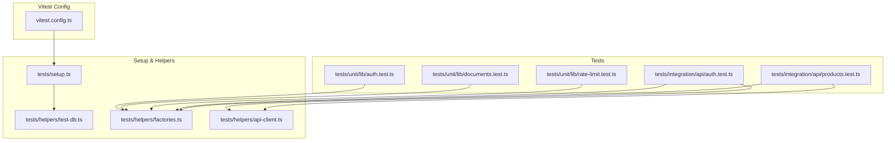

**Diagram sources**
- [vitest.config.ts:1-30](file://vitest.config.ts#L1-L30)
- [tests/setup.ts:1-26](file://tests/setup.ts#L1-L26)
- [tests/helpers/test-db.ts:1-58](file://tests/helpers/test-db.ts#L1-L58)
- [tests/helpers/factories.ts:1-636](file://tests/helpers/factories.ts#L1-L636)
- [tests/helpers/api-client.ts:1-70](file://tests/helpers/api-client.ts#L1-L70)
- [tests/unit/lib/auth.test.ts:1-81](file://tests/unit/lib/auth.test.ts#L1-L81)
- [tests/unit/lib/documents.test.ts:1-290](file://tests/unit/lib/documents.test.ts#L1-L290)
- [tests/unit/lib/rate-limit.test.ts:1-151](file://tests/unit/lib/rate-limit.test.ts#L1-L151)
- [tests/integration/api/auth.test.ts:1-197](file://tests/integration/api/auth.test.ts#L1-L197)
- [tests/integration/api/products.test.ts:1-220](file://tests/integration/api/products.test.ts#L1-L220)

**Section sources**
- [vitest.config.ts:1-30](file://vitest.config.ts#L1-L30)
- [tests/setup.ts:1-26](file://tests/setup.ts#L1-L26)
- [tests/helpers/test-db.ts:1-58](file://tests/helpers/test-db.ts#L1-L58)
- [tests/helpers/factories.ts:1-636](file://tests/helpers/factories.ts#L1-L636)
- [tests/helpers/api-client.ts:1-70](file://tests/helpers/api-client.ts#L1-L70)

## Core Components
- Vitest configuration
  - Environment: Node
  - Globals enabled
  - Setup file: tests/setup.ts
  - Test timeout: 30 seconds
  - Hook timeout: 30 seconds
  - Includes: tests/**/*.test.ts
  - Sequential execution: fileParallelism disabled and sequence.concurrent false to avoid DB race conditions
  - Path alias: "@" resolves to repository root

- Test setup and teardown
  - beforeEach cleans the database using a dependency-order delete strategy
  - afterAll disconnects the test database connection
  - Setup gracefully handles cases where the database is unreachable (e.g., pure unit tests)

- Factories for deterministic test data
  - Generates unique IDs and defaults for entities such as Units, Warehouses, Products, Counterparties, Documents, Users, Categories, Price Lists, and more
  - Supports nested creation (e.g., creating a Product also creates a Unit if not provided)
  - Provides convenience builders (e.g., createDocumentWithItems)

- API client helpers
  - createTestRequest builds NextRequest with method, headers, and query parameters
  - mockAuthUser and mockAuthNone control authentication for route tests
  - jsonResponse parses Response bodies

- Test database utilities
  - cleanDatabase deletes records in foreign-key dependency order
  - disconnectTestDb closes the Prisma connection
  - getTestDb exposes the Prisma client for assertions

**Section sources**
- [vitest.config.ts:9-29](file://vitest.config.ts#L9-L29)
- [tests/setup.ts:8-25](file://tests/setup.ts#L8-L25)
- [tests/helpers/test-db.ts:8-50](file://tests/helpers/test-db.ts#L8-L50)
- [tests/helpers/factories.ts:18-438](file://tests/helpers/factories.ts#L18-L438)
- [tests/helpers/api-client.ts:17-69](file://tests/helpers/api-client.ts#L17-L69)

## Architecture Overview
The testing architecture separates concerns across layers:
- Unit tests validate pure functions and constants without external dependencies.
- Integration tests validate API routes with mocked auth and database interactions.
- Factories and helpers ensure deterministic, isolated test data.

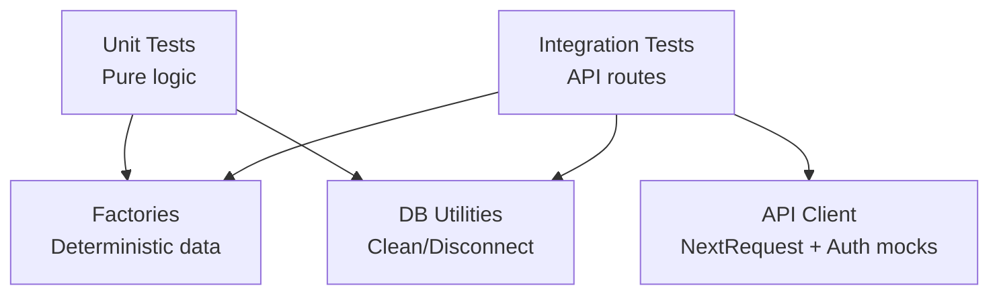

[No sources needed since this diagram shows conceptual workflow, not actual code structure]

## Detailed Component Analysis

### Session Token Security (Unit)
This suite validates token signing, verification, expiration, tampering resistance, and timing-safe comparison.

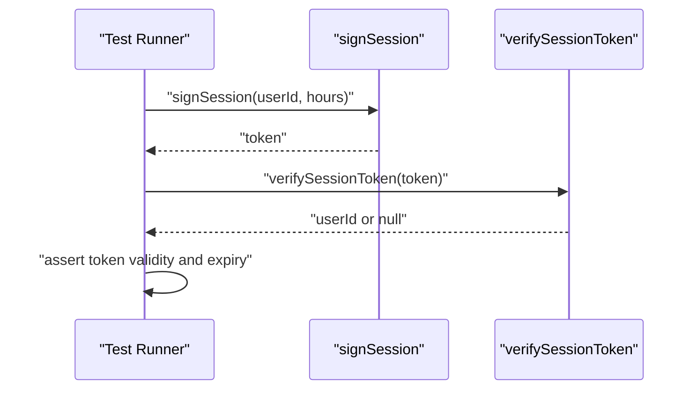

**Diagram sources**
- [tests/unit/lib/auth.test.ts:5-26](file://tests/unit/lib/auth.test.ts#L5-L26)
- [lib/shared/auth.ts:18-59](file://lib/shared/auth.ts#L18-L59)

**Section sources**
- [tests/unit/lib/auth.test.ts:1-81](file://tests/unit/lib/auth.test.ts#L1-L81)
- [lib/shared/auth.ts:18-59](file://lib/shared/auth.ts#L18-L59)

### Document Type Logic (Unit)
Validates document classification helpers and constants.

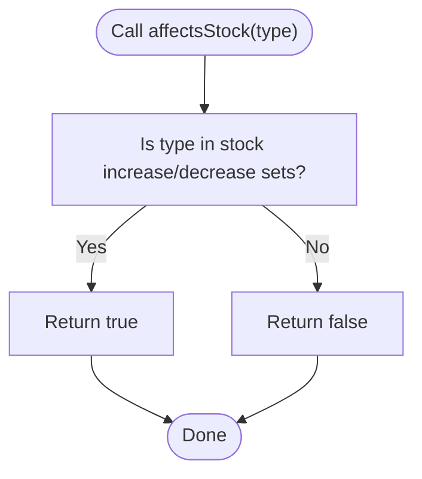

**Diagram sources**
- [tests/unit/lib/documents.test.ts:20-68](file://tests/unit/lib/documents.test.ts#L20-L68)

**Section sources**
- [tests/unit/lib/documents.test.ts:1-290](file://tests/unit/lib/documents.test.ts#L1-L290)

### Rate Limiter (Unit)
Validates request limiting behavior, window resets, and IP extraction.

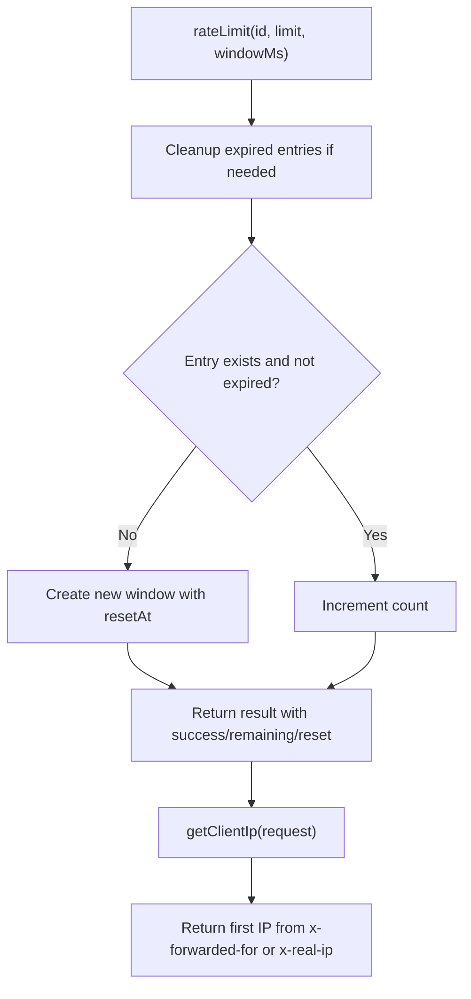

**Diagram sources**
- [tests/unit/lib/rate-limit.test.ts:5-51](file://tests/unit/lib/rate-limit.test.ts#L5-L51)
- [lib/shared/rate-limit.ts:58-114](file://lib/shared/rate-limit.ts#L58-L114)

**Section sources**
- [tests/unit/lib/rate-limit.test.ts:1-151](file://tests/unit/lib/rate-limit.test.ts#L1-L151)
- [lib/shared/rate-limit.ts:58-114](file://lib/shared/rate-limit.ts#L58-L114)

### Authentication API Integration (Integration)
Validates setup, login, and protected profile endpoints with mocked auth.

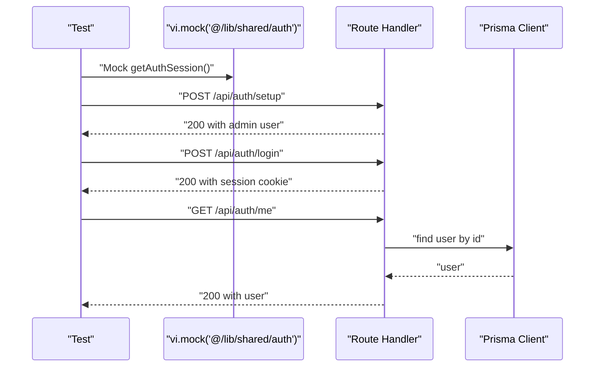

**Diagram sources**
- [tests/integration/api/auth.test.ts:6-13](file://tests/integration/api/auth.test.ts#L6-L13)
- [tests/integration/api/auth.test.ts:25-59](file://tests/integration/api/auth.test.ts#L25-L59)
- [tests/integration/api/auth.test.ts:92-143](file://tests/integration/api/auth.test.ts#L92-L143)
- [tests/integration/api/auth.test.ts:176-194](file://tests/integration/api/auth.test.ts#L176-L194)

**Section sources**
- [tests/integration/api/auth.test.ts:1-197](file://tests/integration/api/auth.test.ts#L1-L197)

### Products CRUD API Integration (Integration)
Validates product creation, listing, updates, and soft-deletion with role-based access control.

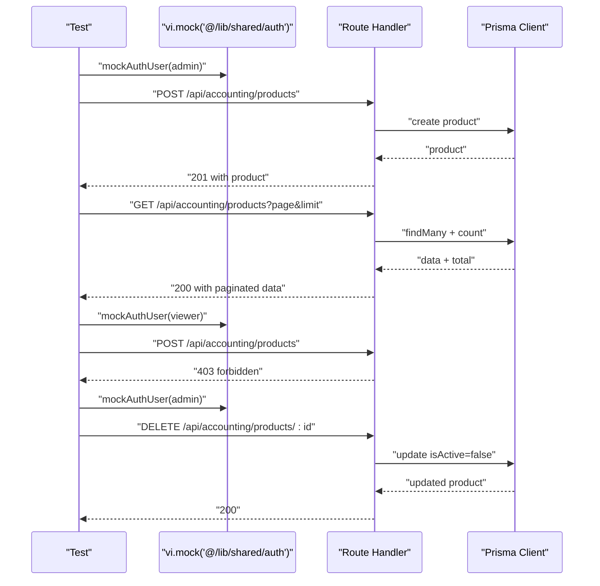

**Diagram sources**
- [tests/integration/api/products.test.ts:6-13](file://tests/integration/api/products.test.ts#L6-L13)
- [tests/integration/api/products.test.ts:36-113](file://tests/integration/api/products.test.ts#L36-L113)
- [tests/integration/api/products.test.ts:141-173](file://tests/integration/api/products.test.ts#L141-L173)
- [tests/integration/api/products.test.ts:179-218](file://tests/integration/api/products.test.ts#L179-L218)

**Section sources**
- [tests/integration/api/products.test.ts:1-220](file://tests/integration/api/products.test.ts#L1-L220)

### Factory Pattern for Test Data Generation
Factories encapsulate entity creation with deterministic IDs and sensible defaults. They support optional overrides and nested creation to simplify tests.

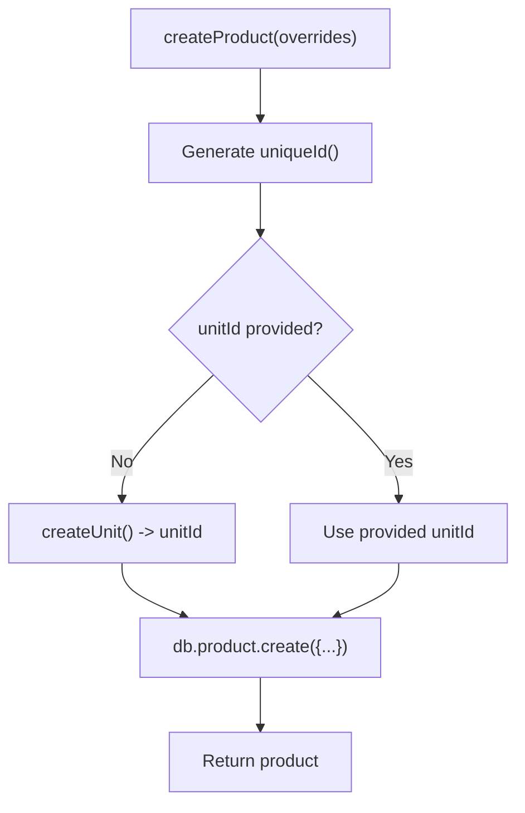

**Diagram sources**
- [tests/helpers/factories.ts:60-93](file://tests/helpers/factories.ts#L60-L93)

**Section sources**
- [tests/helpers/factories.ts:18-438](file://tests/helpers/factories.ts#L18-L438)

### Database Test Isolation Strategies
- Sequential execution prevents concurrent writes from interfering with each other.
- beforeEach runs cleanDatabase to delete records in dependency order, ensuring a clean slate.
- afterAll disconnects the Prisma client to free resources.
- Tests that do not require the database silently skip DB cleanup.

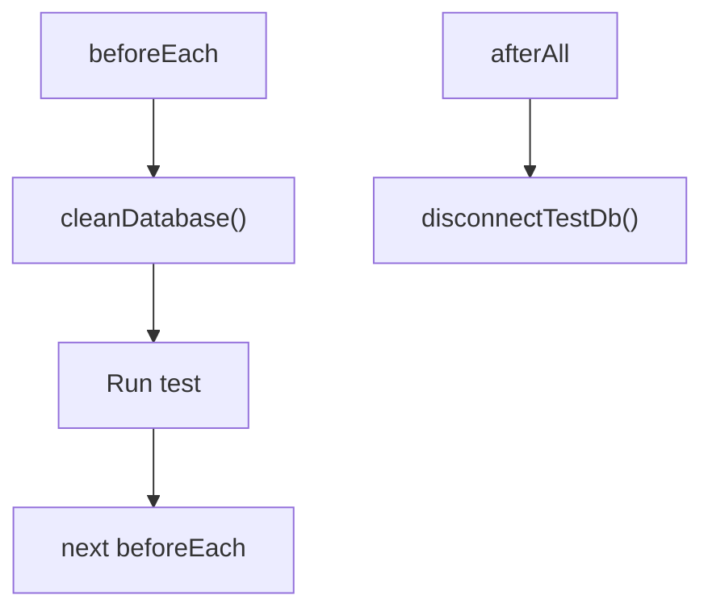

**Diagram sources**
- [tests/setup.ts:8-25](file://tests/setup.ts#L8-L25)
- [tests/helpers/test-db.ts:8-50](file://tests/helpers/test-db.ts#L8-L50)

**Section sources**
- [tests/setup.ts:8-25](file://tests/setup.ts#L8-L25)
- [tests/helpers/test-db.ts:8-50](file://tests/helpers/test-db.ts#L8-L50)

### Mocking External Dependencies
- API route tests mock the auth module to simulate authenticated/unauthenticated sessions.
- createTestRequest constructs NextRequest objects with method, headers, and query parameters.
- Responses are parsed via jsonResponse for assertions.

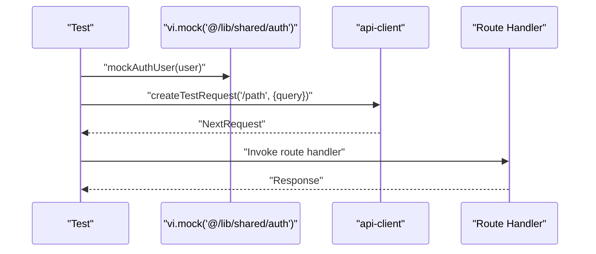

**Diagram sources**
- [tests/helpers/api-client.ts:48-62](file://tests/helpers/api-client.ts#L48-L62)
- [tests/helpers/api-client.ts:17-42](file://tests/helpers/api-client.ts#L17-L42)
- [tests/integration/api/auth.test.ts:6-13](file://tests/integration/api/auth.test.ts#L6-L13)

**Section sources**
- [tests/helpers/api-client.ts:1-70](file://tests/helpers/api-client.ts#L1-L70)
- [tests/integration/api/auth.test.ts:6-13](file://tests/integration/api/auth.test.ts#L6-L13)

### Testing Patterns by Component Type
- Business logic modules (e.g., documents classification)
  - Use describe blocks to group related assertions.
  - Validate constants and helper functions with targeted tests.
  - Example: [tests/unit/lib/documents.test.ts:19-289](file://tests/unit/lib/documents.test.ts#L19-L289)

- Utility functions (e.g., rate limiter, auth)
  - Validate success paths, boundary conditions, and error cases.
  - Example: [tests/unit/lib/rate-limit.test.ts:1-151](file://tests/unit/lib/rate-limit.test.ts#L1-L151), [tests/unit/lib/auth.test.ts:1-81](file://tests/unit/lib/auth.test.ts#L1-L81)

- Authentication services
  - Mock auth module to simulate sessions and assert protected endpoints.
  - Example: [tests/integration/api/auth.test.ts:1-197](file://tests/integration/api/auth.test.ts#L1-L197)

- API routes
  - Use createTestRequest to build requests and jsonResponse to parse responses.
  - Example: [tests/integration/api/products.test.ts:1-220](file://tests/integration/api/products.test.ts#L1-L220)

**Section sources**
- [tests/unit/lib/documents.test.ts:19-289](file://tests/unit/lib/documents.test.ts#L19-L289)
- [tests/unit/lib/rate-limit.test.ts:1-151](file://tests/unit/lib/rate-limit.test.ts#L1-L151)
- [tests/unit/lib/auth.test.ts:1-81](file://tests/unit/lib/auth.test.ts#L1-L81)
- [tests/integration/api/auth.test.ts:1-197](file://tests/integration/api/auth.test.ts#L1-L197)
- [tests/integration/api/products.test.ts:1-220](file://tests/integration/api/products.test.ts#L1-L220)

### Guidelines for Writing Effective Unit Tests
- Naming conventions
  - Use descriptive test names that explain the scenario and expected outcome.
  - Group related tests under describe blocks with clear titles.

- Assertion patterns
  - Prefer explicit assertions over implicit checks.
  - Assert both success and failure paths.
  - Validate metadata returned by utilities (e.g., remaining, reset).

- Test organization
  - Keep tests focused on a single responsibility.
  - Use beforeEach to prepare minimal, deterministic state.
  - Leverage factories to reduce duplication and improve readability.

- Async operations
  - Use await for promises and handle timeouts appropriately.
  - For time-sensitive tests, introduce controlled delays and assert outcomes.

[No sources needed since this section provides general guidance]

### Test Setup Process and Environment Configuration
- Vitest configuration loads environment variables from .env.test before imports and configures:
  - Environment: Node
  - Globals: Enabled
  - Setup file: tests/setup.ts
  - Test timeout: 30 seconds
  - Hook timeout: 30 seconds
  - Include pattern: tests/**/*.test.ts
  - Sequential execution: fileParallelism disabled and sequence.concurrent false
  - Path alias: "@" resolves to repository root

- Scripts
  - test: runs Nx test targets with parallel=1
  - test:coverage: runs Vitest with coverage
  - test:watch: watches tests

**Section sources**
- [vitest.config.ts:5-29](file://vitest.config.ts#L5-L29)
- [package.json:5-27](file://package.json#L5-L27)

### Parallelization Settings
- Sequential execution is enforced to avoid database race conditions during tests.
- fileParallelism is disabled and sequence.concurrent is false.

**Section sources**
- [vitest.config.ts:18-22](file://vitest.config.ts#L18-L22)

### Examples of Common Testing Scenarios
- Component rendering and state management
  - Use factory-generated entities to populate state and assert UI behavior.
  - Example patterns: [tests/helpers/factories.ts:18-438](file://tests/helpers/factories.ts#L18-L438)

- Async operations
  - Validate token expiration and rate limiter windows.
  - Example patterns: [tests/unit/lib/auth.test.ts:16-26](file://tests/unit/lib/auth.test.ts#L16-L26), [tests/unit/lib/rate-limit.test.ts:32-51](file://tests/unit/lib/rate-limit.test.ts#L32-L51)

- API route interactions
  - Construct requests with createTestRequest and assert responses.
  - Example patterns: [tests/helpers/api-client.ts:17-42](file://tests/helpers/api-client.ts#L17-L42), [tests/integration/api/products.test.ts:36-113](file://tests/integration/api/products.test.ts#L36-L113)

**Section sources**
- [tests/helpers/factories.ts:18-438](file://tests/helpers/factories.ts#L18-L438)
- [tests/unit/lib/auth.test.ts:16-26](file://tests/unit/lib/auth.test.ts#L16-L26)
- [tests/unit/lib/rate-limit.test.ts:32-51](file://tests/unit/lib/rate-limit.test.ts#L32-L51)
- [tests/helpers/api-client.ts:17-42](file://tests/helpers/api-client.ts#L17-L42)
- [tests/integration/api/products.test.ts:36-113](file://tests/integration/api/products.test.ts#L36-L113)

## Dependency Analysis
- Unit tests depend on pure functions and constants; they rely on factories for data when applicable.
- Integration tests depend on:
  - API route handlers
  - Mocked auth module
  - API client helpers
  - Factories and test database utilities

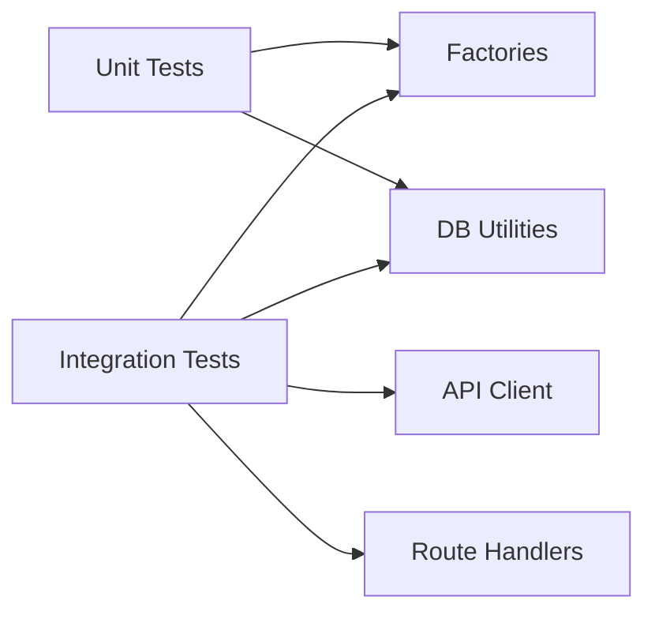

[No sources needed since this diagram shows conceptual relationships, not specific code structure]

**Section sources**
- [tests/unit/lib/auth.test.ts:1-81](file://tests/unit/lib/auth.test.ts#L1-L81)
- [tests/unit/lib/documents.test.ts:1-290](file://tests/unit/lib/documents.test.ts#L1-L290)
- [tests/unit/lib/rate-limit.test.ts:1-151](file://tests/unit/lib/rate-limit.test.ts#L1-L151)
- [tests/integration/api/auth.test.ts:1-197](file://tests/integration/api/auth.test.ts#L1-L197)
- [tests/integration/api/products.test.ts:1-220](file://tests/integration/api/products.test.ts#L1-L220)

## Performance Considerations
- Sequential execution reduces contention but increases total runtime. Keep tests small and focused.
- Use factories to minimize database round-trips by generating related entities in a single test.
- Avoid unnecessary waits; use precise timeouts for async assertions.
- Prefer lightweight assertions (length checks, booleans) over heavy serialization when possible.

[No sources needed since this section provides general guidance]

## Troubleshooting Guide
- Database race conditions
  - Symptom: flaky tests due to concurrent writes.
  - Resolution: Sequential execution is configured; avoid parallel file execution and keep tests minimal.

- Authentication mocking issues
  - Symptom: Tests fail because auth is not mocked.
  - Resolution: Ensure vi.mock is applied before importing route handlers and that mockAuthUser/mockAuthNone are called before invoking routes.

- Missing environment variables
  - Symptom: Auth functions throw due to missing SESSION_SECRET.
  - Resolution: Set environment variables in .env.test for test runs.

- Coverage reporting
  - Command: test:coverage runs Vitest with coverage enabled.

**Section sources**
- [vitest.config.ts:18-22](file://vitest.config.ts#L18-L22)
- [tests/integration/api/auth.test.ts:6-13](file://tests/integration/api/auth.test.ts#L6-L13)
- [lib/shared/auth.ts:5-11](file://lib/shared/auth.ts#L5-L11)
- [package.json:11](file://package.json#L11)

## Conclusion
ListOpt ERP’s testing strategy leverages Vitest with careful isolation, deterministic factories, and targeted mocking to validate both pure logic and API behavior. By enforcing sequential execution, cleaning the database per test, and using factories and API helpers, the suite remains reliable and maintainable. Following the patterns and guidelines outlined here ensures consistent, effective unit and integration tests across the codebase.

## Appendices
- Quick reference: environment variables for auth and rate limiting are loaded via Vitest configuration and scripts.
- Quick reference: database cleanup order prioritizes child tables to respect foreign keys.

**Section sources**
- [vitest.config.ts:5-7](file://vitest.config.ts#L5-L7)
- [tests/helpers/test-db.ts:8-43](file://tests/helpers/test-db.ts#L8-L43)