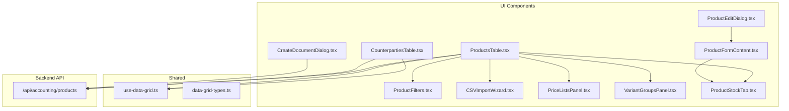
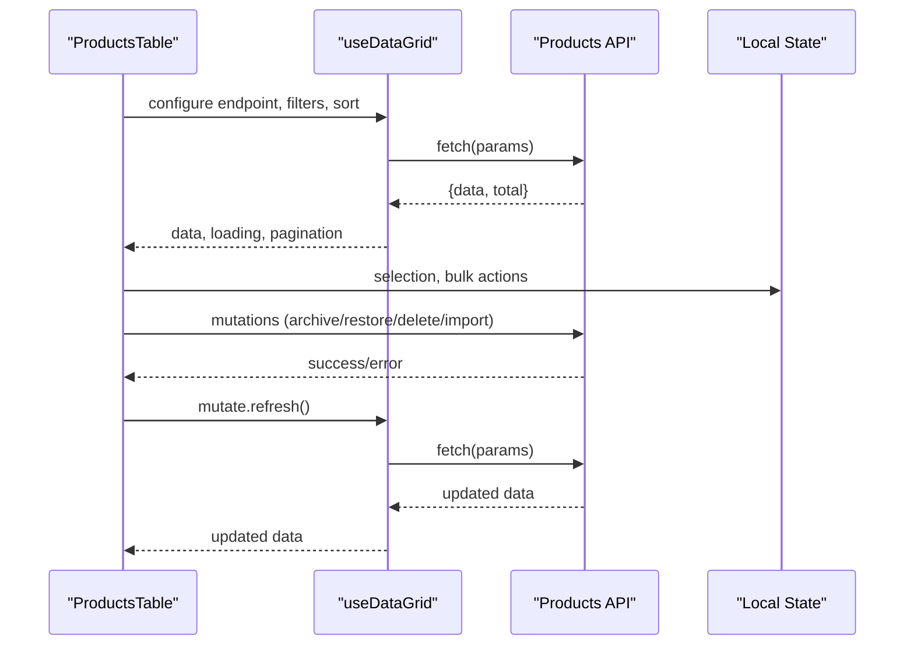
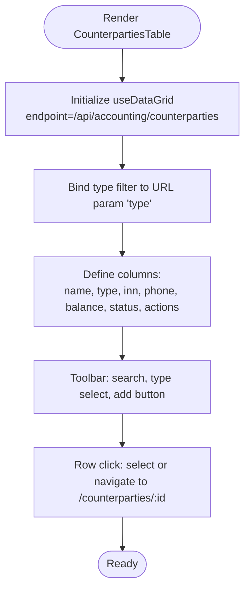
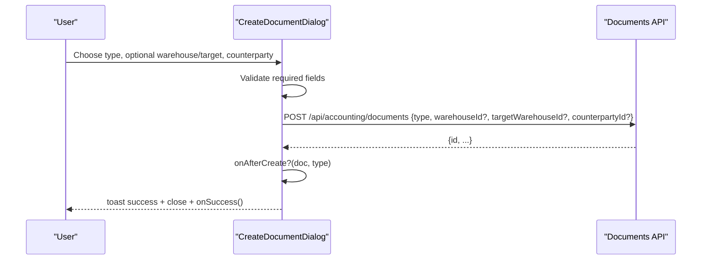
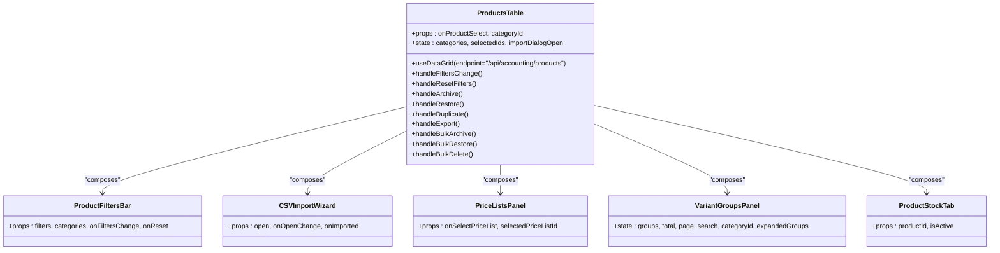
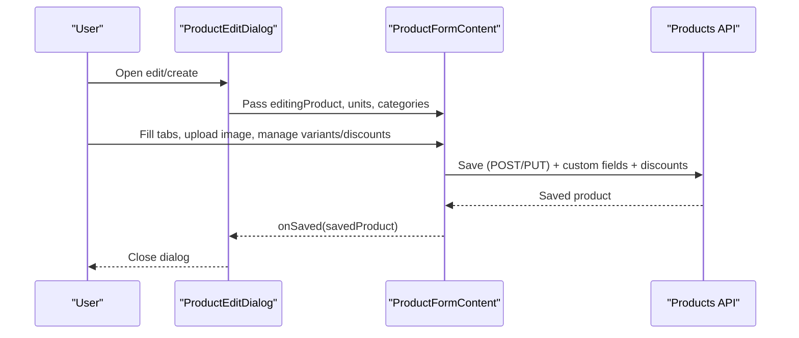
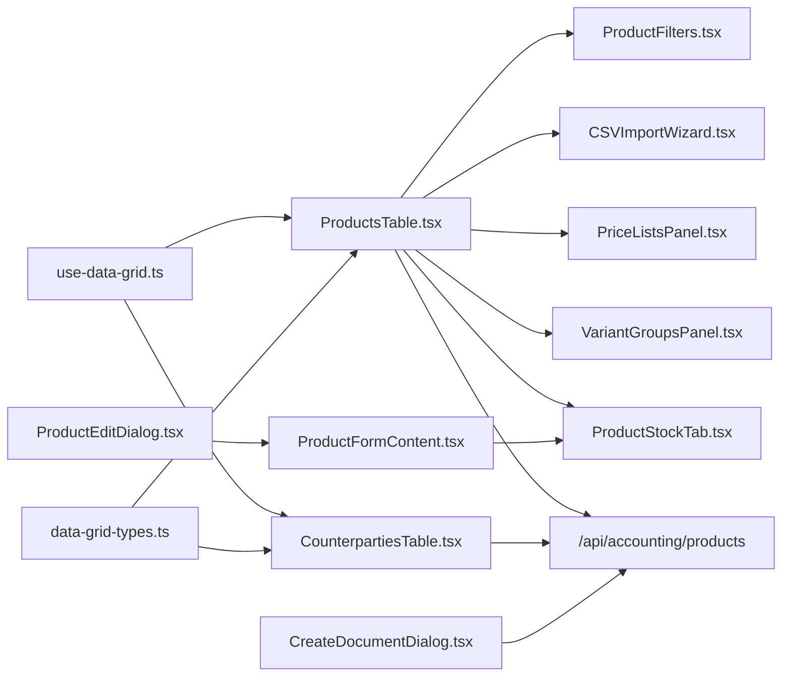

# Accounting Components

<cite>
**Referenced Files in This Document**
- [CounterpartiesTable.tsx](file://components/accounting/CounterpartiesTable.tsx)
- [CreateDocumentDialog.tsx](file://components/accounting/CreateDocumentDialog.tsx)
- [ProductsTable.tsx](file://components/accounting/ProductsTable.tsx)
- [ProductEditDialog.tsx](file://components/accounting/catalog/ProductEditDialog.tsx)
- [ProductFilters.tsx](file://components/accounting/catalog/ProductFilters.tsx)
- [CSVImportWizard.tsx](file://components/accounting/catalog/CSVImportWizard.tsx)
- [PriceListsPanel.tsx](file://components/accounting/catalog/PriceListsPanel.tsx)
- [VariantGroupsPanel.tsx](file://components/accounting/catalog/VariantGroupsPanel.tsx)
- [ProductStockTab.tsx](file://components/accounting/catalog/ProductStockTab.tsx)
- [ProductFormContent.tsx](file://components/accounting/catalog/ProductFormContent.tsx)
- [use-data-grid.ts](file://lib/hooks/use-data-grid/use-data-grid.ts)
- [data-grid-types.ts](file://components/ui/data-grid/data-grid-types.ts)
- [route.ts](file://app/api/accounting/products/route.ts)
</cite>

## Table of Contents
1. [Introduction](#introduction)
2. [Project Structure](#project-structure)
3. [Core Components](#core-components)
4. [Architecture Overview](#architecture-overview)
5. [Detailed Component Analysis](#detailed-component-analysis)
6. [Dependency Analysis](#dependency-analysis)
7. [Performance Considerations](#performance-considerations)
8. [Troubleshooting Guide](#troubleshooting-guide)
9. [Conclusion](#conclusion)

## Introduction
This document explains the specialized accounting components used in the ERP system, focusing on:
- Customer/supplier relationship management via CounterpartiesTable
- Document creation workflows via CreateDocumentDialog
- Inventory and product catalog management via ProductsTable and supporting catalog components

It covers component integration patterns, data binding, form validation, state management, business logic integration, data synchronization, and error handling tailored to accounting workflows.

## Project Structure
The accounting domain is organized under components/accounting and components/accounting/catalog, with shared UI utilities and a reusable data-grid hook. Backend APIs are located under app/api/accounting.

**Diagram sources**
- [CounterpartiesTable.tsx:1-190](file://components/accounting/CounterpartiesTable.tsx#L1-L190)
- [CreateDocumentDialog.tsx:1-245](file://components/accounting/CreateDocumentDialog.tsx#L1-L245)
- [ProductsTable.tsx:1-495](file://components/accounting/ProductsTable.tsx#L1-L495)
- [ProductEditDialog.tsx:1-47](file://components/accounting/catalog/ProductEditDialog.tsx#L1-L47)
- [ProductFilters.tsx:1-171](file://components/accounting/catalog/ProductFilters.tsx#L1-L171)
- [CSVImportWizard.tsx:1-478](file://components/accounting/catalog/CSVImportWizard.tsx#L1-L478)
- [PriceListsPanel.tsx:1-238](file://components/accounting/catalog/PriceListsPanel.tsx#L1-L238)
- [VariantGroupsPanel.tsx:1-309](file://components/accounting/catalog/VariantGroupsPanel.tsx#L1-L309)
- [ProductStockTab.tsx:1-160](file://components/accounting/catalog/ProductStockTab.tsx#L1-L160)
- [ProductFormContent.tsx:1-854](file://components/accounting/catalog/ProductFormContent.tsx#L1-L854)
- [use-data-grid.ts:1-302](file://lib/hooks/use-data-grid/use-data-grid.ts#L1-L302)
- [data-grid-types.ts:1-74](file://components/ui/data-grid/data-grid-types.ts#L1-L74)
- [route.ts:1-226](file://app/api/accounting/products/route.ts#L1-L226)

**Section sources**
- [CounterpartiesTable.tsx:1-190](file://components/accounting/CounterpartiesTable.tsx#L1-L190)
- [CreateDocumentDialog.tsx:1-245](file://components/accounting/CreateDocumentDialog.tsx#L1-L245)
- [ProductsTable.tsx:1-495](file://components/accounting/ProductsTable.tsx#L1-L495)
- [ProductEditDialog.tsx:1-47](file://components/accounting/catalog/ProductEditDialog.tsx#L1-L47)
- [ProductFilters.tsx:1-171](file://components/accounting/catalog/ProductFilters.tsx#L1-L171)
- [CSVImportWizard.tsx:1-478](file://components/accounting/catalog/CSVImportWizard.tsx#L1-L478)
- [PriceListsPanel.tsx:1-238](file://components/accounting/catalog/PriceListsPanel.tsx#L1-L238)
- [VariantGroupsPanel.tsx:1-309](file://components/accounting/catalog/VariantGroupsPanel.tsx#L1-L309)
- [ProductStockTab.tsx:1-160](file://components/accounting/catalog/ProductStockTab.tsx#L1-L160)
- [ProductFormContent.tsx:1-854](file://components/accounting/catalog/ProductFormContent.tsx#L1-L854)
- [use-data-grid.ts:1-302](file://lib/hooks/use-data-grid/use-data-grid.ts#L1-L302)
- [data-grid-types.ts:1-74](file://components/ui/data-grid/data-grid-types.ts#L1-L74)
- [route.ts:1-226](file://app/api/accounting/products/route.ts#L1-L226)

## Core Components
- CounterpartiesTable: Grid for viewing and selecting customers/suppliers with type filtering, search, and balance display.
- CreateDocumentDialog: Unified dialog to create various document types with warehouse/counterparty selection and CSRF-protected submission.
- ProductsTable: Comprehensive product catalog grid with filters, bulk actions, CSV import/export, and integration with catalog panels.

**Section sources**
- [CounterpartiesTable.tsx:35-190](file://components/accounting/CounterpartiesTable.tsx#L35-L190)
- [CreateDocumentDialog.tsx:33-245](file://components/accounting/CreateDocumentDialog.tsx#L33-L245)
- [ProductsTable.tsx:52-495](file://components/accounting/ProductsTable.tsx#L52-L495)

## Architecture Overview
The components share a common data-fetching and state-management pattern powered by a reusable hook and a shared data-grid abstraction. Catalog components integrate tightly with product forms and stock tabs.

**Diagram sources**
- [ProductsTable.tsx:65-85](file://components/accounting/ProductsTable.tsx#L65-L85)
- [use-data-grid.ts:137-179](file://lib/hooks/use-data-grid/use-data-grid.ts#L137-L179)
- [route.ts:7-145](file://app/api/accounting/products/route.ts#L7-L145)

## Detailed Component Analysis

### CounterpartiesTable
- Purpose: Manage customer/supplier relationships with search, type filtering, and balance display.
- Data binding: Uses useDataGrid with endpoint "/api/accounting/counterparties".
- Filtering: Type filter synchronized with URL; toolbar integrates search and action buttons.
- Selection: Supports callback-driven selection or navigation to detail page.
- Business logic: Displays balance rubles with color-coded formatting; supports archive/restore via navigation.

**Diagram sources**
- [CounterpartiesTable.tsx:44-58](file://components/accounting/CounterpartiesTable.tsx#L44-L58)
- [CounterpartiesTable.tsx:65-145](file://components/accounting/CounterpartiesTable.tsx#L65-L145)
- [CounterpartiesTable.tsx:147-153](file://components/accounting/CounterpartiesTable.tsx#L147-L153)

**Section sources**
- [CounterpartiesTable.tsx:35-190](file://components/accounting/CounterpartiesTable.tsx#L35-L190)

### CreateDocumentDialog
- Purpose: Unified creation of accounting documents with configurable visibility of warehouse/counterparty fields.
- Props: open, onOpenChange, docTypes, warehouses, counterparties, onSuccess, and optional overrides for behavior.
- Validation: Ensures document type is selected; enforces warehouse requirement when flagged.
- Submission: CSRF-protected POST to "/api/accounting/documents" with type and optional warehouse/target fields.
- Lifecycle: Toast feedback, optional onAfterCreate hook, and success callback.

**Diagram sources**
- [CreateDocumentDialog.tsx:53-143](file://components/accounting/CreateDocumentDialog.tsx#L53-L143)

**Section sources**
- [CreateDocumentDialog.tsx:33-245](file://components/accounting/CreateDocumentDialog.tsx#L33-L245)

### ProductsTable
- Purpose: Central product catalog with advanced filtering, sorting, bulk actions, and CSV operations.
- Data binding: useDataGrid with endpoint "/api/accounting/products", default sort by name, pagination.
- Filters: ProductFiltersBar props bridge to grid filters; supports search, category, activity, publication, variant status, and discount flag.
- Actions: Individual actions (archive/restore/duplicate) and bulk actions (archive/restore/delete).
- CSV: Export to CSV and import wizard integration.
- Composition: Integrates ProductFiltersBar, CSVImportWizard, PriceListsPanel, VariantGroupsPanel, and ProductStockTab.

**Diagram sources**
- [ProductsTable.tsx:59-495](file://components/accounting/ProductsTable.tsx#L59-L495)
- [ProductFilters.tsx:54-171](file://components/accounting/catalog/ProductFilters.tsx#L54-L171)
- [CSVImportWizard.tsx:131-478](file://components/accounting/catalog/CSVImportWizard.tsx#L131-L478)
- [PriceListsPanel.tsx:32-238](file://components/accounting/catalog/PriceListsPanel.tsx#L32-L238)
- [VariantGroupsPanel.tsx:47-309](file://components/accounting/catalog/VariantGroupsPanel.tsx#L47-L309)
- [ProductStockTab.tsx:38-160](file://components/accounting/catalog/ProductStockTab.tsx#L38-L160)

**Section sources**
- [ProductsTable.tsx:52-495](file://components/accounting/ProductsTable.tsx#L52-L495)

### ProductEditDialog and ProductFormContent
- ProductEditDialog: Modal wrapper around ProductFormContent with editingProduct context and unit/category references.
- ProductFormContent: Full-featured product editor with tabs:
  - Basic: image upload, SKU generation, pricing, SEO, publish-to-store toggle.
  - Characteristics: custom fields with dynamic types and options.
  - SEO: SEO title/description/keywords/slug.
  - Stock: embedded ProductStockTab for live stock values.
  - Variants: variant linking, search, and suggestions.
  - Discounts: add/remove discounts with calculated discounted price.
- Validation: Form-level checks (required fields), CSRF-protected saves, and optimistic updates with refresh.

**Diagram sources**
- [ProductEditDialog.tsx:19-46](file://components/accounting/catalog/ProductEditDialog.tsx#L19-L46)
- [ProductFormContent.tsx:63-251](file://components/accounting/catalog/ProductFormContent.tsx#L63-L251)

**Section sources**
- [ProductEditDialog.tsx:10-47](file://components/accounting/catalog/ProductEditDialog.tsx#L10-L47)
- [ProductFormContent.tsx:52-854](file://components/accounting/catalog/ProductFormContent.tsx#L52-L854)

### ProductFilters
- Purpose: Shared filter bar for ProductsTable with extended filters and reset capability.
- State: Local state for filter values; bridges to ProductsTable via onFiltersChange and onReset.
- API mapping: Converts UI values to API-friendly values (special "all" sentinel).

**Section sources**
- [ProductFilters.tsx:19-171](file://components/accounting/catalog/ProductFilters.tsx#L19-L171)

### CSVImportWizard
- Purpose: Multi-step CSV import for products with auto-mapping, preview, and result reporting.
- Steps: Upload → Mapping → Preview → Result.
- Validation: Enforces required "name" mapping; supports updating existing products by SKU.
- Submission: POST to "/api/accounting/products/import" with processed rows.

**Section sources**
- [CSVImportWizard.tsx:19-478](file://components/accounting/catalog/CSVImportWizard.tsx#L19-L478)

### PriceListsPanel
- Purpose: Manage price lists with create/edit/delete and selection callback.
- Behavior: Loads lists on mount, handles save/delete with toast feedback, and clears selection on deletion.

**Section sources**
- [PriceListsPanel.tsx:27-238](file://components/accounting/catalog/PriceListsPanel.tsx#L27-L238)

### VariantGroupsPanel
- Purpose: Browse and expand product variant groups with stats and pagination.
- Behavior: Loads paginated groups with search and category filters; toggles variant expansion.

**Section sources**
- [VariantGroupsPanel.tsx:47-309](file://components/accounting/catalog/VariantGroupsPanel.tsx#L47-L309)

### ProductStockTab
- Purpose: Display per-warehouse stock quantities, reserves, availability, and valuation.
- Behavior: Lazy loads when tab becomes active; shows totals and explanatory note about reserves.

**Section sources**
- [ProductStockTab.tsx:33-160](file://components/accounting/catalog/ProductStockTab.tsx#L33-L160)

## Dependency Analysis
- Data-grid abstraction: useDataGrid centralizes pagination, search, sorting, URL sync, caching, and mutations.
- Component coupling: ProductsTable composes multiple catalog components; dialogs depend on shared types and utilities.
- External dependencies: Next.js router/search params, TanStack Table types, Sonner for notifications, Lucide icons.

**Diagram sources**
- [use-data-grid.ts:17-301](file://lib/hooks/use-data-grid/use-data-grid.ts#L17-L301)
- [data-grid-types.ts:57-74](file://components/ui/data-grid/data-grid-types.ts#L57-L74)
- [ProductsTable.tsx:59-495](file://components/accounting/ProductsTable.tsx#L59-L495)
- [CounterpartiesTable.tsx:39-190](file://components/accounting/CounterpartiesTable.tsx#L39-L190)
- [ProductEditDialog.tsx:19-46](file://components/accounting/catalog/ProductEditDialog.tsx#L19-L46)
- [ProductFormContent.tsx:63-854](file://components/accounting/catalog/ProductFormContent.tsx#L63-L854)
- [route.ts:7-226](file://app/api/accounting/products/route.ts#L7-L226)

**Section sources**
- [use-data-grid.ts:17-301](file://lib/hooks/use-data-grid/use-data-grid.ts#L17-L301)
- [data-grid-types.ts:57-74](file://components/ui/data-grid/data-grid-types.ts#L57-L74)
- [ProductsTable.tsx:59-495](file://components/accounting/ProductsTable.tsx#L59-L495)
- [CounterpartiesTable.tsx:39-190](file://components/accounting/CounterpartiesTable.tsx#L39-L190)
- [ProductEditDialog.tsx:19-46](file://components/accounting/catalog/ProductEditDialog.tsx#L19-L46)
- [ProductFormContent.tsx:63-854](file://components/accounting/catalog/ProductFormContent.tsx#L63-L854)
- [route.ts:7-226](file://app/api/accounting/products/route.ts#L7-L226)

## Performance Considerations
- Caching: useDataGrid caches responses keyed by endpoint and params; stale-while-revalidate improves perceived performance.
- Debounced search: useDataGrid debounces search input to reduce network requests.
- Lazy loading: ProductStockTab only loads when its tab becomes active.
- Pagination: ProductsTable uses server-side pagination to avoid large payloads.
- URL sync: useDataGrid keeps URL state minimal and clean, reducing unnecessary re-renders.

[No sources needed since this section provides general guidance]

## Troubleshooting Guide
- Data loading errors: useDataGrid displays a toast on fetch failure and falls back to cached data when available.
- Form validation: ProductFormContent validates required fields and shows localized messages; ProductEditDialog ensures document type selection.
- Import failures: CSVImportWizard aggregates row-level errors and shows a summary; allows retry or correction.
- API permissions: Backend routes enforce permissions; unauthorized access surfaces as handled errors.

**Section sources**
- [use-data-grid.ts:171-178](file://lib/hooks/use-data-grid/use-data-grid.ts#L171-L178)
- [ProductFormContent.tsx:220-251](file://components/accounting/catalog/ProductFormContent.tsx#L220-L251)
- [CSVImportWizard.tsx:236-241](file://components/accounting/catalog/CSVImportWizard.tsx#L236-L241)
- [route.ts:140-144](file://app/api/accounting/products/route.ts#L140-L144)

## Conclusion
These accounting components form a cohesive, scalable foundation for managing counterparties, documents, and product catalogs. They leverage a shared data-grid hook for consistent state management, URL synchronization, and caching, while maintaining clear separation of concerns across UI, forms, and business logic. The integration of catalog panels and stock views enables efficient inventory and pricing workflows.