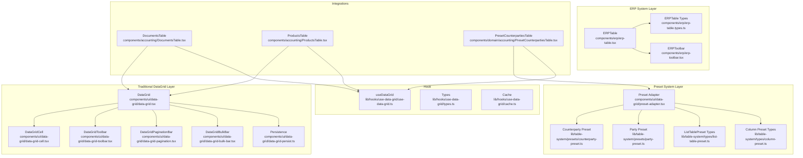
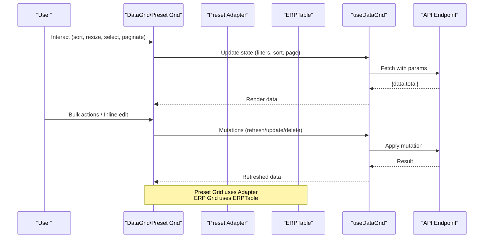
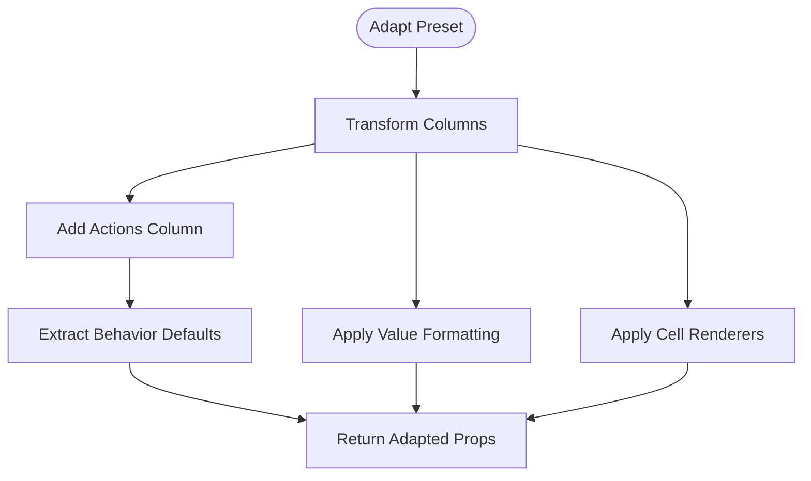
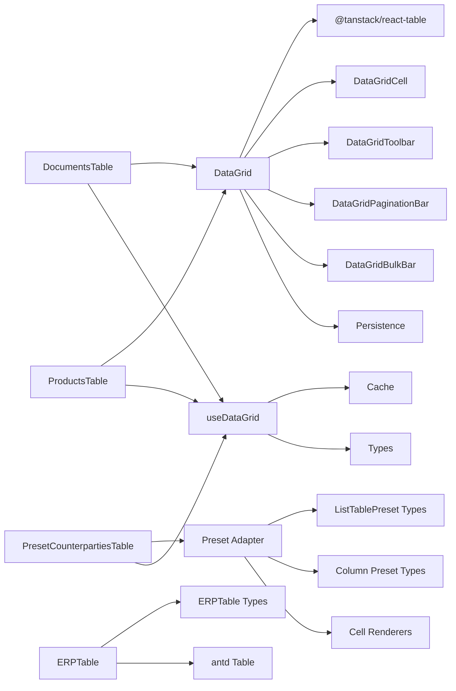

# Data Grid System

<cite>
**Referenced Files in This Document**
- [data-grid.tsx](file://components/ui/data-grid/data-grid.tsx)
- [data-grid-types.ts](file://components/ui/data-grid/data-grid-types.ts)
- [data-grid-cell.tsx](file://components/ui/data-grid/data-grid-cell.tsx)
- [data-grid-toolbar.tsx](file://components/ui/data-grid/data-grid-toolbar.tsx)
- [data-grid-pagination.tsx](file://components/ui/data-grid/data-grid-pagination.tsx)
- [data-grid-bulk-bar.tsx](file://components/ui/data-grid/data-grid-bulk-bar.tsx)
- [data-grid-persist.ts](file://components/ui/data-grid/data-grid-persist.ts)
- [index.ts](file://components/ui/data-grid/index.ts)
- [preset-adapter.tsx](file://components/ui/data-grid/preset-adapter.tsx)
- [use-data-grid.ts](file://lib/hooks/use-data-grid/use-data-grid.ts)
- [types.ts](file://lib/hooks/use-data-grid/types.ts)
- [cache.ts](file://lib/hooks/use-data-grid/cache.ts)
- [DocumentsTable.tsx](file://components/accounting/DocumentsTable.tsx)
- [ProductsTable.tsx](file://components/accounting/ProductsTable.tsx)
- [PresetCounterpartiesTable.tsx](file://components/domain/accounting/PresetCounterpartiesTable.tsx)
- [counterparty-preset.ts](file://lib/table-system/presets/counterparty-preset.ts)
- [party-preset.ts](file://lib/table-system/presets/party-preset.ts)
- [list-table-preset.ts](file://lib/table-system/types/list-table-preset.ts)
- [column-preset.ts](file://lib/table-system/types/column-preset.ts)
- [erp-table.tsx](file://components/erp/erp-table.tsx)
- [erp-table.types.ts](file://components/erp/erp-table.types.ts)
- [erp-toolbar.tsx](file://components/erp/erp-toolbar.tsx)
</cite>

## Update Summary
**Changes Made**
- Added comprehensive documentation for the new preset adapter system
- Documented specialized table presets for counterparties, parties, and other domain entities
- Updated architecture diagrams to reflect the new preset-based approach
- Added documentation for the standardized ERP table system
- Enhanced integration examples showing preset-based table implementations

## Table of Contents
1. [Introduction](#introduction)
2. [Project Structure](#project-structure)
3. [Core Components](#core-components)
4. [Architecture Overview](#architecture-overview)
5. [Detailed Component Analysis](#detailed-component-analysis)
6. [Preset System Architecture](#preset-system-architecture)
7. [Standardized ERP Table System](#standardized-erp-table-system)
8. [Dependency Analysis](#dependency-analysis)
9. [Performance Considerations](#performance-considerations)
10. [Accessibility and UX](#accessibility-and-ux)
11. [Extensibility Guidelines](#extensibility-guidelines)
12. [Troubleshooting Guide](#troubleshooting-guide)
13. [Conclusion](#conclusion)

## Introduction
This document describes the advanced data grid system powering ListOpt ERP's accounting and product catalogs. The system has evolved to include a comprehensive preset-based architecture that standardizes table configurations across the application. It covers the main DataGrid component, cell rendering pipeline, toolbar and pagination controls, bulk operation bar, state management, persistence, filtering and sorting, integration with accounting modules, and guidance for extending the grid with custom columns, filters, and actions. The system now includes specialized presets for counterparties, products, sales orders, purchases, and stock documents, along with a standardized ERP table system for consistent data presentation.

## Project Structure
The grid system is organized around three main layers: the traditional DataGrid components, a new preset adapter system, and a standardized ERP table system:
- UI components: DataGrid, DataGridCell, DataGridToolbar, DataGridPaginationBar, DataGridBulkBar, persistence utilities
- Preset system: Preset adapter, table presets, column definitions, and behavior configurations
- ERP system: Standardized table components with framework-agnostic contracts
- Hook: useDataGrid orchestrates fetching, caching, URL synchronization, and mutations
- Accounting integrations: DocumentsTable, ProductsTable, and PresetCounterpartiesTable demonstrate real-world usage

**Diagram sources**
- [data-grid.tsx:1-370](file://components/ui/data-grid/data-grid.tsx#L1-L370)
- [preset-adapter.tsx:1-197](file://components/ui/data-grid/preset-adapter.tsx#L1-L197)
- [counterparty-preset.ts:1-161](file://lib/table-system/presets/counterparty-preset.ts#L1-L161)
- [party-preset.ts:1-147](file://lib/table-system/presets/party-preset.ts#L1-L147)
- [erp-table.tsx:1-166](file://components/erp/erp-table.tsx#L1-L166)
- [use-data-grid.ts:1-302](file://lib/hooks/use-data-grid/use-data-grid.ts#L1-L302)

**Section sources**
- [data-grid.tsx:1-370](file://components/ui/data-grid/data-grid.tsx#L1-L370)
- [preset-adapter.tsx:1-197](file://components/ui/data-grid/preset-adapter.tsx#L1-L197)
- [erp-table.tsx:1-166](file://components/erp/erp-table.tsx#L1-L166)
- [use-data-grid.ts:1-302](file://lib/hooks/use-data-grid/use-data-grid.ts#L1-L302)

## Core Components
- DataGrid: Central table renderer built on TanStack React Table, with selection, resizing, sticky header, density, and inline-editing support.
- DataGridCell: Inline editor for text, number, select, and date fields with validation and save callbacks.
- DataGridToolbar: Search input, custom filters/actions, and column visibility menu.
- DataGridPaginationBar: Page navigation, page size selector, and "jump to page".
- DataGridBulkBar: Selected count and bulk action buttons.
- Persistence: LocalStorage-backed column sizing and visibility.
- Preset Adapter: Transforms declarative table presets into DataGrid props with standardized column definitions.
- ERPTable: Framework-agnostic table component with antd implementation wrapper.
- useDataGrid: Declarative grid state management with caching, URL sync, and mutations.

**Section sources**
- [data-grid.tsx:27-370](file://components/ui/data-grid/data-grid.tsx#L27-L370)
- [preset-adapter.tsx:25-197](file://components/ui/data-grid/preset-adapter.tsx#L25-L197)
- [erp-table.tsx:83-166](file://components/erp/erp-table.tsx#L83-L166)
- [use-data-grid.ts:17-302](file://lib/hooks/use-data-grid/use-data-grid.ts#L17-L302)

## Architecture Overview
The grid architecture now features three distinct layers working together:
- Traditional DataGrid layer: Direct table rendering with full customization
- Preset system layer: Declarative table configurations with standardized column definitions
- ERP system layer: Framework-agnostic contracts with antd implementation wrappers

**Diagram sources**
- [preset-adapter.tsx:139-180](file://components/ui/data-grid/preset-adapter.tsx#L139-L180)
- [erp-table.tsx:96-165](file://components/erp/erp-table.tsx#L96-L165)
- [use-data-grid.ts:137-182](file://lib/hooks/use-data-grid/use-data-grid.ts#L137-L182)

## Detailed Component Analysis

### DataGrid Component
- Selection column: optional, auto-built when selection.enabled is true; supports bulk actions and bulk bar.
- Sorting: supports internal or external sorting; integrates with toolbar and URL state.
- Resizing: column resizing with persistence; debounced saving for sizing.
- Visibility: column visibility persisted to localStorage.
- Sticky header: shadow on scroll; optional pinned columns.
- Inline editing: click to edit cells with DataGridCell; supports text, number, select, date with validation and save callbacks.
- Density: compact vs normal spacing classes.
- Footer: optional footer row.

**Section sources**
- [data-grid.tsx:27-370](file://components/ui/data-grid/data-grid.tsx#L27-L370)

### Preset Adapter System
The Preset Adapter serves as the single integration point between the declarative preset system and DataGrid components. It transforms ListTablePreset configurations into DataGrid-compatible column definitions while maintaining consistency across the application.

**Diagram sources**
- [preset-adapter.tsx:139-180](file://components/ui/data-grid/preset-adapter.tsx#L139-L180)
- [preset-adapter.tsx:53-116](file://components/ui/data-grid/preset-adapter.tsx#L53-L116)

**Section sources**
- [preset-adapter.tsx:1-197](file://components/ui/data-grid/preset-adapter.tsx#L1-L197)

### ERP Table System
The ERPTable provides a framework-agnostic contract for table components, ensuring consistency across different implementations while allowing flexibility for specific use cases.

**Section sources**
- [erp-table.tsx:1-166](file://components/erp/erp-table.tsx#L1-L166)
- [erp-table.types.ts:1-174](file://components/erp/erp-table.types.ts#L1-L174)

## Preset System Architecture
The preset system introduces a declarative approach to table configuration, enabling consistent column definitions, behavior settings, and toolbar configurations across the application.

### Preset Structure
Each preset defines:
- **Identity**: Unique table identifier and persistence key
- **Columns**: Declarative column definitions with stable IDs
- **Behavior**: Sorting, pagination, selection, and URL synchronization settings
- **Toolbar**: Search, filters, and action configurations
- **Actions**: Row and bulk action descriptors
- **Summary**: Optional summary/footer configuration

### Column Preset Features
- **Stable Identity**: Required column IDs for persistence and sorting
- **Framework-Agnostic**: No React dependencies, supports nested data paths
- **Formatting Options**: Pure value formatters or shared cell renderers
- **Visibility Control**: Default visibility and required column flags
- **Customization**: Column overrides for page-level modifications

**Section sources**
- [list-table-preset.ts:19-113](file://lib/table-system/types/list-table-preset.ts#L19-L113)
- [column-preset.ts:22-143](file://lib/table-system/types/column-preset.ts#L22-L143)

## Standardized ERP Table System
The ERP table system provides framework-agnostic contracts that separate presentation concerns from domain logic, enabling consistent table behavior across different components.

### ERPTable Contract
The ERPTable interface defines:
- **Column Definitions**: Framework-agnostic column specifications
- **Pagination State**: Standard pagination configuration
- **Selection Handling**: Multi-row selection with preservation
- **Sorting Support**: Field-based sorting with order indicators
- **Row Actions**: Flexible action column rendering
- **Empty States**: Configurable empty content messages

### ERPToolbar Features
The ERPToolbar provides:
- **Bulk Mode Detection**: Automatic switching between create and bulk actions
- **Flexible Layout**: Left/right positioning for different action types
- **Selection Integration**: Real-time selected count display
- **Create Button**: Primary action with customizable labels

**Section sources**
- [erp-table.types.ts:83-154](file://components/erp/erp-table.types.ts#L83-L154)
- [erp-toolbar.tsx:21-60](file://components/erp/erp-toolbar.tsx#L21-L60)

## Dependency Analysis
The enhanced grid system maintains clear separation of concerns across three layers:
- Traditional DataGrid depends on TanStack React Table for core rendering and state
- Preset Adapter depends on the table system types and renderer registry
- ERPTable depends on antd for implementation while maintaining framework-agnostic contracts
- useDataGrid depends on Next.js router/searchParams for URL sync and caching utilities
- Integrations depend on useDataGrid and pass gridProps to DataGrid

**Diagram sources**
- [data-grid.tsx:3-25](file://components/ui/data-grid/data-grid.tsx#L3-L25)
- [preset-adapter.tsx:13-21](file://components/ui/data-grid/preset-adapter.tsx#L13-L21)
- [erp-table.tsx:3-10](file://components/erp/erp-table.tsx#L3-L10)

**Section sources**
- [data-grid.tsx:3-25](file://components/ui/data-grid/data-grid.tsx#L3-L25)
- [preset-adapter.tsx:13-21](file://components/ui/data-grid/preset-adapter.tsx#L13-L21)
- [erp-table.tsx:3-10](file://components/erp/erp-table.tsx#L3-L10)

## Performance Considerations
- Virtualization: Not implemented in the current DataGrid. For very large datasets, consider enabling virtualization via TanStack React Table's virtualization features and adjusting row count accordingly.
- Caching: useDataGrid caches responses with freshness window and LRU eviction; reduces network load and improves perceived performance.
- Debouncing: Search input is debounced to avoid excessive requests.
- Abort controller: Cancels stale requests to prevent race conditions.
- Rendering: Skeleton rows during loading; compact density option reduces per-row height.
- Persistence: Debounced column sizing saves reduce storage churn.
- Preset Optimization: Preset adapter caches transformed column definitions to avoid repeated processing.

Recommendations:
- Enable TanStack virtualization for >1000 rows.
- Consider server-side pagination and sorting for large datasets.
- Batch mutations and refresh to minimize re-renders.
- Use preset system for consistent column definitions across similar tables.

**Section sources**
- [use-data-grid.ts:137-182](file://lib/hooks/use-data-grid/use-data-grid.ts#L137-L182)
- [preset-adapter.tsx:139-180](file://components/ui/data-grid/preset-adapter.tsx#L139-L180)

## Accessibility and UX
- Keyboard navigation:
  - Enter to save inline edits; Escape to cancel.
  - Tab order follows logical header/column order.
- Screen reader:
  - Checkbox headers include aria-labels for selection.
  - Search input includes aria-labels for assistive tech.
- Focus management:
  - Inline editors focus input on mount; selects text for quick overwrite.
- Visual feedback:
  - Hover states, sticky header shadow, density options, and error tooltips.
- Preset-based consistency:
  - Standardized column widths and alignments across similar table types.
  - Consistent action button placement and labeling.

**Section sources**
- [data-grid.tsx:108-126](file://components/ui/data-grid/data-grid.tsx#L108-L126)
- [preset-adapter.tsx:67-116](file://components/ui/data-grid/preset-adapter.tsx#L67-L116)

## Extensibility Guidelines
- Custom columns:
  - Use columnDef with accessorKey or id, header, size, enableSorting, meta.align/pin/canHide/editable.
  - Cell renderer receives row.original and getContext for advanced rendering.
- Custom filters:
  - Pass toolbar.filters with custom controls; integrate with grid.setFilter/setFilters.
  - Use filterToParam to transform/filter URL parameters.
- Bulk actions:
  - Provide toolbar.bulkActions to render action buttons; use selection.selectedIds to drive bulk operations.
- Inline editing:
  - Add meta.editable with type, onSave, optional validate, and options for select.
- Persistence:
  - Set persistenceKey to enable column sizing/visibility persistence.
- URL sync:
  - Toggle syncUrl to disable URL syncing for embedded grids.
- Preset-based extensions:
  - Create new ListTablePreset with stable IDs for consistent column definitions.
  - Use columnOverrides for page-specific customizations.
  - Leverage shared cell renderers for consistent formatting.

Examples in code:
- DocumentsTable demonstrates grouped filters, bulk confirm, and persistence key scoping.
- ProductsTable demonstrates custom filters, export/import, and bulk archive/restore/delete.
- PresetCounterpartiesTable shows integration with the new preset adapter system.

**Section sources**
- [data-grid-types.ts:4-22](file://components/ui/data-grid/data-grid-types.ts#L4-L22)
- [list-table-preset.ts:121-167](file://lib/table-system/types/list-table-preset.ts#L121-L167)
- [column-preset.ts:149-171](file://lib/table-system/types/column-preset.ts#L149-L171)

## Troubleshooting Guide
- Grid not updating after mutation:
  - Ensure mutate.refresh is called after successful API updates.
  - Confirm cache invalidation for the endpoint.
- Search not applying:
  - Verify enableSearch and setSearch are wired to toolbar.search.
  - Check filterToParam for null-returning transformations.
- Pagination not changing page size:
  - Enable enablePageSizeChange and provide pageSizeOptions.
- Inline edit not saving:
  - Check validate returns boolean/string; ensure onSave resolves promise.
  - Confirm editable.type matches expected value shape.
- Column visibility not persisting:
  - Ensure persistenceKey is set and localStorage is available.
- Preset not rendering correctly:
  - Verify preset id and persistenceKey are unique and stable.
  - Check column IDs match accessorKey paths.
  - Ensure cell renderer names exist in the renderer registry.
- ERPTable not displaying actions:
  - Verify rowActions prop is provided and not null.
  - Check that action column is properly configured in column definitions.

**Section sources**
- [use-data-grid.ts:223-270](file://lib/hooks/use-data-grid/use-data-grid.ts#L223-L270)
- [preset-adapter.tsx:139-180](file://components/ui/data-grid/preset-adapter.tsx#L139-L180)
- [erp-table.tsx:96-165](file://components/erp/erp-table.tsx#L96-L165)

## Conclusion
The enhanced Data Grid system combines a flexible UI layer with a robust preset-based architecture and standardized ERP table components to deliver responsive, accessible, and extensible table experiences across ListOpt ERP. The new preset adapter system provides a single integration point for declarative table configurations, while the ERP table system ensures consistent behavior across different implementations. This modular design enables quick integration with accounting domains while maintaining strong defaults for persistence, caching, and user experience, with specialized presets for counterparties, products, sales orders, purchases, and stock documents.