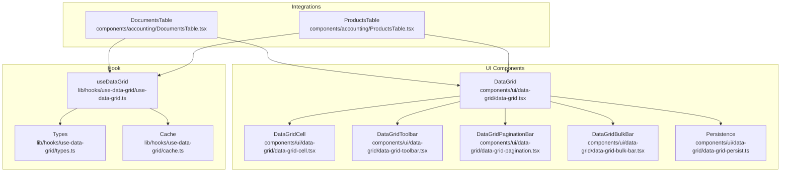
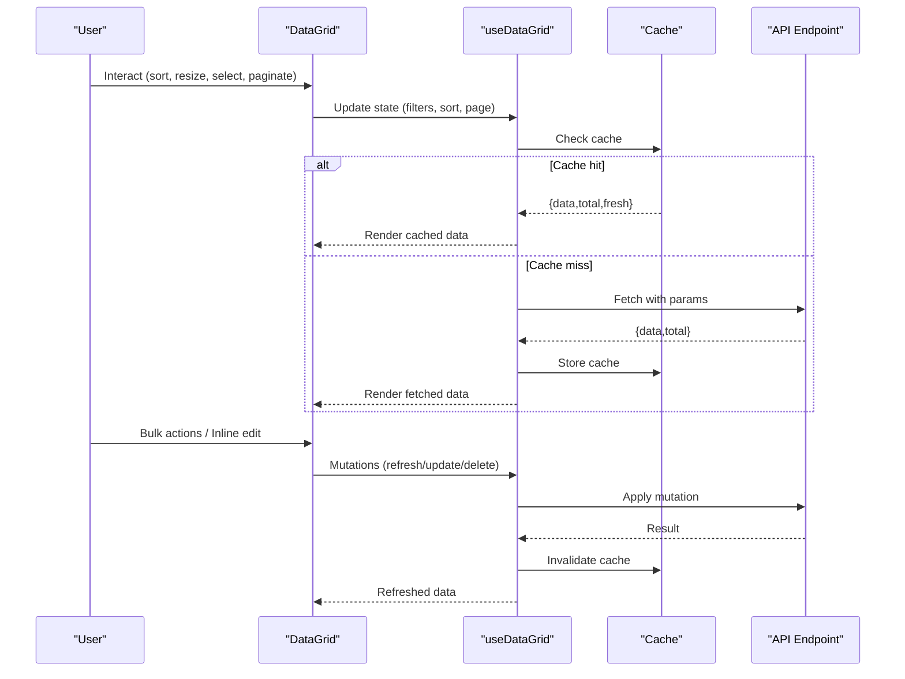
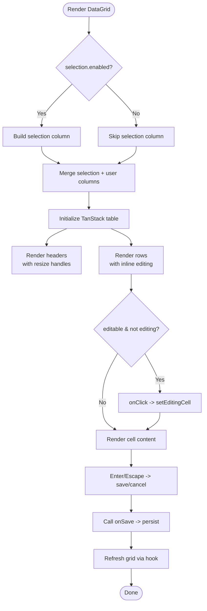
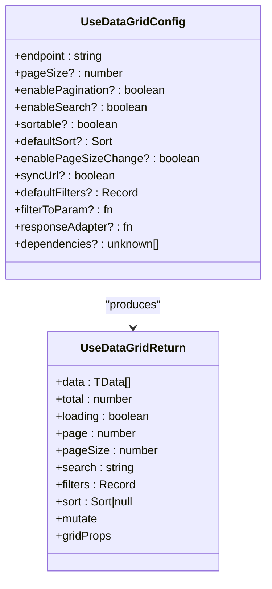
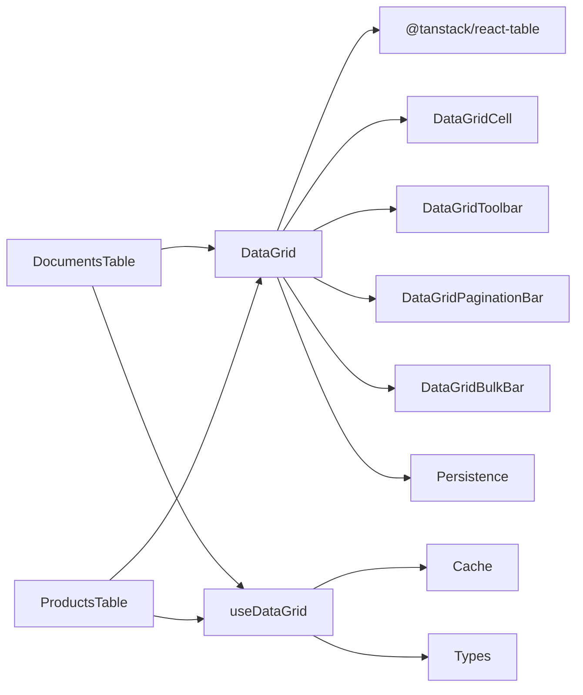

# Data Grid System

<cite>
**Referenced Files in This Document**
- [data-grid.tsx](file://components/ui/data-grid/data-grid.tsx)
- [data-grid-types.ts](file://components/ui/data-grid/data-grid-types.ts)
- [data-grid-cell.tsx](file://components/ui/data-grid/data-grid-cell.tsx)
- [data-grid-toolbar.tsx](file://components/ui/data-grid/data-grid-toolbar.tsx)
- [data-grid-pagination.tsx](file://components/ui/data-grid/data-grid-pagination.tsx)
- [data-grid-bulk-bar.tsx](file://components/ui/data-grid/data-grid-bulk-bar.tsx)
- [data-grid-persist.ts](file://components/ui/data-grid/data-grid-persist.ts)
- [index.ts](file://components/ui/data-grid/index.ts)
- [use-data-grid.ts](file://lib/hooks/use-data-grid/use-data-grid.ts)
- [types.ts](file://lib/hooks/use-data-grid/types.ts)
- [cache.ts](file://lib/hooks/use-data-grid/cache.ts)
- [DocumentsTable.tsx](file://components/accounting/DocumentsTable.tsx)
- [ProductsTable.tsx](file://components/accounting/ProductsTable.tsx)
</cite>

## Table of Contents
1. [Introduction](#introduction)
2. [Project Structure](#project-structure)
3. [Core Components](#core-components)
4. [Architecture Overview](#architecture-overview)
5. [Detailed Component Analysis](#detailed-component-analysis)
6. [Dependency Analysis](#dependency-analysis)
7. [Performance Considerations](#performance-considerations)
8. [Accessibility and UX](#accessibility-and-ux)
9. [Extensibility Guidelines](#extensibility-guidelines)
10. [Troubleshooting Guide](#troubleshooting-guide)
11. [Conclusion](#conclusion)

## Introduction
This document describes the advanced data grid system powering ListOpt ERP’s accounting and product catalogs. It covers the main DataGrid component, cell rendering pipeline, toolbar and pagination controls, bulk operation bar, state management, persistence, filtering and sorting, integration with accounting modules, and guidance for extending the grid with custom columns, filters, and actions. It also includes performance, accessibility, and troubleshooting insights.

## Project Structure
The grid system is organized as a cohesive set of UI components and a powerful data hook:
- UI components: DataGrid, DataGridCell, DataGridToolbar, DataGridPaginationBar, DataGridBulkBar, persistence utilities
- Hook: useDataGrid orchestrates fetching, caching, URL synchronization, and mutations
- Accounting integrations: DocumentsTable and ProductsTable demonstrate real-world usage

**Diagram sources**
- [data-grid.tsx:1-370](file://components/ui/data-grid/data-grid.tsx#L1-L370)
- [data-grid-cell.tsx:1-162](file://components/ui/data-grid/data-grid-cell.tsx#L1-L162)
- [data-grid-toolbar.tsx:1-122](file://components/ui/data-grid/data-grid-toolbar.tsx#L1-L122)
- [data-grid-pagination.tsx:1-165](file://components/ui/data-grid/data-grid-pagination.tsx#L1-L165)
- [data-grid-bulk-bar.tsx:1-29](file://components/ui/data-grid/data-grid-bulk-bar.tsx#L1-L29)
- [data-grid-persist.ts:1-36](file://components/ui/data-grid/data-grid-persist.ts#L1-L36)
- [use-data-grid.ts:1-302](file://lib/hooks/use-data-grid/use-data-grid.ts#L1-L302)
- [types.ts:1-74](file://lib/hooks/use-data-grid/types.ts#L1-L74)
- [cache.ts:1-40](file://lib/hooks/use-data-grid/cache.ts#L1-L40)
- [DocumentsTable.tsx:1-361](file://components/accounting/DocumentsTable.tsx#L1-L361)
- [ProductsTable.tsx:1-495](file://components/accounting/ProductsTable.tsx#L1-L495)

**Section sources**
- [data-grid.tsx:1-370](file://components/ui/data-grid/data-grid.tsx#L1-L370)
- [use-data-grid.ts:1-302](file://lib/hooks/use-data-grid/use-data-grid.ts#L1-L302)

## Core Components
- DataGrid: Central table renderer built on TanStack React Table, with selection, resizing, sticky header, density, and inline-editing support.
- DataGridCell: Inline editor for text, number, select, and date fields with validation and save callbacks.
- DataGridToolbar: Search input, custom filters/actions, and column visibility menu.
- DataGridPaginationBar: Page navigation, page size selector, and “jump to page”.
- DataGridBulkBar: Selected count and bulk action buttons.
- Persistence: LocalStorage-backed column sizing and visibility.
- useDataGrid: Declarative grid state management with caching, URL sync, and mutations.

**Section sources**
- [data-grid.tsx:27-370](file://components/ui/data-grid/data-grid.tsx#L27-L370)
- [data-grid-types.ts:1-74](file://components/ui/data-grid/data-grid-types.ts#L1-L74)
- [data-grid-cell.tsx:21-162](file://components/ui/data-grid/data-grid-cell.tsx#L21-L162)
- [data-grid-toolbar.tsx:24-122](file://components/ui/data-grid/data-grid-toolbar.tsx#L24-L122)
- [data-grid-pagination.tsx:26-165](file://components/ui/data-grid/data-grid-pagination.tsx#L26-L165)
- [data-grid-bulk-bar.tsx:13-29](file://components/ui/data-grid/data-grid-bulk-bar.tsx#L13-L29)
- [data-grid-persist.ts:3-36](file://components/ui/data-grid/data-grid-persist.ts#L3-L36)
- [use-data-grid.ts:17-302](file://lib/hooks/use-data-grid/use-data-grid.ts#L17-L302)
- [types.ts:1-74](file://lib/hooks/use-data-grid/types.ts#L1-L74)
- [cache.ts:1-40](file://lib/hooks/use-data-grid/cache.ts#L1-L40)

## Architecture Overview
The grid architecture separates concerns:
- UI renders data and user interactions
- useDataGrid encapsulates data fetching, caching, URL sync, and mutations
- Persistence stores user preferences locally
- Integrations (DocumentsTable, ProductsTable) compose the grid with domain-specific columns, filters, and actions

**Diagram sources**
- [use-data-grid.ts:137-182](file://lib/hooks/use-data-grid/use-data-grid.ts#L137-L182)
- [cache.ts:17-31](file://lib/hooks/use-data-grid/cache.ts#L17-L31)
- [DocumentsTable.tsx:168-188](file://components/accounting/DocumentsTable.tsx#L168-L188)
- [ProductsTable.tsx:215-265](file://components/accounting/ProductsTable.tsx#L215-L265)

## Detailed Component Analysis

### DataGrid Component
- Selection column: optional, auto-built when selection.enabled is true; supports bulk actions and bulk bar.
- Sorting: supports internal or external sorting; integrates with toolbar and URL state.
- Resizing: column resizing with persistence; debounced saving for sizing.
- Visibility: column visibility persisted to localStorage.
- Sticky header: shadow on scroll; optional pinned columns.
- Inline editing: click to edit cells with DataGridCell; supports text, number, select, date with validation and save callbacks.
- Density: compact vs normal spacing classes.
- Footer: optional footer row.

**Diagram sources**
- [data-grid.tsx:87-159](file://components/ui/data-grid/data-grid.tsx#L87-L159)
- [data-grid-cell.tsx:41-86](file://components/ui/data-grid/data-grid-cell.tsx#L41-L86)

**Section sources**
- [data-grid.tsx:27-370](file://components/ui/data-grid/data-grid.tsx#L27-L370)
- [data-grid-types.ts:39-73](file://components/ui/data-grid/data-grid-types.ts#L39-L73)

### DataGridCell (Inline Editor)
- Normalizes date values to YYYY-MM-DD for HTML input.
- Type-specific editors: text, number, select, date.
- Validation: optional validator returning boolean or error string.
- Keyboard shortcuts: Enter to save, Escape to cancel.
- Error feedback and saving state.

**Section sources**
- [data-grid-cell.tsx:21-162](file://components/ui/data-grid/data-grid-cell.tsx#L21-L162)

### DataGridToolbar
- Search input with clear button and debounce.
- Custom filters/actions slots.
- Column visibility menu: mounts conditionally and resolves display names from meta.label/header/id.

**Section sources**
- [data-grid-toolbar.tsx:24-122](file://components/ui/data-grid/data-grid-toolbar.tsx#L24-L122)

### DataGridPaginationBar
- Computes bounds and total pages.
- Navigation: first, prev, next, last.
- Page size selector (optional).
- “Jump to page” input with validation.

**Section sources**
- [data-grid-pagination.tsx:26-165](file://components/ui/data-grid/data-grid-pagination.tsx#L26-L165)

### DataGridBulkBar
- Shows selected count and renders provided actions.
- Clear selection button.

**Section sources**
- [data-grid-bulk-bar.tsx:13-29](file://components/ui/data-grid/data-grid-bulk-bar.tsx#L13-L29)

### Persistence (LocalStorage)
- Column sizing: debounced save after resize.
- Column visibility: immediate save on toggle.
- Keys are namespaced by persistenceKey.

**Section sources**
- [data-grid-persist.ts:3-36](file://components/ui/data-grid/data-grid-persist.ts#L3-L36)

### useDataGrid Hook
- Manages page, pageSize, search, filters, sort.
- Builds URL params and syncs to URL (optional).
- Debounced search, stale-while-revalidate caching, LRU eviction.
- Mutations: create, update, delete, refresh.
- Exposes gridProps to spread directly into DataGrid.

**Diagram sources**
- [types.ts:3-74](file://lib/hooks/use-data-grid/types.ts#L3-L74)
- [use-data-grid.ts:17-302](file://lib/hooks/use-data-grid/use-data-grid.ts#L17-L302)

**Section sources**
- [use-data-grid.ts:17-302](file://lib/hooks/use-data-grid/use-data-grid.ts#L17-L302)
- [types.ts:1-74](file://lib/hooks/use-data-grid/types.ts#L1-L74)
- [cache.ts:1-40](file://lib/hooks/use-data-grid/cache.ts#L1-L40)

### Accounting Integrations

#### DocumentsTable
- Uses useDataGrid with endpoint /api/accounting/documents.
- Columns: number, type, date, warehouse, counterparty, amount, status, actions.
- Filters: type, status, date range; grouped by document groups.
- Bulk confirm action; individual confirm/cancel actions.
- Persistence key scoped by group.

**Section sources**
- [DocumentsTable.tsx:64-361](file://components/accounting/DocumentsTable.tsx#L64-L361)

#### ProductsTable
- Uses useDataGrid with endpoint /api/accounting/products.
- Columns: image, name, SKU, category, unit, purchase/sale/discounted price, discount validity, actions.
- Filters: category, activity, publication status, variant status, discount flag.
- Bulk archive/restore/delete actions; export to CSV; import wizard.
- Custom row click handler; row class customization.

**Section sources**
- [ProductsTable.tsx:59-495](file://components/accounting/ProductsTable.tsx#L59-L495)

## Dependency Analysis
- DataGrid depends on TanStack React Table for core rendering and state.
- DataGridCell depends on form primitives for inline editing.
- useDataGrid depends on Next.js router/searchParams for URL sync and caching utilities.
- Integrations depend on useDataGrid and pass gridProps to DataGrid.

**Diagram sources**
- [data-grid.tsx:3-25](file://components/ui/data-grid/data-grid.tsx#L3-L25)
- [data-grid-cell.tsx:3-12](file://components/ui/data-grid/data-grid-cell.tsx#L3-L12)
- [use-data-grid.ts:3-7](file://lib/hooks/use-data-grid/use-data-grid.ts#L3-L7)
- [DocumentsTable.tsx:7-17](file://components/accounting/DocumentsTable.tsx#L7-L17)
- [ProductsTable.tsx:15-17](file://components/accounting/ProductsTable.tsx#L15-L17)

**Section sources**
- [data-grid.tsx:3-25](file://components/ui/data-grid/data-grid.tsx#L3-L25)
- [use-data-grid.ts:3-7](file://lib/hooks/use-data-grid/use-data-grid.ts#L3-L7)

## Performance Considerations
- Virtualization: Not implemented in the current DataGrid. For very large datasets, consider enabling virtualization via TanStack React Table’s virtualization features and adjusting row count accordingly.
- Caching: useDataGrid caches responses with freshness window and LRU eviction; reduces network load and improves perceived performance.
- Debouncing: Search input is debounced to avoid excessive requests.
- Abort controller: Cancels stale requests to prevent race conditions.
- Rendering: Skeleton rows during loading; compact density option reduces per-row height.
- Persistence: Debounced column sizing saves reduce storage churn.

Recommendations:
- Enable TanStack virtualization for >1000 rows.
- Consider server-side pagination and sorting for large datasets.
- Batch mutations and refresh to minimize re-renders.

**Section sources**
- [use-data-grid.ts:137-182](file://lib/hooks/use-data-grid/use-data-grid.ts#L137-L182)
- [cache.ts:17-31](file://lib/hooks/use-data-grid/cache.ts#L17-L31)
- [data-grid.tsx:268-278](file://components/ui/data-grid/data-grid.tsx#L268-L278)

## Accessibility and UX
- Keyboard navigation:
  - Enter to save inline edits; Escape to cancel.
  - Tab order follows logical header/column order.
- Screen reader:
  - Checkbox headers include aria-labels for selection.
  - Search input includes aria-labels for assistive tech.
- Focus management:
  - Inline editors focus input on mount; selects text for quick overwrite.
- Visual feedback:
  - Hover states, sticky header shadow, density options, and error tooltips.

**Section sources**
- [data-grid.tsx:108-126](file://components/ui/data-grid/data-grid.tsx#L108-L126)
- [data-grid-toolbar.tsx:44-46](file://components/ui/data-grid/data-grid-toolbar.tsx#L44-L46)
- [data-grid-cell.tsx:36-39](file://components/ui/data-grid/data-grid-cell.tsx#L36-L39)

## Extensibility Guidelines
- Custom columns:
  - Use columnDef with accessorKey or id, header, size, enableSorting, meta.align/pin/canHide/editable.
  - Cell renderer receives row.original and getContext for advanced rendering.
- Custom filters:
  - Pass toolbar.filters with custom controls; integrate with grid.setFilter/setFilters.
  - Use filterToParam to transform/filter URL parameters.
- Bulk actions:
  - Provide toolbar.bulkActions to render action buttons; use selection.selectedIds to drive bulk operations.
- Inline editing:
  - Add meta.editable with type, onSave, optional validate, and options for select.
- Persistence:
  - Set persistenceKey to enable column sizing/visibility persistence.
- URL sync:
  - Toggle syncUrl to disable URL syncing for embedded grids.

Examples in code:
- DocumentsTable demonstrates grouped filters, bulk confirm, and persistence key scoping.
- ProductsTable demonstrates custom filters, export/import, and bulk archive/restore/delete.

**Section sources**
- [data-grid-types.ts:4-22](file://components/ui/data-grid/data-grid-types.ts#L4-L22)
- [DocumentsTable.tsx:79-120](file://components/accounting/DocumentsTable.tsx#L79-L120)
- [ProductsTable.tsx:102-126](file://components/accounting/ProductsTable.tsx#L102-L126)
- [data-grid.tsx:87-131](file://components/ui/data-grid/data-grid.tsx#L87-L131)

## Troubleshooting Guide
- Grid not updating after mutation:
  - Ensure mutate.refresh is called after successful API updates.
  - Confirm cache invalidation for the endpoint.
- Search not applying:
  - Verify enableSearch and setSearch are wired to toolbar.search.
  - Check filterToParam for null-returning transformations.
- Pagination not changing page size:
  - Enable enablePageSizeChange and provide pageSizeOptions.
- Inline edit not saving:
  - Check validate returns boolean/string; ensure onSave resolves promise.
  - Confirm editable.type matches expected value shape.
- Column visibility not persisting:
  - Ensure persistenceKey is set and localStorage is available.

**Section sources**
- [use-data-grid.ts:223-270](file://lib/hooks/use-data-grid/use-data-grid.ts#L223-L270)
- [data-grid-persist.ts:16-35](file://components/ui/data-grid/data-grid-persist.ts#L16-L35)
- [data-grid-cell.tsx:56-76](file://components/ui/data-grid/data-grid-cell.tsx#L56-L76)

## Conclusion
The Data Grid system combines a flexible UI layer with a robust data management hook to deliver responsive, accessible, and extensible table experiences across ListOpt ERP. Its modular design enables quick integration with accounting domains while maintaining strong defaults for persistence, caching, and user experience.