# E-commerce Components

<cite>
**Referenced Files in This Document**
- [CartItemCard.tsx](file://components/ecommerce/CartItemCard.tsx)
- [CartContext.tsx](file://components/ecommerce/CartContext.tsx)
- [BuyOneClick.tsx](file://components/ecommerce/BuyOneClick.tsx)
- [ProductCard.tsx](file://components/ecommerce/ProductCard.tsx)
- [ProductImageGallery.tsx](file://components/ecommerce/ProductImageGallery.tsx)
- [ProductTabs.tsx](file://components/ecommerce/ProductTabs.tsx)
- [ProductVariantChips.tsx](file://components/ecommerce/ProductVariantChips.tsx)
- [ProductBreadcrumb.tsx](file://components/ecommerce/ProductBreadcrumb.tsx)
- [ProductSection.tsx](file://components/ecommerce/ProductSection.tsx)
- [OrderTimeline.tsx](file://components/ecommerce/OrderTimeline.tsx)
- [ReviewForm.tsx](file://components/ecommerce/ReviewForm.tsx)
- [RichTextEditor.tsx](file://components/ecommerce/RichTextEditor.tsx)
- [RichTextRenderer.tsx](file://components/ecommerce/RichTextRenderer.tsx)
- [BenefitsSection.tsx](file://components/ecommerce/BenefitsSection.tsx)
- [HeroCarousel.tsx](file://components/ecommerce/HeroCarousel.tsx)
- [RelatedProducts.tsx](file://components/ecommerce/RelatedProducts.tsx)
- [ProfileEditForm.tsx](file://components/ecommerce/ProfileEditForm.tsx)
- [StockIndicator.tsx](file://components/ecommerce/StockIndicator.tsx)
- [ShareButton.tsx](file://components/ecommerce/ShareButton.tsx)
- [store layout.tsx](file://app/store/layout.tsx)
- [cart page.tsx](file://app/store/cart/page.tsx)
- [product detail page.tsx](file://app/store/catalog/[slug]/page.tsx)
</cite>

## Table of Contents
1. [Introduction](#introduction)
2. [Project Structure](#project-structure)
3. [Core Components](#core-components)
4. [Architecture Overview](#architecture-overview)
5. [Detailed Component Analysis](#detailed-component-analysis)
6. [Dependency Analysis](#dependency-analysis)
7. [Performance Considerations](#performance-considerations)
8. [Troubleshooting Guide](#troubleshooting-guide)
9. [Conclusion](#conclusion)

## Introduction
This document describes the e-commerce UI components used in the online store. It focuses on shopping cart components (CartItemCard, CartContext, BuyOneClick), product presentation components (ProductCard, ProductImageGallery, ProductTabs, ProductVariantChips, ProductBreadcrumb, ProductSection), interactive components (OrderTimeline, ReviewForm, RichTextEditor, RichTextRenderer, BenefitsSection, HeroCarousel, RelatedProducts), forms (ProfileEditForm), and utilities (StockIndicator, ShareButton). It explains component composition patterns, state management, user interaction flows, and integration with the e-commerce backend APIs.

## Project Structure
The e-commerce components live under components/ecommerce and are consumed by Next.js app router pages under app/store. The store layout wraps pages with CartProvider to supply cart state globally.

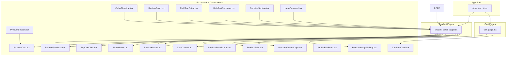

**Diagram sources**
- [store layout.tsx:247-253](file://app/store/layout.tsx#L247-L253)
- [cart page.tsx:1-116](file://app/store/cart/page.tsx#L1-L116)
- [product detail page.tsx:1-358](file://app/store/catalog/[slug]/page.tsx#L1-L358)
- [CartContext.tsx:56-194](file://components/ecommerce/CartContext.tsx#L56-L194)
- [CartItemCard.tsx:24-119](file://components/ecommerce/CartItemCard.tsx#L24-L119)
- [BuyOneClick.tsx:26-165](file://components/ecommerce/BuyOneClick.tsx#L26-L165)
- [ProductCard.tsx:27-88](file://components/ecommerce/ProductCard.tsx#L27-L88)
- [ProductImageGallery.tsx:15-134](file://components/ecommerce/ProductImageGallery.tsx#L15-L134)
- [ProductTabs.tsx:27-137](file://components/ecommerce/ProductTabs.tsx#L27-L137)
- [ProductVariantChips.tsx:19-67](file://components/ecommerce/ProductVariantChips.tsx#L19-L67)
- [ProductBreadcrumb.tsx:15-35](file://components/ecommerce/ProductBreadcrumb.tsx#L15-L35)
- [ProductSection.tsx:14-71](file://components/ecommerce/ProductSection.tsx#L14-L71)
- [OrderTimeline.tsx:23-106](file://components/ecommerce/OrderTimeline.tsx#L23-L106)
- [ReviewForm.tsx:29-199](file://components/ecommerce/ReviewForm.tsx#L29-L199)
- [RichTextEditor.tsx:60-244](file://components/ecommerce/RichTextEditor.tsx#L60-L244)
- [RichTextRenderer.tsx:10-33](file://components/ecommerce/RichTextRenderer.tsx#L10-L33)
- [BenefitsSection.tsx:28-45](file://components/ecommerce/BenefitsSection.tsx#L28-L45)
- [HeroCarousel.tsx:22-136](file://components/ecommerce/HeroCarousel.tsx#L22-L136)
- [RelatedProducts.tsx:10-40](file://components/ecommerce/RelatedProducts.tsx#L10-L40)
- [ProfileEditForm.tsx:22-154](file://components/ecommerce/ProfileEditForm.tsx#L22-L154)
- [StockIndicator.tsx:10-32](file://components/ecommerce/StockIndicator.tsx#L10-L32)
- [ShareButton.tsx:19-76](file://components/ecommerce/ShareButton.tsx#L19-L76)

**Section sources**
- [store layout.tsx:1-255](file://app/store/layout.tsx#L1-L255)
- [cart page.tsx:1-116](file://app/store/cart/page.tsx#L1-L116)
- [product detail page.tsx:1-358](file://app/store/catalog/[slug]/page.tsx#L1-L358)

## Core Components
- CartItemCard: Renders a single cart line item with image, name, variant, quantity controls, unit price, and remove action.
- CartContext: Provides cart state (items, counts, totals), loading, and actions (refresh, add, remove, update quantity) via React Context.
- BuyOneClick: Dialog-based quick purchase flow with minimal customer info submission to create a quick order.
- ProductCard: Compact product tile for listings with image, discount badge, rating, pricing, and unit.
- ProductImageGallery: Responsive image carousel with thumbnails and navigation.
- ProductTabs: Tabbed content for description, characteristics, and reviews.
- ProductVariantChips: Variant selection chips grouped by type with optional price adjustments.
- ProductBreadcrumb: Breadcrumb navigation tailored for product pages.
- ProductSection: Fetches and renders a grid of ProductCard items with skeleton loading.
- OrderTimeline: Timeline visualization of order statuses with timestamps.
- ReviewForm: Modal form to submit product reviews with star ratings.
- RichTextEditor: Tiptap-powered editor with toolbar for headings, lists, links, images, and history.
- RichTextRenderer: Safe HTML renderer with consistent prose styles.
- BenefitsSection: Marketing benefits grid with icons.
- HeroCarousel: Auto-rotating hero banner slides with navigation.
- RelatedProducts: Fetches and displays related products.
- ProfileEditForm: Editable customer profile form with validation and updates.
- StockIndicator: Visual indicator for stock availability.
- ShareButton: Dropdown to copy link or share via Telegram/WhatsApp.

**Section sources**
- [CartItemCard.tsx:10-119](file://components/ecommerce/CartItemCard.tsx#L10-L119)
- [CartContext.tsx:13-194](file://components/ecommerce/CartContext.tsx#L13-L194)
- [BuyOneClick.tsx:18-165](file://components/ecommerce/BuyOneClick.tsx#L18-L165)
- [ProductCard.tsx:10-88](file://components/ecommerce/ProductCard.tsx#L10-L88)
- [ProductImageGallery.tsx:10-134](file://components/ecommerce/ProductImageGallery.tsx#L10-L134)
- [ProductTabs.tsx:20-137](file://components/ecommerce/ProductTabs.tsx#L20-L137)
- [ProductVariantChips.tsx:6-67](file://components/ecommerce/ProductVariantChips.tsx#L6-L67)
- [ProductBreadcrumb.tsx:6-35](file://components/ecommerce/ProductBreadcrumb.tsx#L6-L35)
- [ProductSection.tsx:8-71](file://components/ecommerce/ProductSection.tsx#L8-L71)
- [OrderTimeline.tsx:15-106](file://components/ecommerce/OrderTimeline.tsx#L15-L106)
- [ReviewForm.tsx:19-199](file://components/ecommerce/ReviewForm.tsx#L19-L199)
- [RichTextEditor.tsx:54-244](file://components/ecommerce/RichTextEditor.tsx#L54-L244)
- [RichTextRenderer.tsx:5-33](file://components/ecommerce/RichTextRenderer.tsx#L5-L33)
- [BenefitsSection.tsx:5-45](file://components/ecommerce/BenefitsSection.tsx#L5-L45)
- [HeroCarousel.tsx:18-136](file://components/ecommerce/HeroCarousel.tsx#L18-L136)
- [RelatedProducts.tsx:6-40](file://components/ecommerce/RelatedProducts.tsx#L6-L40)
- [ProfileEditForm.tsx:11-154](file://components/ecommerce/ProfileEditForm.tsx#L11-L154)
- [StockIndicator.tsx:5-32](file://components/ecommerce/StockIndicator.tsx#L5-L32)
- [ShareButton.tsx:14-76](file://components/ecommerce/ShareButton.tsx#L14-L76)

## Architecture Overview
The store layout initializes CartProvider with authentication state and exposes cart actions to all pages. Product detail and cart pages consume these actions to manage state and trigger API calls.

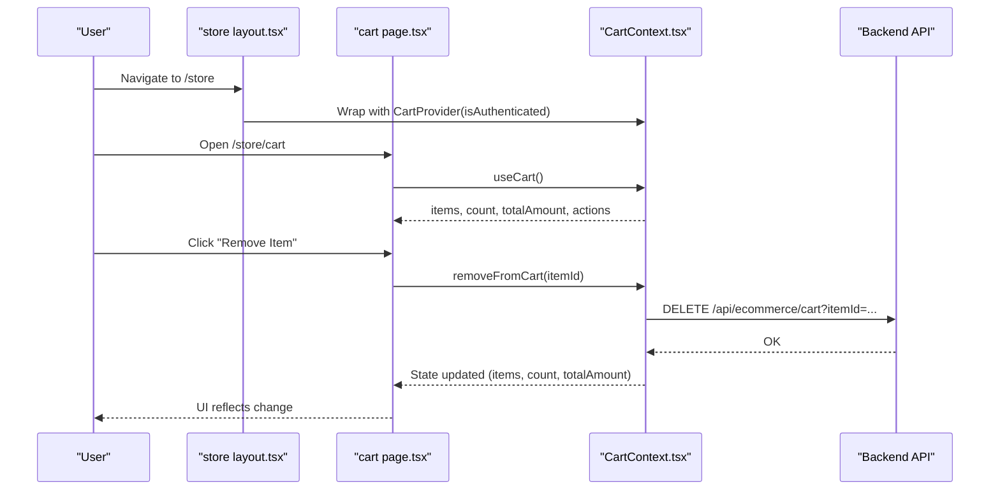

**Diagram sources**
- [store layout.tsx:247-253](file://app/store/layout.tsx#L247-L253)
- [cart page.tsx:11-115](file://app/store/cart/page.tsx#L11-L115)
- [CartContext.tsx:109-134](file://components/ecommerce/CartContext.tsx#L109-L134)

**Section sources**
- [store layout.tsx:247-253](file://app/store/layout.tsx#L247-L253)
- [cart page.tsx:11-115](file://app/store/cart/page.tsx#L11-L115)
- [CartContext.tsx:56-194](file://components/ecommerce/CartContext.tsx#L56-L194)

## Detailed Component Analysis

### CartItemCard
- Purpose: Render a single cart item with image, product link, variant note, quantity controls (+/-), unit price, and remove action.
- Interactions: Calls onUpdateQuantity and onRemove callbacks passed from parent.
- Styling: Uses Card, Button, and Next/Image; formats currency via shared utility.

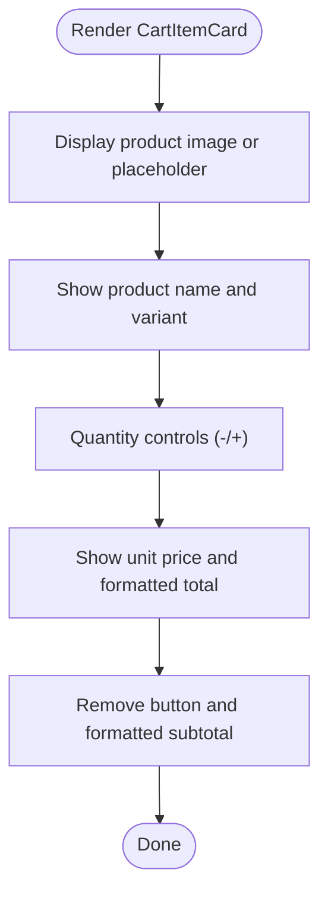

**Diagram sources**
- [CartItemCard.tsx:24-119](file://components/ecommerce/CartItemCard.tsx#L24-L119)

**Section sources**
- [CartItemCard.tsx:10-119](file://components/ecommerce/CartItemCard.tsx#L10-L119)

### CartContext
- Purpose: Centralized cart state management with actions for add/remove/update and refresh.
- State: items[], count, totalAmount, loading.
- Actions:
  - refreshCart(): Fetches cart from /api/ecommerce/cart when authenticated.
  - addToCart(productId, variantId?, quantity): POST to add; shows success/error toast.
  - removeFromCart(itemId): Optimistically removes locally, then calls DELETE; rolls back on failure.
  - updateQuantity(itemId, delta): Optimistically updates quantity, then POSTs delta; rolls back on failure.
- Provider props: isAuthenticated determines whether to fetch remote cart.

```mermaid
classDiagram
class CartContextValue {
+items : CartItem[]
+count : number
+totalAmount : number
+loading : boolean
+refreshCart() : Promise<void>
+addToCart(productId, variantId?, quantity) : Promise<boolean>
+removeFromCart(itemId) : Promise<boolean>
+updateQuantity(itemId, delta) : Promise<boolean>
}
class CartProvider {
+props : { children, isAuthenticated }
+state : items[], loading
+refreshCart()
+addToCart()
+removeFromCart()
+updateQuantity()
}
CartProvider --> CartContextValue : "provides"
```

**Diagram sources**
- [CartContext.tsx:26-194](file://components/ecommerce/CartContext.tsx#L26-L194)

**Section sources**
- [CartContext.tsx:13-194](file://components/ecommerce/CartContext.tsx#L13-L194)

### BuyOneClick
- Purpose: One-click purchase dialog requiring minimal info (name, phone) to submit a quick order.
- Flow: Opens dialog, validates inputs, POSTs to /api/ecommerce/orders/quick-order, shows success with order number.

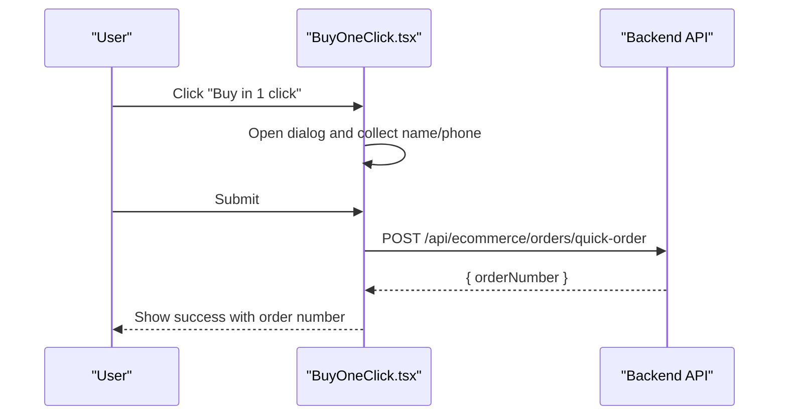

**Diagram sources**
- [BuyOneClick.tsx:39-75](file://components/ecommerce/BuyOneClick.tsx#L39-L75)

**Section sources**
- [BuyOneClick.tsx:18-165](file://components/ecommerce/BuyOneClick.tsx#L18-L165)

### Product Presentation Components

#### ProductCard
- Purpose: Grid tile for product listings with image, discount badge, rating, pricing, and unit.
- Props: ProductCardData with id, name, slug, image, price, discount, rating, reviewCount, unit.

```mermaid
classDiagram
class ProductCardData {
+id : string
+name : string
+slug : string?
+imageUrl : string?
+price : number
+discountedPrice : number?
+discount : {name,type,value}?
+rating : number
+reviewCount : number
+unit : {shortName}
}
class ProductCard {
+props : { product : ProductCardData }
}
ProductCard --> ProductCardData : "renders"
```

**Diagram sources**
- [ProductCard.tsx:10-25](file://components/ecommerce/ProductCard.tsx#L10-L25)

**Section sources**
- [ProductCard.tsx:10-88](file://components/ecommerce/ProductCard.tsx#L10-L88)

#### ProductImageGallery
- Purpose: Full-width responsive image gallery with thumbnails and navigation; auto-rotates for multiple images.
- Behavior: Uses Embla carousel; handles single image vs. multiple images; shows counter.

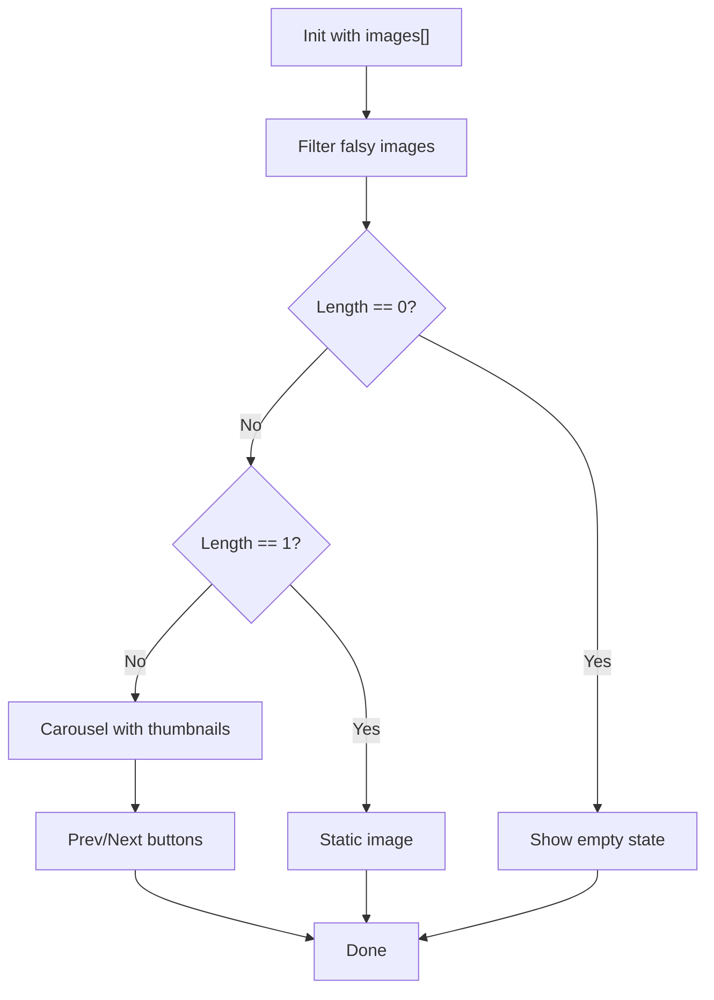

**Diagram sources**
- [ProductImageGallery.tsx:15-134](file://components/ecommerce/ProductImageGallery.tsx#L15-L134)

**Section sources**
- [ProductImageGallery.tsx:10-134](file://components/ecommerce/ProductImageGallery.tsx#L10-L134)

#### ProductTabs
- Purpose: Tabbed interface for Description, Characteristics, and Reviews.
- Behavior: Conditional rendering of characteristics and reviews; uses badges and star icons.

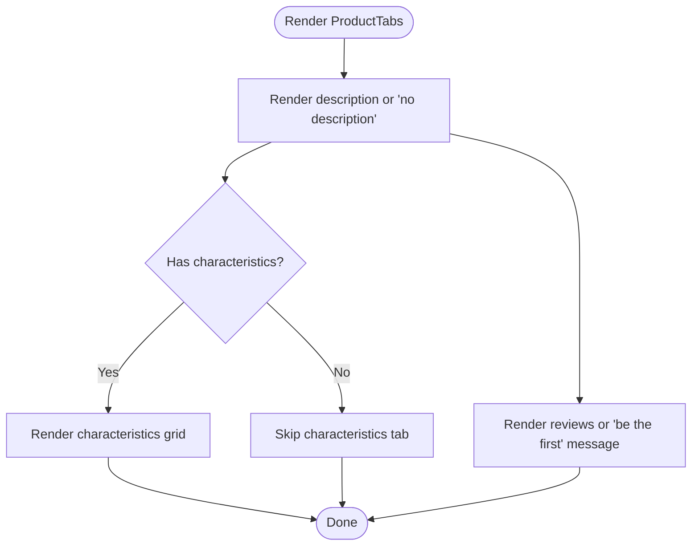

**Diagram sources**
- [ProductTabs.tsx:27-137](file://components/ecommerce/ProductTabs.tsx#L27-L137)

**Section sources**
- [ProductTabs.tsx:20-137](file://components/ecommerce/ProductTabs.tsx#L20-L137)

#### ProductVariantChips
- Purpose: Allow selecting product variants by type; shows price adjustment deltas.
- Behavior: Groups variants by type; toggles selection; applies formatting for adjustments.

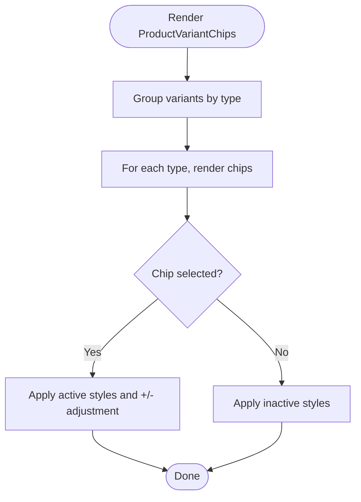

**Diagram sources**
- [ProductVariantChips.tsx:19-67](file://components/ecommerce/ProductVariantChips.tsx#L19-L67)

**Section sources**
- [ProductVariantChips.tsx:6-67](file://components/ecommerce/ProductVariantChips.tsx#L6-L67)

#### ProductBreadcrumb
- Purpose: Breadcrumb navigation for product pages with home and category links.

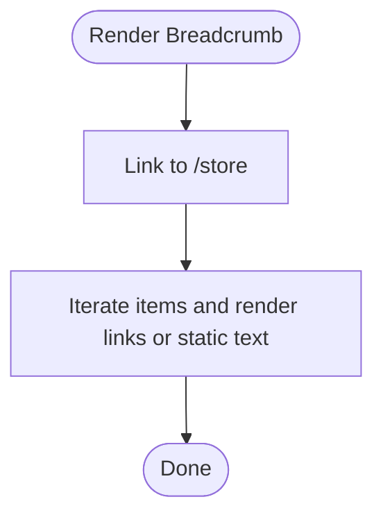

**Diagram sources**
- [ProductBreadcrumb.tsx:15-35](file://components/ecommerce/ProductBreadcrumb.tsx#L15-L35)

**Section sources**
- [ProductBreadcrumb.tsx:6-35](file://components/ecommerce/ProductBreadcrumb.tsx#L6-L35)

#### ProductSection
- Purpose: Fetch and render a section of products with skeleton loading and optional "see all" link.

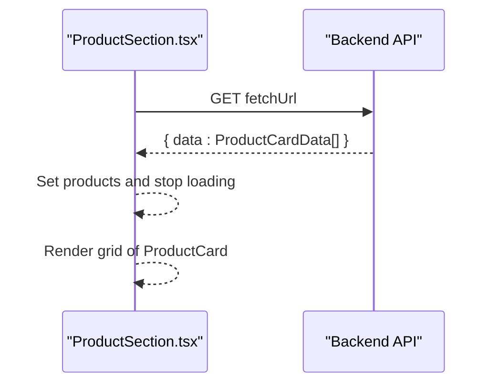

**Diagram sources**
- [ProductSection.tsx:14-71](file://components/ecommerce/ProductSection.tsx#L14-L71)

**Section sources**
- [ProductSection.tsx:8-71](file://components/ecommerce/ProductSection.tsx#L8-L71)

### Interactive Components

#### OrderTimeline
- Purpose: Visualize order lifecycle with status steps and timestamps.

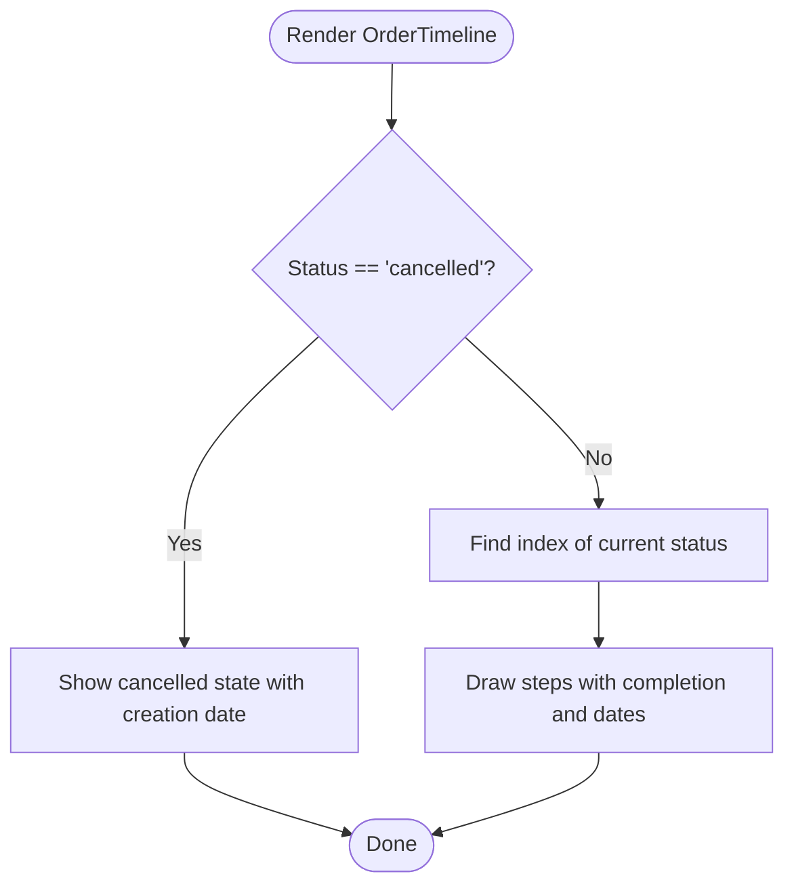

**Diagram sources**
- [OrderTimeline.tsx:23-106](file://components/ecommerce/OrderTimeline.tsx#L23-L106)

**Section sources**
- [OrderTimeline.tsx:15-106](file://components/ecommerce/OrderTimeline.tsx#L15-L106)

#### ReviewForm
- Purpose: Modal to submit product reviews with star rating, title, and comment; posts to /api/ecommerce/reviews.

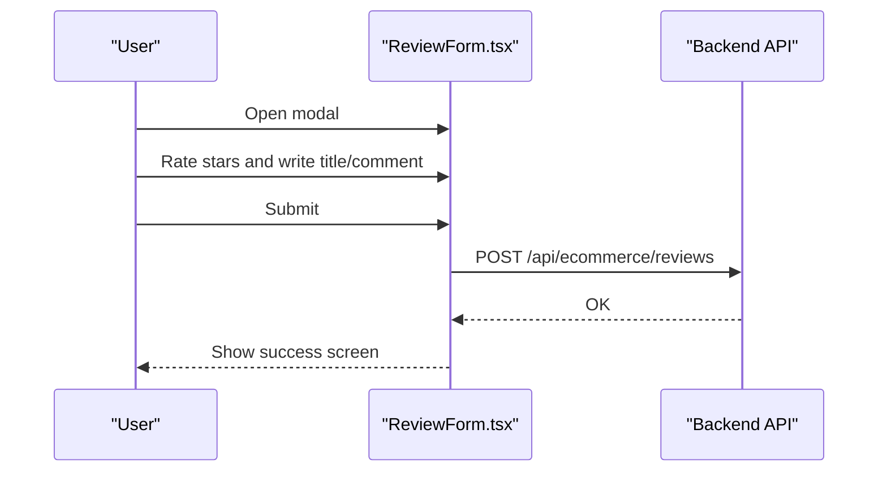

**Diagram sources**
- [ReviewForm.tsx:45-78](file://components/ecommerce/ReviewForm.tsx#L45-L78)

**Section sources**
- [ReviewForm.tsx:19-199](file://components/ecommerce/ReviewForm.tsx#L19-L199)

#### RichTextEditor and RichTextRenderer
- Purpose: Authoring and rendering rich content with consistent styles and toolbar controls.

```mermaid
classDiagram
class RichTextEditor {
+props : { content, onChange, placeholder? }
+editor : TipTap instance
+toolbar : buttons for headings, bold/italic, lists, links, images, undo/redo
}
class RichTextRenderer {
+props : { content, className? }
}
RichTextEditor --> RichTextRenderer : "complements"
```

**Diagram sources**
- [RichTextEditor.tsx:54-244](file://components/ecommerce/RichTextEditor.tsx#L54-L244)
- [RichTextRenderer.tsx:5-33](file://components/ecommerce/RichTextRenderer.tsx#L5-L33)

**Section sources**
- [RichTextEditor.tsx:54-244](file://components/ecommerce/RichTextEditor.tsx#L54-L244)
- [RichTextRenderer.tsx:5-33](file://components/ecommerce/RichTextRenderer.tsx#L5-L33)

#### BenefitsSection and HeroCarousel
- BenefitsSection: Grid of benefit cards with icons and descriptions.
- HeroCarousel: Auto-rotating hero banners with navigation dots and gradient overlays.

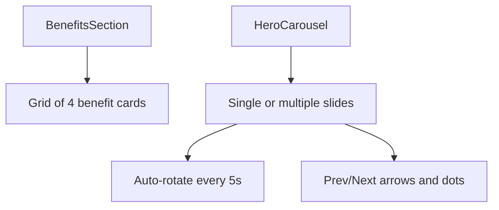

**Diagram sources**
- [BenefitsSection.tsx:28-45](file://components/ecommerce/BenefitsSection.tsx#L28-L45)
- [HeroCarousel.tsx:22-136](file://components/ecommerce/HeroCarousel.tsx#L22-L136)

**Section sources**
- [BenefitsSection.tsx:1-46](file://components/ecommerce/BenefitsSection.tsx#L1-L46)
- [HeroCarousel.tsx:1-137](file://components/ecommerce/HeroCarousel.tsx#L1-L137)

#### RelatedProducts
- Purpose: Fetch and display related products for upsell.

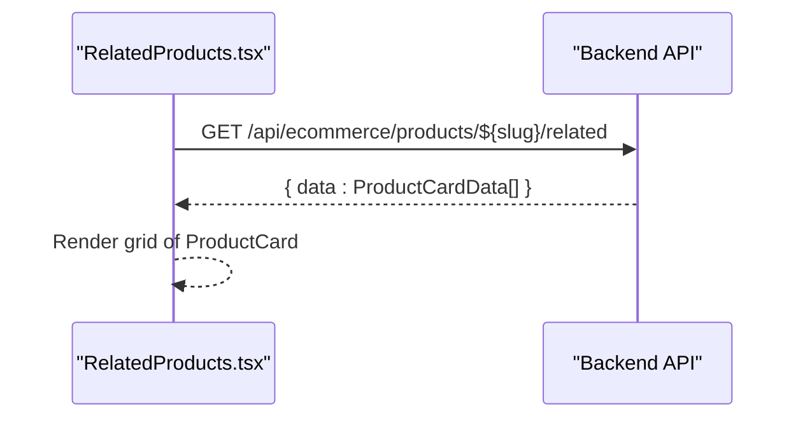

**Diagram sources**
- [RelatedProducts.tsx:10-40](file://components/ecommerce/RelatedProducts.tsx#L10-L40)

**Section sources**
- [RelatedProducts.tsx:6-40](file://components/ecommerce/RelatedProducts.tsx#L6-L40)

### Form Components and Utilities

#### ProfileEditForm
- Purpose: Edit customer profile (name, phone, email); PATCH to /api/auth/customer/me.

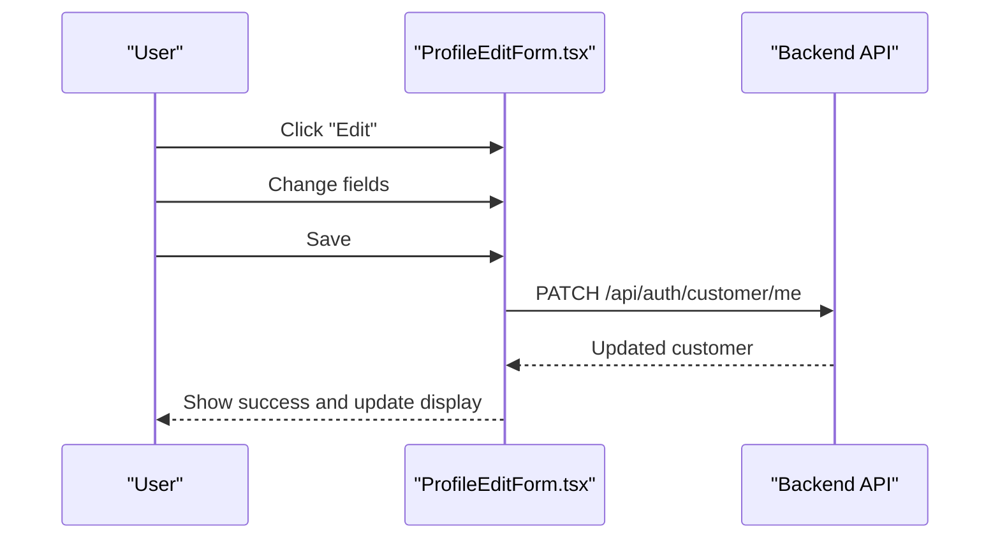

**Diagram sources**
- [ProfileEditForm.tsx:29-61](file://components/ecommerce/ProfileEditForm.tsx#L29-L61)

**Section sources**
- [ProfileEditForm.tsx:11-154](file://components/ecommerce/ProfileEditForm.tsx#L11-L154)

#### StockIndicator
- Purpose: Visual stock status badge (none, low, in stock).

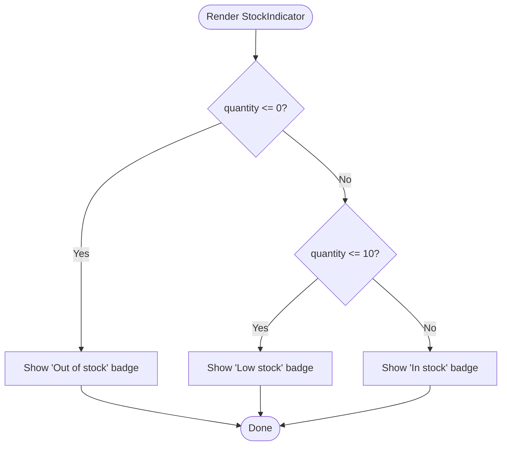

**Diagram sources**
- [StockIndicator.tsx:10-32](file://components/ecommerce/StockIndicator.tsx#L10-L32)

**Section sources**
- [StockIndicator.tsx:5-32](file://components/ecommerce/StockIndicator.tsx#L5-L32)

#### ShareButton
- Purpose: Copy link to clipboard or share via Telegram/WhatsApp.

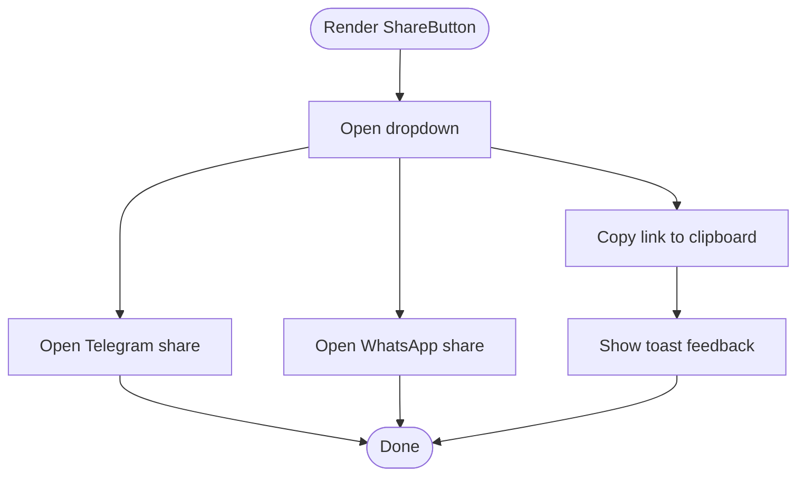

**Diagram sources**
- [ShareButton.tsx:19-76](file://components/ecommerce/ShareButton.tsx#L19-L76)

**Section sources**
- [ShareButton.tsx:14-76](file://components/ecommerce/ShareButton.tsx#L14-L76)

## Dependency Analysis
- CartContext depends on:
  - Next.js runtime (useContext, useState, useCallback, useEffect)
  - Sonner for notifications
  - Shared formatting utility for currency
- Product detail page composes:
  - ProductImageGallery, ProductVariantChips, ProductTabs, ProductBreadcrumb, StockIndicator, ShareButton, RelatedProducts, BuyOneClick
  - Uses CartContext for add-to-cart and quick buy
- Cart page composes:
  - CartItemCard for each item and CartContext for actions

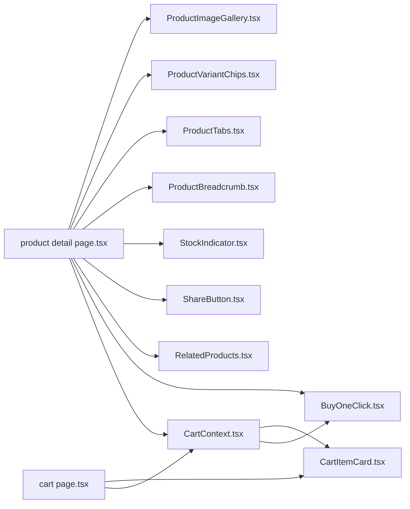

**Diagram sources**
- [CartContext.tsx:56-194](file://components/ecommerce/CartContext.tsx#L56-L194)
- [CartItemCard.tsx:24-119](file://components/ecommerce/CartItemCard.tsx#L24-L119)
- [BuyOneClick.tsx:26-165](file://components/ecommerce/BuyOneClick.tsx#L26-L165)
- [product detail page.tsx:12-354](file://app/store/catalog/[slug]/page.tsx#L12-L354)
- [cart page.tsx:9-115](file://app/store/cart/page.tsx#L9-L115)

**Section sources**
- [product detail page.tsx:12-354](file://app/store/catalog/[slug]/page.tsx#L12-L354)
- [cart page.tsx:9-115](file://app/store/cart/page.tsx#L9-L115)
- [CartContext.tsx:56-194](file://components/ecommerce/CartContext.tsx#L56-L194)

## Performance Considerations
- Client-side caching: CartContext caches items locally and refreshes on mount; avoid unnecessary re-renders by passing memoized callbacks.
- Lazy loading: ProductImageGallery uses priority only for the first image; consider lazy loading for thumbnails.
- Skeletons: ProductSection and product detail page use skeleton loaders to improve perceived performance.
- Minimal re-renders: Use shallow comparisons and stable callbacks to prevent unnecessary updates.

## Troubleshooting Guide
- Cart operations fail silently:
  - addToCart/removeFromCart/updateQuantity show toasts on error; ensure network connectivity and backend routes are reachable.
- BuyOneClick validation:
  - Requires non-empty name and phone; ensure inputs meet minimum length requirements.
- Product detail not found:
  - Product detail page redirects to catalog on 404; verify slug correctness.
- ShareButton clipboard:
  - Clipboard API requires secure context; ensure HTTPS deployment.

**Section sources**
- [CartContext.tsx:83-173](file://components/ecommerce/CartContext.tsx#L83-L173)
- [BuyOneClick.tsx:39-75](file://components/ecommerce/BuyOneClick.tsx#L39-L75)
- [product detail page.tsx:76-95](file://app/store/catalog/[slug]/page.tsx#L76-L95)
- [ShareButton.tsx:24-47](file://components/ecommerce/ShareButton.tsx#L24-L47)

## Conclusion
These e-commerce components provide a cohesive, reusable foundation for product presentation, cart management, and customer interactions. They integrate tightly with backend APIs and Next.js patterns, enabling scalable enhancements for marketing content, product discovery, and conversion optimization.