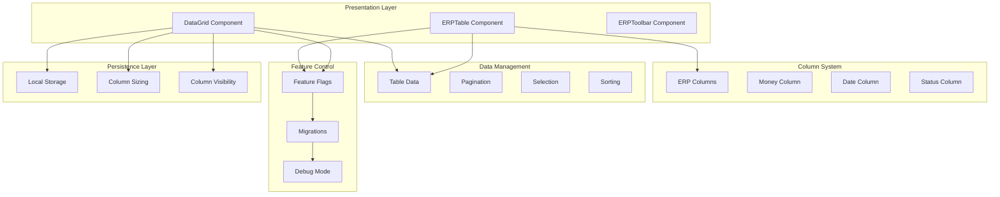
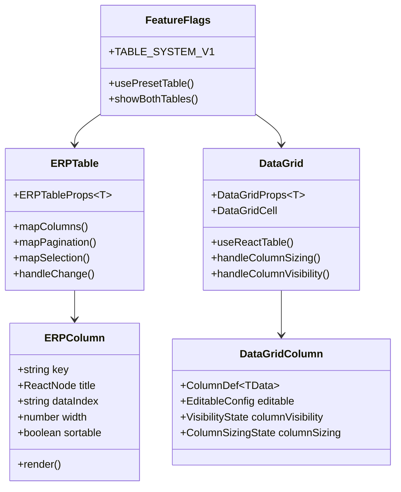
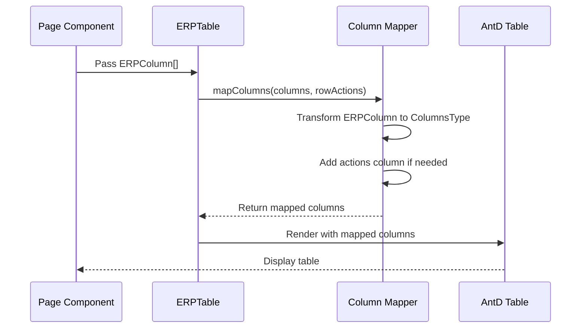
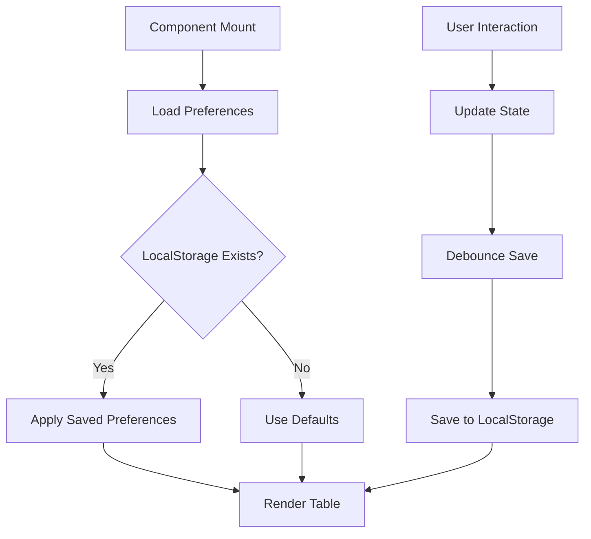
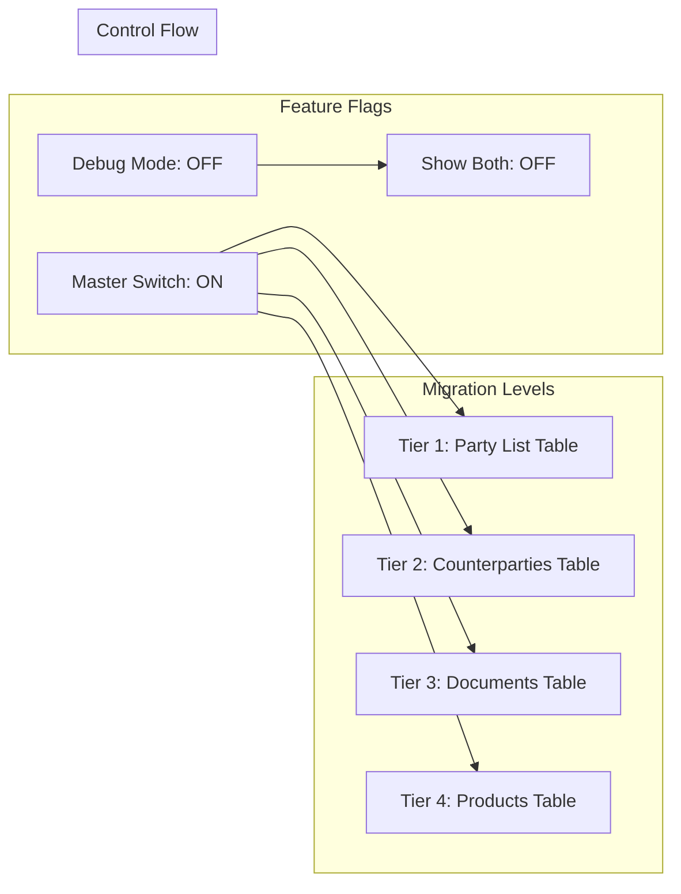
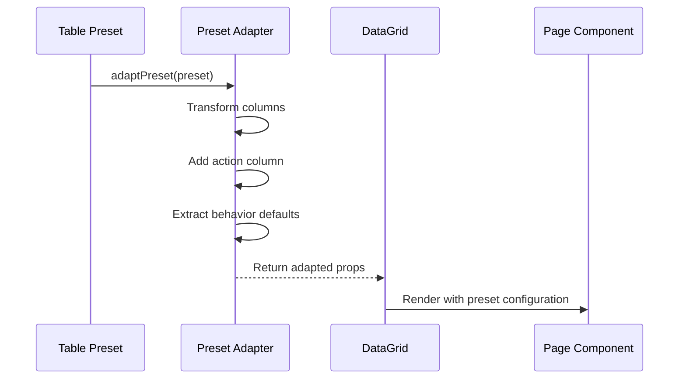

# ERP Table System

<cite>
**Referenced Files in This Document**
- [erp-table.tsx](file://components/erp/erp-table.tsx)
- [erp-table.types.ts](file://components/erp/erp-table.types.ts)
- [erp-toolbar.tsx](file://components/erp/erp-toolbar.tsx)
- [money-column.ts](file://components/erp/columns/money-column.ts)
- [ProductsTable.tsx](file://components/domain/accounting/catalog/ProductsTable.tsx)
- [data-grid.tsx](file://components/ui/data-grid/data-grid.tsx)
- [data-grid-types.ts](file://components/ui/data-grid/data-grid-types.ts)
- [preset-adapter.tsx](file://components/ui/data-grid/preset-adapter.tsx)
- [feature-flags.ts](file://lib/table-system/feature-flags.ts)
- [preset-party-list-table.tsx](file://components/domain/CRM/parties/preset-party-list-table.tsx)
- [party-list-table.tsx](file://components/domain/CRM/parties/party-list-table.tsx)
- [data-grid-persist.ts](file://components/ui/data-grid/data-grid-persist.ts)
- [data-grid-cell.tsx](file://components/ui/data-grid/data-grid-cell.tsx)
- [data-grid-toolbar.tsx](file://components/ui/data-grid/data-grid-toolbar.tsx)
</cite>

## Table of Contents
1. [Introduction](#introduction)
2. [System Architecture](#system-architecture)
3. [Core Components](#core-components)
4. [Table System Comparison](#table-system-comparison)
5. [ERP Table Implementation](#erp-table-implementation)
6. [DataGrid Implementation](#datagrid-implementation)
7. [Column Systems](#column-systems)
8. [Feature Flag Management](#feature-flag-management)
9. [Migration Strategy](#migration-strategy)
10. [Performance Considerations](#performance-considerations)
11. [Troubleshooting Guide](#troubleshooting-guide)
12. [Conclusion](#conclusion)

## Introduction

The ERP Table System is a comprehensive data presentation framework designed for the ListOpt ERP platform. It provides two distinct table implementations: the ERPTable component built on Ant Design for traditional ERP interfaces, and the DataGrid component built on TanStack React Table for modern, feature-rich data grids. This dual-architecture approach enables gradual migration from legacy table implementations to a more sophisticated preset-driven system.

The system emphasizes separation of concerns, with framework-agnostic column definitions, stateless presentation components, and modular feature flag management. It supports advanced features like column persistence, inline editing, bulk operations, and responsive design while maintaining backward compatibility.

## System Architecture

The ERP Table System follows a layered architecture pattern with clear boundaries between presentation, data management, and feature control:



**Diagram sources**
- [erp-table.tsx:1-166](file://components/erp/erp-table.tsx#L1-L166)
- [data-grid.tsx:1-387](file://components/ui/data-grid/data-grid.tsx#L1-L387)
- [feature-flags.ts:1-77](file://lib/table-system/feature-flags.ts#L1-L77)

## Core Components

### ERPTable Component

The ERPTable serves as a stateless presentation wrapper over Ant Design's Table component, providing a framework-agnostic interface for table rendering.

**Key Features:**
- Stateless design with clear separation of concerns
- Framework-agnostic column definitions
- Built-in row actions support
- Comprehensive pagination and selection handling
- Customizable row click handling

**Section sources**
- [erp-table.tsx:82-166](file://components/erp/erp-table.tsx#L82-L166)
- [erp-table.types.ts:79-133](file://components/erp/erp-table.types.ts#L79-L133)

### ERPToolbar Component

Provides consistent toolbar functionality across ERP interfaces with flexible action slots.

**Capabilities:**
- Create button management
- Bulk actions display
- Extra actions positioning
- Responsive design support

**Section sources**
- [erp-toolbar.tsx:7-61](file://components/erp/erp-toolbar.tsx#L7-L61)
- [erp-table.types.ts:135-154](file://components/erp/erp-table.types.ts#L135-L154)

### DataGrid Component

The DataGrid represents the modern, feature-rich table implementation built on TanStack React Table.

**Advanced Features:**
- Column resizing and visibility management
- Inline editing capabilities
- Persistent user preferences
- Comprehensive toolbar system
- Bulk selection and actions

**Section sources**
- [data-grid.tsx:27-387](file://components/ui/data-grid/data-grid.tsx#L27-L387)
- [data-grid-types.ts:57-74](file://components/ui/data-grid/data-grid-types.ts#L57-L74)

## Table System Comparison

The system maintains two parallel table implementations to facilitate gradual migration:



**Diagram sources**
- [erp-table.tsx:16-47](file://components/erp/erp-table.tsx#L16-L47)
- [data-grid.tsx:155-176](file://components/ui/data-grid/data-grid.tsx#L155-L176)
- [feature-flags.ts:8-50](file://lib/table-system/feature-flags.ts#L8-L50)

## ERP Table Implementation

The ERPTable implementation focuses on simplicity and performance for traditional ERP scenarios:

### Column Mapping System

The ERPTable uses a strict mapping system to convert framework-agnostic column definitions to Ant Design's specific requirements:



**Diagram sources**
- [erp-table.tsx:16-47](file://components/erp/erp-table.tsx#L16-L47)
- [erp-table.tsx:111-113](file://components/erp/erp-table.tsx#L111-L113)

### Pagination and Selection Handling

The ERPTable provides comprehensive state management for pagination and selection:

**Section sources**
- [erp-table.tsx:49-80](file://components/erp/erp-table.tsx#L49-L80)
- [erp-table.types.ts:42-69](file://components/erp/erp-table.types.ts#L42-L69)

## DataGrid Implementation

The DataGrid implementation offers advanced functionality for modern applications:

### Column Persistence System

The DataGrid includes sophisticated persistence mechanisms for user preferences:



**Diagram sources**
- [data-grid.tsx:62-74](file://components/ui/data-grid/data-grid.tsx#L62-L74)
- [data-grid-persist.ts:7-35](file://components/ui/data-grid/data-grid-persist.ts#L7-L35)

### Inline Editing Capabilities

The DataGrid supports inline editing with validation and error handling:

**Section sources**
- [data-grid-cell.tsx:41-76](file://components/ui/data-grid/data-grid-cell.tsx#L41-L76)
- [data-grid-types.ts:17-22](file://components/ui/data-grid/data-grid-types.ts#L17-L22)

## Column Systems

### ERP Column System

The ERP column system provides a framework-agnostic approach to column definitions:

**Key Features:**
- Flexible data access via dataIndex
- Custom cell renderers
- Alignment and width controls
- Sortable column support

**Section sources**
- [erp-table.types.ts:3-40](file://components/erp/erp-table.types.ts#L3-L40)
- [money-column.ts:48-64](file://components/erp/columns/money-column.ts#L48-L64)

### Money Column Implementation

The money column system provides consistent currency formatting across the application:

```mermaid
flowchart TD
Input[Number Input] --> CheckNull{Is Value Null?}
CheckNull --> |Yes| Dash[Return "—"]
CheckNull --> |No| CheckCurrency{Currency Type?}
CheckCurrency --> |RUB| FormatRUB[Use formatRub]
CheckCurrency --> |Other| IntlFormat[Intl.NumberFormat]
FormatRUB --> Output[Formatted String]
IntlFormat --> Output
Dash --> Output
```

**Diagram sources**
- [money-column.ts:24-36](file://components/erp/columns/money-column.ts#L24-L36)

**Section sources**
- [money-column.ts:15-36](file://components/erp/columns/money-column.ts#L15-L36)

## Feature Flag Management

The table system uses a comprehensive feature flag system for controlled migration:

### Migration Strategy

The system implements a tiered migration approach:



**Diagram sources**
- [feature-flags.ts:8-50](file://lib/table-system/feature-flags.ts#L8-L50)

**Section sources**
- [feature-flags.ts:52-77](file://lib/table-system/feature-flags.ts#L52-L77)

### Debug Mode Implementation

The debug mode allows side-by-side comparison of legacy and new implementations:

**Section sources**
- [party-list-table.tsx:128-161](file://components/domain/CRM/parties/party-list-table.tsx#L128-L161)

## Migration Strategy

### Preset-Based Migration

The system uses presets to drive table configuration:



**Diagram sources**
- [preset-adapter.tsx:139-180](file://components/ui/data-grid/preset-adapter.tsx#L139-L180)

**Section sources**
- [preset-party-list-table.tsx:27-41](file://components/domain/CRM/parties/preset-party-list-table.tsx#L27-L41)

### Real-World Implementation Example

The ProductsTable demonstrates the integration of ERPTable in a production environment:

**Section sources**
- [ProductsTable.tsx:224-420](file://components/domain/accounting/catalog/ProductsTable.tsx#L224-L420)

## Performance Considerations

### Rendering Optimization

Both table implementations include several performance optimizations:

**ERPTable Optimizations:**
- Stateless design reduces re-renders
- Minimal DOM manipulation
- Efficient column mapping
- Lazy loading for row actions

**DataGrid Optimizations:**
- Virtualized rendering for large datasets
- Debounced persistence saves
- Efficient column state management
- Client-only persistence loading

### Memory Management

The system implements careful memory management strategies:

**Section sources**
- [data-grid.tsx:76-102](file://components/ui/data-grid/data-grid.tsx#L76-L102)
- [erp-table.tsx:115-137](file://components/erp/erp-table.tsx#L115-L137)

## Troubleshooting Guide

### Common Issues and Solutions

**Table Not Rendering:**
- Verify data array is properly formatted
- Check column definitions match data structure
- Ensure proper TypeScript interface implementation

**Feature Flag Issues:**
- Confirm TABLE_SYSTEM_V1.enabled is set correctly
- Verify specific table flag is enabled
- Check debug mode settings for development

**Performance Problems:**
- Monitor for excessive re-renders
- Check column persistence storage
- Verify proper cleanup of event listeners

**Section sources**
- [erp-table.tsx:146-165](file://components/erp/erp-table.tsx#L146-L165)
- [data-grid.tsx:178-185](file://components/ui/data-grid/data-grid.tsx#L178-L185)

## Conclusion

The ERP Table System provides a robust foundation for data presentation across the ListOpt ERP platform. Its dual-architecture approach enables gradual migration from legacy implementations to modern, feature-rich table systems while maintaining backward compatibility and performance standards.

The system's strength lies in its clear separation of concerns, comprehensive feature flag management, and flexible column definition system. The ERPTable component excels in traditional ERP scenarios requiring simplicity and performance, while the DataGrid component provides advanced functionality for modern applications needing sophisticated data manipulation capabilities.

Future enhancements could include expanded action column support in the DataGrid, additional column types, and enhanced accessibility features. The current architecture provides a solid foundation for these improvements while maintaining the system's core principles of modularity and maintainability.