# Shared UI Primitives

<cite>
**Referenced Files in This Document**
- [button.tsx](file://components/ui/button.tsx)
- [input.tsx](file://components/ui/input.tsx)
- [dialog.tsx](file://components/ui/dialog.tsx)
- [select.tsx](file://components/ui/select.tsx)
- [table.tsx](file://components/ui/table.tsx)
- [card.tsx](file://components/ui/card.tsx)
- [checkbox.tsx](file://components/ui/checkbox.tsx)
- [dropdown-menu.tsx](file://components/ui/dropdown-menu.tsx)
- [label.tsx](file://components/ui/label.tsx)
- [separator.tsx](file://components/ui/separator.tsx)
- [sheet.tsx](file://components/ui/sheet.tsx)
- [sonner.tsx](file://components/ui/sonner.tsx)
- [switch.tsx](file://components/ui/switch.tsx)
- [tabs.tsx](file://components/ui/tabs.tsx)
- [textarea.tsx](file://components/ui/textarea.tsx)
- [badge.tsx](file://components/ui/badge.tsx)
</cite>

## Table of Contents
1. [Introduction](#introduction)
2. [Project Structure](#project-structure)
3. [Core Components](#core-components)
4. [Architecture Overview](#architecture-overview)
5. [Detailed Component Analysis](#detailed-component-analysis)
6. [Dependency Analysis](#dependency-analysis)
7. [Performance Considerations](#performance-considerations)
8. [Troubleshooting Guide](#troubleshooting-guide)
9. [Conclusion](#conclusion)
10. [Appendices](#appendices)

## Introduction
This document describes the shared UI primitive components built with the shadcn/ui design system. It focuses on fundamental components used across the application: Button, Input, Dialog, Select, Table, Card, Checkbox, DropdownMenu, Label, Separator, Sheet, Sonner, Switch, Tabs, Textarea, and Badge. For each component, we explain props, styling options, composition patterns, accessibility features, responsive design considerations, and integration patterns. We also cover theming support, style overrides via Tailwind classes, animation states, and guidance for extending components while maintaining design consistency.

## Project Structure
The primitives live under components/ui and are thin wrappers around Radix UI primitives, styled with Tailwind classes and a consistent design system. Many components use class-variance-authority (cva) for variant-driven styling and include data-slot attributes for testing and consistent styling hooks.

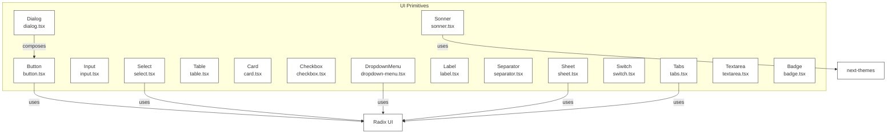

**Diagram sources**
- [button.tsx:1-65](file://components/ui/button.tsx#L1-L65)
- [input.tsx:1-22](file://components/ui/input.tsx#L1-L22)
- [dialog.tsx:1-160](file://components/ui/dialog.tsx#L1-L160)
- [select.tsx:1-191](file://components/ui/select.tsx#L1-L191)
- [table.tsx:1-117](file://components/ui/table.tsx#L1-L117)
- [card.tsx:1-93](file://components/ui/card.tsx#L1-L93)
- [checkbox.tsx:1-37](file://components/ui/checkbox.tsx#L1-L37)
- [dropdown-menu.tsx:1-258](file://components/ui/dropdown-menu.tsx#L1-L258)
- [label.tsx:1-25](file://components/ui/label.tsx#L1-L25)
- [separator.tsx:1-29](file://components/ui/separator.tsx#L1-L29)
- [sheet.tsx:1-144](file://components/ui/sheet.tsx#L1-L144)
- [sonner.tsx:1-41](file://components/ui/sonner.tsx#L1-L41)
- [switch.tsx:1-32](file://components/ui/switch.tsx#L1-L32)
- [tabs.tsx:1-92](file://components/ui/tabs.tsx#L1-L92)
- [textarea.tsx:1-19](file://components/ui/textarea.tsx#L1-L19)
- [badge.tsx:1-49](file://components/ui/badge.tsx#L1-L49)

**Section sources**
- [button.tsx:1-65](file://components/ui/button.tsx#L1-L65)
- [dialog.tsx:1-160](file://components/ui/dialog.tsx#L1-L160)
- [select.tsx:1-191](file://components/ui/select.tsx#L1-L191)
- [dropdown-menu.tsx:1-258](file://components/ui/dropdown-menu.tsx#L1-L258)
- [sheet.tsx:1-144](file://components/ui/sheet.tsx#L1-L144)
- [tabs.tsx:1-92](file://components/ui/tabs.tsx#L1-L92)
- [badge.tsx:1-49](file://components/ui/badge.tsx#L1-L49)

## Core Components
Below is a concise overview of each component’s purpose, primary props, and styling options. See the Detailed Component Analysis for implementation specifics.

- Button
  - Purpose: Primary action affordance with variants and sizes.
  - Key props: variant, size, asChild, className.
  - Variants: default, destructive, outline, secondary, ghost, link.
  - Sizes: default, xs, sm, lg, icon, icon-xs, icon-sm, icon-lg.
  - Accessibility: Focus-visible ring, aria-invalid integration.
  - Responsive: Gap and padding adjust per size; icon sizes handled automatically.

- Input
  - Purpose: Single-line text input with consistent focus states.
  - Key props: type, className.
  - States: Disabled, focused, aria-invalid.
  - Responsive: Font sizing adapts across breakpoints.

- Dialog
  - Purpose: Modal overlay with header/footer/title/description helpers.
  - Key props: Root, Trigger, Portal, Overlay, Content, Header/Footer, Title, Description, Close.
  - Composition: Content composes Button for close; supports showCloseButton toggle.
  - Animations: Fade and zoom transitions driven by open/closed state.

- Select
  - Purpose: Accessible single/multi-selection dropdown.
  - Key props: Root, Group, Value, Trigger (size), Content (position, align), Item, Label, Separator, ScrollUp/Down buttons.
  - Variants: Popper vs item-aligned positioning.
  - Interaction: Keyboard navigation, scrollable viewport, indicators.

- Table
  - Purpose: Scrollable table container with semantic rows and cells.
  - Key props: Table, TableHeader/TableBody/TableFooter, TableRow, TableHead/TableCell, TableCaption.
  - States: Hover, selected via data-state.

- Card
  - Purpose: Content grouping with optional action area and responsive grid.
  - Key props: Card, CardHeader, CardTitle, CardDescription, CardAction, CardContent, CardFooter.
  - Layout: Grid-based header with optional action column.

- Checkbox
  - Purpose: Three-state checkbox with indeterminate support.
  - Key props: Root, Indicator (check/minor).
  - States: Checked, unchecked, indeterminate.

- DropdownMenu
  - Purpose: Nested menus with items, checkboxes, radios, separators, and shortcuts.
  - Key props: Root, Portal, Trigger, Content, Group, Label, Item, CheckboxItem, RadioGroup/RadioItem, Separator, Sub/SubTrigger/SubContent, Shortcut.
  - Variants: Item variant destructive; inset option.

- Label
  - Purpose: Associates text with controls; respects disabled states.
  - Key props: Root, className.

- Separator
  - Purpose: Decorative or structural divider.
  - Key props: Root, orientation (horizontal/vertical), decorative.

- Sheet
  - Purpose: Slide-out panel from side/top/bottom/left.
  - Key props: Root, Trigger, Portal, Overlay, Content (side, showCloseButton), Header/Footer, Title, Description, Close.
  - Animations: Side-specific slide transitions.

- Sonner
  - Purpose: Toast notifications integrated with theme.
  - Key props: ToasterProps forwarded; theme resolved via next-themes.
  - Theming: Uses CSS variables mapped to design tokens.

- Switch
  - Purpose: Toggle control with thumb animation.
  - Key props: Root, Thumb.
  - States: Checked/unchecked with color transitions.

- Tabs
  - Purpose: Tabbed interface with list and content areas.
  - Key props: Root, List (variant), Trigger, Content.
  - Variants: default, line; orientation horizontal/vertical.

- Textarea
  - Purpose: Multi-line text input with consistent focus states.
  - Key props: className.
  - States: Disabled, focused, aria-invalid.

- Badge
  - Purpose: Small status or metadata label.
  - Key props: variant, asChild, className.
  - Variants: default, secondary, destructive, outline, ghost, link.

**Section sources**
- [button.tsx:1-65](file://components/ui/button.tsx#L1-L65)
- [input.tsx:1-22](file://components/ui/input.tsx#L1-L22)
- [dialog.tsx:1-160](file://components/ui/dialog.tsx#L1-L160)
- [select.tsx:1-191](file://components/ui/select.tsx#L1-L191)
- [table.tsx:1-117](file://components/ui/table.tsx#L1-L117)
- [card.tsx:1-93](file://components/ui/card.tsx#L1-L93)
- [checkbox.tsx:1-37](file://components/ui/checkbox.tsx#L1-L37)
- [dropdown-menu.tsx:1-258](file://components/ui/dropdown-menu.tsx#L1-L258)
- [label.tsx:1-25](file://components/ui/label.tsx#L1-L25)
- [separator.tsx:1-29](file://components/ui/separator.tsx#L1-L29)
- [sheet.tsx:1-144](file://components/ui/sheet.tsx#L1-L144)
- [sonner.tsx:1-41](file://components/ui/sonner.tsx#L1-L41)
- [switch.tsx:1-32](file://components/ui/switch.tsx#L1-L32)
- [tabs.tsx:1-92](file://components/ui/tabs.tsx#L1-L92)
- [textarea.tsx:1-19](file://components/ui/textarea.tsx#L1-L19)
- [badge.tsx:1-49](file://components/ui/badge.tsx#L1-L49)

## Architecture Overview
The components follow a consistent pattern:
- Thin wrappers around Radix UI primitives.
- Data attributes (data-slot, data-variant, data-size) for styling hooks and tests.
- Centralized Tailwind classes with design tokens (e.g., ring, muted, foreground).
- Optional variants via cva for Button and Badge; Tabs uses cva for list variants.
- Theming via next-themes for Sonner.

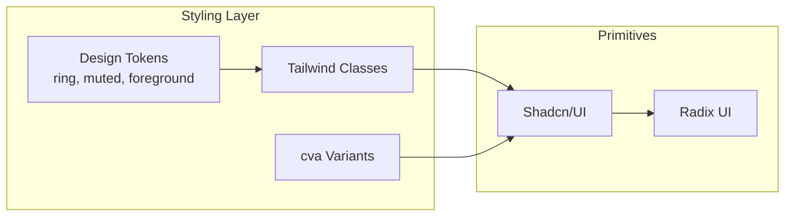

[No sources needed since this diagram shows conceptual workflow, not actual code structure]

## Detailed Component Analysis

### Button
- Props
  - variant: default | destructive | outline | secondary | ghost | link
  - size: default | xs | sm | lg | icon | icon-xs | icon-sm | icon-lg
  - asChild: render as Slot.Root to compose other components
  - className: additional Tailwind classes
- Styling
  - Focus-visible ring and border integration; destructive variants include dark-mode focus ring adjustments.
  - Icon sizing normalized; gap/padding scale with size.
- Accessibility
  - Focus-visible ring; disabled state prevents interaction and reduces opacity.
- Usage patterns
  - Compose with icons; use asChild to wrap links or other interactive elements.
- Extending
  - Add new variant via cva; keep consistent focus and disabled states.

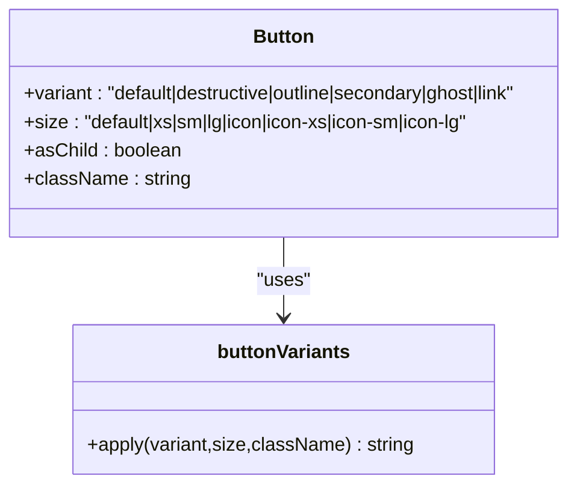

**Diagram sources**
- [button.tsx:7-39](file://components/ui/button.tsx#L7-L39)

**Section sources**
- [button.tsx:1-65](file://components/ui/button.tsx#L1-L65)

### Input
- Props
  - type: input type
  - className: additional Tailwind classes
- Styling
  - Focus-visible ring; destructive invalid state; placeholder and file input text colors; dark:bg-input/30.
- Accessibility
  - Focus-visible ring; disabled state handled.
- Usage patterns
  - Combine with Label; integrate with form libraries via ref forwarding.

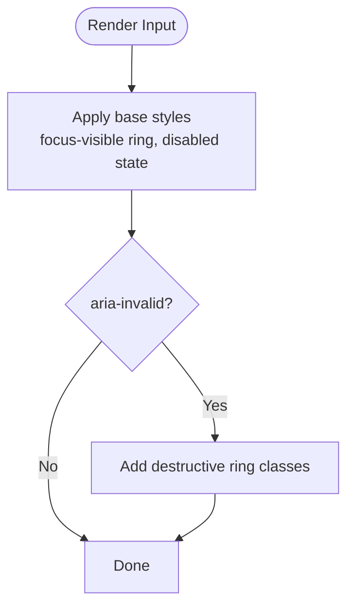

**Diagram sources**
- [input.tsx:10-15](file://components/ui/input.tsx#L10-L15)

**Section sources**
- [input.tsx:1-22](file://components/ui/input.tsx#L1-L22)

### Dialog
- Composition
  - Root, Trigger, Portal, Overlay, Content, Header/Footer, Title, Description, Close.
  - Content optionally renders a close button and delegates to Button.
- Props
  - Content: showCloseButton (boolean)
  - Footer: showCloseButton (boolean)
- Animations
  - Fade and zoom transitions; overlay backdrop.
- Accessibility
  - Proper roles and aria-describedby handling; focus trapping via Radix UI.
- Usage patterns
  - Use Header/Footer for structured layouts; Title/Description for semantics.

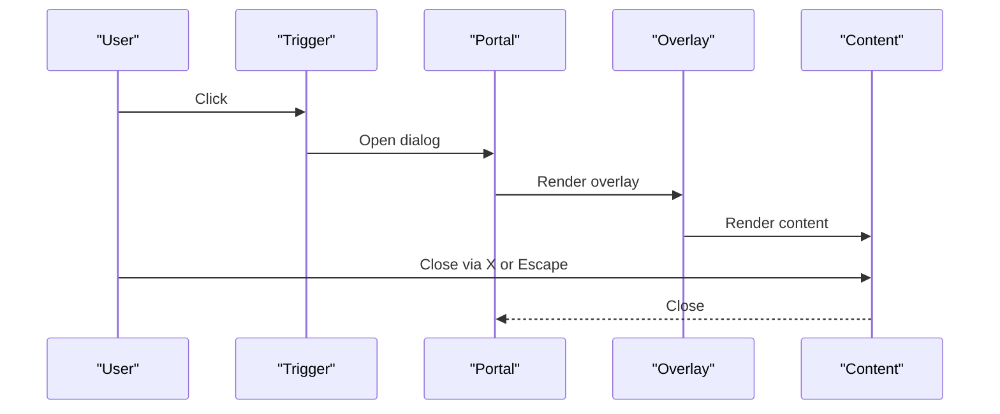

**Diagram sources**
- [dialog.tsx:10-83](file://components/ui/dialog.tsx#L10-L83)

**Section sources**
- [dialog.tsx:1-160](file://components/ui/dialog.tsx#L1-L160)

### Select
- Composition
  - Root, Group, Value, Trigger (supports size), Content (position, align), Item, Label, Separator, ScrollUp/Down buttons.
- Props
  - Trigger: size ("sm" | "default")
  - Content: position ("item-aligned" | "popper"), align
- Interaction
  - Keyboard navigation; scrollable viewport; item indicators.
- Accessibility
  - Proper labeling and selection semantics via Radix UI.

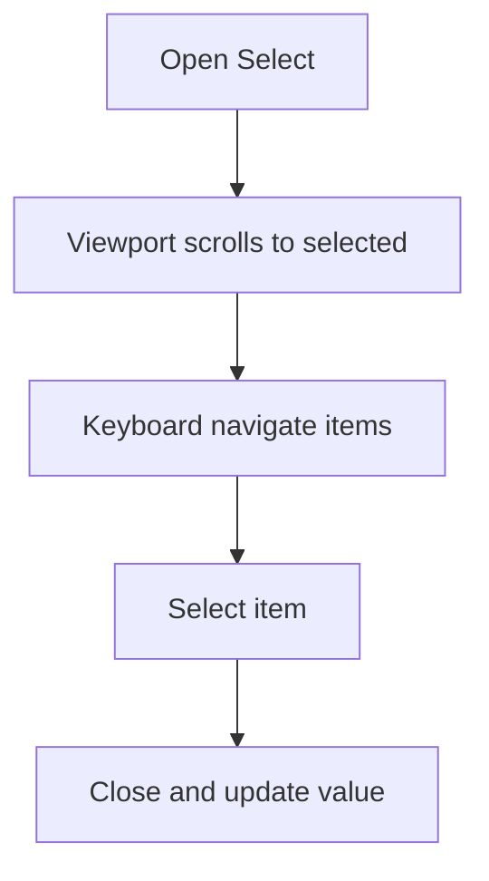

**Diagram sources**
- [select.tsx:53-87](file://components/ui/select.tsx#L53-L87)

**Section sources**
- [select.tsx:1-191](file://components/ui/select.tsx#L1-L191)

### Table
- Composition
  - Table container wrapper plus semantic elements: TableHeader, TableBody, TableFooter, TableRow, TableHead, TableCell, TableCaption.
- Styling
  - Hover and selection states; responsive padding and alignment.
- Accessibility
  - Semantic markup for screen readers.

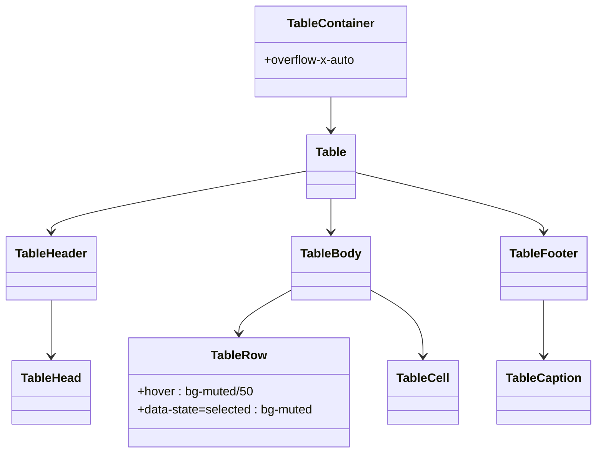

**Diagram sources**
- [table.tsx:7-105](file://components/ui/table.tsx#L7-L105)

**Section sources**
- [table.tsx:1-117](file://components/ui/table.tsx#L1-L117)

### Card
- Composition
  - Card, CardHeader (with optional CardAction), CardTitle, CardDescription, CardContent, CardFooter.
- Layout
  - Responsive grid in CardHeader; action area aligned to the top-right when present.

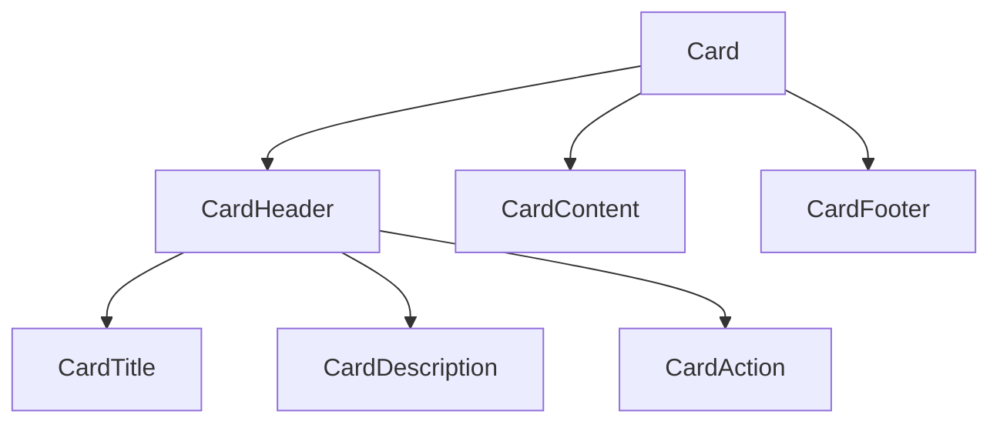

**Diagram sources**
- [card.tsx:5-82](file://components/ui/card.tsx#L5-L82)

**Section sources**
- [card.tsx:1-93](file://components/ui/card.tsx#L1-L93)

### Checkbox
- Props
  - Root: className
  - Indicator: renders either Minus or Check icon depending on checked state.
- States
  - Supports indeterminate via checked="indeterminate".

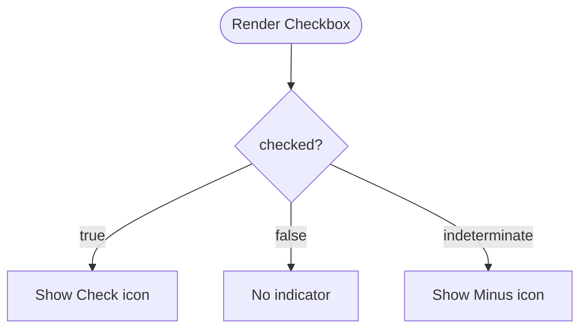

**Diagram sources**
- [checkbox.tsx:26-31](file://components/ui/checkbox.tsx#L26-L31)

**Section sources**
- [checkbox.tsx:1-37](file://components/ui/checkbox.tsx#L1-L37)

### DropdownMenu
- Composition
  - Root, Portal, Trigger, Content, Group, Label, Item (default/destructive/inset), CheckboxItem, RadioGroup/RadioItem, Separator, Sub/SubTrigger/SubContent, Shortcut.
- Variants
  - Item variant destructive; inset option for indentation.
- Accessibility
  - Keyboard navigation; nested submenus supported.

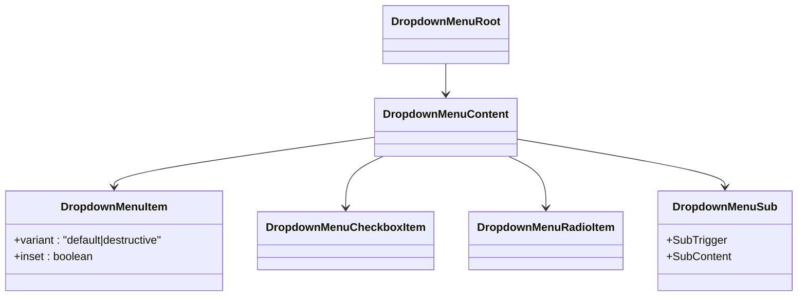

**Diagram sources**
- [dropdown-menu.tsx:9-239](file://components/ui/dropdown-menu.tsx#L9-L239)

**Section sources**
- [dropdown-menu.tsx:1-258](file://components/ui/dropdown-menu.tsx#L1-L258)

### Label
- Props
  - Root: className
- Behavior
  - Respects disabled states via peer/group selectors.

**Section sources**
- [label.tsx:1-25](file://components/ui/label.tsx#L1-L25)

### Separator
- Props
  - orientation: "horizontal" | "vertical"
  - decorative: boolean
  - className: additional Tailwind classes

**Section sources**
- [separator.tsx:1-29](file://components/ui/separator.tsx#L1-L29)

### Sheet
- Composition
  - Root, Trigger, Portal, Overlay, Content (side: "top"|"right"|"bottom"|"left", showCloseButton), Header/Footer, Title, Description, Close.
- Animations
  - Side-specific slide-in/out transitions; overlay fade.

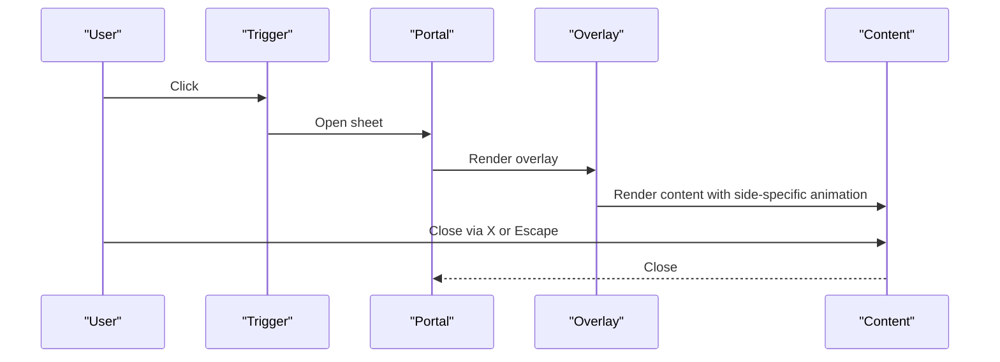

**Diagram sources**
- [sheet.tsx:47-85](file://components/ui/sheet.tsx#L47-L85)

**Section sources**
- [sheet.tsx:1-144](file://components/ui/sheet.tsx#L1-L144)

### Sonner
- Props
  - ToasterProps forwarded; theme resolved via next-themes.
- Styling
  - CSS variables mapped to design tokens for normal state visuals.

**Section sources**
- [sonner.tsx:1-41](file://components/ui/sonner.tsx#L1-L41)

### Switch
- Props
  - Root: className
  - Thumb: className
- Animation
  - Thumb translates horizontally based on checked state.

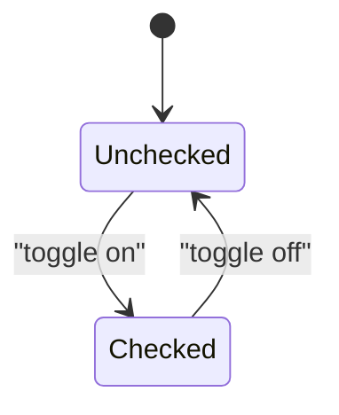

**Diagram sources**
- [switch.tsx:13-27](file://components/ui/switch.tsx#L13-L27)

**Section sources**
- [switch.tsx:1-32](file://components/ui/switch.tsx#L1-L32)

### Tabs
- Composition
  - Root, List (variant: "default" | "line"), Trigger, Content.
- Props
  - Root: orientation ("horizontal" | "vertical")
  - List: variant
- Styling
  - Active state underline or shadow depending on variant and orientation.

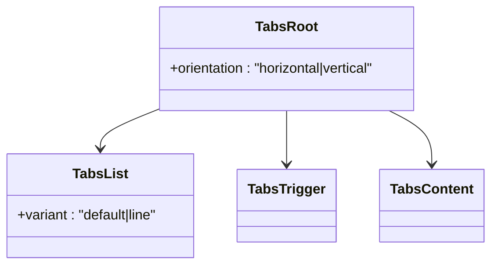

**Diagram sources**
- [tabs.tsx:9-89](file://components/ui/tabs.tsx#L9-L89)

**Section sources**
- [tabs.tsx:1-92](file://components/ui/tabs.tsx#L1-L92)

### Textarea
- Props
  - className: additional Tailwind classes
- Styling
  - Focus-visible ring; destructive invalid state; dark:bg-input/30.

**Section sources**
- [textarea.tsx:1-19](file://components/ui/textarea.tsx#L1-L19)

### Badge
- Props
  - variant: default | secondary | destructive | outline | ghost | link
  - asChild: render as Slot.Root
  - className: additional Tailwind classes
- Styling
  - Rounded-full; variant palette; hover states for anchor variants.

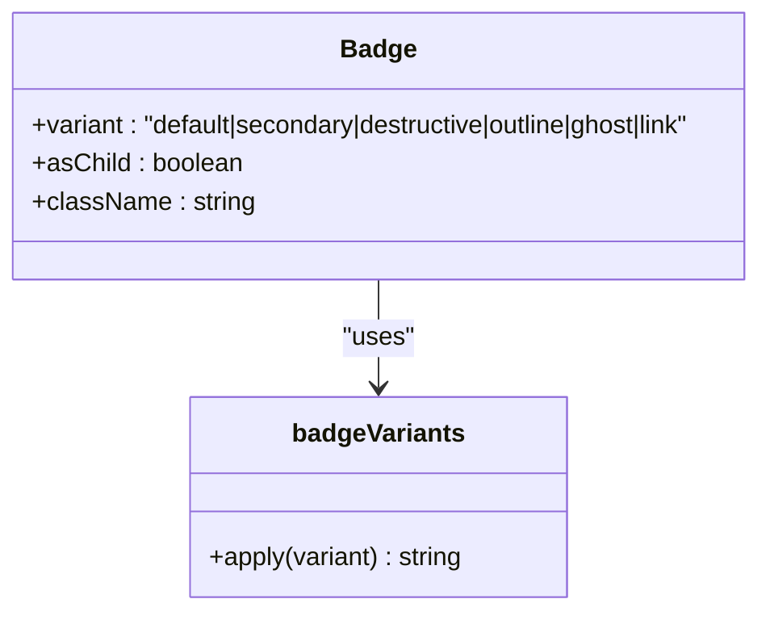

**Diagram sources**
- [badge.tsx:7-27](file://components/ui/badge.tsx#L7-L27)

**Section sources**
- [badge.tsx:1-49](file://components/ui/badge.tsx#L1-L49)

## Dependency Analysis
- Internal dependencies
  - Button, Badge, Tabs use cva for variants.
  - Dialog composes Button for its close trigger.
  - Sonner depends on next-themes for theme resolution.
- External dependencies
  - Radix UI primitives for accessible base behavior.
  - class-variance-authority for variant composition.
  - lucide-react for icons used across components.

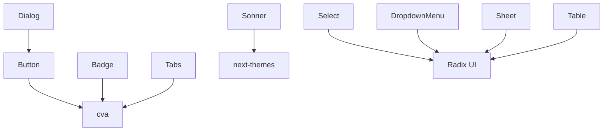

**Diagram sources**
- [button.tsx:1-65](file://components/ui/button.tsx#L1-L65)
- [badge.tsx:1-49](file://components/ui/badge.tsx#L1-L49)
- [tabs.tsx:1-92](file://components/ui/tabs.tsx#L1-L92)
- [dialog.tsx:1-160](file://components/ui/dialog.tsx#L1-L160)
- [sonner.tsx:1-41](file://components/ui/sonner.tsx#L1-L41)
- [select.tsx:1-191](file://components/ui/select.tsx#L1-L191)
- [dropdown-menu.tsx:1-258](file://components/ui/dropdown-menu.tsx#L1-L258)
- [sheet.tsx:1-144](file://components/ui/sheet.tsx#L1-L144)
- [table.tsx:1-117](file://components/ui/table.tsx#L1-L117)

**Section sources**
- [button.tsx:1-65](file://components/ui/button.tsx#L1-L65)
- [badge.tsx:1-49](file://components/ui/badge.tsx#L1-L49)
- [tabs.tsx:1-92](file://components/ui/tabs.tsx#L1-L92)
- [dialog.tsx:1-160](file://components/ui/dialog.tsx#L1-L160)
- [sonner.tsx:1-41](file://components/ui/sonner.tsx#L1-L41)
- [select.tsx:1-191](file://components/ui/select.tsx#L1-L191)
- [dropdown-menu.tsx:1-258](file://components/ui/dropdown-menu.tsx#L1-L258)
- [sheet.tsx:1-144](file://components/ui/sheet.tsx#L1-L144)
- [table.tsx:1-117](file://components/ui/table.tsx#L1-L117)

## Performance Considerations
- Prefer shallow wrappers around Radix UI to minimize re-renders.
- Use asChild patterns (e.g., Button with asChild) to avoid unnecessary DOM nodes.
- Keep variant sets small and reuse cva compositions to reduce CSS bloat.
- Avoid heavy animations on low-powered devices; consider prefers-reduced-motion checks at the app level.

[No sources needed since this section provides general guidance]

## Troubleshooting Guide
- Focus rings not visible
  - Ensure focus-visible ring utilities are enabled in your Tailwind config and that components apply focus-visible classes consistently.
- Disabled state not working
  - Verify disabled prop is passed to the underlying primitive and that pointer-events-none and opacity classes are applied.
- Icons inside interactive elements
  - Components normalize icon sizes and pointer-events; ensure icons are sized appropriately and do not interfere with click targets.
- Theming inconsistencies
  - Confirm next-themes is configured and that Sonner maps to design tokens via CSS variables.
- Accessibility issues
  - Use semantic wrappers (Label, DialogTitle/Description, TableHead) and ensure keyboard navigation works in Select/DropdownMenu/Switch/Tabs.

**Section sources**
- [button.tsx:8-8](file://components/ui/button.tsx#L8-L8)
- [input.tsx:11-13](file://components/ui/input.tsx#L11-L13)
- [checkbox.tsx:16-18](file://components/ui/checkbox.tsx#L16-L18)
- [tabs.tsx:67-72](file://components/ui/tabs.tsx#L67-L72)
- [sonner.tsx:27-34](file://components/ui/sonner.tsx#L27-L34)

## Conclusion
These shared UI primitives provide a cohesive, accessible, and theme-aware foundation for building forms, dialogs, navigation, and content areas. By leveraging Radix UI for behavior and Tailwind with design tokens for styling, the components remain customizable, performant, and consistent across the application. Extend them thoughtfully using cva, maintain focus and disabled states, and integrate with form libraries via standard ref and event patterns.

[No sources needed since this section summarizes without analyzing specific files]

## Appendices

### Usage Patterns and Customization
- Tailwind overrides
  - Pass className to override base styles; use data-slot attributes for targeted selectors in tests or advanced styling.
- Form library integration
  - Forward refs to Input/Textarea/Select roots; handle onChange/onBlur/validation events; propagate aria-invalid where applicable.
- Responsive design
  - Components adapt via breakpoint-aware text sizes and spacing; ensure container widths accommodate content density.
- Cross-browser compatibility
  - Radix UI polyfills and Tailwind utilities generally provide broad support; test focus rings and transitions on target browsers.

[No sources needed since this section provides general guidance]