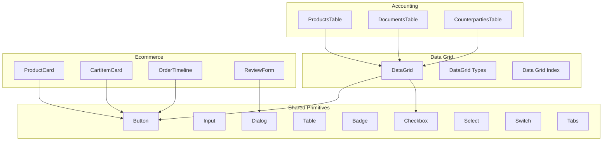
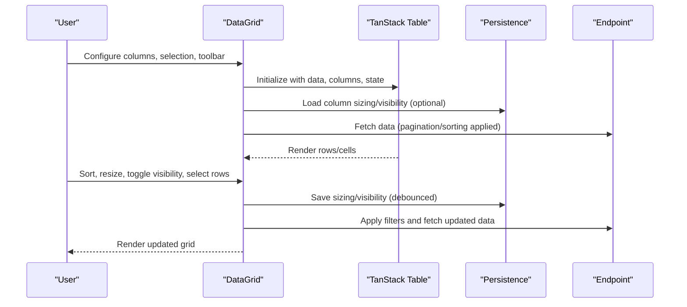
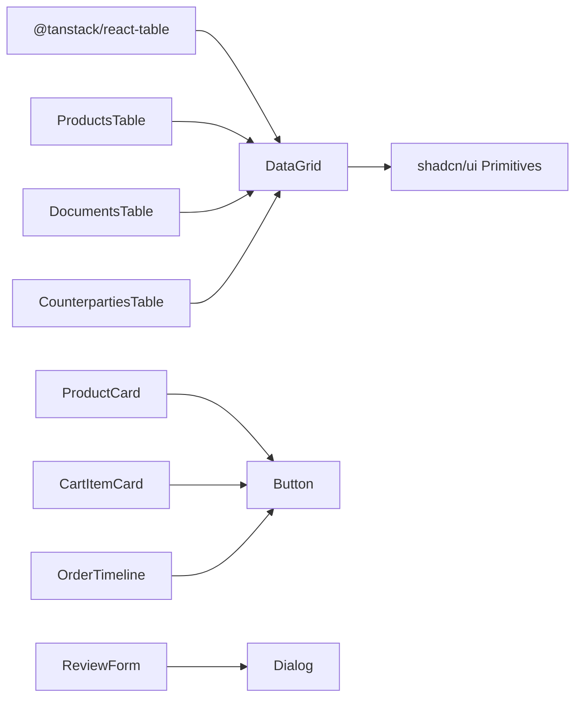

# UI Components

<cite>
**Referenced Files in This Document**
- [button.tsx](file://components/ui/button.tsx)
- [input.tsx](file://components/ui/input.tsx)
- [dialog.tsx](file://components/ui/dialog.tsx)
- [table.tsx](file://components/ui/table.tsx)
- [badge.tsx](file://components/ui/badge.tsx)
- [checkbox.tsx](file://components/ui/checkbox.tsx)
- [select.tsx](file://components/ui/select.tsx)
- [switch.tsx](file://components/ui/switch.tsx)
- [tabs.tsx](file://components/ui/tabs.tsx)
- [data-grid.tsx](file://components/ui/data-grid/data-grid.tsx)
- [data-grid-types.ts](file://components/ui/data-grid/data-grid-types.ts)
- [index.ts](file://components/ui/data-grid/index.ts)
- [ProductsTable.tsx](file://components/accounting/ProductsTable.tsx)
- [DocumentsTable.tsx](file://components/accounting/DocumentsTable.tsx)
- [CounterpartiesTable.tsx](file://components/accounting/CounterpartiesTable.tsx)
- [ProductCard.tsx](file://components/ecommerce/ProductCard.tsx)
- [CartItemCard.tsx](file://components/ecommerce/CartItemCard.tsx)
- [OrderTimeline.tsx](file://components/ecommerce/OrderTimeline.tsx)
- [ReviewForm.tsx](file://components/ecommerce/ReviewForm.tsx)
</cite>

## Table of Contents
1. [Introduction](#introduction)
2. [Project Structure](#project-structure)
3. [Core Components](#core-components)
4. [Architecture Overview](#architecture-overview)
5. [Detailed Component Analysis](#detailed-component-analysis)
6. [Dependency Analysis](#dependency-analysis)
7. [Performance Considerations](#performance-considerations)
8. [Accessibility and Responsive Design](#accessibility-and-responsive-design)
9. [Theming and Customization](#theming-and-customization)
10. [Usage Examples and Integration Guidelines](#usage-examples-and-integration-guidelines)
11. [Troubleshooting Guide](#troubleshooting-guide)
12. [Conclusion](#conclusion)

## Introduction
This document describes the ListOpt ERP UI component library, focusing on shared primitives built with shadcn/ui and Radix UI, and specialized components for accounting and e-commerce workflows. It covers:
- Shared UI primitives: buttons, inputs, dialogs, tables, badges, checkboxes, selects, switches, tabs
- Advanced data grid system with filtering, sorting, pagination, persistence, and bulk operations
- Accounting components: product tables, documents tables, counterparty management
- E-commerce components: product cards, shopping cart items, order timelines, review forms
- Composition patterns, prop interfaces, customization, accessibility, responsiveness, theming, and state management

## Project Structure
The UI library is organized by domain:
- Shared primitives under components/ui
- Data grid under components/ui/data-grid
- Accounting-specific components under components/accounting
- E-commerce components under components/ecommerce



**Diagram sources**
- [button.tsx:1-65](file://components/ui/button.tsx#L1-L65)
- [input.tsx:1-22](file://components/ui/input.tsx#L1-L22)
- [dialog.tsx:1-160](file://components/ui/dialog.tsx#L1-L160)
- [table.tsx:1-117](file://components/ui/table.tsx#L1-L117)
- [badge.tsx:1-49](file://components/ui/badge.tsx#L1-L49)
- [checkbox.tsx:1-37](file://components/ui/checkbox.tsx#L1-L37)
- [select.tsx:1-191](file://components/ui/select.tsx#L1-L191)
- [switch.tsx:1-32](file://components/ui/switch.tsx#L1-L32)
- [tabs.tsx:1-92](file://components/ui/tabs.tsx#L1-L92)
- [data-grid.tsx:1-370](file://components/ui/data-grid/data-grid.tsx#L1-L370)
- [data-grid-types.ts:1-74](file://components/ui/data-grid/data-grid-types.ts#L1-L74)
- [index.ts:1-15](file://components/ui/data-grid/index.ts#L1-L15)
- [ProductsTable.tsx:1-495](file://components/accounting/ProductsTable.tsx#L1-L495)
- [DocumentsTable.tsx:1-361](file://components/accounting/DocumentsTable.tsx#L1-L361)
- [CounterpartiesTable.tsx:1-190](file://components/accounting/CounterpartiesTable.tsx#L1-L190)
- [ProductCard.tsx:1-89](file://components/ecommerce/ProductCard.tsx#L1-L89)
- [CartItemCard.tsx:1-120](file://components/ecommerce/CartItemCard.tsx#L1-L120)
- [OrderTimeline.tsx:1-107](file://components/ecommerce/OrderTimeline.tsx#L1-L107)
- [ReviewForm.tsx:1-200](file://components/ecommerce/ReviewForm.tsx#L1-L200)

**Section sources**
- [button.tsx:1-65](file://components/ui/button.tsx#L1-L65)
- [data-grid.tsx:1-370](file://components/ui/data-grid/data-grid.tsx#L1-L370)
- [ProductsTable.tsx:1-495](file://components/accounting/ProductsTable.tsx#L1-L495)

## Core Components
This section documents the shared UI primitives and their customization options.

- Button
  - Variants: default, destructive, outline, secondary, ghost, link
  - Sizes: default, xs, sm, lg, icon, icon-xs, icon-sm, icon-lg
  - Props: variant, size, asChild, className, plus all native button props
  - Accessibility: supports focus-visible rings, aria-invalid states
  - Customization: variant and size tokens via class variance authority; asChild enables composition with links or icons

- Input
  - Props: type, className, plus all native input props
  - Accessibility: focus-visible ring, aria-invalid states
  - Customization: integrates with shared cn utility for consistent spacing and transitions

- Dialog
  - Parts: Root, Trigger, Portal, Close, Overlay, Content, Header, Footer, Title, Description
  - Props: Content accepts showCloseButton flag; Footer optionally renders a close button
  - Accessibility: manages focus trapping, portal rendering, and screen reader attributes

- Table
  - Parts: Table, TableHeader, TableBody, TableFooter, TableRow, TableHead, TableCell, TableCaption
  - Features: container with horizontal scrolling, hover and selection states, responsive alignment
  - Accessibility: semantic markup for screen readers

- Badge
  - Variants: default, secondary, destructive, outline, ghost, link
  - Props: variant, asChild, className
  - Accessibility: focus-visible ring, aria-invalid support

- Checkbox
  - Props: checked (boolean or indeterminate), className
  - Accessibility: supports indeterminate state, focus-visible ring

- Select
  - Parts: Select, SelectTrigger, SelectValue, SelectContent, SelectLabel, SelectItem, SelectSeparator, SelectScrollUpButton, SelectScrollDownButton
  - Props: size, position, align
  - Accessibility: keyboard navigation, focus management, portal rendering

- Switch
  - Props: checked, className
  - Accessibility: focus-visible ring, role semantics

- Tabs
  - Variants: default, line
  - Parts: Tabs, TabsList, TabsTrigger, TabsContent
  - Accessibility: orientation-aware behavior, focus-visible styles

**Section sources**
- [button.tsx:1-65](file://components/ui/button.tsx#L1-L65)
- [input.tsx:1-22](file://components/ui/input.tsx#L1-L22)
- [dialog.tsx:1-160](file://components/ui/dialog.tsx#L1-L160)
- [table.tsx:1-117](file://components/ui/table.tsx#L1-L117)
- [badge.tsx:1-49](file://components/ui/badge.tsx#L1-L49)
- [checkbox.tsx:1-37](file://components/ui/checkbox.tsx#L1-L37)
- [select.tsx:1-191](file://components/ui/select.tsx#L1-L191)
- [switch.tsx:1-32](file://components/ui/switch.tsx#L1-L32)
- [tabs.tsx:1-92](file://components/ui/tabs.tsx#L1-L92)

## Architecture Overview
The data grid composes TanStack React Table with shadcn/ui primitives and local persistence. Specialized accounting and e-commerce tables wrap the grid with domain-specific columns, toolbar controls, and API-driven state.



**Diagram sources**
- [data-grid.tsx:1-370](file://components/ui/data-grid/data-grid.tsx#L1-L370)
- [data-grid-types.ts:1-74](file://components/ui/data-grid/data-grid-types.ts#L1-L74)

**Section sources**
- [data-grid.tsx:1-370](file://components/ui/data-grid/data-grid.tsx#L1-L370)
- [data-grid-types.ts:1-74](file://components/ui/data-grid/data-grid-types.ts#L1-L74)

## Detailed Component Analysis

### Data Grid System
The DataGrid provides:
- Sorting (client or server-managed)
- Column resizing and visibility toggling with persistence
- Sticky header with scroll shadow
- Selection column with bulk actions
- Toolbar with search, filters, and bulk actions slot
- Pagination bar
- Editable cells via DataGridCell
- Footer area
- Density control (compact/normal)

Key props and behaviors:
- Columns: extend TanStack’s ColumnDef with meta for alignment, label, pin, editable
- Selection: enabled flag, selectedIds Set, onSelectionChange callback, getRowId resolver
- Toolbar: search, filters, actions, bulkActions slot
- Persistence: optional persistenceKey persists column sizing and visibility
- External sorting: supply onSortingChange to delegate sorting to server
- Row click: onRowClick handler
- Empty/loading states: emptyMessage, loading skeleton rows

```mermaid
classDiagram
class DataGrid {
+data : TData[]
+columns : DataGridColumn[]
+pagination? : DataGridPagination
+selection? : DataGridSelection
+toolbar? : DataGridToolbar
+persistenceKey? : string
+density? : "compact"|"normal"
+stickyHeader? : boolean
+loading? : boolean
+emptyMessage? : string
+footer? : ReactNode
+onRowClick?(row : TData) : void
+getRowClassName?(row : TData) : string
+onSortingChange?(sortBy : string, sortOrder : "asc"|"desc") : void
+sorting? : {id : string, desc : boolean}[]
}
class DataGridColumn {
+accessorKey? : string
+id? : string
+header : string|ReactNode
+enableSorting? : boolean
+enableResizing? : boolean
+meta? : ColumnMeta
}
class DataGridSelection {
+enabled : boolean
+selectedIds : Set<string>
+onSelectionChange(ids : Set<string>) : void
+getRowId(row : unknown) : string
}
class DataGridToolbar {
+search? : {value, onChange, placeholder}
+filters? : ReactNode
+actions? : ReactNode
+bulkActions?(selectedCount : number) : ReactNode
}
class EditableConfig {
+type : "text"|"number"|"select"|"date"
+onSave(rowId : string, value : unknown) : Promise<void>
+validate?(value : unknown) : boolean|string
+options? : {value,label}[]
}
DataGrid --> DataGridColumn : "uses"
DataGrid --> DataGridSelection : "uses"
DataGrid --> DataGridToolbar : "uses"
DataGridColumn --> EditableConfig : "meta.editable"
```

**Diagram sources**
- [data-grid-types.ts:1-74](file://components/ui/data-grid/data-grid-types.ts#L1-L74)
- [data-grid.tsx:1-370](file://components/ui/data-grid/data-grid.tsx#L1-L370)

**Section sources**
- [data-grid.tsx:1-370](file://components/ui/data-grid/data-grid.tsx#L1-L370)
- [data-grid-types.ts:1-74](file://components/ui/data-grid/data-grid-types.ts#L1-L74)
- [index.ts:1-15](file://components/ui/data-grid/index.ts#L1-L15)

### Accounting Components

#### ProductsTable
- Purpose: Manage products with advanced filtering, sorting, and bulk operations
- Features:
  - Filters: search, category, activity, publication status, variant status, discount presence
  - Actions: archive, restore, duplicate, export CSV, import wizard
  - Bulk actions: archive, restore, delete
  - Columns: image, name with badges, SKU, category, unit, purchase/sale/discounted prices, discount validity, actions
  - Persistence: column sizing/visibility saved under a persistence key
  - Selection: multi-select with bulk actions bar
  - Sorting: delegated to grid via onSortingChange
  - Pagination: provided by grid

Integration highlights:
- Uses a custom hook to manage grid state and API integration
- Bridges filters bar state to grid filters and sort
- Exports CSV with current filters
- Supports CSV import wizard

**Section sources**
- [ProductsTable.tsx:1-495](file://components/accounting/ProductsTable.tsx#L1-L495)
- [data-grid.tsx:1-370](file://components/ui/data-grid/data-grid.tsx#L1-L370)

#### DocumentsTable
- Purpose: View and manage accounting documents with grouped types and statuses
- Features:
  - Grouped document types (stock, purchases, sales, finance)
  - Status badges with color variants
  - Filters: type, status, date range
  - Actions: confirm/cancel per row
  - Bulk confirm
  - Columns: number, type, date, warehouse, counterparty, amount, status, actions
  - Persistence: separate keys per group
  - Selection: multi-select with bulk confirm

Integration highlights:
- ForwardRef exposes refresh method
- Uses useDataGrid for pagination, search, and filters
- Type filter clears group types param when a specific type is chosen

**Section sources**
- [DocumentsTable.tsx:1-361](file://components/accounting/DocumentsTable.tsx#L1-L361)
- [data-grid.tsx:1-370](file://components/ui/data-grid/data-grid.tsx#L1-L370)

#### CounterpartiesTable
- Purpose: Manage counterparties (customers/suppliers) with type filtering and balance display
- Features:
  - Type filter (all, customer, supplier, both)
  - Columns: name, type badge, tax ID, phone, balance, status, actions
  - Search and pagination via useDataGrid
  - Row click routing or selection callback

**Section sources**
- [CounterpartiesTable.tsx:1-190](file://components/accounting/CounterpartiesTable.tsx#L1-L190)
- [data-grid.tsx:1-370](file://components/ui/data-grid/data-grid.tsx#L1-L370)

### E-commerce Components

#### ProductCard
- Purpose: Present product preview in catalogs and listings
- Features:
  - Image placeholder fallback
  - Discount badge (percentage or fixed)
  - Rating and review count
  - Pricing with strikethrough for discounted price
  - Unit display
  - Link to product detail

**Section sources**
- [ProductCard.tsx:1-89](file://components/ecommerce/ProductCard.tsx#L1-L89)

#### CartItemCard
- Purpose: Represent items in the shopping cart with quantity controls and removal
- Features:
  - Product image, name, variant option
  - Quantity adjustment (+/-)
  - Unit price and subtotal
  - Remove item action

**Section sources**
- [CartItemCard.tsx:1-120](file://components/ecommerce/CartItemCard.tsx#L1-L120)

#### OrderTimeline
- Purpose: Visualize order lifecycle stages with timestamps
- Features:
  - Stages: pending, paid, processing, shipped, delivered
  - Cancelled state display
  - Completion indicators and dates per stage

**Section sources**
- [OrderTimeline.tsx:1-107](file://components/ecommerce/OrderTimeline.tsx#L1-L107)

#### ReviewForm
- Purpose: Collect product reviews with star ratings and optional title/comment
- Features:
  - Star rating with hover feedback
  - Title and comment fields
  - Submission with error handling and success state
  - Dialog-based UX with controlled open/close

**Section sources**
- [ReviewForm.tsx:1-200](file://components/ecommerce/ReviewForm.tsx#L1-L200)

## Dependency Analysis
- DataGrid depends on TanStack React Table for virtualization and state management, and on shadcn/ui primitives for selection and UI consistency.
- Accounting tables depend on DataGrid and a custom grid hook for API integration and state synchronization.
- E-commerce components depend on shared primitives for consistent styling and behavior.



**Diagram sources**
- [data-grid.tsx:1-370](file://components/ui/data-grid/data-grid.tsx#L1-L370)
- [ProductsTable.tsx:1-495](file://components/accounting/ProductsTable.tsx#L1-L495)
- [DocumentsTable.tsx:1-361](file://components/accounting/DocumentsTable.tsx#L1-L361)
- [CounterpartiesTable.tsx:1-190](file://components/accounting/CounterpartiesTable.tsx#L1-L190)
- [ProductCard.tsx:1-89](file://components/ecommerce/ProductCard.tsx#L1-L89)
- [CartItemCard.tsx:1-120](file://components/ecommerce/CartItemCard.tsx#L1-L120)
- [OrderTimeline.tsx:1-107](file://components/ecommerce/OrderTimeline.tsx#L1-L107)
- [ReviewForm.tsx:1-200](file://components/ecommerce/ReviewForm.tsx#L1-L200)

**Section sources**
- [data-grid.tsx:1-370](file://components/ui/data-grid/data-grid.tsx#L1-L370)
- [ProductsTable.tsx:1-495](file://components/accounting/ProductsTable.tsx#L1-L495)
- [DocumentsTable.tsx:1-361](file://components/accounting/DocumentsTable.tsx#L1-L361)
- [CounterpartiesTable.tsx:1-190](file://components/accounting/CounterpartiesTable.tsx#L1-L190)

## Performance Considerations
- Virtualization: DataGrid leverages TanStack React Table for efficient rendering of large datasets.
- Debounced persistence: Column sizing updates are debounced to reduce storage writes.
- Skeleton loading: DataGrid displays skeleton rows while loading to maintain perceived performance.
- Minimal re-renders: Selection and toolbar slots render only when selection changes or bulk actions are requested.
- Pagination: Accounting tables use pagination to limit payload sizes and improve responsiveness.

[No sources needed since this section provides general guidance]

## Accessibility and Responsive Design
- Focus management: Buttons, inputs, selects, and dialogs apply focus-visible rings and manage focus traps.
- Semantic markup: Tables use thead/tbody/tfoot and proper roles for interactive elements.
- Keyboard navigation: Select and Tabs support keyboard-driven selection and activation.
- Responsive layouts: DataGrid containers scroll horizontally; compact density reduces vertical space.
- Screen reader support: Dialogs and tables include appropriate labels and descriptions.

[No sources needed since this section provides general guidance]

## Theming and Customization
- Variants and sizes: Buttons, badges, tabs lists expose variant and size tokens for consistent styling.
- CSS utilities: Components compose a shared cn utility for merging classes and applying theme tokens.
- Dark mode: Components integrate with dark:bg-input/30 and related tokens for dark themes.
- Editable cells: DataGrid supports editable cells with validation and save callbacks.

[No sources needed since this section provides general guidance]

## Usage Examples and Integration Guidelines

### Using DataGrid
- Define columns with meta for alignment, pinning, and editability.
- Provide selection config for multi-select and bulk actions.
- Supply toolbar with search, filters, and bulk actions slot.
- Optionally persist column sizing and visibility using persistenceKey.
- For server-side sorting, provide onSortingChange and external sorting state.

**Section sources**
- [data-grid.tsx:1-370](file://components/ui/data-grid/data-grid.tsx#L1-L370)
- [data-grid-types.ts:1-74](file://components/ui/data-grid/data-grid-types.ts#L1-L74)

### Integrating ProductsTable
- Wrap with filters bar and import/export controls.
- Use onProductSelect callback or rely on row clicks to navigate to product detail.
- Leverage bulk actions for mass archive/restore/delete.

**Section sources**
- [ProductsTable.tsx:1-495](file://components/accounting/ProductsTable.tsx#L1-L495)

### Integrating DocumentsTable
- Use groupFilter to constrain document types.
- Bind type and status filters to toolbar controls.
- Implement bulk confirm with progress feedback.

**Section sources**
- [DocumentsTable.tsx:1-361](file://components/accounting/DocumentsTable.tsx#L1-L361)

### Integrating CounterpartiesTable
- Apply type filter to narrow results.
- Use row click or onCounterpartySelect to trigger navigation or selection.

**Section sources**
- [CounterpartiesTable.tsx:1-190](file://components/accounting/CounterpartiesTable.tsx#L1-L190)

### E-commerce Patterns
- ProductCard: Use for catalog grids; ensure slugs or IDs for routing.
- CartItemCard: Provide update/remove callbacks; compute subtotals client-side.
- OrderTimeline: Pass status and timestamps; handle cancelled state separately.
- ReviewForm: Open via dialog; validate rating before submission.

**Section sources**
- [ProductCard.tsx:1-89](file://components/ecommerce/ProductCard.tsx#L1-L89)
- [CartItemCard.tsx:1-120](file://components/ecommerce/CartItemCard.tsx#L1-L120)
- [OrderTimeline.tsx:1-107](file://components/ecommerce/OrderTimeline.tsx#L1-L107)
- [ReviewForm.tsx:1-200](file://components/ecommerce/ReviewForm.tsx#L1-L200)

## Troubleshooting Guide
- DataGrid not updating after filter change:
  - Ensure filters are passed to the grid and that setFilters/setSort are invoked.
  - Verify persistenceKey is consistent if relying on saved state.
- Sorting not applied:
  - For server-side sorting, provide onSortingChange and external sorting state.
- Bulk actions not visible:
  - Confirm selection.enabled is true and selectedIds.size > 0.
- Dialog focus issues:
  - Ensure DialogPortal wraps content and that triggers are properly associated.
- Select dropdown misalignment:
  - Adjust position and align props; verify portal rendering.

**Section sources**
- [data-grid.tsx:1-370](file://components/ui/data-grid/data-grid.tsx#L1-L370)
- [dialog.tsx:1-160](file://components/ui/dialog.tsx#L1-L160)
- [select.tsx:1-191](file://components/ui/select.tsx#L1-L191)

## Conclusion
The ListOpt ERP UI library combines shadcn/ui primitives with a powerful, extensible DataGrid to deliver robust accounting and e-commerce experiences. The components emphasize accessibility, responsiveness, and developer ergonomics, with clear patterns for customization, persistence, and state management.

[No sources needed since this section summarizes without analyzing specific files]